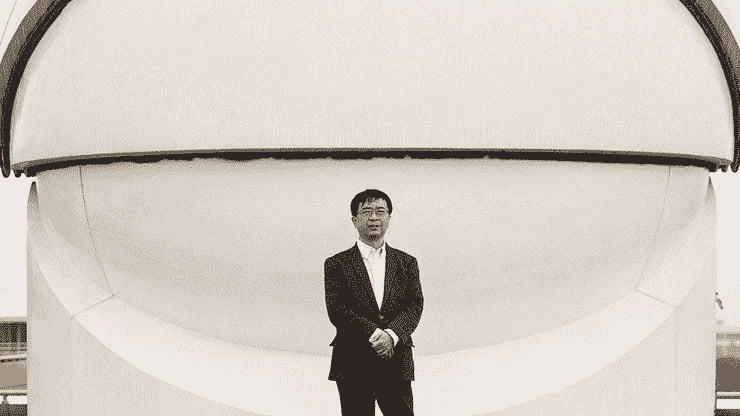
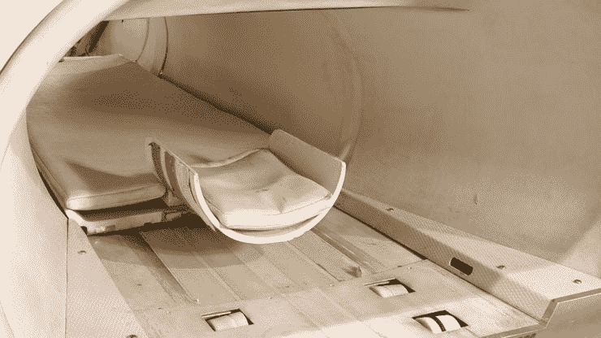
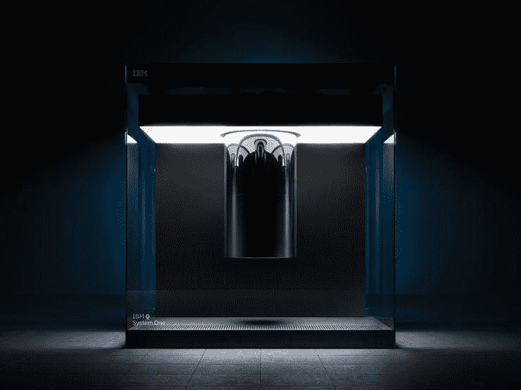

# 量子鸽笼效应|量子计算周刊#9

> 原文：<https://medium.com/hackernoon/quantum-pigeonhole-effect-quantum-computing-weekly-9-8d5f9d13dae9>

> 这是我每周电子邮件中关于量子计算新闻的综合版本。[访问主页](https://www.quantumcomputingweekly.com/)订阅更新和查看以前的问题。

🎉新年快乐，欢迎收看 2019 年第一期！

接下来的两周会有点轻松，因为我正在为新的一年和我的公司加紧工作，并最终去度蜜月——也就是说，我仍将尽最大努力提供我最喜欢的量子计算新闻和花絮！

你在寻找量子计算的某个特定领域，希望在下一期文章中看到它吗？ [Ping 我](https://twitter.com/jesperht)然后让我知道！

# 本周的小事实

Quantum pigeons (not really)

你可能听说过量子纠缠，但你听说过它的表亲，宇宙关联连接吗？利用预选择和后选择，我们可以得到两个粒子之间的联系——换句话说，在不同时间(比如未来)进行的测量可以影响现在的量子系统。[看看这个，了解更多关于这项研究的](https://www.newscientist.com/article/mg22329802-300-pigeon-paradox-reveals-quantum-cosmic-connections/)，了解三只鸽子如何占据两个鸽笼而不被分享的想法。如果你真的想深入研究鸽子洞，那么[这是原始论文](https://www.pnas.org/content/pnas/113/3/532.full.pdf)。

# 学习

本周，我想提请大家注意微软研究院为(经典)计算机科学家制作的关于量子计算的视频。它深入到真实的例子中，并且使用了用 Q#编写的代码(基于 F#)，这是我个人以前从未见过的！

# 新闻

# 感谢阅读！投稿？

写了一篇有趣的博文或者发现了一些关于量子计算的趣事分享？发现了一个错误？通过电子邮件(点击回复)或在 twitter 上 ping 我( [@jesperht](https://twitter.com/jesperht) )取得联系。

[**将中国打造成量子超级大国的人**](https://www.technologyreview.com/s/612596/the-man-turning-china-into-a-quantum-superpower/?utm_campaign=Quantum%20Computing%20Weekly&utm_medium=email&utm_source=Revue%20newsletter)**——**[**【www.technologyreview.com】**](https://www.technologyreview.com/s/612596/the-man-turning-china-into-a-quantum-superpower/)
中国的“量子之父”简正在策划其在可能改变整个行业的技术领域的全球领先地位。

[**英特尔寻求建造世界上第一台真正的量子计算机**](https://www.newscientist.com/article/2189379-intels-quest-to-build-the-worlds-first-true-quantum-computer/?utm_campaign=Quantum%20Computing%20Weekly&utm_medium=email&utm_source=Revue%20newsletter)**——**[**英特尔量子计算研究团队的 www.newscientist.com**](https://www.newscientist.com/article/2189379-intels-quest-to-build-the-worlds-first-true-quantum-computer/)
詹姆斯·克拉克向《新科学家》讲述了他制造第一台百万量子比特设备的雄心

## [你的大脑是量子计算机吗？](https://arxiv.org/ftp/arxiv/papers/1812/1812.05602.pdf?utm_campaign=Quantum%20Computing%20Weekly&utm_medium=email&utm_source=Revue%20newsletter)

[arxiv.org](https://arxiv.org/ftp/arxiv/papers/1812/1812.05602.pdf)

这位来自奥斯陆大学的研究人员写了一篇关于信息处理和记忆的量子力学应用的惊人论文。

第一台量子计算机不太可能的起源早在 1998 年，两个团队就发表了第一次真实世界量子计算的结果。但是第一台量子计算机根本不是计算机。它们是生物化学设备，依赖于和核磁共振成像机一样的科学。

[**IBM 在 CES 2019 上概述 Q System One 量子计算机**](https://www.zdnet.com/article/ibm-at-ces-2019-outlines-q-system-one-quantum-computer/?utm_campaign=Quantum%20Computing%20Weekly&utm_medium=email&utm_source=Revue%20newsletter)**——**[**www.zdnet.com**](https://www.zdnet.com/article/ibm-at-ces-2019-outlines-q-system-one-quantum-computer/)
Q System One 采用模块化设计，零件设计尽量减少干扰。IBM 的计划是开始扩展量子计算中心。

# 感谢阅读！投稿？

写了一篇有趣的博客或者发现了一些关于量子计算的有趣的事情来分享？发现了一个错误？在 twitter ( [@jesperht](https://www.twitter.com/jesperht) )上 Ping 我或者在下面留言。