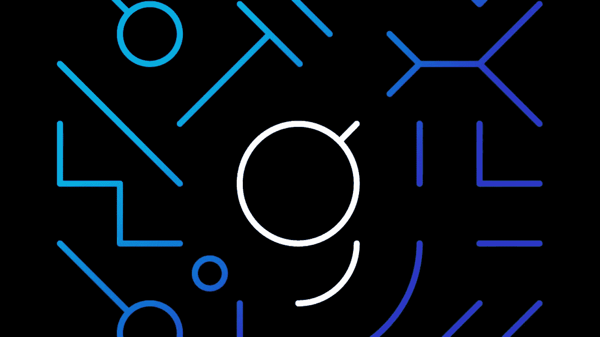
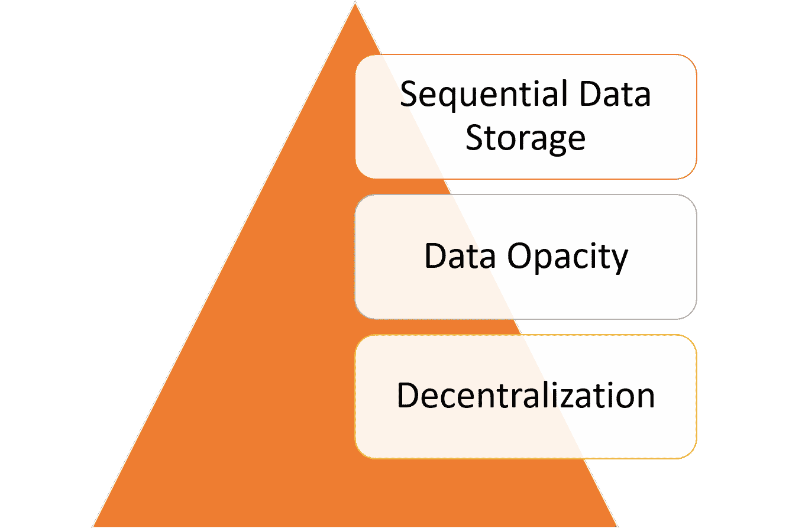
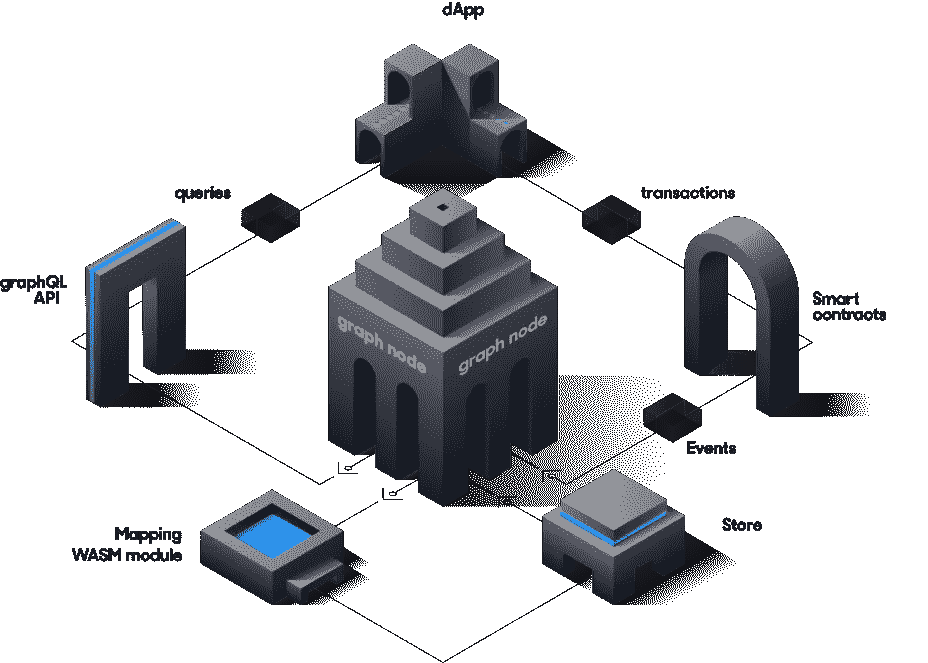

# 质疑区块链:为什么图可能成为 Web3 栈的重要协议之一

> 原文：<https://medium.com/hackernoon/querying-the-blockchain-why-the-graph-might-become-one-of-the-important-protocols-of-the-web3-eb77673bc967>



数据访问在软件历史上的任何技术趋势中都扮演着重要的角色。数据库、搜索引擎或查询 API 等数据访问技术无处不在，以至于我们在设计软件解决方案时很少想到它们。随着 Web 3.0、由区块链技术支持的分散式应用的发展，数据访问等基础设施块将变得更加重要。然而，解决区块链的数据访问已被证明是一项非常具有挑战性的工作，迫使开发人员花费大量时间编写基础设施代码。在市场上的 Web3 数据访问解决方案中，[Graph Protocol](https://thegraph.com/)是我特别喜欢的一个，因为它的简单性和对现代技术的巧妙利用。

几个月前，在我们的一个区块链实现中，我们偶然发现了[图](https://thegraph.com/)，从那以后我们一直在测试和跟踪这个项目。该图背后的主要思想是通过利用已有的数据访问协议(如 GraphQL)使区块链数据可查询。虽然这种想法听起来在概念上微不足道，但其实现充满了不小的挑战。

# 查询区块链数据的挑战

在软件行业的过去 50 年中，每一种技术趋势都经历了数据访问技术的改进，因为它们能够建立在以前趋势所创建的基础设施之上。从文件系统到最近的大数据运动，数据访问技术的生产周期越来越短，功能越来越复杂。随着区块链技术的出现，这种发展趋势完全改变了，因为与其他技术运动不同，区块链空间从存储和网络协议级别开始重新设想数据访问。从这个角度来看，以前技术发展中的大多数数据访问技术和最佳实践在应用到区块链时都不切实际。简单明了地说，Web 3.0 应该有一个 Web 3.0 数据访问协议。

是什么让区块链数据访问如此具有挑战性？在我看来，这一挑战有三个根本原因:



**去中心化:**区块链的数据存在于一个去中心化的节点网络中，这些节点不断地在它们之间复制记录。从数据访问的角度来看，这种模型比集中式数据库基础设施复杂得多。

不透明:区块链的数据受到不同程度的加密和混淆，这使得数据很难解读。显然，查询协议的全部意义在于知道要查询什么属性，而这些信息在区块链堆栈中是不容易访问的。

**顺序数据存储:**区块链的数据是在事务中捕获的，存储在一个顺序的块组中。这种块事务数据结构提供了非常差的导航能力，而这正是实现可靠的数据查询协议所需要的。

对上述三个挑战的相反解释表明，一个健壮的 Web 3.0 数据访问堆栈应该具有三个主要功能:

I .访问信息的能力，就像信息存储在中央存储库中一样。

二。基于属性查询记录的能力。

三。能够根据特定标准高效浏览区块链数据。

这些挑战中的一些已经通过孤立的技术解决了，我们还没有一个一致的堆栈来将它们放在一起。

# 进入图表

从概念上讲，该图是一个用于索引和查询区块链数据的分散式协议。该图从创建描述区块链数据表示的清单开始。清单可以指定 DApp 的特定协议的属性。创建清单后，该图从特定协议或应用程序中捕获链上事件，并使用清单作为指导将它们索引到 IPFS 中。最后，数据由基于流行的 [GraphQL](https://graphql.org/) 协议的 API 公开。图形端点将把 GraphQL 查询翻译成用于访问数据的 IPFS 命令。



从体系结构的角度来看，该图基于以下组件:

*   Graph CLI:一个基于 JavaScript 的工具，允许开发人员定义描述区块链结构的子图，这些子图将被图形索引。子图由子图清单、模式和映射组成。子图清单指向要索引的数据源(例如智能合同)和任何解码信息(ABI)。描述如何转换或聚合数据的 TypeScript 函数。Graph CLI 将所有这些编译到一个 WASM 模块中，该模块可以由 Graph 节点执行
*   **Postgres Store** :基于 Postgres 的数据库，基于(实体、属性、值)元组将区块链数据存储并索引到特定的表中。该结构有效地映射到 GraphQL 语法。
*   **GraphQL 服务器**:graph QL API 和堆栈其他组件的主机。
*   **以太坊适配器**:使用 IPC 或 RPC 订阅以太坊事件并访问智能合约存储的组件。
*   **WASM 运行时主机**:执行映射以将区块链数据翻译成可索引和可查询的数据结构的模块。

为了简单起见，跳过几个步骤，让我们来说明图协议是如何工作的。第一步是使用 YAML 语法定义子图清单，如下所示:

```
specVersion: 0.0.1
schema:
  file: ./schema.graphql
dataSources:
- kind: ethereum/contract
  name: MyERC721Contract
  source:
    address: "0x06012c8cf97BEaD5deAe237070F9587f8E7A266d"
    abi: ERC721
  mapping:
    kind: ethereum/events
    apiVersion: 0.0.1
    language: wasm/assemblyscript
    entities:
    - Token
    abis:
    - name: ERC721
      file: ./abis/ERC721ABI.json
    eventHandlers:
    - event: Transfer(address,address,uint256)
      handler: handleTransfer
    file: ./mapping.ts
```

从定义中可以看出，前面的子图捕获了特定智能合约(MyERC721Contract)的 Transfer 事件中的数据。要捕获的具体数据由合同 ABI JSON 文件定义:

```
[{
    "anonymous": false,
    "inputs": [
      {
        "indexed": true,
        "name": "_from",
        "type": "address"
      },
      {
        "indexed": true,
        "name": "_to",
        "type": "address"
      },
      {
        "indexed": true,
        "name": "_tokenId",
        "type": "uint256"
      }
    ],
    "name": "Transfer",
    "type": "event"
  }]
```

下一步是编写一个映射函数，根据特定的子图转换来自以太坊区块链的数据:

```
import { Transfer } from './types/abis/SomeContract'

// This is an example of an entity type generated from a
// subgraph's GraphQL schema
import { Token } from './types/schema'

export function handleTransfer(event: Transfer): void {
    let tokenID = event.params.tokenID.toHex()
    let token = new Token(tokenID)
    token.currentOwner = event.params.to

    token.save()
}
```

此时，子图可以展开，我们可以开始监听以太坊区块链的事件。当前版本的图形支持使用 Infura 收集以太坊数据，托管本地以太坊节点或 Ganache。以下代码启动一个图形节点，通过 Infura API 监听数据:

```
cargo run -p graph-node --release -- \
  --postgres-url postgresql://<USERNAME><:PASSWORD>@localhost:5432/<POSTGRES_DB_NAME> \
  --ethereum-rpc <ETHEREUM_NETWORK_NAME>:https://mainnet.infura.io \
  --ipfs 127.0.0.1:5001 \
  --debug
```

最后，我们可以使用典型的 GraphQL 语法来查询数据:

```
{
  tokens {
    id
    currentOwner
  }
}
```

开发人员已经使用该图为流行的协议和 DApps 部署了子图。您可以看到他们中的许多人[使用图形浏览器](https://thegraph.com/explorer/)，它提供了一个灵活的用户界面来针对特定的智能合同或 DApps 执行 GraphQL 查询。

该图是解决 Web 3.0 应用程序最重要的挑战之一的非常好的迭代。通过利用 IPFS、Postgress 或 GraphQL 等成熟技术，Graph 降低了开发人员查询区块链数据的门槛。让事情变得更加令人兴奋的是，当前版本的图形[最近被开源](https://github.com/graphprotocol)，并且正在积极地版本化。尽管仍处于非常早期的阶段，但该图似乎已经具备了成为 Web 3.0 运动中最重要的协议之一的技术基础。