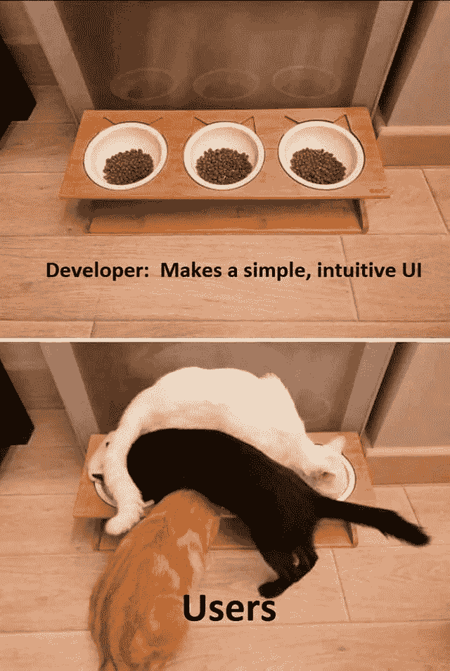

# JavaScript 对象快速指南

> 原文：<https://medium.com/hackernoon/quick-guide-to-javascript-objects-d7e299fd557a>

简单地说，对象就是键和相应值的集合。让我们以《辛普森一家》中我最喜欢的角色为例:


```
const obj = {"name": "Homer Simpson","gender": "Male","children": ["Lisa","Bart"]//oops homer forgot the Maggie again DOH!}
```

现在的问题是如何访问这些值？答案再简单不过了。下面是各种控制台日志的输出:

```
console.log(obj.name)
>>"Homer Simpson"console.log(obj.gender)
>> "Male"console.log(obj.children)
>>["Lisa" , "Bart"]console.log(obj.children[0])
>>"Lisa"
```

本质上 object.key 会给你那个键的值。您也可以通过括号符号:`obj["name"]`访问 name 的值，它将给出与点符号:`obj.name`相同的结果。

# 创建新对象

创建对象有很多种方法，但是为了使本指南简单，我们只讨论两种创建对象的方法。

首先是使用如上所示的花括号:

```
const obj = {"name": "Homer Simpson","gender": "Male","children": ["Lisa", "Bart"]}
```

第二种方法是使用新关键字:

```
function Person(name,gender,children) {
  this.name = name;
  this.gender = gender;
  this.children = children
}
const obj = new Person("Homer Simpson","Male",["Lisa","Bart"])
```

# 添加新密钥:

现在让我们给我们的对象添加新的键:

```
obj.wife = "Marge Simpson"
console.log(obj)

>> {"name": "Homer Simpson","gender": "Male","contact no": "123456789012","children": ["Lisa", "Bart"],"wife" : "Marge Simpson"}
```

您还可以将函数设置为任意键的值。键的名称可以是任何字符串或可以转换为字符串的名称。我们也可以使用`delete obj.key`或`delete obj["key"]`删除对象的任何关键点。

# 枚举对象的键:

如果你不知道键，而你想访问对象，那么你可以使用`object.keys(obj)`遍历键。`object.keys(obj)`会给你一个数组的键，然后你可以调用`forEach()`并遍历键。下面是一个例子

```
Object.keys(data).forEach( (element) => { console.log(obj[element])})output : 
>>"Homer Simpson"
>>"Male"
>>["Lisa","Bart"]
>>"Marge Simpson"
```

那都是乡亲们！！！

这里有一些随机编排的幽默来让你的一天开心起来

