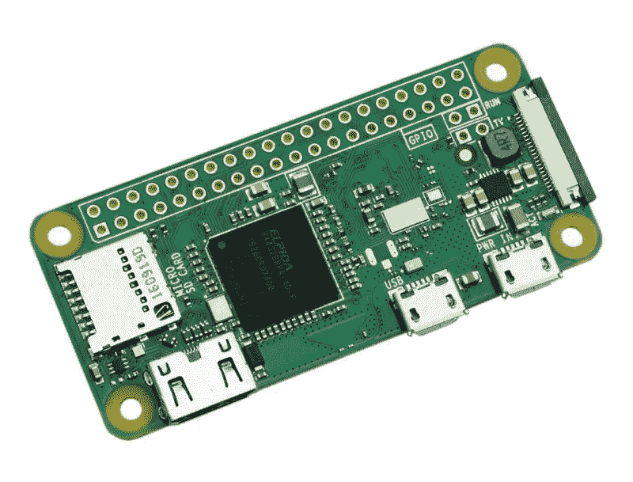

# 基于 Raspberry Pi 的 Wifi 路由器

> 原文：<https://medium.com/hackernoon/raspberry-pi-based-wifi-routers-3b8c7c49143f>



这篇相当长的帖子将带你完成在一台 [Raspberry Pi](https://hackernoon.com/tagged/raspberry-pi) Zero W 或 Raspberry Pi 3 上设置一个 [WiFi 路由器](https://hackernoon.com/tagged/wifi-router)的过程。有很多原因会让你想做这样的事情:

*   为您的 web 应用程序的任何位置接入点设置演示
*   创建用于网络测试的可部署设备。

作为一个额外的收获，这篇文章还描述了如何安装 NodeJS 和 AWS 命令行工具来创建带有 AWS 的脚本化工作流。

# 设置树莓 Pi

使用 [Raspbian Lite](https://www.raspberrypi.org/downloads/raspbian/) 设置 Raspberry Pi Zero W。我用的版本是`2018-06-27-raspbian-stretch-lite.img`

以下说明以 Mac OSX 为中心，但与使用其他操作系统的方式没有太大区别。

**定位 SD 卡**

在 Mac 上，您可以通过命令行使用 diskutil 来实现这一点。执行下面的命令，并查找与您的 SD 卡大小相匹配的/dev/disk。对我来说，那就是/dev/disk2

```
$ diskutil list
```

**卸下 SD 卡**

接下来使用磁盘号卸载 SD 卡。

```
$ diskutil unmountDisk /dev/disk2
```

**刷新操作系统镜像**

使用`dd`命令将 Raspbian lite 映像刷新到您的 SD 卡上。执行此操作时要小心！

这是一个很好的机会来提一下如果你不小心使用的话,`dd`命令会非常危险。始终确保您将`dd`指向正确的磁盘驱动器！你不会想删除错误的驱动器。毕竟，该命令被称为磁盘破坏者是有原因的，但这不是 dd 所代表的意思。如果你感兴趣，可以看看这段`[dd](https://en.wikipedia.org/wiki/Dd_%28Unix%29)`历史。

```
$ sudo dd bs=1m if=./2018-06-27-raspbian-stretch-lite.img of=/dev/disk2 conv=sync
```

当 dd 正在运行时，您可以按下键盘上的 ctrl-t 来检查状态。根据 SD 卡的速度，SD 磁盘闪存可能需要一段时间。

出于性能原因，建议您使用 6 类或 10 类 microSDHC 卡。

复制完成后，您可以将光盘刻录到卡上:

```
$ cd /Volumes/boot
```

创建一个空的 ssh 文件，告诉操作系统您希望启用 SSH 访问:

```
$ touch ssh
```

接下来用下面的内容创建一个`wpa_supplicant.conf`文件，确保用你路由器的设置替换你的 ssid 和 psk 字段。

```
ctrl_interface=DIR=/var/run/wpa_supplicant GROUP=netdev
update_config=1
country=US
network={
    ssid="YOUR-SSID"
    psk="YOUR-PASSWORD"
    scan_ssid=1
}
```

完成更改后，安全地卸载 SD。

```
$ cd ~
$ diskutil unmountDisk /dev/disk2
```

**连接并配置您的 Raspberry Pi**

接下来，将 SD 插入 Pi Zero 并启动设备。

给它一分钟左右的时间来完成，然后尝试 ping 设备以找到它。

```
$ ping raspberrypi.local
```

或者使用您的网络路由器或 Wifi 扫描仪找到设备，例如[谁在我的 Wifi 上](https://itunes.apple.com/us/app/who-is-on-my-wifi/id909760813?mt=12)

您可以使用以下方式 ssh 进入设备:

```
$ ssh pi@raspberrypi.local
or
$ ssh pi@10.10.0.107
```

默认密码是`raspberry`。

如果您遇到以下错误:

```
@@@@@@@@@@@@@@@@@@@@@@@@@@@@@@@@@@@@@@@@@@@@@@@@@@@@@@@@@@@
@ WARNING: POSSIBLE DNS SPOOFING DETECTED! @
@@@@@@@@@@@@@@@@@@@@@@@@@@@@@@@@@@@@@@@@@@@@@@@@@@@@@@@@@@@
```

然后简单地编辑您的`.ssh/known_hosts`文件，删除含有`raspberrypi`条目的那一行。

```
$ vi /Users/${USER}/.ssh/known_hosts
```

继续，一旦你登录，第一件事就是修改密码！

```
$ passwd
```

用户名仍将保持`pi`，但您可以使用新密码登录。

如果您愿意，可以使用 raspi-config 实用程序进行其他调整。

```
$ sudo raspi-config
```

接下来，确保操作系统是最新的:

```
$ sudo apt-get update
$ sudo apt-get upgrade
```

*   ***关于上面的更新命令的一个注意事项:如果在安装软件包时您得到一个错误，如*** `***E: Unable to fetch some archives, maybe run apt-get update or try with — fix-missing?***` ***，那么重新运行*** `***sudo apt-get update***` ***并重试失败的软件包更新。事实证明这是成功的。***

最后，这里花点时间来设置您的时区:

`$ sudo dpkg-reconfigure tzdata`

# 添加节点

对于 Pi ZeroW 使用:

```
$ mkdir nodejs; cd nodejs
$ wget [https://nodejs.org/dist/v8.12.0/node-v8.12.0-linux-armv6l.tar.xz](https://nodejs.org/dist/v8.12.0/node-v8.12.0-linux-armv6l.tar.xz)
$ tar -xvf node-v8.12.0-linux-armv6l.tar.xz
$ cd /usr/local/bin
$ sudo cp /home/pi/nodejs/node-v8.12.0-linux-armv6l/bin/node .
$ sudo ln -sf /home/pi/nodejs/node-v8.12.0-linux-armv6l/bin/npx npx
$ sudo ln -sf /home/pi/nodejs/node-v8.12.0-linux-armv6l/bin/npm npm
$ cd ~
```

如果使用 Raspberry Pi 3，使用:

```
$ mkdir nodejs; cd nodejs
$ wget [https://nodejs.org/dist/v10.14.0/node-v10.14.0-linux-armv7l.tar.xz](https://nodejs.org/dist/v10.14.0/node-v10.14.0-linux-armv7l.tar.xz)
$ tar -xvf node-v10.14.0-linux-armv7l.tar.xz
$ cd /usr/local/bin
$ sudo cp /home/pi/nodejs/node-v10.14.0-linux-armv7l/bin/node .
$ sudo ln -sf /home/pi/nodejs/node-v10.14.0-linux-armv7l/bin/npx npx
$ sudo ln -sf /home/pi/nodejs/node-v10.14.0-linux-armv7l/bin/npm npm
$ cd ~
```

您可以通过以下方式测试 NodeJS 安装:

```
$ node --version
```

# 安装 AWS 命令行工具

这是一个可选的步骤，但是如果您在 S3 存储桶中有想要复制到 Raspberry Pi 中的文件，这是非常有用的。

`$ sudo apt-get install awscli`

接下来配置 AWS 访问:

```
$ aws configure
AWS Access Key ID [None]: ************
AWS Secret Access Key [None]: ***************************
Default region name [None]: us-west-2
Default output format [None]: json
```

下载资产脚本

```
#!/bin/bash
mkdir -p $1
aws s3 cp s3://bucketname/$1 ./$1 — recursive
```

用法:

```
./download.sh 303A0FA/teb002/3A0FA-2018/10/18/90918447–2fnaodyxhbr
```

# 设置为路由器

*   由[https://medium . com/@ ivaylov/raspberry-pi-wifi-router-82921 ed2 AC 17](/@ivaylov/raspberry-pi-wifi-router-82921ed2ac17)提供的步骤，有以下一些改动:

**移除 WPA 恳求者**

`$ sudo apt-get purge wpasupplicant`

**安装 DHCP 服务器**
`$ sudo apt-get install isc-dhcp-server`

**设置 DHCP**
`$ sudo vi /etc/dhcp/dhcpd.conf`

添加到文件末尾:

```
subnet 172.16.1.0 netmask 255.255.255.0 {
  range 172.16.1.25 172.16.1.50;
  option domain-name-servers 8.8.4.4;
  option routers 172.16.1.1;
  interface wlan0;
}
```

**安装主机接入点守护进程**
`$ sudo apt-get install hostapd`

**配置 hostapd**

创建一个 hostapd.conf 文件


将这些行添加到 hostapd.conf 文件中

```
interface=wlan0
#driver=nl80211
ssid=YOUR_STATION
hw_mode=g
channel=5
wpa=1
wpa_passphrase=SECRETPASSWORD
wpa_key_mgmt=WPA-PSK
wpa_pairwise=TKIP CCMP
wpa_ptk_rekey=600
macaddr_acl=0
```

继续前进…

```
$ sudo ifconfig wlan0 172.16.1.1
$ sudo /etc/init.d/isc-dhcp-server restart
```

-d 用于调试模式，以便您可以查看是否出现任何错误
`$ sudo hostapd -d /etc/hostapd/hostapd.conf`

在^^^之后可能需要 ctrl-c

现在让我们使这些变化持久化
`$ sudo vi /etc/network/interfaces`

接下来，添加或编辑以下几行

```
auto wlan0
iface wlan0 inet static
address 172.16.1.1
netmask 255.255.255.0
```

编辑 rc.local …

`$ sudo vi /etc/rc.local`

并在最后一行前增加两行`exit 0`

```
hostapd -B /etc/hostapd/hostapd.conf
iptables -t nat -A POSTROUTING -o eth0 -j MASQUERADE
```

然后取消/etc/sysctrl.conf 中以下行的注释

`$ sudo vi /etc/sysctl.conf`

```
# Uncomment the next line to enable packet forwarding for IPv4
#net.ipv4.ip_forward=1
```

所以上面应该是:

```
net.ipv4.ip_forward=1
```

就是这样。我们现在可以重启机器了。

`$ sudo reboot`

# 测试

在此阶段，您应该能够访问 WiFi 网络。

# —

*感谢阅读！如果你喜欢你所读的，按住下面的拍手按钮，让其他人也能看到。也可以* [*在 Twitter 上关注我*](https://twitter.com/cjus) *。*