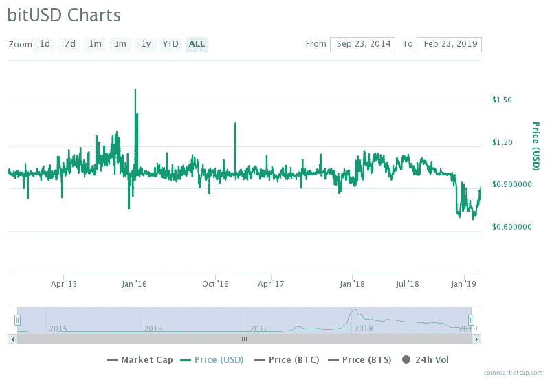

# 触及所有人:稳定是比特币波动的答案吗？

> 原文：<https://medium.com/hackernoon/reaching-everyone-are-stablecoins-the-answer-to-bitcoins-volatility-2a0649215465>

# 看问题了。对于那些最需要保值和交易自由的人来说，风险可能远远大于收益。

> 这是我们关于网络中的“触及每一个人”系列文章的摘要，作者是马特·฿和瓦西姆·阿尔辛迪，他们使用比特币和建立在比特币之上的技术栈来帮助那些生活在压迫政权下或冲突地区的人，以及那些寻求逃离他们的人。阅读[第 1 部分](https://hackernoon.com/reaching-everyone-pt-i-the-need-for-sound-money-outside-of-the-wealthiest-territories-f9a27e1f6488)和[第 2 部分](https://hackernoon.com/reaching-everyone-pt-ii-resilience-censorship-resistance-and-the-bitcoin-blockchain-c1c133d5ac96)。

毫无疑问，BTC-菲亚特交叉汇率的波动性使得加密货币价值的外部衡量指标变化很大，显然下行风险没有帮助，特别是对于那些处于困境的人，甚至是他们命悬一线的人。另一方面，像这样的事情可能会发生:

[https://www.thesun.co.uk/news/7804100/isis-war-chest-bitcoin-crash-investment-millions-cryptocurrency/](https://www.thesun.co.uk/news/7804100/isis-war-chest-bitcoin-crash-investment-millions-cryptocurrency/)

所谓的“稳定硬币”能解决波动性难题吗？那么，稳定在什么方面，以及如何保持价格的一致性？概括地说，目前有三种模式:

1) **中央发证机关**。对价值的信心是建立在有审查风险的信念基础上的——比如 JPM 即将上市。抵押不足的附加风险。

2) **托管资产支持**。价格维持取决于对基础资产的信心和审计的透明度。例子包括系绳或黄金支持产品。

3) **算法机制**看起来是有价值的，但却是未经证实的实验。除非经过长时间的大规模测试，否则这些都不是边缘人群投资财富的地方。戴和 Basis (RIP)就是这种方法的例子。如果稳定过程被认为是类似于[安全的](https://hackernoon.com/a-brief-primer-on-navigating-tokenspace-2290a90b5a65)和报告外部价格的集中神谕，监管负担会带来额外的风险。抢先交易可能是戴面临的另一个问题，因为在挂钩失败的情况下，(MakerDAO 的母公司股票)的持有者将被稀释，更老练的持有者在出现麻烦迹象时就会逃离。这可能类似于向后播放的[坎蒂隆效应](https://fee.org/articles/the-cantillon-effect-because-of-inflation-we-re-financing-the-financiers/)？

stablecoins 等平台发行的令牌存在相当大的[基础协议和智能合约风险](/@joelooney/the-real-cost-of-cryptogoods-dd156f5df056)，尤其是在当前占主导地位的 stablecoin 令牌“托管”平台以太坊准备过渡到 ETH1 的情况下。x 和 ETH2.0 与 ProgPoW、hybrid PoW/PoS、PoS、令人眼花缭乱的各种等离子体国家频道家族、新的虚拟机、分片和/或国家租赁的某种组合。相比之下，比特币的保守发展理念和对网络功能快速变化的厌恶，在很大程度上推动创新进入“第二层”，如闪电网络和侧链。

如今，使用稳定的硬币在很大程度上将风险从价格波动重新分配到技术不确定性、监管不确定性和/或保管不确定性，对于与实物现金相比几乎没有其他选择的人来说，这不一定是明智的交易。几乎所有这些系统都存在隐私问题，这些系统要么需要一些反洗钱/KYC 要素，要么使用隐私性本来就很差的网络。

从历史上看，没有一种稳定的货币能够在一段时间内捍卫其钉住美元的政策。Stablecoins 仍然是一个实验，没有地方处理生死问题。随着与菲亚特挂钩的竞争产品越来越多，越来越多来自传统金融的概念被提出或尝试，如[滞期费](https://ethresear.ch/t/perishable-usd-an-uncollateralized-stablecoin-based-on-demurrage/3979)、[可审查性](https://www.tonysheng.com/gemini-paxos-stablecoins)、[平价折扣](https://www.theblockcrypto.com/2019/01/04/gemini-gave-trading-firms-a-stablecoin-discount-and-it-caused-big-headaches-for-one-of-its-rivals/)或[利息](/@hasufly/interest-rates-are-the-next-battleground-in-the-stablecoin-wars-47ea954118d3)。

即使是英镑[等主要货币也未能维持与资源丰富的对手](https://theeconreview.com/2018/10/16/how-soros-broke-the-british-pound/)达成一致的交易范围，一份智能合约或资源有限的非本土区块链代币[在加密货币疯狂市场周期的各个阶段](https://blog.bitmex.com/a-brief-history-of-stablecoins-part-1/)平衡价格、供应和需求的机会有多大仍有待观察。

The BitShares USD stablecoin BitUSD has among the longest history of any attempt. Source [https://coinmarketcap.com/currencies/bitusd/](https://coinmarketcap.com/currencies/bitusd/)

对于最发达国家之外的人，或者那些人权受到威胁的人来说，至少在今天，coins 并没有带来好处。

> Wassim Alsindi 在独立实验室 Parallel Industries 指导研究，从数据驱动和人类的角度分析加密货币网络。在推特上的[www.pllel.com](http://www.pllel.com/)和 [@parallelind](https://twitter.com/parallelind) 找到他。
> 
> Matt B 是加密货币领域的作家和内容策略师，对比特币和隐私技术特别感兴趣。可以通过推特上的 [itsmattbit.ch](http://itsmattbit.ch/) 和 [@MattoshiN](https://twitter.com/mattoshin) 联系到他。

# 感谢阅读。在你走之前！

> 如果你觉得这篇文章有趣，请👏并在你能分享的地方分享。记住，你最多可以鼓掌 50 次——这对可见度和温暖模糊的感觉真的有很大的影响。欢迎大家来 www.pllel.com 和 T2 的推特上闲逛。