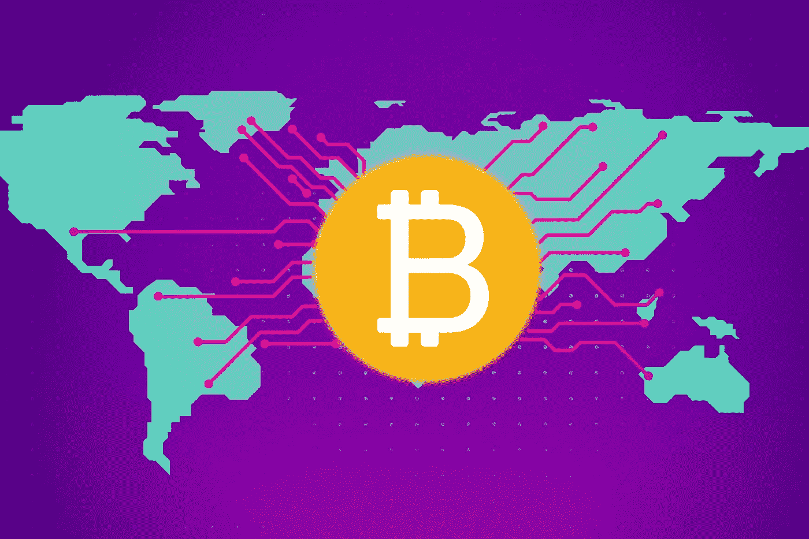

# 联系每个人。I:最富裕地区之外对稳健货币的需求

> 原文：<https://medium.com/hackernoon/reaching-everyone-pt-i-the-need-for-sound-money-outside-of-the-wealthiest-territories-f9a27e1f6488>

Source: Kevin Durkin for In The Mesh

> 网格中[上的 ICYMI，先在那里读取接下来的零件。](https://inthemesh.com/archive/reaching-everyone-pt-i/)
> 
> 本文是由[伊朗](https://medium.com/u/7364555d4095#3da63eda3e59)和[津巴布韦](https://www.forbes.com/sites/stevehanke/2017/10/28/zimbabwe-hyperinflates-again-entering-the-record-books-for-a-second-time-in-less-than-a-decade/#7c8bfe513eed)看到了这一幕。至于商品货币，它们在过去一直受到没收和稀释——想想美国的第 6102 号行政命令，政府强迫公民上缴金条和硬币。
> 
> 公元前四世纪，亚里士多德将货币的理想属性定义为可运输性、可替代性、稀缺性和可分性。比特币在很大程度上满足了上述标准——类似于贵金属的开采，比特币区块的生成需要采矿者的大量支出(硬件、电力、基础设施和运营成本)，以获得一种可证明的稀缺资产，总供应量上限为 2100 万个比特币。可以说，这使得它比黄金更稀有，黄金的供应限制只是假设，当前的估值没有考虑到经济上不可行的提取——即在地球的海洋或太空中。
> 
> 与目前的贵金属一样，在网络明确允许的参数之外，以采矿的形式合成比特币是不可能的。任何这样做的尝试都与网络不兼容。每枚硬币可以分成 100，000，000 个单位，一个 UTXO(未用交易输出)单位在功能上等同于另一个单位——尽管就污点和[黑名单](https://www.coindesk.com/goodbye-fungibility-ofacs-bitcoin-blacklist-remake-crypto)而言，比特币的可替代性目前存在限制。(在下一篇文章中，我们将介绍一些针对这些挑战的协议内和协议外解决方案)。
> 
> 显然，存在于网络空间的硬通货将比实物替代品带来诸多好处:隐蔽性、似是而非的抵赖性、可编程性、便携性和易于全球传播。比特币的前身，如 Wei Dao 的 b-money 或 Szabo 的 bit gold，在解决涉及数字货币双重支出的关键分布式计算问题方面取得了长足进步，尽管它们并不完美，因为在使用工作证明和链选择规则作为减轻 Sybil 攻击和达成网络共识的机制之前，需要一定程度的集中化。虽然有人推动比特币制度化，以此作为机构接受的标志，但它的发源地赛博朋克和秘密无政府主义运动从来不认为这很重要。两者都一直致力于解放个人，用密码工具和协议武装他们，保护他们的主权不受潜在压迫者、等级制度、统治者和支配者的侵犯。
> 
> 来自自由之家的一份 [2017 年报告](https://freedomhouse.org/report/freedom-world/freedom-world-2017)表明，世界上超过一半的国家由被认为限制公民自由的治理结构统治。在接受评估的 195 个国家中，87 个(45%)被评为“自由”，59 个(30%)被评为“部分自由”，49 个(25%)被评为“不自由”。在被认为“不自由”的国家，一个普遍的主题似乎是将货币和经济控制作为社会控制的关键机制。这通常是通过发行疲软或不受欢迎的法定货币来实现的，由于无能或恶意(或两者兼而有之)导致货币发行政策管理不善，法定货币无法长期保持购买力。
> 
> 安全数字货币的可能性对于那些生活在独裁政权下的人以及那些试图逃离独裁政权的人来说都具有无限的潜力。虽然可能需要几十年才能看到比特币蚕食法定货币，但它已经有很大的潜力成为法定货币的竞争者。与国家强制实施的货币体系并行运作的货币体系将权力从现任发行者手中重新分配给民众，并削弱了国家印钞机的效力。

> Wassim Alsindi 在独立实验室 Parallel Industries 指导研究，从数据驱动和人类的角度分析加密货币网络。在 www.pllel.com 的[和推特上的](http://www.pllel.com/) [@parallelind](https://twitter.com/parallelind) 找到他。
> 
> Matt B 是加密货币领域的作家和内容策略师，对比特币和隐私技术特别感兴趣。可以通过推特上的 [itsmattbit.ch](http://itsmattbit.ch/) 和 [@MattoshiN](https://twitter.com/mattoshin) 联系到他。

# 感谢阅读。在你走之前！

> 如果你觉得这篇文章有趣，请👏并在你能分享的地方分享。记住，你最多可以鼓掌 50 次——这对可见度和温暖模糊的感觉真的有很大的影响。欢迎大家来到 www.pllel.com[和推特](http://www.pllel.com)上。