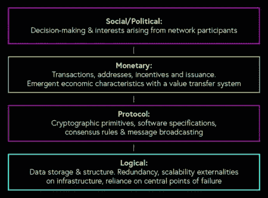
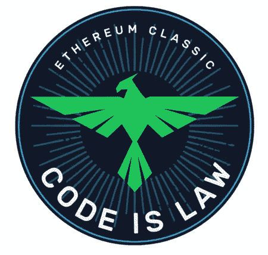

# 联系每个人。II:弹性、审查阻力和比特币区块链

> 原文：<https://medium.com/hackernoon/reaching-everyone-pt-ii-resilience-censorship-resistance-and-the-bitcoin-blockchain-c1c133d5ac96>

Source: Kevin Durkin for In The Mesh

> 网格中[上的 ICYMI，先在那里读取接下来的零件。](https://inthemesh.com/archive/reaching-everyone-pt-i/)
> 
> 本文是由[马特·฿](https://medium.com/u/7364555d4095?source=post_page-----c1c133d5ac96--------------------------------)([@ mattoshin](http://twitter.com/MattoshiN))和[瓦西姆·阿尔辛迪](https://medium.com/u/52f8c4ac75f3?source=post_page-----c1c133d5ac96--------------------------------) ( [@parallelind](http://twitter.com/parallelind) )撰写的四篇系列文章中的第二篇，讲述了比特币的使用以及建立在比特币之上的技术栈，以帮助那些生活在压迫性政权下或冲突地区的人，以及那些寻求逃离他们的人。[此处第一部分](https://hackernoon.com/reaching-everyone-pt-i-the-need-for-sound-money-outside-of-the-wealthiest-territories-f9a27e1f6488)。

政府授权货币的有害影响——以及相反，合理采用货币的好处——在本系列的[上一篇文章](https://hackernoon.com/reaching-everyone-pt-i-the-need-for-sound-money-outside-of-the-wealthiest-territories-f9a27e1f6488)中讨论过，比特币的特性使其成为法定货币的强大且无需许可的替代品。在本文中，我们将重点介绍使该协议如此健壮的技术，以及为什么它在当今世界如此重要。明智的做法是首先为比特币提供一个定义，这不是一件容易的事情。作为导致一系列突发行为和现象的复杂组件集合体，比特币的本质似乎带有许多主观因素。比特币抄写员[尼克·卡特](https://medium.com/u/a063100e6515?source=post_page-----c1c133d5ac96--------------------------------)已经解决了比特币的一些[认识论](/@nic__carter/visions-of-bitcoin-4b7b7cbcd24c)和[本体论](/s/story/what-is-it-like-to-be-a-bitcoin-56109f3e6753)的观点，正如更广泛的现象学所告知的那样。

比特币的名字指的是几件事:广播“推送”消息协议、运行客户端软件和 UTXOs(未用交易输出)或“比特币碎片”的点对点节点网络。用户地址之间的交易记录使用一种高保证数据结构——“区块链”进行公证，这种数据结构在网络节点之间保持同步，允许任何运行比特币客户端软件的人在未经许可的情况下建立一个账本。交易历史的全局状态保持一致。账本的真实状态由创建块的热力学竞争来维持(*工作证明*，或 PoW‘mining’)，确保潜在攻击者需要大量计算能力和能量来重写区块链，从而改变比特币的历史记录。矿工赢得寻找候选区块并将其广播到网络的比赛，将获得比特币奖励，前提是遵守协议，并且网络就下一个要添加到链中的区块达成协议。交易包括在每个区块中，其顺序由“费用市场”决定，优先级较高的交易激励矿商以高于平均水平的费用将其包括在内。

从用户的角度来看，比特币是一种支付系统，允许他们发送支付，而不用考虑边界、政府或地理距离。一旦一个事务被包含在一个块中，它就被称为有一个单独的确认。随后的每一次确认，对手都变得更难推翻、改变或审查它。在正常的网络操作中，一旦有六次确认，交易就被认为是最终的和可消费的——尽管在现实中最终是概率性的而不是绝对的。换句话说，逆转的可能性极小，而不是不可能。虽然比特币没有经历过大规模的分类账历史重组(所谓的“多数”或[“51%”攻击](/chainrift-research/bitcoins-attack-vectors-51-attacks-a96deac43774))，但它正在成为较小电力网络中越来越常见的。作为一个用户，有什么比在一个相对容易且经常被破坏的脆弱网络中存储您的宝贵价值更不鼓舞信心的呢？这就像让你的前门半开着，并想知道为什么事情总是变得一团糟。

单向 SHA-256d 哈希函数在比特币生态系统(以及更广泛的公钥加密领域)中发挥着不可或缺的作用，利用了“猜测”或“强力破解”与公钥相关联的私钥与证明所述公钥与私钥相关联的容易程度之间的不对称性。类似地，块是很难“猜测”的(进入 PoW 算法)，但是证明已经找到一个是微不足道的。

Source: [https://commons.wikimedia.org/wiki/File:Meat_grinder.jpg](https://commons.wikimedia.org/wiki/File:Meat_grinder.jpg)

本质上，哈希函数是一个确定性的过程，它获取一条信息(任意长度)并返回一条特定长度的信息。把这样一个功能想象成绞肉机——你可以把一片上好的神户牛肉放入绞肉机中产生肉末，但几乎不可能对原始牛肉进行逆向工程。

尽管围绕“[比特币煮沸海洋](https://www.bloomberg.com/opinion/articles/2017-12-07/bitcoin-is-greener-than-its-critics-think)”的生态中心主义叙事，但 PoW 是添加当今存在的区块的最安全、公平和有效的机制。完全有可能将该算法替换为一个财团或一方通过一些其他机制创建新块，但这将通过集中生产和验证来牺牲整个价值主张。“自主进入”的概念对比特币的去中心化至关重要，而推而广之，它最吸引人的特征体现在抵御外部控制和胁迫的能力上:无需许可(任何人都可以成为网络的一部分)、抵制审查(任何人都可以交易)和不变性(交易是最终的)。自 2009 年 1 月上线以来，该网络享受了 [99.983%的正常运行时间](http://bitcoinuptime.com/)。

去中心化不容易被简化为二元现象，更像是一种涌现的、复杂的和多维的光谱特征。这个概念最初是由托克维尔提出的，作为法国大革命前后国家权力集中的反义词。已经有许多方法将去中心化描述为一个有意义的甚至是可量化的指标，其中[的见解](https://news.earn.com/quantifying-decentralization-e39db233c28e)和[的方法](http://www.truthcoin.info/blog/measuring-decentralization/)各不相同。在一个给定的网络中，您可能需要考虑无数不同的因素，例如技术、参与者的组织(或缺乏组织)、保存历史记录的数据结构以及网络本身的拓扑结构。从所有意图和目的来看，比特币在所有这些指标上都表现得很好——哈希权力集中 [*可能*是一个问题](/@jimmysong/mining-centralization-scenarios-b74102adbd36)，尽管博弈论和“游戏中的皮肤”由于设备支出的沉没成本在大多数情况下会激励拥有大量资金的参与者诚实行事。这方面的一个例子是挖掘池 GHash.io，在广泛的骚动和计算资源的重新分配之前，[在 2014 年突破了网络哈希表](https://arstechnica.com/information-technology/2014/07/bitcoin-pool-ghash-io-commits-to-40-hashrate-limit-after-its-51-breach/)的 50%。出埃及是如此的明显，以至于这个人才库很快就不复存在了。

Source: Kevin Durkin for In The Mesh

让我们尝试使用这种分层方法从更细粒度的角度来理解这些概念所体现的内容。不变性是一种主要在协议层观察到的属性，货币层的持久性依赖于此，确保利益相关者或对手无法更改交易记录，从而实现平衡。审查阻力也主要出现在协议层，因为任何类型的有效交易都不会被阻止广播到 P2P 网络，包括在块中并记录在网络的共享分类帐中。[无权限](https://twitter.com/TokenHash/status/1066374186258452480)可以看作是社会层面的一个相关现象，没有人或实体被阻止广播交易并被纳入分类账，这样任何人都可以不受偏见地参与和使用网络。

当考虑我们模型中的不同层次时，去中心化本身可以被理解为不同的东西。协议去中心化指的是节点的分布，从分类帐的起源和对交易和/或块的挖掘和验证的激励来完全验证分类帐。货币去中心化可以通过[研究资产分布集中度的不平等来评估](https://news.earn.com/quantifying-decentralization-e39db233c28e)，尽管这在加密货币中是一种不完美的启发式方法，因为一个实体可能控制许多公钥，这反过来可以产生许多地址。一个更紧迫的问题是集中交易所持有的比特币数量——截至 2018 年底，仅比特币基地一国就持有 BTC [至少 5%的比特币。](https://blog.coinbase.com/a-behind-the-scenes-look-at-the-biggest-and-quietest-crypto-transfer-on-record-682ff4a6d9e4)

社会去中心化涉及网络的决策和达成共识的方法，以及利益相关者成员的某些子集是否能够对网络的结果施加不适当程度的显性或隐性影响。比特币的“隐式用户契约”最近被描述为协议和社交层之间相互加强的正反馈循环，也是分布式用户组达成的主体间共识，类似于博弈论中的焦点或“谢林”点。

Source: [https://github.com/ETCDEVTeam/design/blob/master/marketing/code-is-law-badge/](https://github.com/ETCDEVTeam/design/blob/master/marketing/code-is-law-badge/code-is-law512.png)

考虑到这一点，经常被引用的“代码即法律”的概念指的是加密货币网络中的不变性，通常更多地指的是保护系统及其分类账的预期用途和功能，而不是不顾缺陷或漏洞盲目坚持软件实施。例如，[比特币的软件客户端“参考实现”的一些版本中的一个最近的关键漏洞](https://bitcoincore.org/en/2018/09/20/notice/)——比特币核心——将允许对手破坏网络上的挖掘节点，并秘密地创造更多的比特币 UTXOs 供应，从而违反供应上限。解决这个问题的阻力很小，因为它被认为是一个明显的软件错误，与隐含但相互理解的“比特币规则”明显矛盾。然而，在 2016 年以太坊网络中一个类似的问题变得[极具争议](http://forkonomy.pllel.com/)，此前一个以投资为重点的智能合约套件“DAO”发生灾难性故障，导致网络分裂，因为删除某些余额包括一些“子 DAO”(不归因于攻击者)的行为被认为违反了网络的不变性和“不可停止的应用程序”的承诺。这导致了保留以太坊名称的新网络的创建，以及被称为以太坊经典的原始网络哲学的延续，其中原始以太坊社区的重要少数人继续挖掘、开发和维护围绕经典区块链建立的网络。

虽然上述事件都与网络软件的意外功能有关，但与利用 DAO 后的以太坊网络碎片相比，最近的比特币核心漏洞(CVE)缺乏争用，这可以通过检查两个事件序列的差异来解释。比特币核心漏洞影响了钱包的实现，而 DAO 是一套链上智能合约，拥有约 15%的 ETH 供应。其次，比特币核心 CVE 被负责任地披露，并被大多数矿工(他们最容易被利用)及时修补，而以太坊被认为对 DAO 的情况处理得很差，尽管多名研究人员在推出前公开[呼吁谨慎和进一步的代码审计](https://github.com/ETCDEVTeam/design)。最后，鉴于"一体行动"的失败，在最佳推进方式上存在重大分歧，并提出了若干解决方案。链上的“碳投票”被用来评估网络利益相关者的情绪，尽管这被低投票率和由鲸鱼和内部人士组成的单一集团的大量投票所破坏。

比特币的关键特征——稀缺性、去中心化、不变性、抗审查性和无许可性——是过去十年精心设计和开发的结果，代表了迄今为止计算机科学和工程领域最重要的成就。话虽如此，要实现加密货币作为坚不可摧的游击金融军械库的最终潜力，增强地球上一无所有的人民反对独裁主义和压迫的能力，仍有许多工作要做。

感谢 Richard Myers 的有用反馈。

*接下来是***:这是本系列的两个系列，更多关于加密货币赋予生活在独裁统治下的人们权力的潜力。**

> *Wassim Alsindi 在独立实验室 Parallel Industries 指导研究，从数据驱动和人类的角度分析加密货币网络。在推特上的[www.pllel.com](http://www.pllel.com/)和 [@parallelind](https://twitter.com/parallelind) 找到他。*
> 
> *Matt B 是加密货币领域的作家和内容策略师，对比特币和隐私技术特别感兴趣。可以通过 Twitter 上的 [itsmattbit.ch](http://itsmattbit.ch/) 和 [@MattoshiN](https://twitter.com/mattoshin) 联系到他。*

# *感谢阅读。在你走之前！*

> *如果你觉得这篇文章有趣，请👏并在你能分享的地方分享。记住，你最多可以鼓掌 50 次——这对可见度和温暖模糊的感觉真的有很大的影响。欢迎大家来 www.pllel.com 和推特上闲逛。*