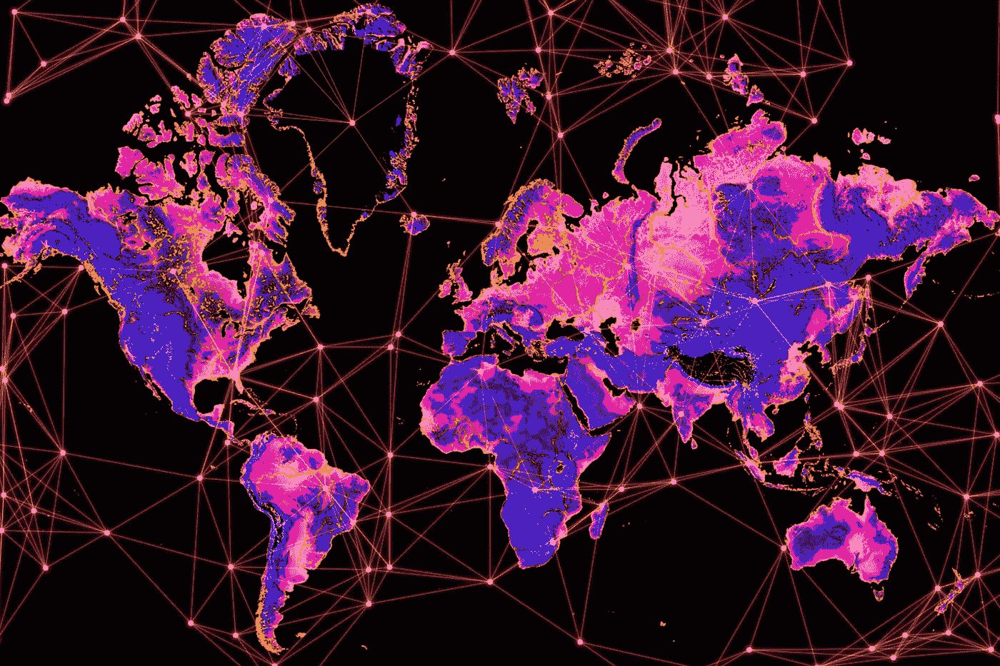
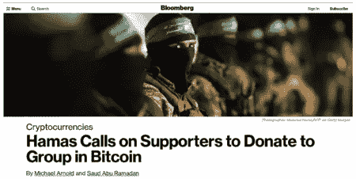
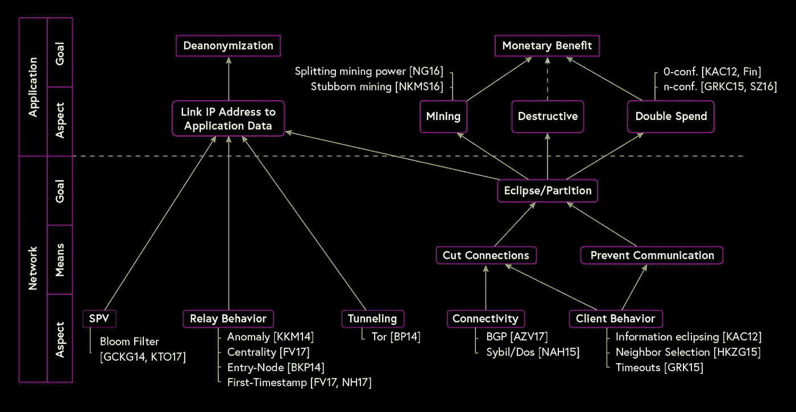

# 触及每一个人，第三部分:为什么比特币很重要——隐私、自由和权威

> 原文：<https://medium.com/hackernoon/reaching-everyone-pt-iii-why-bitcoin-matters-privacy-freedom-and-authority-68257bdd9e5>

> 网格中[上的 ICYMI，先读取那里的下一部分。](https://inthemesh.com)
> 
> 本文是由[马特·฿](https://medium.com/u/7364555d4095?source=post_page-----68257bdd9e5--------------------------------)([@ mattoshin](http://twitter.com/MattoshiN))和[瓦西姆·阿尔辛迪](https://medium.com/u/52f8c4ac75f3?source=post_page-----68257bdd9e5--------------------------------) ( [@parallelind](http://twitter.com/parallelind) )撰写的四篇系列文章中的第三篇，讲述了比特币的使用以及建立在比特币之上的技术栈，以帮助那些生活在压迫性政权下或冲突地区的人，以及那些寻求逃离他们的人。阅读[第一篇](https://hackernoon.com/reaching-everyone-pt-i-the-need-for-sound-money-outside-of-the-wealthiest-territories-f9a27e1f6488)和[第二篇](https://hackernoon.com/reaching-everyone-pt-ii-resilience-censorship-resistance-and-the-bitcoin-blockchain-c1c133d5ac96)连载。

By Kevin Durkin for In The Mesh

首先，比特币是不可知论者。它服务于任何事物，任何人，不管用户是谁，也不管他们的意图是什么，只要他们遵守规则——规则 [*，而不是规则*](https://www.epsilontheory.com/the-et-interviews-anti-authoritarian-technology/) *s* 。人们可能在网络、协议和货币中看到的是一种依赖于上下文的罗夏测试:一个人的老鼠药是另一个人的饭票。当传统金融机构通过不断扩大的 choke point 操作推动社交媒体去平台化的浪潮时，比特币作为被边缘化、被排斥、被压迫和被遗忘的人的工具而变得突出。它使任何人都能够开发一种并行的方式来交易和存储财富，随着时间的推移，使用比特币的方式和方法在种类和质量上都有所增长。毫无疑问，BTC-菲亚特交叉汇率的波动性使得加密货币价值的外部衡量指标变化很大，显然下行风险没有帮助，特别是当你把自己的生命置于危险之中时。另一方面，当国家货币经历恶性通胀事件时，比特币可能是少数几个相对稳定的避风港之一。截至今天， [stablecoins 还不是答案](https://hackernoon.com/reaching-everyone-are-stablecoins-the-answer-to-bitcoins-volatility-2a0649215465)。

自由意味着每个人都可以使用它，不管你对他们的动机、政治倾向或优先权有何看法。各种风格和信仰的游击队和外部组织将会成为分散化技术的早期采用者(T21)，对此我们无能为力。预防原则在没有许可的环境中不起作用，也没有“关闭开关”——这是一个功能，而不是一个错误。

比特币预示着一个“极端所有权”的新时代——或者至少，为个人提供了真正对其财富行使主权的选择。当正确使用时，它既是不可剥夺的，也是不可审查的。在数字时代，最重要的事情莫过于确保财富可以在没有保管人或其他第三方保留个人身份信息、将接收者列入黑名单或以其他方式拒绝/撤销交易的情况下存储和传输。虽然实物现金在日常交易中为个人提供了一定程度的匿名性，但数字支付的推动通过创造可能被用于监控目的的数字足迹威胁到这一隐私。

个人如何“体验”比特币完全取决于他们。一个极端是那些不需要真正拥有的人——想想那些依赖托管交易所或钱包的投机者。另一方面，超级用户寻求粒度控制，以最大化他们的隐私和财务自主权——如硬币控制、UTXO 混合或操作完全验证节点等功能。显然，它们越是倾向于这个极端，比特币的价值主张就越明显。

毫无疑问，比特币如今的吸引力源于其信任最小化、快速和全球转移的便利性，以及贵金属历来表现出的抗变化性和(算法强制)稀缺性。对中央发行的法定货币的信任需要参与者委托政府维护货币合法性和购买力，而对加密货币网络持续健康运行的信任只需要参与者按照自身利益行事——共识由活跃节点驱动。事实上，你将很难获得对可能危及他人财富的升级的支持，比如增加货币供应量或者为了方便而牺牲安全性。然而，没有一个系统是绝对可靠的，忽视一些以各种方式执行的潜在危险的攻击媒介是愚蠢的。从 [eclipse 攻击](/chainrift-research/bitcoins-attack-vectors-sybil-eclipse-attacks-d1b6679963e5)——在地理上或以其他方式针对单个或分组的节点子集，以模糊和改变他们对 *canonical* 区块链的看法——到国家支持的 51%攻击和[大规模去匿名化努力](/chainrift-research/bitcoins-attack-vectors-dust-attacks-9040edee2986)，这些都可能极大地破坏网络的安全性和可信度。

可替代性和隐私是相关联的概念——资产的可替代性保护了持有它的个人的隐私。黄金和法定现金等资产被认为是高度可替代的，因为几乎不可能区分同一类型的单位。相反，像一幅罕见的画这样的东西，由于其独特性，是不可替代的。从功能上来说——在很大程度上——比特币似乎是可替代的:绝大多数商家会不加区别地接受支付，不管硬币的来源如何。

然而，经过仔细研究，情况并不乐观。由于该协议依赖于公共分类账来跟踪资金的流动，这为希望执行分析的无畏的数据挖掘者和潜在的匿名用户提供了丰富的信息源。"[区块链分析](https://www.theblockcrypto.com/2019/02/26/coinbase-responds-to-its-controversial-acquisition-of-blockchain-intelligence-platform-neutrino/)"众所周知，公司(及其政府客户)会跟踪通过网络的 UTXOs 的传播，这些 UTXOs 经过了给定的地址，或者与“黑名单”上的实体进行了交互。

[Source: [https://twitter.com/tillneu/status/1095996386238218242/photo/1;](https://twitter.com/tillneu/status/1095996386238218242/photo/1;) re-design by Kevin Durkin for In The Mesh]

有一整类硬币在其协议中提供不同程度的[隐私](https://cacm.acm.org/magazines/2018/6/228028-privacy-in-decentralized-cryptocurrencies/fulltext)，并解决了比特币固有的缺陷。[在生死攸关的情况下](https://twitter.com/CryptoGainz1/status/1059185716561936384)，在当局充满敌意的地方，将 BTC 交易或地址与现实世界的身份联系起来可能会产生严重后果。另一方面，如果比特币像 Monero 或 Zcash 一样私有，那么它的货币稳健性将取决于[保持真实的加密假设](https://www.youtube.com/watch?v=jWAhDH07bUY)。这种情况的一个例子是最近披露的 Zcash 中的漏洞[,该漏洞源于加密错误，尽管利用起来很复杂，但它可能会允许对手偷偷增加秘密“屏蔽池”中的供应量。](https://z.cash/blog/zcash-counterfeiting-vulnerability-successfully-remediated/)

尽管比特币的账本是透明的，但它可以被私人使用。虽然目前该协议本身没有包含强保证，但随着保密交易、 [MAST](https://bitcointechtalk.com/what-is-a-bitcoin-merklized-abstract-syntax-tree-mast-33fdf2da5e2f) 、 [Taproot](https://bitcoinmagazine.com/articles/taproot-coming-what-it-and-how-it-will-benefit-bitcoin/) 和 [Schnorr 签名](https://github.com/sipa/bips/blob/bip-schnorr/bip-schnorr.mediawiki)等改进的实施，这种情况将会改变。如今使用的是外部协调的混淆技术，最常见的是 CoinJoin 实现，如 [JoinMarket 和 ZeroLink](/@nopara73/joinmarket-vs-zerolink-972f0ce5eb3c) 。这允许用户集中并联合处理多个输入，从而保证了一定程度的似是而非的可否认性，因为观察者无法将输出映射到特定的输入。

最近开发的更复杂的 CoinJoin 交易类型，如[支付到端点](https://blockstream.com/2018/08/08/improving-privacy-using-pay-to-endpoint/)(也称为 PayJoin/Stowaway)和[跳脱](https://samouraiwallet.com/ricochet)，已经证明了链分析功能的缺点，正如他们今天所理解的那样。一个警告是，尽管我们有许多单独的技术来改善比特币交易隐私，但这些元素之间的相互作用不一定被广泛理解。因此，关键信息泄露或某些流程失败的概率不为零，用户不应假设所有工具都经过了全面的组合测试。例如，如果 Lightning 节点 id 是公开的，那么将混合 UTXOs 从 CoinJoin wallet 发送到 Lightning 节点可能会导致取消匿名。

由于比特币协议在过去 10 年中表现出如此令人钦佩的弹性和正常运行时间，地方、地区、国家或全球范围的当局只能试图对网络和更广阔世界之间的“软”接口施加压力，如交易所、商人、矿工、硬件和软件供应商。政府对比特币的下意识反应导致法律不一致，这是一个持续存在的现实。

确保监管者拥有独立的[工具](https://hackernoon.com/q-a-on-tokenspace-a-new-conceptual-classification-framework-for-cryptoassets-6a6d16234ed5)和[信息来源](https://www.jbs.cam.ac.uk/faculty-research/centres/alternative-finance/publications/)将最大限度地减少导致任意禁令、限制、许可、罚款、监禁或扣押的误解。甚至上游的基础设施，如[互联网服务提供商、域名注册商](https://freedomhouse.org/report/freedom-net/freedom-net-2018)和支付中介也面临着越来越大的压力。特别令人担忧的一个方面是，比特币与代币、ico 或其他通过监管套利筹集资金的区块链项目混为一谈。中国现在显然要求加密货币节点向当局[注册。如果运营加密货币企业的个人或企业受到腐败官员的严密监视，他们就有被](https://bitcoinist.com/bitcoin-node-illegal-china/)[勒索](https://hackernoon.com/extortion-police-raids-and-secrecy-inside-the-venezuelan-bitcoin-mining-world-6e97a25e7402)或[绑架](https://www.reuters.com/article/us-ukraine-kidnapping/ukraine-kidnappers-free-bitcoin-analyst-after-1-mln-ransom-paid-idUSKBN1EN1QB)的风险。

另一个需要努力的领域是比特币 UTXOs 本身的可替代性。如上所述，越来越多的行业向政府和遵守国家合规程序的企业提供分析服务。尽管它们可能会向客户过度推销自己的能力，但众所周知，交易所会向它们提供信息。在比特币等网络上解密标识符的一种尝试包括尝试使用元数据，如[浏览器指纹、语言偏好、节点和网络客户端 IP 地址](https://theintercept.com/2018/03/20/the-nsa-worked-to-track-down-bitcoin-users-snowden-documents-reveal/)进行定位，并将这些链接到特定地址或 UTXOs。由于上面讨论的分类帐的公共性质，即使用户图的一小部分被取消匿名也具有更广泛的潜在影响。了解你的客户和反洗钱法律(KYC/反洗钱)共同构成了目前使用比特币的个人的最大隐私风险。

[除尘](/chainrift-research/bitcoins-attack-vectors-dust-attacks-9040edee2986)也是一种潜在的链分析技术，它通过向目标地址发送受感染的 UTXOs 并跟踪它们的传播来利用钱包中较差的硬币选择。这种载体主要针对商家(交易所和其他经济节点)，因为个人用户可以通过将 dust UXTOs 标记为不可描述来轻松规避此类攻击。鉴于最近 [OFAC 制裁与伊朗国民相关联的地址](https://home.treasury.gov/news/press-releases/sm556)，交易机制本身也很重要。在推送系统中，任何实体将如何阻止人们与被批准的地址[进行交互？](https://twitter.com/LaurentMT/status/1068130701109796864)

在很大程度上，随着比特币网络和围绕它建立的生态系统的成熟，许多现有的问题都会变得不那么严重。在中国西部等特定地区，哈希力量聚合的减少使得恶意(私人或国家批准的)行为者越来越难以控制危险的金额，加密货币业务对一个国家的 GDP 和税收的贡献越来越大，如果这些国家考虑彻底禁止加密货币或敌对采矿，那么对它们的预算惩罚会更大。加密技术的进步强化了比特币的隐私保护潜力。

在本系列的最后一部分，我们将探索在个人隐私和自由受到威胁的情况下使用比特币进行交易的各种工具、技术和策略。

*感谢 Yuval Kogman、Alex Gladstein、Richard Myers、Elaine Ou 和 Adam Gibson 提供的有用反馈。*

> Wassim Alsindi 在独立实验室 Parallel Industries 指导研究，从数据驱动和人类的角度分析加密货币网络。在推特上的[www.pllel.com](http://www.pllel.com/)和 [@parallelind](https://twitter.com/parallelind) 找到他。
> 
> Matt B 是加密货币领域的作家和内容策略师，对比特币和隐私技术特别感兴趣。可以通过推特上的 [itsmattbit.ch](http://itsmattbit.ch/) 和 [@MattoshiN](https://twitter.com/mattoshin) 联系到他。

# 感谢阅读。在你走之前！

> 如果你觉得这篇文章有趣，请👏并在你能分享的地方分享。记住，你最多可以鼓掌 50 次——这对可见度和温暖模糊的感觉真的有很大的影响。欢迎大家来 www.pllel.com 和 T2 的推特上闲逛。

## 从社区中了解更多信息

 [## 为什么比特币很重要

### 这比你想象的更重要

hackernoon.com](https://hackernoon.com/why-bitcoin-matters-c8bf733b9fad)