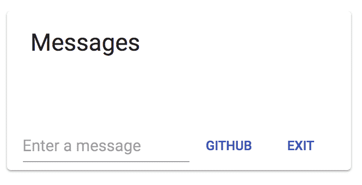

# React 聊天基础教程

> 原文：<https://medium.com/hackernoon/react-chat-basic-tutorial-7bd2af16a57e>

如果你是一名软件开发人员、工程师或者只是对编程感兴趣，那么这篇教程是为你准备的。这个演练是开源和免费的；[麻省理工](https://en.wikipedia.org/wiki/MIT_License)风格。你可以查看完整的 [React Chat GitHub 库](https://github.com/nxsyed/ReactChatEngineApp)。

[React](https://reactjs.org/) 是一个 [JavaScript](https://hackernoon.com/tagged/javascript) 库，它使您能够开发复杂的前端应用程序，能够以快速高效的方式处理业务逻辑。我们将使用 React 为我们强大的聊天应用程序构建 web 应用程序前端。React 的独特优势除了拥有最大的 JavaScript 社区之一和令人难以置信的灵活性之外，还在于它与 React Native 的兼容性，允许我们轻松地将我们的 web 应用程序转变为 iOS 和 Android 的原生移动应用程序。

在本教程中，我们将使用 React 和 [PubNub ChatEngine](https://pubnub.com/products/chatengine/) 构建一个简单但功能丰富的聊天应用程序。React 与 material-UI 将被用来组织和增强我们的应用程序，而 ChatEngine 将被用作连接我们聊天用户的主干消息基础设施和框架。

# React 概述

在我们开始编码之前，我们需要对 React 是什么以及它为我们提供了什么有更深的理解。首先，React 是基于 JavaScript 构建的。这意味着我们可以使用我们对 JavaScript 的现有理解，并且仍然能够很好地使用 React。

React 与其他产品的主要区别在于组件的概念和组件内的生命周期。如果您没有太多使用 React 的经验，请不要担心！我建议在我们继续之前看一下官方的反应文件，但这不是必须的。

让我们开始编写 react 聊天应用程序吧！为了更简单，继续从 repo:[React Chat GitHub Repository](https://github.com/nxsyed/ReactChatEngineApp)。

# 步骤 1:环境设置

在进入代码之前，我们需要做一些事情。第一个是节点包管理器(NPM ),它可以让我们添加我们需要的包，以获得我们需要的所有有趣的功能。要获得 NPM，我们需要获得 Node 的最新版本，有了它，我们就可以在终端中使用 npm/npx 命令。一旦启动并运行，我们将使用终端安装一些必备的包并创建项目层次结构(这将为我们节省一些时间)。

```
 *## Enter these on your command line.*
    *## If you have not already, install Node.js (preferably LTS).*
    npx create-react-app react-chat-engine-app

    *## Change into the new directory*

    cd react-chat-engine-app

    npm start
```

使用 npx 命令设置一个样板 React 项目，其中包含 React 开发团队描述的所需包和首选文件夹结构。一旦我们运行 npm start，我们应该会在 URL“localhost:3000”上看到一个欢迎页面

您将看到该实例将在终端中运行。请确保该窗口保持打开，因为它将允许我们在更新时看到热点更新。

# 步骤 2:聊天引擎设置

使用 ChatEngine 的最佳方式是使用 NPM 安装包

`npm install chat-engine --save`

运行该命令将为我们提供让我们的应用程序能够聊天的先决条件。

# 步骤 3:创建 ChatEngine 服务

现在我们已经创建了一个基本的 React 项目，我们可以开始给它添加一些味道了。我们要做的就是初始化 ChatEngine 对象。我们稍后将更深入地介绍该功能。

**react-chat-engine-app/src/index . js**

```
**import** React, { Component } **from** 'react';
    **import** ChatEngineCore **from** 'chat-engine';

    **const** now **=** **new** Date().getTime();
    **const** username **=** ['user', now].join('-');

    **const** ChatClient **=** ChatEngineCore.create({
        publishKey: 'your-pub-key',
        subscribeKey: 'your-sub-key'
    }, {
        globalChannel: 'chatting'
    });

    **class** App **extends** Component {

      **constructor**(props) {
        **super**(props);
        **this**.chat **=** **new** ChatClient.Chat(`BasicChatApp`);
      }

      render(){
        **<**div**>** **<**/div>
      }
    }

    ChatClient.on('$.ready', () **=>** {
        ReactDOM.render(**<**App **/>**, document.getElementById('root'));
    });
```

由于 ChatEngine 依赖于 PubNub 的数据流[网络](https://hackernoon.com/tagged/network)，**我们需要**pub nub 发布/订阅密钥来开始。使用以下表格配置 ChatEngine 并获取您的密钥:。

1.  生成的密钥将显示在您的屏幕上。
2.  用 **index.js** 中的字符串**<YOUR-PUBNUB-Publish-KEY>**和**<YOUR-PUBNUB-Subscribe-KEY>**替换新生成的发布密钥和订阅密钥

# 步骤 4:用 React 构建应用程序 UI

在上一步中，我们能够添加主要的后端功能，这将使我们的应用程序与其他实例进行通信。现在，下一步是连接

为了显示聊天消息，我们使用 *<离子列表>* 和 *<离子网格>* UI 元素。

应用程序 UI 的整个 HTML 代码在**home.html**中声明。您可以根据此应用程序的新 UI 声明覆盖该文件。

**react-chat-engine-app/src/index . js**(修改文件)

```
 **import** React, { Component } **from** 'react';
    **import** ReactDOM **from** 'react-dom';
    **import** './index.css';
    **import** ChatEngineCore **from** 'chat-engine';

    **import** { withStyles } **from** '@material-ui/core/styles';
    **import** Card **from** '@material-ui/core/Card';
    **import** CardActions **from** '@material-ui/core/CardActions';
    **import** CardContent **from** '@material-ui/core/CardContent';
    **import** List **from** '@material-ui/core/List';
    **import** ListItem **from** '@material-ui/core/ListItem';
    **import** Button **from** '@material-ui/core/Button';
    **import** Typography **from** '@material-ui/core/Typography';
    **import** Input **from** '@material-ui/core/Input';
    **import** opengraph **from** 'chat-engine-open-graph';

    **const** now **=** **new** Date().getTime();
    **const** username **=** ['user', now].join('-');

    **const** ChatClient **=** ChatEngineCore.create({
        publishKey: 'your-pub-key',
        subscribeKey: 'your-sub-key'
    }, {
        globalChannel: 'chatting'
    });

    ChatClient.connect(username, {
      signedOnTime: now
    }, 'auth-key');

    **const** styles **=** {
      card: {
        maxWidth: 345,
        margin: '0 auto', 
        float: 'none', 
        marginbottom: '10px' 
      },
      openCard:{
        maxWidth: 200
      },
      openMedia: {
        height: 80,
      },
      media: {
        objectFit: 'cover',
      },
      container: {
        display: 'flex',
        flexWrap: 'wrap',
      },
    };

    **class** Message **extends** Component{

      render () {
          **return** ( 
            **<**div **>** 
              { **this**.props.uuid }: { **this**.props.text } 
            **<**/div>
          );
      }
    };

    **class** App **extends** Component {

      **constructor**(props) {
        **super**(props);
        **this**.chat **=** **new** ChatClient.Chat(`BasicChatApp`);
      }

      sendChat **=** () **=>** {
        console.log("Sending Chat");
      }

      setChatInput **=** (event) **=>** {
        **this**.setState({ chatInput: event.target.value })
      }

      componentDidMount() {

      }

      handleKeyPress **=** (e) **=>** {
        **if** (e.key **===** 'Enter') {
            **this**.sendChat();
        }
      }

      render(){
        **const** { classes } **=** **this**.props;
        **return**(
          **<**Card className**=**{classes.card}**>**
              **<**CardContent**>**
                **<**Typography gutterBottom variant**=**"headline" component**=**"h2"**>**
                  Messages
                **<**/Typography>
                  **<**div className**=**{classes.root}**>**
                    **<**List component**=**"nav"**>**
                      **<**ListItem**>**
                      **<**Typography component**=**"div"**>**
                        { **this**.state.messages }
                      **<**/Typography>
                      **<**/ListItem>
                    **<**/List>
                  **<**/div>
              **<**/CardContent>
              **<**CardActions**>**
                **<**Input
                  placeholder**=**"Enter a message"
                  value**=**{**this**.state.chatInput}
                  className**=**{classes.input}
                  onKeyDown**=**{**this**.handleKeyPress}
                  onChange**=**{**this**.setChatInput}
                  inputProps**=**aria**-**label
                **/>**
                **<**Button size**=**"small" color**=**"primary"**>**
                  Github
                **<**/Button>
                **<**Button size**=**"small" color**=**"primary"**>**
                  Exit
                **<**/Button>
              **<**/CardActions>
            **<**/Card>
          );
        }
      }

    **const** ChatComponent **=** withStyles(styles)(App);

    ChatClient.on('$.ready', () **=>** {
        ReactDOM.render(**<**ChatComponent **/>**, document.getElementById('root'));
    });
```

看起来我们在这里添加了很多代码。但是请放心，我们所做的只是使用 Material-UI 库创建了一个简单的 UI。但是，请注意我们正在改变的组件和状态。我们创建了一个名为 Message 的组件，它将作为一个虚拟组件来处理我们的聊天消息。另一件事是我们在应用程序组件中创建的状态，它允许我们在用户点击 enter 时清除聊天输入。我们存储在 state 中的另一个变量是消息数组。这是为了预测将进入我们的应用程序的消息，并重新呈现我们添加到数组中的每个新消息。



# 步骤 5:为应用程序 UI 编写业务逻辑代码

这部分相当简单。我们在这里只看两个函数 componentDidMount 和 sendChat。我们发送和接收消息的所有逻辑都将存储在这里。

**react-chat-engine-app/src/index . js/src/index . js**(修改文件)

```
 **import** React, { Component } **from** 'react';
    **import** ReactDOM **from** 'react-dom';
    **import** './index.css';
    **import** ChatEngineCore **from** 'chat-engine';

    **import** { withStyles } **from** '@material-ui/core/styles';
    **import** Card **from** '@material-ui/core/Card';
    **import** CardActions **from** '@material-ui/core/CardActions';
    **import** CardContent **from** '@material-ui/core/CardContent';
    **import** List **from** '@material-ui/core/List';
    **import** ListItem **from** '@material-ui/core/ListItem';
    **import** Button **from** '@material-ui/core/Button';
    **import** Typography **from** '@material-ui/core/Typography';
    **import** Input **from** '@material-ui/core/Input';
    **import** opengraph **from** 'chat-engine-open-graph';

    **const** now **=** **new** Date().getTime();
    **const** username **=** ['user', now].join('-');

    **const** ChatClient **=** ChatEngineCore.create({
        publishKey: 'your-pub-key',
        subscribeKey: 'your-sub-key'
    }, {
        globalChannel: 'chatting'
    });

    ChatClient.connect(username, {
      signedOnTime: now
    }, 'auth-key');

    **const** styles **=** {
      card: {
        maxWidth: 345,
        margin: '0 auto', 
        float: 'none', 
        marginbottom: '10px' 
      },
      openCard:{
        maxWidth: 200
      },
      openMedia: {
        height: 80,
      },
      media: {
        objectFit: 'cover',
      },
      container: {
        display: 'flex',
        flexWrap: 'wrap',
      },
    };

    **class** Message **extends** Component{

      render () {
          **return** ( 
            **<**div **>** 
              { **this**.props.uuid }: { **this**.props.text } 
            **<**/div>
          );
      }
    };

    **class** App **extends** Component {

      **constructor**(props) {
        **super**(props);
        **this**.chat **=** **new** ChatClient.Chat(`BasicChatApp`);
      }

      sendChat **=** () **=>** {
        console.log("Sending Chat");
      }

      setChatInput **=** (event) **=>** {
        **this**.setState({ chatInput: event.target.value })
      }

      componentDidMount() {

      }

      handleKeyPress **=** (e) **=>** {
        **if** (e.key **===** 'Enter') {
            **this**.sendChat();
        }
      }

      render(){
        **const** { classes } **=** **this**.props;
        **return**(
          **<**Card className**=**{classes.card}**>**
              **<**CardContent**>**
                **<**Typography gutterBottom variant**=**"headline" component**=**"h2"**>**
                  Messages
                **<**/Typography>
                  **<**div className**=**{classes.root}**>**
                    **<**List component**=**"nav"**>**
                      **<**ListItem**>**
                      **<**Typography component**=**"div"**>**
                        { **this**.state.messages }
                      **<**/Typography>
                      **<**/ListItem>
                    **<**/List>
                  **<**/div>
              **<**/CardContent>
              **<**CardActions**>**
                **<**Input
                  placeholder**=**"Enter a message"
                  value**=**{**this**.state.chatInput}
                  className**=**{classes.input}
                  onKeyDown**=**{**this**.handleKeyPress}
                  onChange**=**{**this**.setChatInput}
                  inputProps**=**aria**-**label
                **/>**
                **<**Button size**=**"small" color**=**"primary"**>**
                  Github
                **<**/Button>
                **<**Button size**=**"small" color**=**"primary"**>**
                  Exit
                **<**/Button>
              **<**/CardActions>
            **<**/Card>
          );
        }
      }

    **const** ChatComponent **=** withStyles(styles)(App);

    ChatClient.on('$.ready', () **=>** {
        ReactDOM.render(**<**ChatComponent **/>**, document.getElementById('root'));
    });
```

让我们一个功能一个功能地分析这段代码。

## A.构造函数()

这里发生了两件事。首先是用频道名初始化我们的 ChatEngine 对象。第二个是创建几个变量来跟踪应用程序中的变化，包括已经输入的消息和进入应用程序的新消息。

## B.sendChat()

该函数检查用户是否输入了消息的状态。如果他们按下了 enter 键，该函数将向我们定义的通道发送一条发布消息。

## C.setChatInput(事件)

这个方法用于检索所有加入聊天室的用户。这用于填充 UI 的标题部分，以显示当前在聊天室中的所有用户。

## D.componentDidMount()

此方法用于从 app 客户端发送聊天消息。它被绑定到 UI 的 *<输入框>* 以及 *<按钮>* 元素。

# 后续步骤

我们现在有了一个用 React 库构建的基本功能聊天应用。你可以查看 [GitHub repo](https://github.com/nxsyed/ReactChatEngineApp) 获取这个应用的完整代码。现在你可以在你的机器上运行这个项目了！

*最初发表于*[*reactjs . chat*](https://reactjs.chat/tutorials/react-basic-chat-module/)*。*