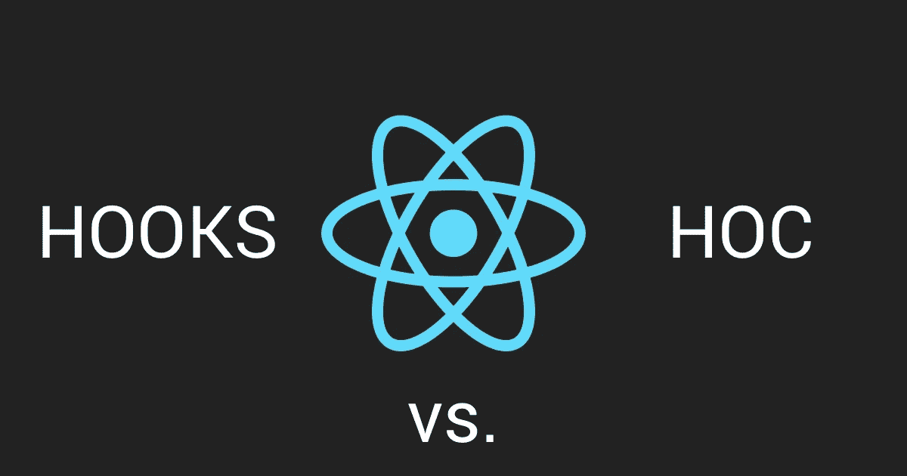

# 反应钩子——比 HOC 慢？

> 原文：<https://medium.com/hackernoon/react-hooks-slower-than-hoc-ff105586036>

现在，备受期待的 React Hooks API 已经正式发布，我终于能够将它的执行速度与以前的 HOCs 进行比较了。而结果让我大吃一惊！



在对闪亮的新鱼钩的兴奋中，值得信赖的老鱼钩可能已经被不必要的诋毁了。我马上会说，我的简单基准测试表明 HOCs 可能仍然更快，尽管最近它被指责为“包装地狱”。当然，如果你发现我的测试有缺陷，我会感谢被纠正。

# 测试应用程序

我设计了一个基本的测试应用程序，它可以呈现 10，000 个具有 3 个状态值的功能组件实例，并在第一次呈现后设置 3 个状态值。主组件记录从根组件的实例化到它完成呈现 10，000 个项目所经过的时间。为此，它还使用了一种效果。

然后我创建了测试应用的两个版本，一个使用钩子，另一个使用 HOCs(使用我最近发布的**反应堆库**:https://github.com/arnelenero/reactorlib#reactor-library[)。](https://github.com/arnelenero/reactorlib#reactor-library)

## 钩子版本

```
import React, { useEffect, useState } from 'react';
import { render } from 'react-dom';const array = [];
for (let i = 0; i < 10000; i++) array[i] = true;const Component = () => {
  const [a, setA] = useState('');
  const [b, setB] = useState('');
  const [c, setC] = useState('');

  useEffect(() => {
    setA('A');
    setB('B');
    setC('C');
  }, []); return <div>{a + b + c}</div>;
};const Benchmark = ({ start }) => {
  useEffect(() => {
    console.log(Date.now() - start);
  }); return array.map((item, index) => <Component key={index} />);
};render(<Benchmark start={Date.now()} />, document.getElementById('root'));
```

## 反应堆库版本

```
import React from 'react';
import { render } from 'react-dom';
import { compose, withState, withEffect } from '@reactorlib/core';const array = [];
for (let i = 0; i < 10000; i++) array[i] = true;const _Component = ({ a, b, c }) => {
  return <div>{a + b + c}</div>;
};const Component = compose(
  withState({
    a: '',
    b: '',
    c: ''
  }),
  withEffect(({ setA, setB, setC }) => {
    setA('A');
    setB('B');
    setC('C');
  }, true)
)(_Component);const _Benchmark = () => {
  return array.map((item, index) => <Component key={index} />);
};const Benchmark = compose(
  withEffect(({ start }) => {
    console.log(Date.now() - start);
  })
)(_Benchmark);render(<Benchmark start={Date.now()} />, document.getElementById('root'));
```

# 测试设置

测试是在 2015 年初运行 MacOS Sierra 10.12.3 和 Chrome 71 的 12 英寸 Macbook (1.1GHz Core M，8GB RAM)上进行的。

两个版本都在 React 16.8.1 上。

# 测试结果

我获得了在 MacOS Chrome 上进行 10 次测试的结果，所有结果都显示出明显的赢家。

```
Rendering Time in millisecondsRun#     Hooks        HOCs
-----------------------------
 1       2197         1440
 2       2302         1757
 3       2749         1407
 4       2243         1309
 5       2167         1644
 6       2219         1516
 7       2322         1673
 8       2268         1630
 9       2164         1446
10       2071         1597
```

但是不要相信我的话。你可以运行我上面贴的两个版本，自己看看。

# 结论

如果渲染速度的差异对您的用例至关重要(例如组件的循环实例)，这些数字表明您可能需要重新考虑使用 hoc。但是，对于典型的用例，这种差异可能不足以影响您的决策。

# 其他考虑

在 Hooks 和 HOC 之间做出选择可能并不像我们最初认为的那样容易。除了我在这里提到的，还有其他因素会影响这个选择，比如您的代码重用的特定策略。好消息是，我们不会被迫只选择其中之一；我们可以两者都用，仔细判断哪些组件应该优先于另一个。

在你需要 hoc 的地方，你可能想看看我的反应堆库(【https://github.com/arnelenero/reactorlib#reactor-library】)。不，不仅仅是功能组件的问题；它还有很多其他的东西可以帮助你简化 React/Redux 开发。请随意使用，它既是你的也是我的。