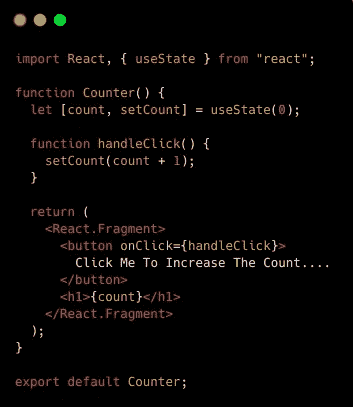
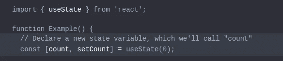

# React 钩子:useState(使用状态钩子)

> 原文：<https://medium.com/hackernoon/react-hooks-usestate-using-the-state-hook-89ec55b84f8c>


**A new way of working with React.**

> React 挂钩目前在 create-react-app 中可用

在本文中，我们将试图理解什么是 [React 钩子](https://reactjs.org/docs/hooks-intro.html)以及使用它们时我们必须遵循的规则。另外，我们将使用 ***useState React 钩子创建一个计数器应用程序。***

# 什么是 React 钩子？

> React 挂钩是让我们从功能组件中挂钩到 React 状态和生命周期特性的功能。

这里，我们的意思是钩子允许我们轻松地操作功能组件的状态，而不需要将它们转换成类组件。

钩子在类内不起作用(*因为* *它们让你在没有类的情况下使用 React】)。通过使用它们，我们可以完全避免使用生命周期方法，例如*组件卸载*、*组件更新*、*组件卸载*。相反，我们将使用类似`useEffect`的内置钩子。*

**基本内置挂钩:**

1.  返回一个有状态值和一个更新它的函数— ***使用状态***
2.  允许您在功能组件中执行副作用— ***使用效果***
3.  接受上下文对象(从`React.createContext`返回的值)并返回当前上下文值，该值由给定上下文的最近上下文提供者给出— ***useContext***

# 钩子的规则

钩子是 JavaScript 函数，但是它们强加了两个额外的规则:

1.  不要调用循环、条件或嵌套函数内的钩子— *只调用顶层的钩子***。**
2.  *不要从常规的 JavaScript 函数调用钩子——只从 React 函数组件调用钩子**。***

> **让我们深入了解一下****use state hook****特性是如何工作的。**

*首先，使用 [create-react-app](https://github.com/facebook/create-react-app) 创建一个名为`counter`的新 React 应用。*

```
*$ npx create-react-app counter
$ cd counter
$ npm start*
```

**

*counter app*

*现在我们需要创建`Counter`组件和一个按钮来更新计数器。
并将`Counter`内的初始状态(计数)设置为 0 值。并添加一个事件处理程序，以便每当单击按钮时，`count`就增加 1。*

*我们在组件内部直接调用`useState`钩子:*

**

*`const [count, setCount] = useState(0);`声明一个 ***状态变量*** 。`useState()`钩子的唯一参数是初始状态。*

****useState*** 返回一对值:当前状态和更新它的函数。这就是我们写`const [count, setCount] = useState()`的原因。这类似于一个班里的`this.state.count`和`this.setState`。*

> *您可以在单个组件中多次使用状态挂钩:*

```
*function ExampleWithManyStates() {
  const [age, setAge] = useState(42);
  const [fruit, setFruit] = useState('banana');
  const [todos, setTodos] = useState([{ text: 'Learn Hooks' }]);
}* 
```

> *`const [count, setCount] = useState(0);` 数组析构语法让我们给通过调用`useState`声明的状态变量取不同的名字。这些名字不是`useState` API 的一部分。*

*在这里你可以找到一个 React 钩子使用状态的例子:[https://github.com/jscodelover/react-hooks](https://github.com/jscodelover/react-hooks)*

*在 [Twitter](https://twitter.com/jscodelover) 、 [LinkedIn](https://www.linkedin.com/in/jscodelover) 或 [GitHub](https://github.com/jscodelover) 上关注我。*

*希望这篇文章对你有用。感谢阅读&继续编码！！*