# 与 Chuck Norris 进行本地聊天

> 原文：<https://medium.com/hackernoon/react-native-chat-with-chuck-norris-dd5721523742>

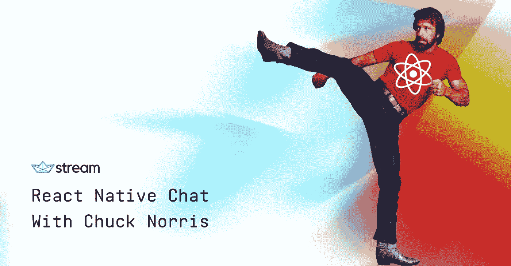

我是 [Stream](https://getstream.io) 和 [Feeds](https://getstream.io/activity-feeds/) 和 [Chat](https://getstream.io/chat/) 的 API 的开发者传道者，我有机会体验我们的各种工具、令人惊叹的 UI 套件和新产品！多年来，Stream 一直是 feeds 即服务的领先提供商，为超过 5 亿的最终用户提供 feeds。在过去的几个月里，该团队一直在努力开发一款新产品——[Chat](https://getstream.io/chat/)。

在本教程中，我将带您了解如何使用 React Native、[天赋聊天](https://github.com/FaridSafi/react-native-gifted-chat)(React Native Chat Components by Stream 目前正在开发中)、[无服务器聊天](https://serverless.com/)，当然还有[按流聊天](https://getstream.io/chat/)，构建一个简单的 messenger 风格的应用程序。为了增加混合，我将引入一个后端 Lambda 函数，它将自动响应由第三方 API 提供的 Chuck Norris 笑话和事实。

对于繁重的工作，我们将使用 [Stream Chat JS](https://www.npmjs.com/package/stream-chat) ，一个直接与 Stream API 通信的 JavaScript SDK。如果你有兴趣查看一个关于流聊天的很棒的教程，看看这里的。

> 我还应该指出，我将使用 macOS 和 iOS，所以如果您使用 Windows 或 Linux，本教程可能会稍有偏离。

要跟进这篇文章，请确保您已经安装和/或设置了以下内容:

*   [世博会](https://expo.io)
*   [无服务器](https://serverless.com/framework/docs/getting-started/)
*   [AWS](https://aws.amazon.com/)

> 寻找代码库？你可以在这里找到开源代码[。来个快速演示怎么样？我也有！看看](https://github.com/GetStream/react-native-chat-chucky)[开胃](https://appetize.io/app/crhnp4qabpmznx6bzvfz6ad708)上的演示。

让我们找点乐子！🏂

# 1.按流配置聊天

前往 [https://getstream.io](https://getstream.io) ，点击网站右上角的“注册”按钮。按照提示进行操作。

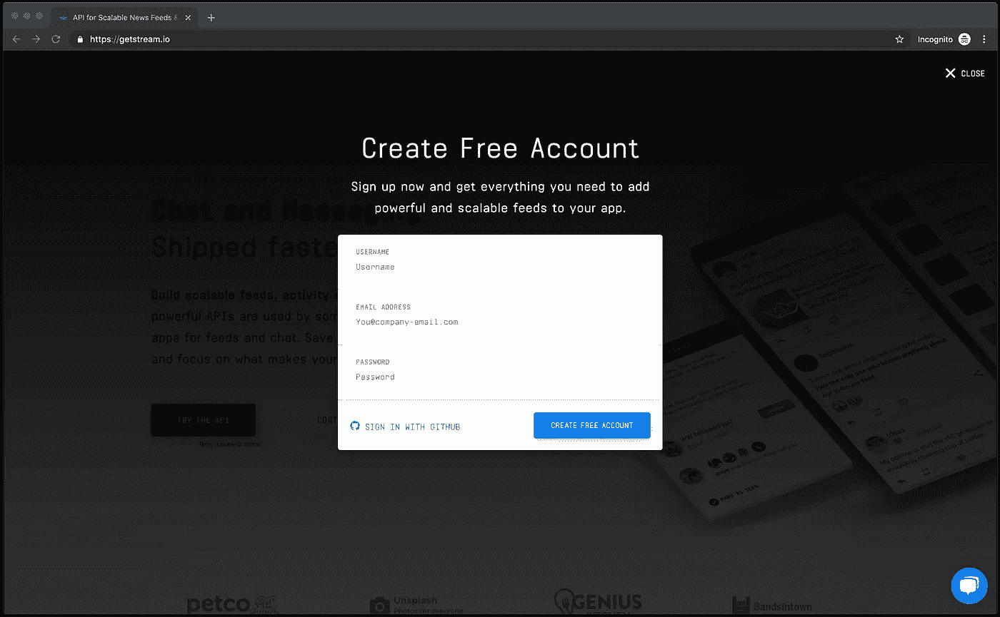

[https://getstream.io](https://getstream.io)

一旦你被重定向，前往[https://getstream.io/chat/#pricing](https://getstream.io/chat/#pricing)并点击“开始试用”按钮——这将为你的帐户启用试用聊天(14 天)。一旦审判开始，你就快成功了！

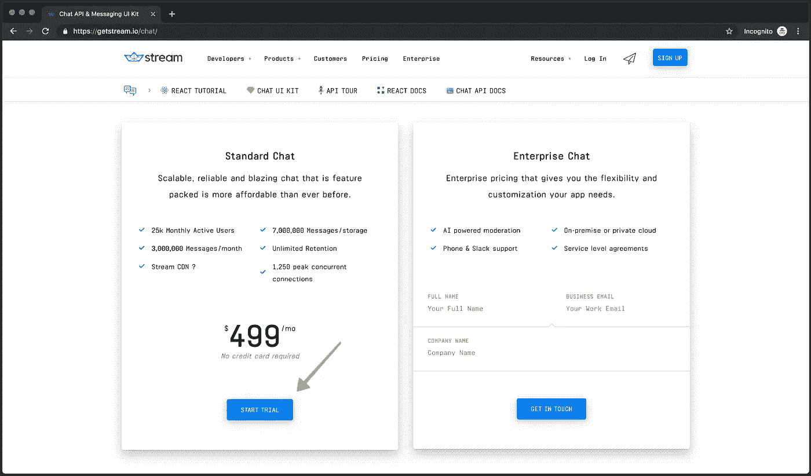

[https://getstream.io/chat/#pricing](https://getstream.io/chat/#pricing)

回到[仪表板](https://getstream.io/dashboard)并点击您的应用程序。仪表盘默认为“Feeds”，所以请点击顶部的“Chat”按钮。

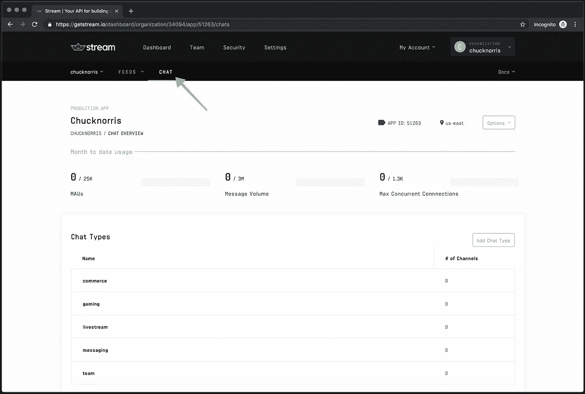

Stream Dashboard

从这里，如果你向下滚动，你会看到你新启用的聊天应用程序的各种设置。确保在一个新的标签页中打开它——您将需要这个页面中的**密钥**、**秘密**(底部)和**应用 ID** (顶部)。

如果你对流聊天的定价和产品比较感兴趣，可以看看这个。

# 2.设置无服务器

当您只有几个必需的端点时，类似于这个构建，无服务器通常是最有意义的。启动服务器可能需要相当长的时间，而且可能相当昂贵。我并不是说无服务器环境适用于所有人和所有事物，但是，我是说如果你正在构建一个很小的 API，无服务器环境绝对是一个不错的选择。

前往[https://dashboard.serverless.com](https://dashboard.serverless.com)创建一个新账户。遵循入职流程(电子邮件验证、用户名选择、应用创建等。).创建应用程序后，保存租户名称(例如，*尼克-查克*用户名= *尼克-查克*租户)，并保存应用程序名称——在接下来的几个步骤中，我们将需要这两个名称。

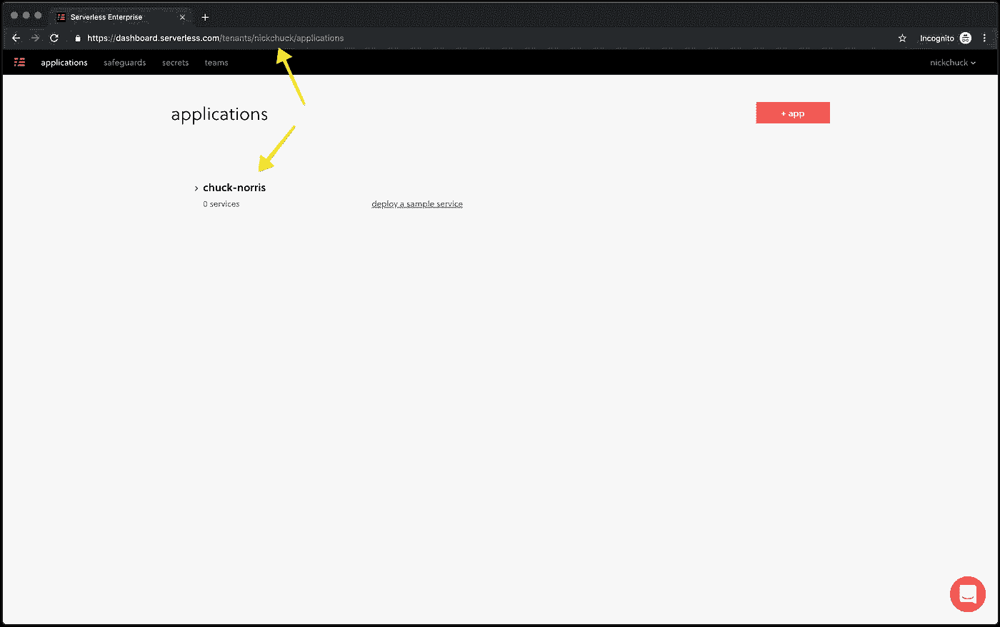

Serverless Dashboard

# 3.使用 Expo 创建一个 React 本机应用程序

Expo 通过使用 Expo APIs 简化了构建 React 本地应用程序的过程。从技术上讲，我们根本不需要它；然而，如果你想快速地将一些东西组合在一起，并有可能为 iOS 或 Android 开发一个版本，Expo 将是最快的方式。毕竟，你可以随时退出你的世博项目。

要创建您的应用程序，请打开您的终端，前往您选择的目录(我将位于 **~/Code** )。一旦一切就绪，运行下面的命令来搭建项目。

**$ Expo init react-native-chat-chucky**

按照 Expo CLI 的提示，在选项卡和空白问题中选择“空白”。一旦你回答完问题，Expo 会生成目录并使用 yarn 或 npm 安装必要的依赖项。您的终端应该如下所示:

iTerm 2

一切就绪！👏

# 4.添加聊天 SDK 以反应本地聊天

接下来，让我们使用下面的命令安装所有需要的依赖项。我将为此使用 yarn，但是如果您在初始设置时选择了 npm，请使用它来避免混合锁文件。

**$ yarn add axios MD5 react-native-gifted-chat react-native-iphone-x-helper react-native-parsed-text react-router-native stream-chat**

# 5.添加默认消息

为了显示聊天界面，我们使用了 [react-native-gifted-chat](https://www.npmjs.com/package/react-native-gifted-chat) ，这是一个非常棒的 UI 库，专门用于处理聊天应用程序。有了天才聊天，我们可以把 UI 放在一边，快速启动并运行！

为了开始一个初始消息，我们需要创建一个新目录和一个消息文件。UI 已经被连接起来需要这个文件，所以只需要创建它并放入一个自定义消息。

**$ mkdir data&&touch messages . js**

完成这一步后，将下面的代码片段粘贴到文件中并保存。

data/messages.js

可以走了！🚀

# 6.添加路由和屏幕以反应本地

我们已经有了所有必要的依赖项，所以让我们继续前进，把所有的东西都绑在一起！

修改您的 **App.js** 文件，使其包含以下代码片段。

创建名为 screens 的目录，并在其中创建两个文件——chat . js 和 Login.js。

**$ mkdir 屏幕& & cd 屏幕& &触摸 Chat.js & &触摸 Login.js**

一旦这两个文件就位，我们将需要填充它们！将下面显示的代码放到适当的文件中。

**Chat.js**

Chat.js

**Login.js**

Login.js

> 在第 22 行，从您的 Stream Dashboard 中拖放 Stream 应用程序 ID。在第 53 行，您需要添加由 AWS API Gateway 提供的 Lambda 端点——不要担心，您现在还没有，我们将在下一节中介绍它。

呜！快到了！👨‍🚀

# 7.添加无服务器目录和文件

现在，您已经使用 Expo 成功搭建了一个 React 本机应用程序，接下来进入目录(例如 react-native-chat-chucky)。

**$ CD react-native-chat-chucky**

首先，让我们继续创建一个名为 serverless 的新目录，然后进入该目录，这样我们就可以安装一些依赖项。

**$ mkdir 无服务器& & cd 无服务器**

新建一个 **package.json** 文件。

**$ touch package.json**

然后，将下面示例片段的内容复制到 package.json 文件中。

> 添加 package.json 文件后，确保在无服务器目录下运行 yarn 以正确安装模块。

完成上述步骤后，您需要将以下文件内容复制/粘贴到您的无服务器目录中。

**.eslintrc.json**

.eslintrc.json

**。prettierrc**

.prettierrc

**webpack.config.js**

webpack.config.js

**serverless.yml**

serverless.yml

> 在 serverless.yml 文件的顶部，您将定义从 serverless 仪表盘保存的租户名称和应用程序名称。在我的例子中，我使用 **nickchuck** 作为我的租户名称，使用 **chuck-norris** 作为我的应用程序名称。

干得好！👊

# 8.设置 AWS

网上有大量支持如何做到这一点的信息。我将提供必要的步骤，但这绝对是我推荐您阅读的内容！

> 需要注意的一个关键点是，无服务器需要几种不同的 AWS IAM 权限。S3、CloudFormation、API Gateway 和 Lambda 等等。有一些方法可以将 IAM 权限限制在满足必要要求的范围内，这些方法可以在[这里](https://serverless.com/framework/docs/providers/aws/guide/iam/)找到。我发现虽然这是最安全的方法，但肯定不是最快的。我的建议是，如果这是一个个人 AWS 帐户，请节省一些时间，并从 IAM 授予您的帐户“AdministratorAccess”权限。

设置好 AWS 帐户和 IAM 权限后，使用 [aws-cli](https://docs.aws.amazon.com/cli/latest/userguide/cli-chap-install.html) 在命令行中指定您的凭证(凭证可以在 IAM 下找到)。

**$ aws 配置**

aws-cli 将询问您的访问密钥 ID 和秘密访问密钥。它还会问您几个(可选)问题，以便 AWS CLI 可以正确地提供您的配置文件。

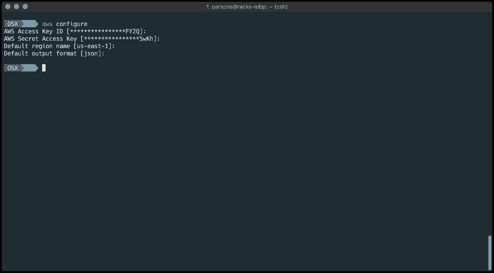

aws-cli

> 第一次需要安装 aws-cli 吗？在 macOS 上超级简单。只需运行 brew install aws-cli 和 [Homebrew](https://brew.sh/) 就会为您完成剩下的工作！

干得好！🕺

# 9.部署无服务器版本

配置好 AWS 并将您的 AWS 凭证安全地存储在您的机器上之后，是时候将无服务器构建部署到 Lambda 了！导航到 React 本机代码库中的无服务器目录，然后运行以下命令！

> 如果您尚未安装无服务器 CLI，可以使用 npm install -g 无服务器进行安装。

**$ sls 部署**

构建将开始，您应该开始看到实时的日志记录！

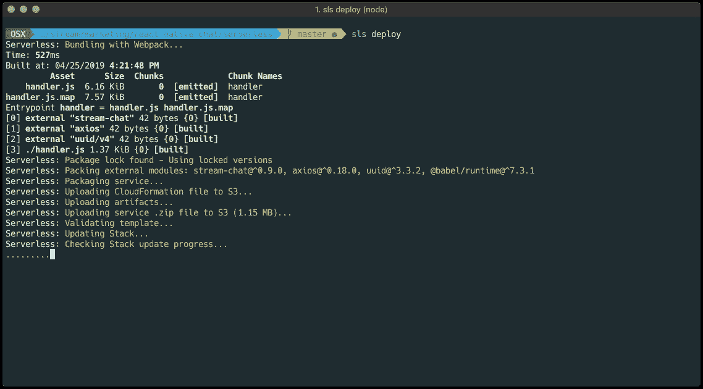

$ sls deploy

> 遇到问题了？请在文章末尾的评论中留下详细信息，我会帮你解决的！

嘣！💥

# 10.启用 API 网关以开始服务请求

Serverless 已经为您完成了一些繁重的工作，自动化了大部分构建。在无服务器出现之前，我们只有 Lambda 可以使用，有时事情确实有点不稳定和麻烦。对于一个只有 Lambda 的工作流，我们过去常常被要求压缩我们的代码库(节点模块等等),然后手动将压缩文件上传到 AWS。呸！😫

要验证您的 Lambda 是否与 API Gateway 一起提供，请登录 AWS 并搜索 API Gateway。

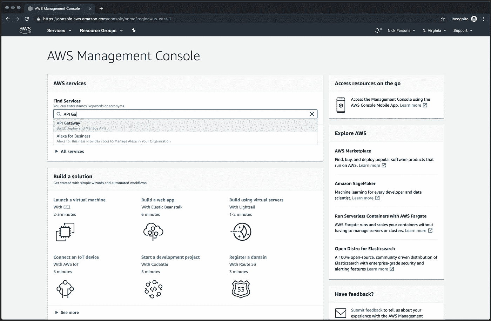

AWS Dashboard — API Gateway

单击“API Gateway”，您将被重定向到带有 API 列表的仪表板。我的帐户下有一些，所以它可能会显示一些不同的东西。理想情况下，您正在寻找一个名为**prod-<YOUR _ APP _ NAME>**的东西。在我的例子中，它是 prod-react-native-app。点击正确的 API 查看您的资源。

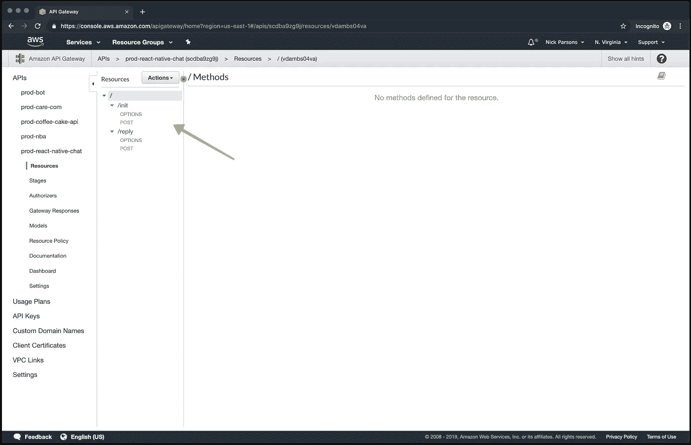

API Gateway — Resources

选择顶部根资源后，单击“Actions”下拉菜单并选择“Deploy API”。

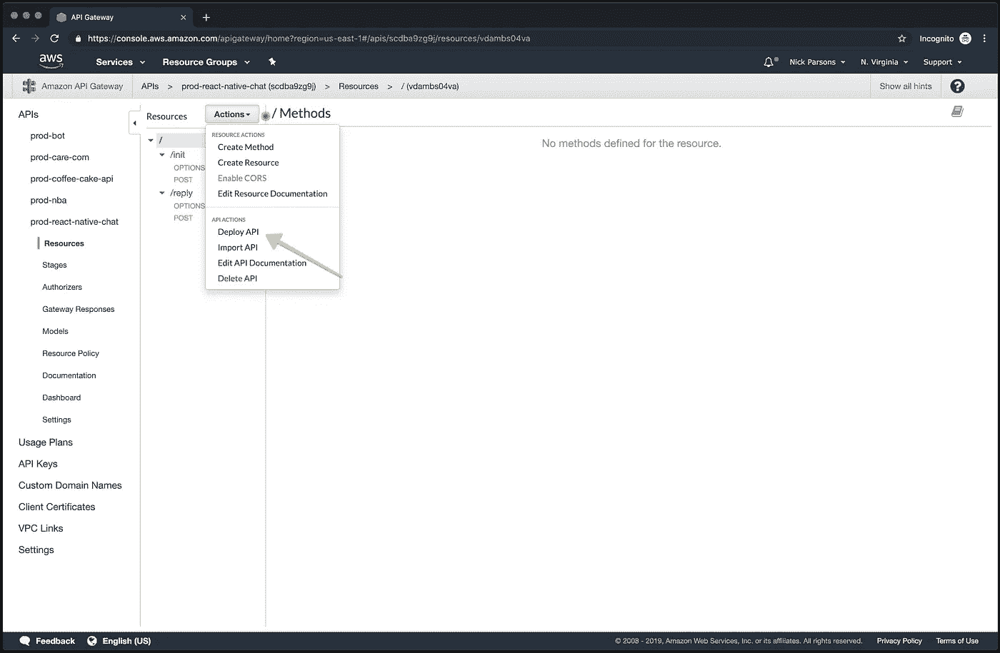

API Gateway — Deploy

将显示一个模式，供您指定您的“阶段”。如果你在下拉列表中还没有一个“stage ”,创建一个新的，你可以随意命名。我选择了“prod”这个名字，因为当我推送到 Lambda 时，它通常已经使用[无服务器离线](https://www.npmjs.com/package/serverless-offline)进行了测试，并且已经可以生产了。

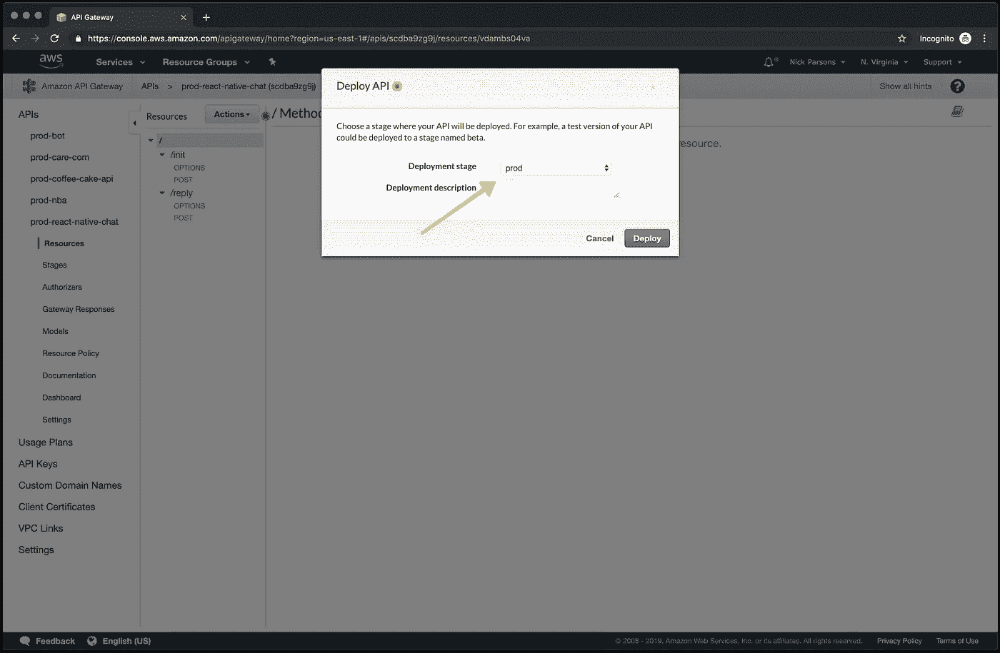

API Gateway — Deploy API

点击“部署”，您的 API 将被部署到 API Gateway！现在，只需捕获调用 URL 并保存它以供下一步使用！

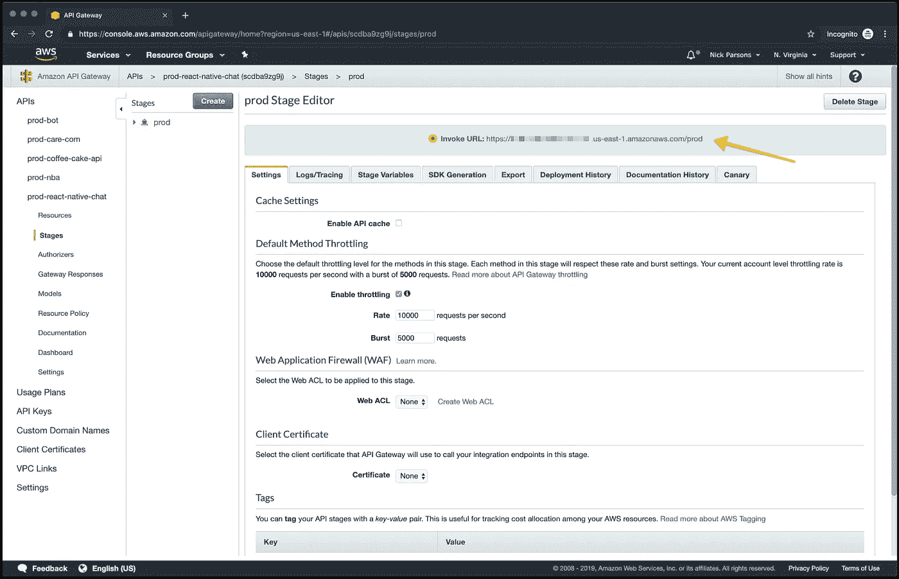

API Gateway — Stage Editor

快到了！🏎

# 11.在 Chat.js 中指定 Init 端点

保存您的调用 URL 后，将调用 init 处理程序，方法是将 **/init** 附加到它的末尾。转到 Chat.js，第 53 行，从 AWS API Gateway 放入您的调用 URL。这将处理流聊天所需的服务器端令牌的获取和生成。

有了正确的 URL 之后，代码将在用户登录后向/init 发送用户信息*(又名 you！).POST 将返回一个带有用户信息和生成的用户令牌的序列化对象。*

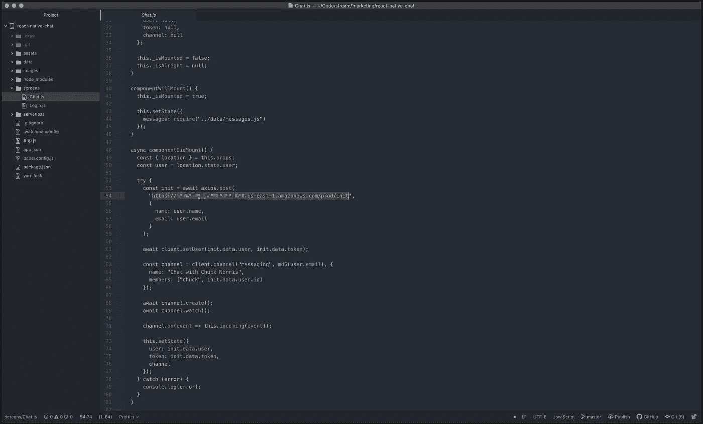

Chat.js

> 您的端点当前没有受到 API 密钥的保护。如果您想要启用 API 密钥，可以在 API 网关内逐个路由地完成。

答对了。🎲

# 12.设置 Webhook 回复 URL

类似于上面的步骤，URL 将是您的调用 URL，并在末尾附加了 **/reply** 。在 Stream Chat 仪表盘中，向下滚动到“Chat Events”部分，通过滑动切换按钮直到它变为绿色来启用 webhook。然后将您的 URL 放入输入中，并单击“保存”。

Stream Dashboard — Webhooks

有了合适的 URL 和激活的 webhook，任何通过 UI 发送的聊天事件都会通过 POST 转发到 Lambda。正文包含许多有用的信息，包括聊天标识符(CID)、发出请求的用户、消息正文等等。

如果您查看 serverless/handler.js 中的回复处理程序，您会注意到，只有当事件来自“chuck”以外的用户(Chuck Norris 的预设用户)时，我们才会发回聊天消息。这是相当简单的逻辑，不应该太混乱。

> Stream CLI 还提供了设置 Webhook URL 的功能——你可以在这里下载 Stream CLI [。请在这里](https://github.com/getstream/stream-cli)参考文档[。](https://github.com/GetStream/stream-cli/blob/master/docs/chat.md#stream-chatpushwebhook)

再走一步！🚶

# 13.火本地聊起来！

你已经走了很长一段路。到目前为止，我们已经用 Expo 和 Gifted Chat 构建了一个定制的 React 原生聊天 UI，绑定到 Stream，用 Serverless 设置了一个 AWS Lambda，并在 Stream Chat 仪表板上配置了一个 webhook。哇，太多了。

现在是时候和查克·诺里斯一起娱乐一下了，听听他生活中所有激动人心的故事。

使用命令行启动 iOS 模拟器(从您的项目目录中)。

**$ expo start — ios**

**或**

进入 React Native 的根目录，运行命令 **yarn start** 。Expo 将为您打开一个新的调试器窗口。接下来，按照下面的步骤。

*   打开 Xcode
*   导航到 Xcode 菜单栏，直到它下拉
*   找到“打开开发者工具”，然后点击“模拟器”

iOS 模拟器将启动并挂在你窗口的右上角。接下来，关注 Expo 打开的调试器窗口。在左下角，点击“在 iOS 模拟器上运行”。

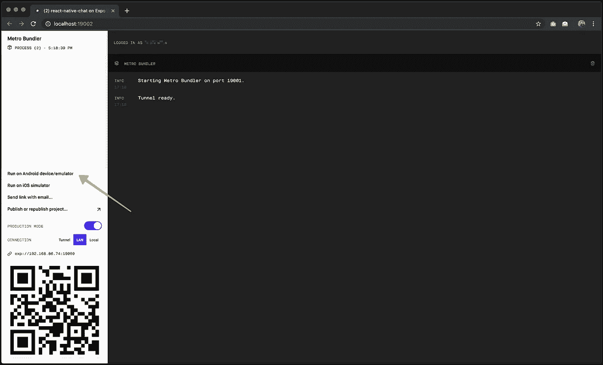

Expo Debugger

应用程序应该加载到 iOS 模拟器中，您应该会看到登录屏幕！

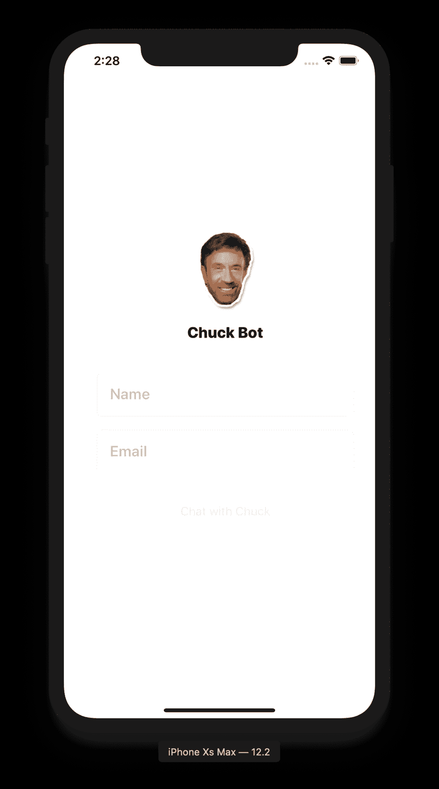

iOS — Welcome

键入您的姓名和电子邮件，然后单击底部的“与 Chuck 聊天”按钮。该应用程序将向服务器发出请求，并在流中检索您的应用程序提供的有效用户令牌。从这里开始，一切都是为了开心！

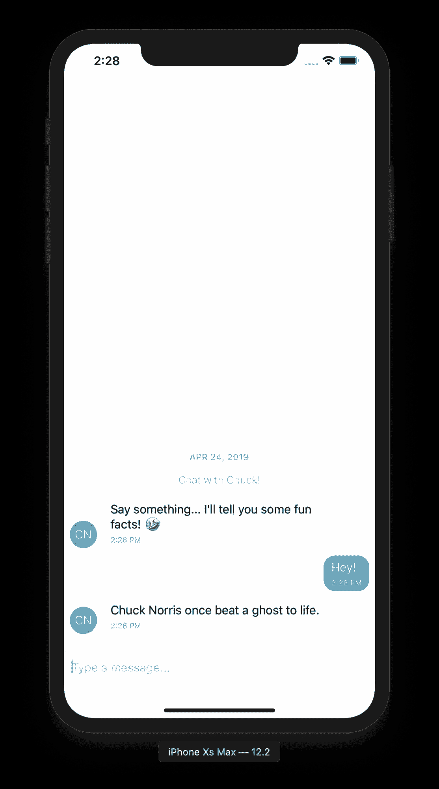

iOS — Chat

> 停滞在构建阶段？在下面的评论中留下一些细节，我很乐意帮助你！

如果你想进一步定制这款应用，或者把它变成 APK (Android)或 IPA (iOS)，我建议你查看以下链接:

*   [借助 Expo 构建独立应用](https://docs.expo.io/versions/latest/distribution/building-standalone-apps/)
*   [天才聊天——GitHub](https://github.com/FaridSafi/react-native-gifted-chat)
*   [流聊天文档](https://getstream.io/chat/docs/)
*   [流聊天教程](https://getstream.io/chat/react-native-chat/tutorial/)

这是一个总结！[按流聊天](https://getstream.io/chat/)提供了必要的后端基础设施来从头开始构建聊天产品，只让前端由您决定！看看这些基于 Stream Chat 构建的 [React powered 教程。](https://getstream.io/chat/react-chat/tutorial/)

喜欢这个教程？来点掌声怎么样？🙂👏