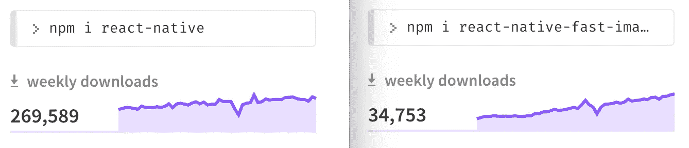
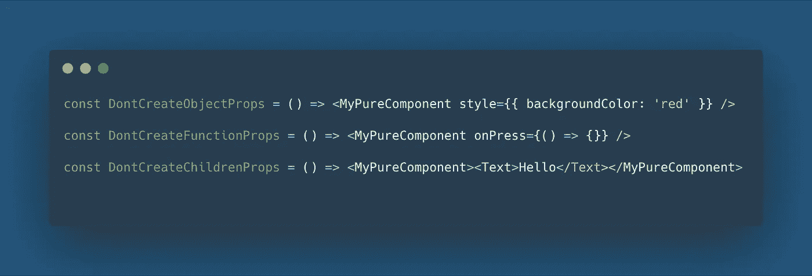
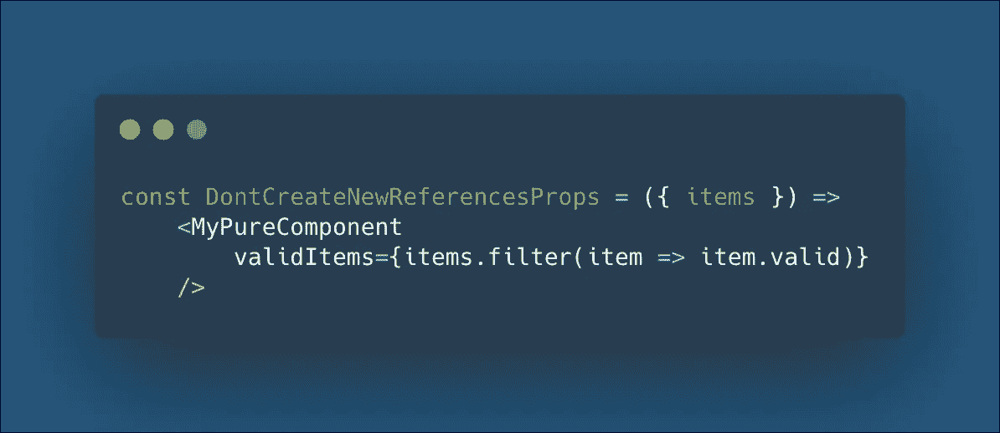
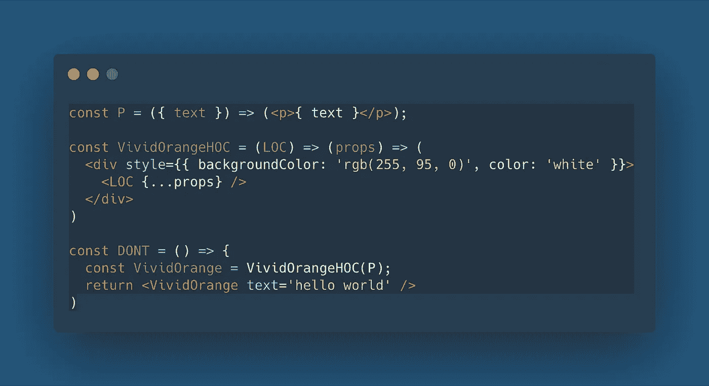
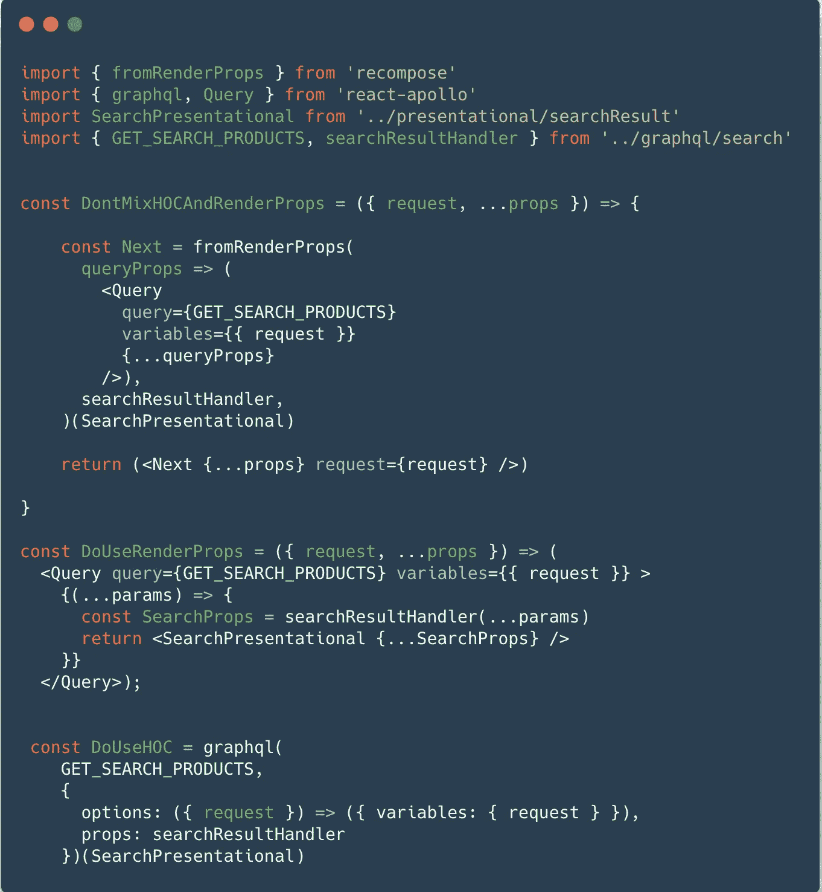
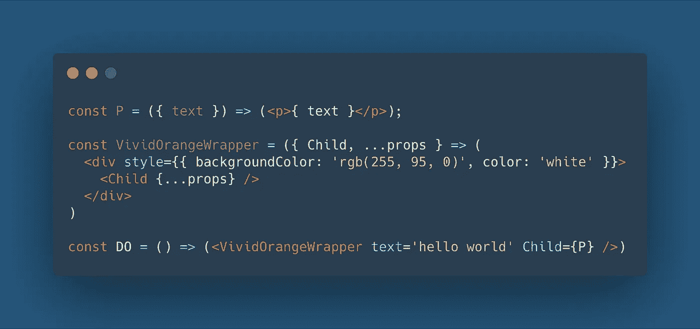

# 反应本地性能:做与不做

> 原文：<https://medium.com/hackernoon/react-native-performance-do-and-dont-1198e97b730a>

> tL；DR —一定要阅读 React、React Native 和每个库的文档，使用远程映像可能会很痛苦:使用库。有些模式可能是有害的，小心纯组件和 HOCS。使您的库保持最新。给你的应用和你的用户一些爱。

这篇文章是基于两年来构建[内利奥](https://nelio.io) React 本地移动应用的经验，这些应用可以在 [iOS](https://itunes.apple.com/fr/app/nelio/id1057392527?mt=8) 和 [Android](https://play.google.com/store/apps/details?id=io.nelio.hello&hl=en) 上使用。它假设您已经有一些使用 React 和/或 React Native 的经验。严格来说，React Native 并不是专用的，因为下面的一些建议适用于常规的 React 应用程序。这也不是一个详尽的性能指南:你可以应用这里找到的所有建议，但仍然有一个落后的应用程序。不要责怪我们；-)

内利奥是一家专注于手工食品的食品配送初创公司，目前在巴黎运营。当交付高质量产品是你的业务时，它会影响到你公司的方方面面。从营销信息到代码库。基本上，这里的每个人都专注于提供最佳的用户体验。

绩效是可以改变对您提供的服务的整体看法的话题之一。老实说，在这个话题上，我们有时很难达到我们和客户的期望。这篇文章是基于我们在这次旅程中学到的东西。我们犯过的错误，不会再发生的错误，或者我们学到的东西和我们采取的应对措施。

# 反应和反应-本机性能

作为一名过去 4 年的 React 开发人员，我能说的就是我喜欢它。当我加入 React Native 项目时，我非常高兴，就学习曲线而言，它符合我的预期:拥有相同的框架使开始开发您的第一个组件变得非常容易，但稍后您将需要更深入地了解 React Native。正如成为一名高级 React Web 开发人员需要你了解浏览器中正在发生的事情一样；-)

关于 React Native 中的性能，这是相同的:

> 您所知道的关于 React 性能的一切都将适用于 React 本机应用程序

也就是说，下一步很可能是跳转到 [React 性能文档](https://reactjs.org/docs/optimizing-performance.html)以及稍后的 [React 原生性能文档](https://facebook.github.io/react-native/docs/performance)。这些都是很好的资源，我不会在这里花费任何时间复制粘贴或重写；-)我更倾向于关注我们为了提高性能而放置或决定避免的特定模式。

我也不会花任何时间争论反应自然是否足够快，你是否应该移动到颤动或完全自然。有一些很棒的 React 本地应用。以下是我们如何努力成为他们中的一员。

# 一定要提供用户界面反馈

性能主要是关于感知，而不是精确测量一个功能完成需要多长时间。更重要的是*还有多久？*，你应该问问自己*为什么？*和*什么时候？。*

人们普遍认为，在用户互动之后，你应该在 100 毫秒内给出反馈。请记住，这个门槛是你不应该跨越的障碍。还要记住**给予反馈永远不会太早**。

有不同的方式向用户提供反馈。在 React Native 中，一个伟大而简单的解决方案是在所有接受用户交互的组件上使用 [TouchableOpacity](https://facebook.github.io/react-native/docs/touchableopacity) 组件。这将在交互过程中向用户提供反馈，并且是一种很好的方式来表明交互后将发生的事情。

A skeleton product card in Nelio App

如果点击导致打开一个新的屏幕，那么你应该**花一些时间考虑你的数据加载**。通常一个好的方法是尽快打开新屏幕，呈现已经有的内容，并在内容加载时显示加载器和/或一些占位符组件。这是一种也被称为 [*骨架筛*](https://uxdesign.cc/what-you-should-know-about-skeleton-screens-a820c45a571a) *的技术。*

如果您单击导致其他操作，比如将一个项目添加到您的购物车、收藏夹或发布聊天消息，这通常会包括远程 API 调用。在这种情况下，您应该尽可能——大多数时候— **表现得好像端点已经成功响应了一样**。这种模式被称为[乐观用户界面](https://uxplanet.org/optimistic-1000-34d9eefe4c05)，在整个行业中也非常普遍。

在内利奥，我们使用 GraphQL 和 ReactApollo。带有 [optimisticResponse](https://www.apollographql.com/docs/react/features/optimistic-ui) 参数的 ReactApollo 有一个很好的解决方案来实现这种模式。在使用 redux 时，这也可以通过不同的方式来完成。

# 形象

关于 React 原生应用的性能和可用性的一个大话题是图像。来自网络背景，对我来说有点意外。想想看，浏览器在处理图像方面做了大量工作，比如下载、缓存、解码、缩放和显示图像:所有这些都是以流式方式进行的。

## 务必使用图像缓存解决方案

React 本机代码提供了一个[图像](https://facebook.github.io/react-native/docs/image)组件，它在显示单个图像方面做得很好，但在处理大量图像时会有一些问题。具体来说，我们有一些闪烁的问题，而且当太多的图像加载到我们的应用程序中时，在某些时候，它们会停止加载。

我们切换到 [react-native-fast-image](https://github.com/DylanVann/react-native-fast-image) ，似乎我们不是唯一的一个。

Recently react-native-fast-image was downloaded 12% as often a react-native on NPM registry which is almost as Expo

## 请按照您需要的大小加载图像

React-native-fast-image 解决了我们遇到的许多问题，但我们仍然注意到我们的应用程序中有一些随机崩溃与一些图像有关。快速检查后，我们注意到我们要求我们的应用程序下载、缓存和缩放数十张图片，每张图片都有几百千字节。我们最初试图通过对图片上传设置一些硬性限制来解决这个问题，但我们对这个解决方案并不满意。在任何情况下，**小心你正在加载的图像的数量和大小**，因为这会给设备带来很大压力。一个好的解决方案是不在设备上而是在之前完成大部分工作。

An image resized to specific dimensions with cloudImg with the following URL [https://acoigzuuen.cloudimg.io/crop/640x360/q95/_s3_nelio_/kaviari-3384d944c6f8418679baee23-1523374450958.jpeg](https://acoigzuuen.cloudimg.io/crop/640x360/q95/_s3_nelio_/kaviari-3384d944c6f8418679baee23-1523374450958.jpeg)

即使你对图片没有记忆问题，按照你要显示的尺寸来调整图片的大小仍然是一个好主意。这将减轻用户设备的压力。

我们最近转而使用图像缩放 CDN 解决方案，该解决方案允许我们下载图像，并将其精确缩放到我们想要显示的大小。对于记录，我们选择了[云图像](https://www.cloudimage.io)，目前非常满意。它允许我们请求一个特定尺寸的图像。为了快速实现，我们选择更改 GraphQL 解析器，将其转换为 cloudImage one 的图像 URL。这种改变也可以在客户端完成。CloudImage 是我们寻求的解决方案，因为我们可以使用 [Cloudinary](https://cloudinary.com/) 或托管开源解决方案，如 [imgProxy](https://github.com/imgproxy/imgproxy) 或 [Thumbor](https://github.com/thumbor/thumbor) 。

# 务必明智地使用纯组件

如前所述，React 原生应用在所有 React 应用之前和之后。大多数对 React 应用有益的建议也适用于 React 本地应用。

可能关于 React 性能最流行的建议是关于是否使用 PureComponent(和/或 [React.memo()](https://reactjs.org/docs/react-api.html#reactmemo) )。长话短说，React 中无用的重新渲染通常不是问题，但在复杂的应用程序中可能会成为问题。PureComponent 是一种防止组件在道具不变的情况下重新渲染的方法。更准确地说，它通过对 props 进行浅层比较来实现 [shouldComponentUpdate](https://reactjs.org/docs/react-component.html#shouldcomponentupdate) 。

有些人认为在实现新组件时默认使用 PureComponent 是一个好模式。我的建议是永远记住，它可能弊大于利。这是邪恶的过早优化的一个很好的例子[。](http://wiki.c2.com/?PrematureOptimization)

如果你需要/真的想减少重新渲染，请记住，在这种情况下，当实例化一个组件时，你不应该在你的父渲染方法中创建这个纯组件的任何道具。

Don't create any new props at render time when using a pure component

提供道具的两个主要用例是提供新的对象和新的功能。上面的例子也显示了提供一个子组件作为子道具，但是如果你超越了 JSX，最后，它只是一个普通的 JS 对象。

关于对象，也要记住数组是对象。当把你的组件切换到一个更加函数化的风格时，要时刻注意大多数函数，它们本身是纯粹的，会创建新的引用。同样，不要在渲染时调用这些函数。

Also avoid pitfalls when going functional

在使用 React-Native 时，您可能会经常用到的另一种模式是 [renderProps](https://reactjs.org/docs/render-props.html) :提供一个返回组件的函数作为道具。从道具的角度来看，渲染道具只是一个作为道具提供的常规函数，因此一般的建议是适用的:不要在运行时创建渲染道具。

在内利奥这里，我们还没有使用反应钩，如果你还没有，你需要检查一下。React Native 0.59 中自带的钩子，下面会有专门的一节介绍它。我们用的反而是[重新作曲](https://github.com/acdlite/recompose)，从中钩子得到了很大的启发。

多亏了`Pure`、`withHandlers`和`withPropsOnChange`，重新组合已经证明了它是一个非常有用的工具，可以帮助我们保持代码库的整洁并提高性能。

# 不要匆忙使用 hoc

当你的应用程序变得复杂，你想在你的组件间共享一些公共模式时，使用[高阶组件](https://reactjs.org/docs/higher-order-components.html)并不罕见。

使用高阶组件是一个相当好的实践，即使这有时是有争议的，因为它增加了间接性。但是它会增加你理解代码的复杂性。

Don't instance HOC at render

你真正应该小心的是**不要在运行中实例化任何高阶组件，特别是在渲染方法** 期间 [**。您不想这样做的原因是，您实际上是在创建一个新的组件。React 无法知道这实际上是与之前相同的组件(因为这确实不是)。这给协调算法带来了很大的压力。不仅如此，它还强制 React 在整个树上运行所有的生命周期方法。**](https://reactjs.org/docs/higher-order-components.html#dont-use-hocs-inside-the-render-method)

我记得有一个案例，我们发现了这个不好的模式，并解决了它。基本上这发生在我们混合使用 *RenderProps* 和*高阶组件*的时候。作为 Apollo 用户，我们在大多数地方使用 [Apollo 查询组件](https://www.apollographql.com/docs/react/essentials/queries/#basic)从我们的端点获取数据。因为我们的代码风格是尽可能使用重新组合，所以最初的实现是将 Apollo 查询组件包装在一个 *fromRenderProps* HOC 中。这对于所有不需要动态变量的查询都很有效，但如果不需要，就会失败，因为[没有办法给你的渲染道具组件](https://github.com/acdlite/recompose/issues/702)提供特定的道具。我们最初实现的方式是错误的。我们后来确定了两种方法来改善这种情况。第一个是接受在这里不使用 Recompose HOC，只使用一个更经典的实现来做一个常规的组件。第二个，我们选择的，是切换到 [Apollo graphQL HOC](https://www.apollographql.com/docs/react/api/react-apollo#graphql) ，这是[记录的](https://www.apollographql.com/docs/react/recipes/recompose)来匹配我们的使用。

我可以想象的另一种用法是，如果你需要基于你收到的道具实例化一个高阶组件。我创建了一个[小例子](https://repl.it/repls/VividOrangePipeline)来展示这种情况。我们的代码库中有一些与这种模式相近的东西。经过一番思考后，我们通过在这些地方不使用 HOC，而用 renderProps 替换它，或者直接提供组件作为道具，来摆脱它。

Do use another pattern such as Children, renderProps, or Component as Props

# 不要实现大容量缩减器

如果您没有使用 GraphQL，那么您可能正在使用 [redux](https://redux.js.org/) 。这里我们两者都用，但是我不建议在大多数情况下使用。

如果你没有使用 redux 和 [normalizr](https://github.com/paularmstrong/normalizr) 和/或 [rematch](https://rematch.gitbooks.io/rematch/#getting-started) ，或者在某个时候编写你自己的 reducers，请注意**总是只变异你需要的对象**。如果你用心的跟随 [Redux 基础教程](https://redux.js.org/basics/reducers#designing-the-state-shape)你已经意识到了这一点，但是如果你不是，那就再读一遍；-)

如果你像我们一样，有时太急于编码，那么当你从网络上重新获取一个条目列表，并保存到你的 reducer 中时——即使是以一种规范化的方式——你可能会天真地这样做:

Bad pattern in your reducer — maybe you are updating objects which don't need to be

如果这样做并且在呈现可以在后台刷新的项目列表时有一些性能问题，那么您需要做的是仅在需要时更新您的商店。更准确地说，**只更新需要成为**的引用:如果一个条目的值和以前一样，那么你可能不需要在 redux 中为它保存一个新的引用。更新你的商店中的引用，将创建无用的渲染，最终将产生相同的组件。

# 不要天真地分享选择器

如果使用 redux，那么在您的`connect()`调用中使用 mapStateToProps 函数。

随着应用程序的增长，mapStateToProps 的复杂性增加，您可能会注意到在 mapStateToProps 中进行的一些计算变得很繁重。你可能还会注意到，你有时会过度渲染，这可能看起来违背直觉，因为 connect 实现了他自己的[道具浅层比较](https://redux.js.org/faq/react-redux#why-isn-t-my-component-re-rendering-or-my-mapstatetoprops-running)。

这里的问题基本上与 pureComponent 相同。如果每次你渲染你的父组件的时候，你给了一个 pureComponent 新的道具，它将需要重新渲染。**如果你的组件的行为是相同的，你需要做的是保持先前的属性。**

一旦正确理解了这一点，那么[重新选择](https://github.com/reduxjs/reselect)是克服这个问题的一个很好的解决方案。这又一次引入了一些样板文件，但这绝对是值得的。

但是要小心，**对重选的不良使用也会引入新的性能问题**。当您在应用程序的不同位置共享您的 reducers，或者在同一组件的不同实例之间共享时，情况尤其如此。这里问题是重选选择器基本上是内存化的方法，其缓存限制为一个。重新选择文档有一个关于共享选择器的章节，并提供了一个模式来克服它。基本上，它包括为组件的每个实例创建新的选择器。其他库，如 [re-reselect](https://github.com/toomuchdesign/re-reselect) 以不同的方式解决了这个问题。

在任何情况下，当您开始跨组件或同一组件的不同实例共享选择器时，您都应该非常小心。

# 更进一步

在所有智能手机上提供无延迟的体验不是一次性的任务，而是一个持续的追求，软件开发也是如此。你会发现下面一些我们正在考虑的改进。

## 使用 React Native 0.59

如前所述，RN0.59 带 React 钩子到 React Native。使用钩子应该允许我们从重新组合中切换出来，重新组合已经不再被开发了。

而且 React Native 0.59 给 Android 设备带来了升级版的 [JavaScriptCore](https://facebook.github.io/react-native/blog/2019/03/12/releasing-react-native-059#updated-jsc-means-performance-gains-and-64-bit-support-on-android) ，已经有一段时间没有更新了。此次更新带来了约 25%的性能提升， [**64 位支持将于 2019 年 8 月 1 日起在 Google Play 商店强制执行**](https://developer.android.com/distribute/best-practices/develop/64-bit) **。**

## 尝试平面列表选项

当呈现元素列表时，您应该始终使用基于[虚拟化列表](https://facebook.github.io/react-native/docs/virtualizedlist)的组件，例如[平面列表](https://facebook.github.io/react-native/docs/flatlist)或[部分列表](https://facebook.github.io/react-native/docs/sectionlist)。根据你的列表中的项目数量，组件的复杂程度和它们的尺寸，你可能需要花一些时间来调整它们的道具，因为它们中的很多会对性能产生直接影响。

## 使用工具检测您的性能问题

当试图了解性能问题时，您需要了解组件装载或渲染的时间。 [React Profiler](https://reactjs.org/blog/2018/09/10/introducing-the-react-profiler.html) 对于理解延迟的来源有很大的帮助。

我们还没有使用过，但是在你的应用程序中寻找响应源时可能有用的东西是[监视队列](https://github.com/facebook/react-native/blob/0ee5f68929610106ee6864baa04ea90be0fc5160/Libraries/BatchedBridge/MessageQueue.js#L88)，正如这里的[所解释的](https://blog.callstack.io/reactnative-how-to-check-what-passes-through-your-bridge-e435571ffd85)。队列是应用程序的 JS 部分和本机部分之间的通信代理通道。

你的界面可能是半反应性的:例如滚动视图或可触摸的不透明度工作，但是你写的 JS 处理程序不会被触发。在这种情况下，这意味着执行本机代码，而不是 JS。监视队列是否超级繁忙可能是了解问题来源的好方法。

# 谢谢

喔，恭喜你读到这里。有什么个人小贴士可以分享吗？不要害羞，评论；-)你还有什么问题吗？请放在那里，我会尽力回答。