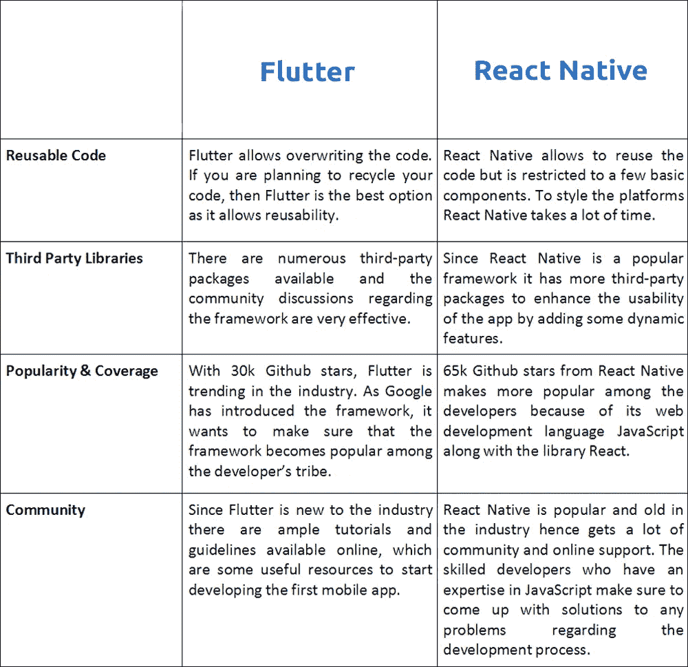
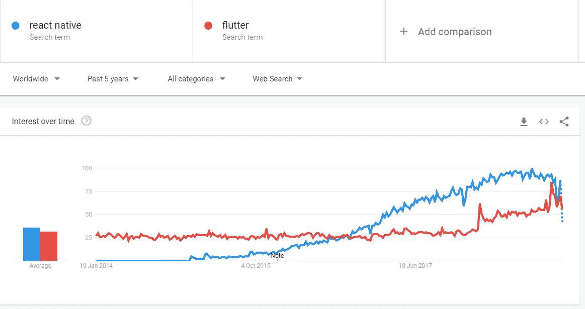

# react Native vs Flutter——你更喜欢哪个？

> 原文：<https://medium.com/hackernoon/react-native-vs-flutter-which-is-preferred-for-you-bba108f808>

React Native vs Flutter

在本文中，您将获得 React Native 与 Flutter 及其快速比较的详细信息。

随着越来越多的人接受现代化技术，对移动应用程序的需求也在很大程度上增加了。为了跟上客户和企业不断增长的需求，利基技术、框架和平台的不断流入成为必须。要为新的业务领域开发全新的移动应用，开发人员需要强大的技术，使耗时的编码变得简单高效。为了实现这一点，许多开发人员已经开始使用跨平台应用程序，以便他们可以利用其功能来设计电子商务应用程序、交互式应用程序和社交应用程序。

Flutter 和 React native 是两个主要的开发框架，它们正在竞争证明自己的价值，并且它们是跨平台移动应用开发的宿主。React Native vs Flutter 是 2018 年和 2019 年最热门的话题。

Source:- [https://facebook.github.io/react-native/](https://facebook.github.io/react-native/)

脸书引入了 [React Native](https://www.oreilly.com/library/view/learning-react-native/9781491929049/ch01.html) ，这个框架很快就流行起来，使用它的公司受益匪浅。React Native 被称为混合应用的未来[。](https://technostacks.com/blog/react-native-hybrid-apps/)

Source:- [https://flutter.io/](https://flutter.io/)

Google 推出的 [Flutter](https://medium.freecodecamp.org/an-introduction-to-flutter-the-basics-9fe541fd39e2) 是移动应用界的新手。难怪 Flutter 可以帮助开发人员创建漂亮的原生应用程序，并帮助他们轻松开发跨平台应用程序。

我们在这里对颤振和反应本地性能进行比较，这是基于各种参数完成的。这张对比图将证明对初创公司很有帮助，因为他们可以很容易地确定哪个框架最适合他们的移动应用程序开发。

***这里快速对比一下就明白了，哪个是最好的混合框架？***

comparison of react native and flutter

你可以在下面看到 react native 和 flutter 的谷歌趋势对比。

React Native vs Flutter — Google Trends

**用户界面**

当谈到应用程序的用户界面和创建块组件时，你会发现 React native 和 Flutter 之间存在巨大的差距。React Native 基于[原生组件](https://www.lynda.com/React-js-tutorials/Introduction-native-components/577374/610777-4.html)，而 Flutter 与专有的小部件集完美配合，owner 小部件非常令人兴奋，并且最适合于获得提供动态性和原生支持的定制 UI 设计。

话虽如此，这款应用还是有一些缺点，因为它缺少一些组件，影响了用户体验。React native 被认为是增强用户体验的最动态的框架。

**开发时间**

React native 仍然是开发下一代移动应用程序最可靠的框架之一。开发人员更喜欢它，因为它效率很高，减少了开发的时间，此外，它还增加了用户界面，减少了开发项目的时间。

在 Flutter 与 React Native 之间的比较中，Flutter 需要更多的开发时间。React Native 的现成组件使开发过程变得简单快捷，从而在不打扰开发人员的情况下扩大了移动应用程序开发的范围。Flutter 承诺了高质量的可用性，但是开发框架需要比 React Native 更多的认可。

**表演**

Flutter vs React 本机性能映射是识别哪个框架最适合[移动应用开发](https://technostacks.com/mobile-apps)的最佳方式。Flutter vs React Native 领先于其他框架的原因在于 Dart 框架。此外，JavaScript 层帮助他们轻松地与本地组件连接。

或者，React Native 拥有更大的粉丝群和[社区](https://facebook.github.io/react-native/)，然而，开发人员意识到他们在创建混合应用程序时所面临的痛苦。但是，本机应用程序非常适合这些要求。按照框架，开发人员在本地环境中开发应用程序时不会遇到任何问题。

开发人员在运行 React 本机混合应用程序架构时有时会遇到问题。而 Flutter 让开发人员更容易，因为他们可以重用现有的代码。C ++引擎工作完美，支持这种语言，因此 Flutter 在这里获得了赞赏。

**稳定性**

对于那些期待完美移动应用的公司来说，稳定性是一个重要的方面。当我们比较 React Native 和 Flutter 时，竞争看起来非常困难。Alpha 版本 if Flutter 让它后退了一步，因为它不推荐用于大型项目。

新推出的 [Flutter beta 2 版本](/flutter-io/https-medium-com-flutter-io-announcing-flutters-beta-2-c85ba1557d5e)为开发者提供了一些令人印象深刻的功能。大型[社区对 React Native](https://github.com/react-native-community) 的支持以及它自诞生以来的一致性使它变得更加流行和可靠。React Native 是一个已经建立起来的框架，它的特性和可靠性得到了业界的认可，而在这个行业中，Flutter 仍然在努力取得成功。因此，React Native 在这里是一个明显的赢家。

**客户群**

React Native 这几天不需要介绍了。过去是，现在也是开发者最有前途的移动应用开发框架之一。该框架可以执行任何规模的项目。当我们在这个框架中谈论项目的规模时，有几个大的名字是脸书、Instagram、Airbnb、Skype、沃尔玛等。

仅仅几年前[推出](https://en.wikipedia.org/wiki/Flutter_(software))的 Flutter 仍在努力让业界感受到它的存在。由于该框架对市场来说是新的，它需要一段时间来创建一个基础并得到市场的认可。目前商店里只有少数应用程序可以展示，但是随着时间的推移，新的品牌也会加入到列表中。

**文档&工具包**

文档处理是一件非常复杂和耗时的事情。然而，Flutter 非常擅长[简化文档](https://flutter.io/docs)，它允许移动应用程序开发者在编写应用程序时使用它们，从而使他们的生活变得简单。因此，就文档和工具包而言，与同类产品相比，Flutter 是最好的选择。

使用 React Native 的[文档化过程并不是这样组织的。此外，该框架删除了那些有助于使过程顺利进行的组件。因此，很明显，工具带来了两个框架之间的激烈竞争。Flutter 拥有大量支持 React 的 ide 和工具。与](https://devdocs.io/react_native/) [visual studio 代码](https://code.visualstudio.com/)、 [android studio](https://developer.android.com/studio/) 的兼容性为框架增加了价值。因此，在这里颤振是明确的赢家。

**关键要点**

因此，我列出了两种在移动应用开发初创企业中流行的框架的详细对比。如上所述，这两个框架在稳定性、性能、文档和其他方面都有各自的优点。

因此，很难确定谁是赢家，因为两者各有利弊。但我可以说，由于 Flutter 是一个新的框架，与 React Native 相比，它需要更多的时间才能在行业中稳定下来。这清楚地表明，从 React Native 开始是一个明智的选择。

我不怀疑 Flutter 的能力，因为它有助于创建漂亮的移动应用程序，并帮助初创企业立即开始盈利。Flutter 还有很长的路要走，它有着令人印象深刻的未来。

如果你对这篇文章有任何问题，那么你可以在下面评论并问我，或者如果你想开发一个 react native 和 flutter 应用程序，那么[用专家来满足你的需求](https://technostacks.com/contact-us)。