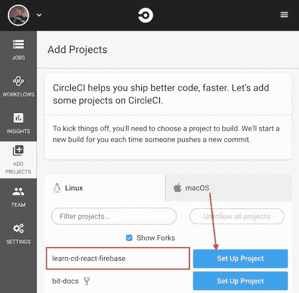
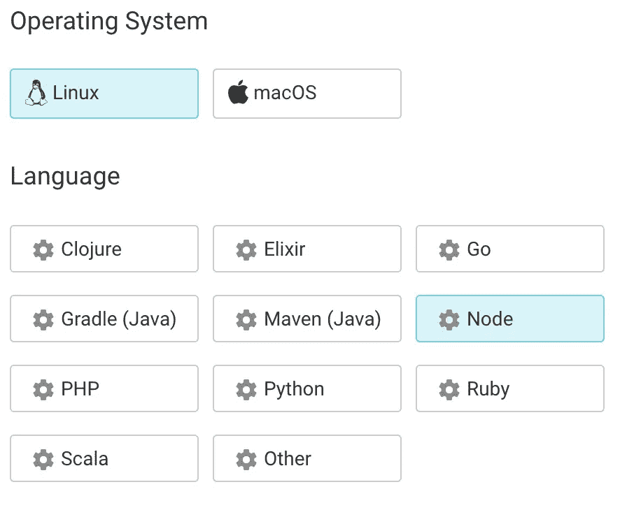
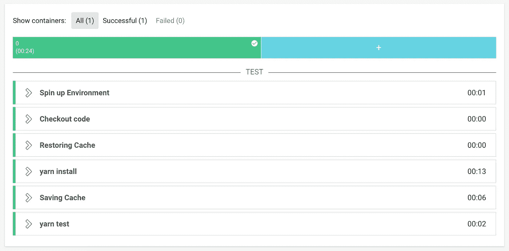
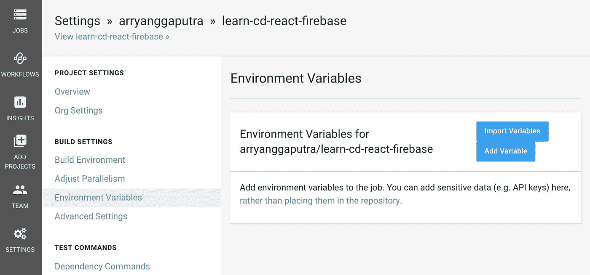
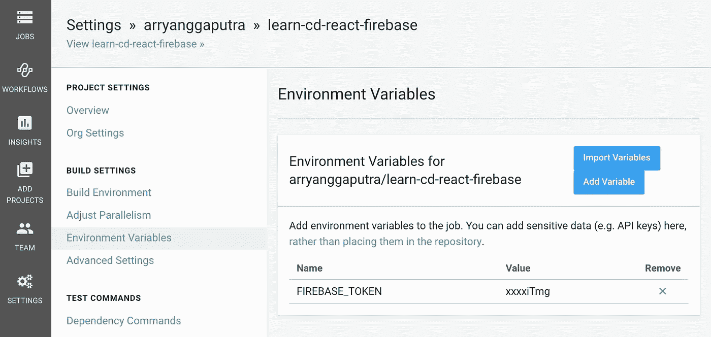
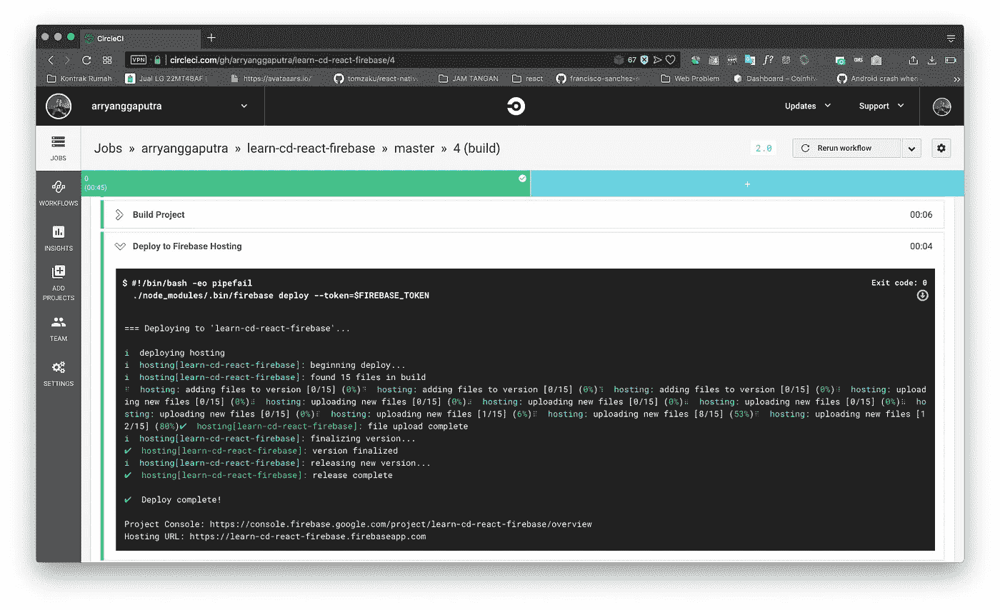

# 使用 CircleCI 将 ReactJS 持续部署到 Firebase 主机

> 原文：<https://medium.com/hackernoon/reactjs-continuous-deployment-to-firebase-hosting-using-circle-ci-ed31c0aee2ca>


# 介绍

做同样的事情很无聊。在这个主题中，最无聊的部分是将我们的 Web 应用程序部署到 [Firebase](https://hackernoon.com/tagged/firebase) 主机上。我们采取的步骤是:

1.  测试您的 react 应用程序，`yarn test`
2.  按下`git`
3.  构建你的 react 应用，`yarn build`
4.  做部署到 firebase 托管，`firebase deploy`

上面的步骤很无聊，在这篇文章里我试着分享我的经验来把上面的四个工作总结成一个。因此，我们需要做的就是将更改推送到 git 存储库，CircleCI 会做所有的事情。

# 要求

在进一步开始之前，您必须具备以下五项要求:

1.  React App。
2.  Firebase 项目，此处转到[。](http://console.firebase.google.com)
3.  Git 存储库。我的资源库为本教程，[这里](https://github.com/arryanggaputra/learn-cd-react-firebase)
4.  Firebase 命令行工具，到[这里](https://github.com/firebase/firebase-tools)。
5.  [CircleCI](https://hackernoon.com/tagged/circleci) 账号，到[这里](http://circleci.com)。

# 开始吧！

## 1.配置 Firebase

创建一个 React 项目，在本教程中我将使用`create-react-app`

```
$ create-react-app learn-cd-react-firebase
$ cd learn-cd-react-firebase
$ yarn install
$ yarn build
```

我们需要配置我们的项目连接到 Firebase，做`firebase login`

```
$ firebase login

? Allow Firebase to collect anonymous CLI usage and error reporting information? NoVisit this URL on any device to log in:
[https://accounts.google.com/o/oauth2/auth?client_id=563584335869-x](https://accounts.google.com/o/oauth2/auth?client_id=563584335869-fgrhgmd47bqnekij5i8b5pr03ho849e6.apps.googleusercontent.com&scope=email%20openid%20https%3A%2F%2Fwww.googleapis.com%2Fauth%2Fcloudplatformprojects.readonly%20https%3A%2F%2Fwww.googleapis.com%2Fauth%2Ffirebase%20https%3A%2F%2Fwww.googleapis.com%2Fauth%2Fcloud-platform&response_type=code&state=327146197&redirect_uri=http%3A%2F%2Flocalhost%3A9005)xxxxxxWaiting for authentication...✔  Success! Logged in as [arryanggaputra@gmail.com](mailto:arryanggaputra@gmail.com)
```

执行`firebase init`，这将在当前目录下设置一个新的 Firebase 项目。该命令将在当前目录下创建一个`firebase.json`配置文件。

用空格做选择，选择`Hosting`

```
You're about to initialize a Firebase project in this directory:/Users/arryanggaalievpratamaputra/sites/learn-cd-react-firebase? Which Firebase CLI features do you want to setup for this folder? Press Space to select features, then Enter to confirm your choices.
 ◯ Database: Deploy Firebase Realtime Database Rules
 ◯ Firestore: Deploy rules and create indexes for Firestore
 ◯ Functions: Configure and deploy Cloud Functions
❯◉ **Hosting: Configure and deploy Firebase Hosting sites**
 ◯ Storage: Deploy Cloud Storage security rules
```

选择您的 Firebase 项目

```
First, let's associate this project directory with a Firebase project. You can create multiple project aliases by running firebase use --add, but for now we'll just set up a default project.? Select a default Firebase project for this directory:
  [don't setup a default project]
  mws-surabaya (mws-surabaya)
❯ **learn-cd-react-firebase (learn-cd-react-firebase)**
  [create a new project]
```

配置公共目录，键入`build`，`create-react-app`项目将把你的构建生成到`build`文件夹中。**配置为单页 app** ，输入`Yes`

```
=== Hosting SetupYour public directory is the folder (relative to your project directory) that
will contain Hosting assets to be uploaded with firebase deploy. If you
have a build process for your assets, use your build's output directory.? What do you want to use as your public directory? **build**
? Configure as a single-page app (rewrite all urls to /index.html)? **Yes**
? File build/index.html already exists. Overwrite? **No**
i  Skipping write of build/index.htmli  Writing configuration info to firebase.json...
i  Writing project information to .firebaserc...✔  Firebase initialization complete!
```

## 2.手动部署到 Firebase

为了确保我们的 Firebase 主机是否可以使用，我们将尝试手动部署。

我们用命令进行构建`yarn build`

```
yarn run v1.10.1
$ react-scripts build
Creating an optimized production build...
Compiled successfully.File sizes after gzip:34.71 KB  build/static/js/1.fa92c112.chunk.js
  763 B     build/static/js/runtime~main.229c360f.js
  713 B     build/static/js/main.b50be446.chunk.js
  511 B     build/static/css/main.3a30845b.chunk.cssThe project was built assuming it is hosted at the server root.
You can control this with the homepage field in your package.json.
For example, add this to build it for GitHub Pages:"homepage" : "[https://](http://myname.github.io/myapp)[learn-cd-react-firebase.firebaseapp.com](https://learn-cd-react-firebase.firebaseapp.com)",The build folder is ready to be deployed.
You may serve it with a static server:yarn global add serve
  serve -s buildFind out more about deployment here:[http://bit.ly/CRA-deploy](http://bit.ly/CRA-deploy)✨  Done in 13.14s.
```

构建成功后，我们使用命令`firebase deploy`部署到 Firebase

```
=== Deploying to 'learn-cd-react-firebase'...i  deploying hosting
i  hosting[learn-cd-react-firebase]: beginning deploy...
i  hosting[learn-cd-react-firebase]: found 15 files in build
✔  hosting[learn-cd-react-firebase]: file upload complete
i  hosting[learn-cd-react-firebase]: finalizing version...
✔  hosting[learn-cd-react-firebase]: version finalized
i  hosting[learn-cd-react-firebase]: releasing new version...
✔  hosting[learn-cd-react-firebase]: release complete✔  Deploy complete!Project Console: [https://console.firebase.google.com/project/learn-cd-react-firebase/overview](https://console.firebase.google.com/project/learn-cd-react-firebase/overview)
Hosting URL: [https://learn-cd-react-firebase.firebaseapp.com](https://learn-cd-react-firebase.firebaseapp.com)
```

这是工作🔥😎[https://learn-cd-react-firebase.firebaseapp.com](https://learn-cd-react-firebase.firebaseapp.com)

## 3.用我们的项目配置 CircleCI

转到[circleci.com](http://circleci.com)和`ADD PROJECT`



Press Setup Project button

选择`Linux`作为操作系统，选择`Node`作为我们的语言。



回到我们的项目，并创建 CircleCI 配置

*   创建一个名为`.circleci`的文件夹
*   添加一个文件`config.yml`(这样文件路径就在`.circleci/config.yml`)。
*   用样本`config.yml`的内容填充`config.yml`
*   将此样本复制到我们的存储库中

```
version: 2
jobs:
  build:
    docker:
      - image: 'circleci/node:8'
    working_directory: ~/repo
    steps:
      - checkout
      - restore_cache:
          keys:
            - 'v1-dependencies-{{ checksum "package.json" }}'
            - v1-dependencies-
      - run: 'yarn install'
      - save_cache:
          paths:
            - node_modules
          key: 'v1-dependencies-{{ checksum "package.json" }}'
      - run: 'yarn test'
```

把这个变化推上 GitHub，开始构建！你需要按标有`Start building!`的蓝色按钮



If building success, you will see this

## 4.从 CircleCI 部署到 Firebase 主机

这一步将允许我们将项目自动部署到 Firebase 主机上。生成 Firebase CI 令牌。

```
$ firebase login:ciVisit this URL on any device to log in:
[https://accounts.google.com/o/oauth2/auth?client_id=563584335869-fgrhgmd](https://accounts.google.com/o/oauth2/auth?client_id=563584335869-fgrhgmd47bqnekij5i8b5pr03ho849e6.apps.googleusercontent.com&scope=email%20openid%20https%3A%2F%2Fwww.googleapis.com%2Fauth%2Fcloudplatformprojects.readonly%20https%3A%2F%2Fwww.googleapis.com%2Fauth%2Ffirebase%20https%3A%2F%2Fwww.googleapis.com%2Fauth%2Fcloud-platform&response_type=code&state=157166044&redirect_uri=http%3A%2F%2Flocalhost%3A9005)Waiting for authentication...✔  Success! Use this token to login on a CI server:1/qV80aq1eE06WJkIkwEmkkoU12iIKq2DYOV2gNiTmgExample: firebase deploy --token "$FIREBASE_TOKEN"
```

转到项目设置


Project Setting

转到环境变量



Environtment Variables menu at CricleCI

添加变量`FIREBASE_TOKEN`，用我们之前得到的令牌值填充。



打开`.circleci/config.yml`。将此行添加到`config.yml`的底部

```
- run:
    name: 'Build Project'
    command: 'yarn build'
- run:
    name: 'Deploy to Firebase Hosting'
    command: './node_modules/.bin/firebase deploy --token=$FIREBASE_TOKEN'
```

*   添加 firebase 工具作为开发依赖项`yarn add firebase-tools --dev`
*   将更改推送到 github。
*   每次你在 github 上推动改变，CircleCI 都会进行部署
*   和成功



我们现在已经设置了一个持续部署来将您的项目部署到 Firebase 主机。

如果你在以上部分的任何一点上卡住了，或者如果我在某个地方犯了错误或者错过了一个关键点，请在评论中告诉我。

## 如果这有用，请点击拍手👏下面扣几下，以示支持！⬇⬇⬇ 🙏🏼

# 我的其他帖子

[](/@arryanggaputra) [## 阿利扬加·阿利耶夫·pratamaputra‏‏‎-中等

### 阅读阿林加·阿利耶夫·pratamaputra‏‏‎在媒介上的作品。‏‏‎Front 终端开发者- React 爱好者。每天…

medium.com](/@arryanggaputra)