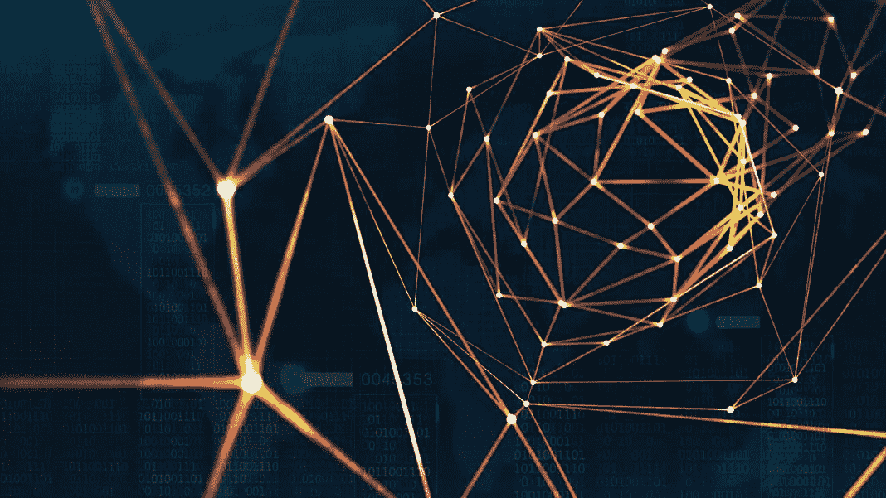
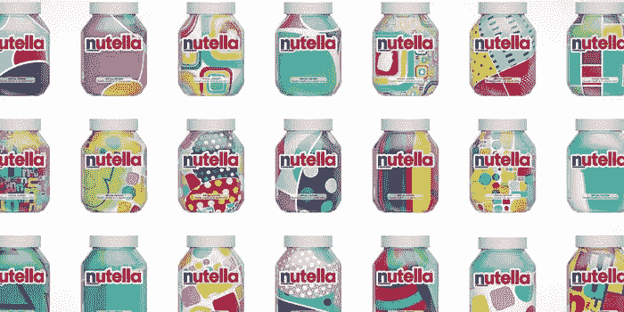
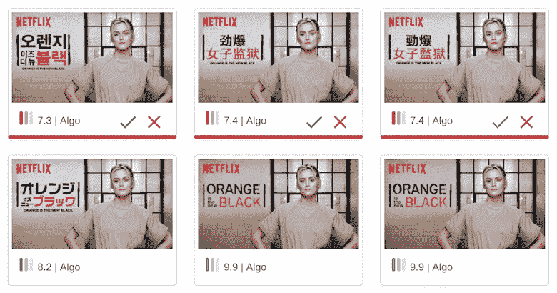
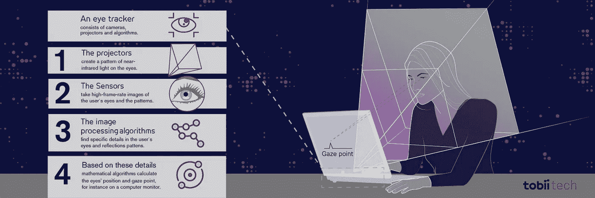
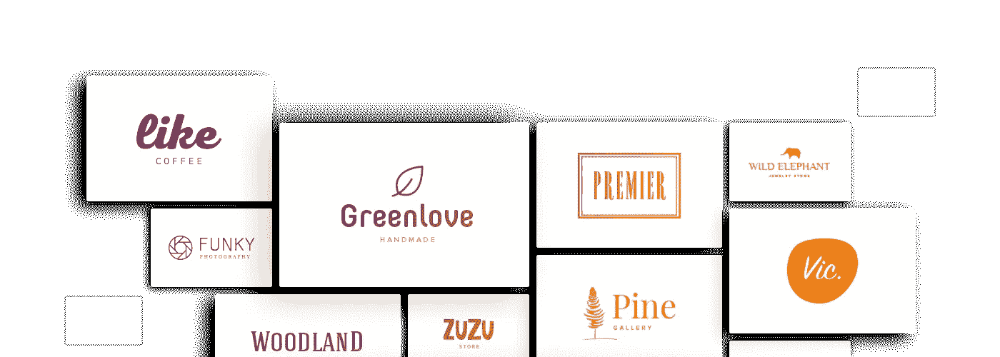

# 人工智能在设计中的现实应用

> 原文：<https://medium.com/hackernoon/real-world-applications-of-ai-in-design-85c3fc728a36>

人工智能正在许多行业迅速成为主流，包括平面设计。这项技术让设计师兴奋不已，因为人工智能可以让设计过程变得更快更容易，但同时也很可怕，因为我们已经看到了人工智能系统的能力。

人工智能进入平面设计行业的最早例子之一是 Grid，这是一个在几分钟内为客户创建现代外观网站的网站。用户只需要上传内容，使用人工智能，网格将开始建立网站。该网站于 2015 年推出。自那以后，许多由人工智能驱动的创建网站和生成徽标的工具被推出，包括 [Turbologo](https://turbologo.com) 、 [Squarespace](https://squarespace.com) 、 [Wix](https://wix.com) 等。

2017 年，费列罗与一家广告公司 Ogilvy & Mather Italia 合作，让更多人购买 Nutella。他们的计划是用一个[算法来设计包装](/inspiring-ai/algorithm-designs-seven-million-different-jars-of-nutella-35c18f782780)。然后，该算法被提供了数据库模式和颜色，以创建七百万个独特的罐子，这些罐子在一个月内销售到整个意大利。

nutella jars designed by an algorithm

这是否意味着人工智能将取代人类工人？根据牛津大学和德勤的[报告](https://www2.deloitte.com/content/dam/Deloitte/uk/Documents/Growth/deloitte-uk-insights-from-brawns-to-brain.pdf)，2001 年至 2015 年间，英国因自动化失去了 80 万个工作岗位。但根据同一份报告，创造了 350 万个新工作岗位。你看，这并不都是悲观的。没错，AI 可以在我们人类可以想象的创造性领域做很多事情。但是有创造力的专业人士不能被机器取代。至少在未来几年内不会。

有些工作需要文化、情感、时间、身份等方面的知识。一些企业或组织需要通过印刷品和标志来传达他们的故事。例如，你需要一个[定制的桌子投掷](https://topcustomprint.com/)用于一个活动，设计师将能够按照你的需求来设计。人工智能只是不能模仿这些任务。老实说，AI 对平面设计师来说更像是朋友，而不是敌人。正如 IBM 首席执行官[建议的](https://www.bloomberg.com/news/features/2017-09-20/ginni-rometty-on-artificial-intelligence)，“如果 AI 被设计师理解为增强智能，而不是听起来更可怕的人工智能，它将对艺术家更有帮助。”

在人工智能的帮助下，设计师可以以更高的速度和更低的成本创建多种设计。人工智能在平面设计中有很多令人惊叹的应用。设计师和机器人可以并肩工作，创造奇迹。让我们看看人工智能将如何帮助设计过程。

# 自动化跑腿

设计师的工作包括大量的跑腿工作。设计师平均花费 20%的时间来解决可以由人工智能轻松自动化的问题。一些任务，如裁剪图像、校正颜色，不能简单地自动化，因为在这些任务发生时，它们需要人的注意。

但是人工智能可以为我们做这项工作。事实上，它已经开始帮助我们解决这个问题。Adobe 推出了 [Adobe Sensei](https://www.adobe.io/apis/experienceplatform/sensei.html) ，它增强了智能功能，帮助设计师更高效地工作。它在一个通用框架中使用人工智能和机器学习来改善最终产品的整体设计和交付。

Adobe Scene Stitch 可以识别图像中的各种模式，并可以帮助编辑，甚至创建新的场景。网飞也在利用增强智能系统进行艺术品个性化。每当需要用不同语言为一场演出创建多个横幅时，设计师所要做的就是查看机器人创建的横幅，以批准或拒绝它们。

所有这些都可以为设计师节省大量时间，让他们专注于更重要的事情，并为产品设计做出决策。

# 改进网站的设计元素

根据 Adobe [的调查](https://theblog.adobe.com/creativity-in-business-key-takeaways-from-survey/)，69%的创意人员认为人工智能的使用将在未来五年内大幅增加。他们还认为，人工智能系统不会夺走他们的工作。很明显，很多人都很乐观，对这种技术的需求也很高。

像 [Tobii Pro Sprint](https://www.tobiipro.com/sprint/) 这样使用眼球追踪技术的工具可以帮助改善网站的设计元素。它允许 UX 的设计师在使用网站时记录参与者的眼球运动，这将有助于设计师解决可用性问题并改进设计。

tobii.com

但是像 [EyeQuant](https://www.fastcompany.com/90171173/eyequant) 这样的公司将它带到了一个全新的水平，他们教会人工智能以 85%的准确率预测人们喜欢什么样的广告。

# 更智能的设计系统

人工智能还可以帮助你让你的设计系统更智能、更健壮。公司相信设计系统能让他们的产品与用户保持一致。在设计系统中实现人工智能将有助于我们分析用户如何与设计系统的所有元素进行交互，我们可以了解哪一个最适合每个功能。这有助于更好的优化。

系统越了解什么可行，什么不可行，结果就越好。Squarespace 和 Wix 等公司已经在使用人工智能技术来帮助设计师进行决策。Wix ADI 利用客户的反馈和它的算法将网站设计得尽善尽美。

# **其他一些在平面设计中使用人工智能的工具**

# 设计景观

DesignScape 有一个令人印象深刻的人工智能系统，为网站设计者提供有用的提示和线索，使网站接近完美。它不自行设计网站，但对提高设计者的效率很有帮助。

人工智能将无法像人类一样设计网站，至少在不久的将来不会，但它确实会减少我们的维护工作。

# 定制品牌

裁缝品牌专门为企业创造标志。它有一个非常先进和强大的人工智能，可以在没有人类交互的情况下快速创建一个标志。用户只需回答几个问题，并提供有关他们业务的信息。然后，人工智能系统将分析结果，并创建动态徽标。

# Turbologo:智能徽标制作工具

Turbologo 是另一个为你的企业创造醒目标志的好工具。你需要输入你的公司名称，选择颜色，挑选一些你喜欢的图标，它会为你创造出很棒的标志。一旦你输入了所有的细节，就会产生很多想法，你可以从中进行选择。用起来真的很简单。Turbologo 使用人工智能和机器学习来设计你可以使用的标志。

# 丰乔伊

FontJoy 使用深度学习系统生成字体组合。它帮助开发人员选择最佳的字体配对。嗯，很难说什么才是好的字体配对，开发者也意识到了这一点。因此，他们首先会问是什么导致了糟糕的配对，这是一种更容易的开始方式。使用深度学习系统，该网站允许您生成令人敬畏的字体组合。

这些只是在设计中使用人工智能的许多工具中的几个。你看，人工智能正在改变平面设计行业，我们都应该欢迎它。设计师不应该被这项技术吓倒。它将创造许多新的机会，通过利用它的力量，设计师将更有创造力和生产力。