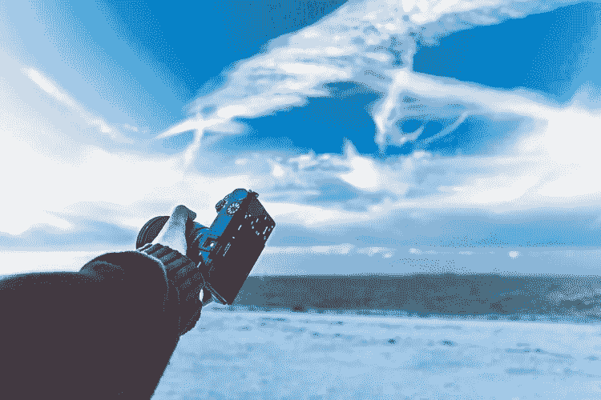

# 人工智能在摄影和编辑软件中的现实应用

> 原文：<https://medium.com/hackernoon/real-world-applications-of-ai-in-photography-and-editing-software-7dffe96fa68d>

近年来，相机越来越接近极限，尤其是在硬件方面。随着摄影技术的快速发展，每一项成就都只有几个月的突破性，或者一年直到下一次成功。

为了弥补硬件限制，并补充相机的物理功能，工程师们发现人工智能是值得的。智能手机一直处于这一领域的前沿，因为它们试图掩盖自己的物理限制，并赶上 DSLR 相机。

如今，摄影更多的是关于算法，而不是传感器和镜头，今天的顶级相机(特别是在智能手机中)是根据支持它们的 AI 的能力来评级的。这种增长不仅限于相机，还延伸到了针对初学者或专家的照片编辑软件。这些快速发展对照片处理的不同方面来说意义重大。

# **照片管理**

人工智能越来越有助于简化管理照片的过程。智能手机让我们所有人至少成为了业余摄影师。人类不断打破拍摄照片数量的记录，但这带来了另一个容易管理照片的问题。

值得庆幸的是，以谷歌和苹果为首的许多公司都有不同但相似的技术来使用机器学习轻松管理照片。

*   Google 相册使用机器学习来一次性识别、标记和分类多张图片，以确保您拥有整洁的相册。现在，你可以识别和隔离包含狗的照片，甚至是带着微笑的照片。它还可以识别重复并删除它们，还可以把你的图像转换成 gif。它通过监督学习工作:机器学习来建立一个深度神经网络的集合。这种算法随着不断使用而变得更好。
*   类似地，苹果的照片搜索功能建立在相同的智能照片组织框架上，尽管更加注重隐私。

有了这样的照片管理应用程序，你可以轻松地对照片进行分类，并过滤掉质量不好的照片。

# **照片编辑**

摄影领域的机器学习看到了简易照片编辑软件的兴起，使每个人都可以进行图像编辑，而不仅仅是专业人士。随着 one-tap 修图软件的出现，有许多受人工智能启发的初学者照片编辑软件，使照片焕然一新。现在有许多编辑照片的软件，让深受喜爱的 Photoshop 望尘莫及。

*   Skylum 是一款顶级的照片编辑软件，具有人工智能支持的升级功能，可以提高分辨率。结果是照片打印时图像更清晰。
*   Skylum 最近还发布了 Photolemur，这是一款图像编辑器，人们只需轻轻一点就可以自动修饰照片。
*   另外， [Meero 使用 AI](https://www.meero.com/en/news/technology/393/Ai_In_Photography_Time_For_A_Change_In_Focus) 进行智能编辑，如色调和颜色校正、几何校正、高动态范围融合等。
*   Prisma Lensa 是一款简单的照片编辑软件，被称为“一键式 photoshop”。它的人工智能照片编辑方法轻松取代了许多现在流行的“美颜滤镜”应用程序。
*   [在 MEDIAKG TI](https://www.mediakg-ti.com/easy-photo-editing-software-for-windows/) 也发布了 Fotoworks XL，这是一款照片编辑软件，带有自动图像增强功能，可以改变你的图像。这个功能可以让你去掉瑕疵，展示照片最好的一面
*   使用 Luminar 应用程序，您可以仅使用滑块来调整亮度、饱和度、白平衡和对比度等功能，从而编辑照片。

# **硬件处理**

与 DSLR 相机相比，智能手机在硬件功能方面确实有限。他们试图用人工智能来弥合这一鸿沟。不同的智能手机公司已经宣布了更强大、更智能的处理器来处理图像。从多个相机到智能处理器，智能手机摄影的趋势是将算法与硬件相结合。这已经奏效了。

*   苹果发布的 A11 仿生神经引擎芯片打破了记录。使用机器学习，它有助于更好地增强图像和更准确的图像识别，以及增强现实的能力。当前的 8 核 A12 仿生芯片比其前身有所改进，性能高出数倍，同时在几个功能中赋予图片更多深度。此外，A13 将于今年发布，它只会更好。
*   华为的 Honor View 20 配备了一个巨大的 4800 万像素摄像头，用于捕捉高分辨率图像。为此，它使用了索尼的 IMX586 图像传感器。结果包括更清晰的图片和可以放大几倍的高分辨率图片。自发布以来，许多其他智能手机都试图复制并改进这项技术。
*   谷歌的 Pixel 也不例外。Pixel 2 手机带有图像增强芯片。Pixel 3 手机有一个更好的版本。
*   随着 Lumentum 等芯片供应商在竞争中脱颖而出，3d 传感器也成为了一件事。

让算法与更小的摄像机传感器(如无人机摄像机和安全摄像机中的传感器)一起工作，可以用于更高分辨率的监控图片/视频，并提高安全性。

# **图像识别**

使用机器学习进行图像识别并不新鲜，但它正变得越来越先进。

*   苹果双摄像头 iPhones 的人像模式是众多模式中的第一个，因为它将图像识别引入了实时拍照。一个摄像头用于识别照片中的物体和人物，而另一个摄像头则赋予图像深度并模糊背景。自从它发布以来，许多公司也在他们的智能手机上采用了它，这是智能手机相机与数码单反相机竞争的方式之一。
*   Excire 软件是一个先进的自动对象标记照片编辑软件，可以识别不同年龄组甚至不同国籍的人。
*   最近，[佳能与德国慕尼黑工业大学的研究人员合作，即使被物体遮挡，也能人工创造背景场景。分层深度图像技术使用生成对抗网络(GAN)来推断和构造背景。太神奇了！](http://campar.in.tum.de/pub/dhamo2019prl/dhamo2019prl.pdf&ved=2ahUKEwjwvvKikOviAhUZQRUIHfyWCP4QFjAAegQIBBAB&usg=AOvVaw1TGG5qcpF6yqcbaq3zQwx2)
*   有许多手机像华为的 P20 Pro，它有三个后置摄像头，可以更好地处理图像。它可以识别 19 个类别的多达 500 个场景。

# **照片优化**

各公司一直专注于生产能够拍摄更高分辨率照片的相机，但这意味着文件大小的增加。虽然使用 Google Photos 和 iCloud 等应用程序将图片保存到云中已经取得了成效，但还有更多的事情可以做。

*   苹果公司最近在 iOS 11 上推出了高效图像格式(HEIF ),以对抗 JPEG 等主流照片格式。HEIF 以缩小的文件尺寸提供高质量的图片而自豪，并可以帮助解决存储空间有限的问题。
*   Skylum 还致力于在不影响质量的情况下一次性压缩多张图片。它的人工智能研究实验室正在处理这件事。

## **结论**

以上只是人工智能对摄影产生积极影响的一些例子。用于 Windows 10 利基的[照片编辑软件似乎是人工智能革命中的最大赢家。智能手机似乎正在努力追赶 DSLR 相机的创新照片效果。DSLR 相机不会很快过时，尤其是对专业人士而言。但人工智能驱动的手机摄影仍有很大潜力。](https://www.photo-editing-software-for-windows-10.com/)