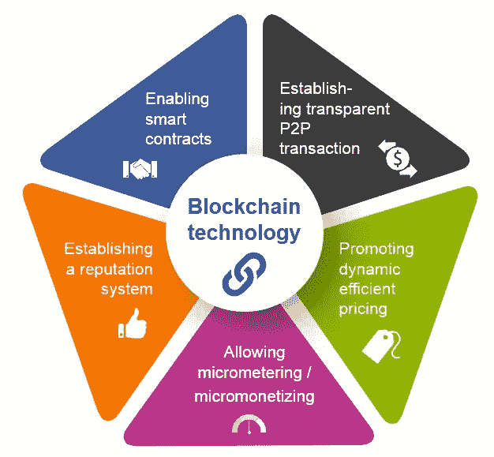

# 2019 年加密货币交易所开发商需求增加的原因

> 原文：<https://medium.com/hackernoon/reasons-for-increase-in-the-demand-for-cryptocurrency-exchange-developers-in-2019-892fabaae2d1>

随着世界转向数字化，人们需要熟悉它。加密货币交易是目前人们使用的货币的一个方面。作为一种特殊形式的数字货币，它正在全世界被使用。不久前，世界见证了加密货币的兴起。然而，随着时间的推移，这种上升并没有持续很长时间。

加密货币的趋势有所下降。但是现在是时候让加密货币再次流行起来了。这最终会导致加密货币开发者的价值增加。

**了解一点加密货币**

加密货币是目前大多数国家都在使用的新货币形式。它得到了应有的关注和欢迎。大多数人寻求加密货币交易所的发展，以便用加密货币硬币交易他们的钱。

*对于那些想知道加密货币到底是什么的人来说，这里有答案。*

这种特殊类型的货币实际上可用于个人对个人的交易。在加密货币交换脚本的帮助下，人们可以以更个性化的方式进行支付和交易。在很短的时间内，加密货币就统治了世界。没有一份报纸或头条新闻不谈论加密货币至少一次。

大多数公司都在利用加密货币的不同方面，如模块、交易等等。这就是为什么很明显，大多数商人希望与加密货币交易所的发展。

**加密货币简介**

2017 年，加密货币首次问世。全世界的人都知道这到底是什么，以及它在商业中的用途。这导致了加密货币的突然流行。这篇文章是写给那些想了解加密货币和加密货币交易所开发者的人的。

老实说，加密货币的技术非常新。大多数人还没有意识到它的不同好处。安全交易，没有中间第三方连接是一些好处。我们认为这就是为什么存在对加密货币趋势的需求。人们一直在寻找能够在短时间内开发出[加密货币兑换软件](https://theninehertz.com/cryptocurrency-exchange-development/)的开发者。

这些开发人员完全了解新技术，他们是专家。需求的增长使得它们如此有价值。你可能会惊讶地发现，开发商正在变得非常昂贵和昂贵的久而久之。这都是因为加密货币的流行。

随着加密货币开发服务的出现，加密货币的影响会越来越大。这就是为什么开发商也将有越来越多的价值。至少消息来源是这么说的。

## 但是是什么有趣的特性让加密货币如此受欢迎呢？

加密货币的惊人之处在于它非常安全，而且有加密功能。这种货币没有任何形式的第三方控制，实际上肯定是牢不可破的。数据挖掘者都负责对数字货币进行强有力的监控。区块链的开发者和加密货币的开发者是运行整个事情的人。

加密货币最常见的用途是作为交换媒介。没有中央控制力量来管理它。所以，加密货币没有权威机构和金融机构。

加密货币的开发者到底是谁？

现在是 2019 年，对开发者的需求肯定非常高。客户总是希望从他们选择的加密货币兑换开发公司获得完美。这就是为什么开发人员需要成为不同开发趋势和编码的专家。

他们需要精通 PHP、Python、Java 和其他语言。这些语言有助于将移动应用程序与加密货币区块链连接起来。此外，它们确保将 API 集成到加密货币的不同应用中。

**是什么特质让加密货币开发者如此有价值？**

最重要的一个问题是，开发人员在加密货币交易所开发公司做什么？。这将有助于我们了解为什么开发商的价值增加了这么多。以下是加密货币开发者的一些共同职责。这些角色将提供对开发人员工作的深入了解，并告诉我们他们做什么。当然，你会了解为什么这些开发人员对公司如此重要。

*   他们协助开发不同的加密货币兑换发展技术。这是开发人员在其职责中必须扮演的最重要的角色之一。
*   他们致力于开发基于区块链的[技术的应用。应用的开发和构建掌握在加密货币开发者手中。因此，这肯定是一项非常重要的责任。](https://steemit.com/blockchain/@theninehertz/the-new-disruption-in-world-of-technology-blockchain)
*   他们评估不同的结构。这些评估基于交易和交换的基础设施。毫无疑问，越来越多的企业开始涉足数字货币交易。所以，这就是开发者要做的。他们监视正在发生的不同交易，并找出这些交易的结果。
*   开发人员也是密码挖掘领域的专家。他们对万物如何运作有一个概念，并以许多不同的方式运用这些知识。加密挖掘的开发是开发者做的事情。
*   此外，开发人员还有另一项特殊职责。有了关于密码挖掘的知识，他们创造出了已经在系统应用中使用的特性。因此，对于那些需要与新技术兼容的应用程序的人，开发者可以提供帮助。
*   它们也有助于实现数字货币领域的应用程序。开发能够适应数字货币趋势的应用程序是他们最常见的角色之一。
*   他们使用加密货币领域的最新知识和技术。我们看到的所有发展都是由于开发者的努力。因此，毫无疑问，他们的工作对我们非常重要。
*   他们帮助排除几个问题，然后解决它们。加密货币交易所可能会出现许多问题。这对人们来说可能是一个障碍。

开发人员有责任找出这些问题。不仅如此，它们对问题的解决也有很大的帮助。

随着加密货币的[兴起，加密货币开发者的角色与日俱增。我们需要越来越多的专业加密货币开发者。由于缺乏专业的加密货币开发人员，需求可能会增加。因此，随着 2019 年加密货币趋势的开始，开发者将拥有更多价值。](https://theninehertz.com/blog/how-the-world-of-cryptocurrencies-will-shape-up-in-the-near-future/)

这就是为什么人们对它们的需求如此之高的原因。说到加密货币，最好雇佣开发人员。在这种情况下绝对不会有犯错的余地。

**为什么加密货币开发者因区块链需求高**

区块链是加密货币非常重要的一部分。我们都知道开发商帮助创造了区块链。因此，开发者的价值增加了。人们真的需要知道拥有区块链的重要性。这将有助于他们理解加密货币交换脚本和开发者的价值。

所以，这里有一些在商业中使用区块链带来的好处。

## 智能合同

您需要了解许多合同特性。金钱和货物的转移是其中的一些特征。好消息是，随着区块链的使用，智能合约将会遍地开花。这些协议将会有一些新的规则。这可以证明比传统合同更有用。

## 产品认证

有许多制造商是未经授权的。这些制造商有自由为不同的产品制造一些赝品。这对于拥有真实产品的企业主来说可能是个问题。这是该行业必须经历的最常见的问题之一。

有许多品牌受到这个问题的困扰。因此，使用区块链是有益的。有了这项技术，可追溯性将会有新的规则。因此，安全问题将不复存在。

## 安全交易

在密码学的帮助下，会有很多安全的记录。对于交易来说，这可能是一件好事。他们中的每一个都和过去的有联系。区块链的使用不需要任何权限来管理记录。此外，每个参与者都可以看到和分享操作。

我们当然不怀疑加密货币开发者正在席卷全球的事实。随着高需求，开发者的价值在增加，并将继续增加。