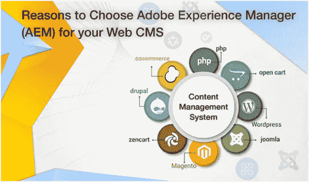
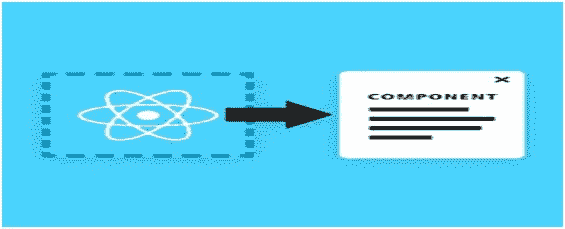

# 为您的 Web CMS 选择 Adobe Experience Manager(AEM)的原因

> 原文：<https://medium.com/hackernoon/reasons-to-choose-adobe-experience-manager-aem-for-your-web-cms-be009e317ff0>

免责声明:我们不是由 Adobe 赞助

企业需要整合针对每次交互优化的内容，以留住客户。企业需要一个单一平台来管理所有战略组件(web、移动、电子邮件、社交和社区)以取得市场成功。

根据 Gartner****的一份报告，** Adobe 连续第八次被评为最佳 CMS(内容管理系统)开发。它使组织能够跨包括移动应用和网站在内的所有渠道创建和管理个性化体验。使用 AEM 的另一个优势是，它减少了在正确的时间向正确的客户交付数字体验的复杂性。**

Reasons to Choose Abobe Experience Manager (AEM) for your Web CMS

**什么是 Adobe 体验管理器(AEM)？**

Adobe Experience Manager 是一个 web 内容管理系统，由 Adobe 产品组成，如 Adobe Analytics、Adobe Campaign、Adobe Solutions、Adobe Primetime、Adobe Target、Adobe Media Optimizer 和 Adobe Audience Manager。AEM 由五个模块组成，包括站点、资产、移动设备、表单和社区。它可以单独使用，也可以与其他组件同时使用。使用这些模块可以为您的所有需求提供一站式解决方案，从构建网站到管理营销资产。如果你不知道如何使用 AEM，你可以向 AEM 顾问或 AEM 咨询公司寻求帮助。让我们看看为什么领先的 [**CMS 开发公司**](http://www.xeliumtech.com/cms-development) 选择 AEM 而不是其他 CMS 的一些主要原因。

*   **易于导航的仪表板**

全面的仪表板提供了在一个非常集中的环境中管理和编辑项目的机会。编辑可以在他们的项目中添加不同类型的信息。项目不过是一组链接在一起的资源。通常，它以平铺的形式表示。AEM 中的其他可配置元素是团队信息、与项目相关联的任务、项目信息以及关联的外部链接。

**Easy to Navigate**

*   **SEO 和用户体验**

上传资产时需要元数据和标签，这些数据有助于提升网站的 SEO 和用户体验。但是，如果您每天上传数百个资产，那么这可能是一项复杂的任务。但是，AEM 能够检测与内容相关联的内容信息，然后自动为其指定元数据和标签。这并不意味着您不能编辑标签，但是当您有大量内容要上传时，AEM 会提高速度。

**SEO and User Experience**

另请阅读:[选择合适的 CMS 之前要考虑的特性](http://www.xeliumtech.com/blog/Features-to-Consider-Before-Selecting-The-Right-CMS)

*   **直观的大坝文件夹结构**

完全集成的数字资产管理(DAM)工具提供了管理和分发整个网站资产的工具。图像、视频和文档可以以结构化的方式存储在 DAM 中。DAM 最有益的特性是拖放资产。上传资产时，会触发 web 格式副本的自动创建，并允许编辑者编辑版权数据和其他元数据属性。

**Intuitive Folder Structure by DAM**

*   **与其他内容管理系统相比，编辑内容要简单得多**

内容是任何 CMS 数字体验的支柱。AEM 允许编辑创建和管理内容驱动的策略。AEM 的 WYSIWYG 结构允许编辑在完成设计后可视化他们的项目。与此同时，可以拖动构建块在页面上创建额外的内容。

**Editing Content is way Simpler when compared to other CMS**

*   **开箱(OTB)组件**

网页中的某些内容可以使用预安装的现成构建块来可视化。使用开箱即用组件的最大优势是更快的部署和更低的开发成本。这意味着开发人员不需要编写更多的代码。它由 Adobe 支持；因此，您将定期获得更新。一些 OTB 组件包括标准布局、表单创建以及收集、存储和管理数据的工作流步骤。

**Out of the Box (OTB) Components**

**标准布局的部件特征有:**

标题:允许可视化标题。

文本:提供标准文本的布局。

图像:允许使用 DAM 中可用的图像。

**组件创建表单的功能包括:**

文本输入框:姓名、电子邮件 id

下拉菜单、复选框、单选按钮

提交按钮

**工作流程步骤的特点是:**

在 AEM 数据库中存储数据

发送电子邮件

自动向图像添加缩略图

**与云的集成**

Adobe Experience Manager 总是排名靠前的原因是 CMS 供应商在全球范围内的有效性。其他 CMS 提供商要么没有云支持，要么不提供全套解决方案。除了全套服务之外，Adobe 还提供云支持，这也是为什么与任何其他 CMS 供应商相比，它也是经济实惠的。

**Integration with the Cloud**

AEM 的每个组件都是一个强大的独立元素，拥有自己独特的工具。它还提供了更快的上市解决方案，并抑制了过渡。但是，仅仅集成 AEM 是不够的，你需要了解它是如何工作的，以便从中获得最佳效果，有无数的 AEM 咨询公司可以帮助你超越你的竞争对手。

## 关于作者

Lisa Watson 是一位博客作者，她正在与一家领先的 CMS 开发公司合作。如果您有任何具体想法，或者正在寻找经验丰富的 [AEM 顾问或 AEM 实施合作伙伴](http://www.xeliumtech.com/cms-development)来提供最佳的 CMS 解决方案，您可以[联系这里。](http://sales@xeliumtech.com)