# 再平衡与 HODL 的熊市分析

> 原文：<https://medium.com/hackernoon/rebalance-vs-hodl-a-bear-market-analysis-618b6df3fd9>

本研究的目的是确定重新平衡加密货币投资组合的绩效影响。具体来说，重点将放在 2018 年 1 月开始的加密熊市上。为了进行一项公平评估投资组合再平衡回报的研究，我们需要仔细考虑我们的回溯测试、数据和可变输入。

最近，我们的团队也发表了比较周期性再平衡和阈值再平衡的研究。我们鼓励您在这里查看这项研究:

 [## 加密货币再平衡策略的最佳门槛

### 这项研究将成为加密货币投资组合基于阈值的再平衡的首次主要分析。的…

blog.shrimpy.io](https://blog.shrimpy.io/blog/the-best-threshold-for-cryptocurrency-rebalancing-strategies) 

# 研究数据

## **交易&订单数据**

从 Bittrex exchange 收集完整的订单数据。Bittrex 数据由 CoinAPI 提供。使用他们的[rest API](https://docs.coinapi.io/#order-book)，我们能够在每个再平衡间隔编译 Bittrex 上可用的 20 个最佳买价和卖价。我们的数据集范围从 2018 年 1 月 7 日到 2019 年 1 月 24 日，实际订单数据用于这项研究。所有交易都假定 Bittrex 收取标准的 0.25%交易费。关于交易费影响的详细分析，请参考下面的文章。

 [## 加密投资组合再平衡:交易费用分析

### 从这些结果中，我们可以得出结论，交易费用可以对投资组合的底线表现产生很大的影响。在…

blog.shrimpy.io](https://blog.shrimpy.io/blog/crypto-portfolio-rebalancing-a-trading-fee-analysis) 

我们将通过限制 BTC 对的买卖来简化这项研究的交易逻辑。因此，从瑞士联邦理工学院到 USDT 的交易会从瑞士联邦理工学院到 BTC，然后从 BTC 到 USDT。尽管 Bittrex 上有一个 ETH 到 USDT 的交易对，但出于研究目的，我们将忽略这些替代交易对。在这种情况下，这两种交易都将产生 0.25%的费用。

## **投资组合规模(资产数量)**

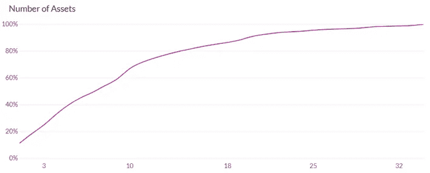

我们将评估多种多样的投资组合，从 2 项资产开始，到 18 项资产，每 4 项资产为一个区间。这个样本大小范围应该涵盖大部分加密资产。在 Shrimpy 的用户群中，大约 68%的用户管理 2 到 18 项资产的投资组合。有关投资组合多样化和最佳投资组合规模的更多信息，请访问我们下面的文章。

 [## 多样化的加密用户表现更好

### 该图比较了再平衡期及其在过去一年中的表现。我们可以看到 1 小时的重新平衡…

blog.shrimpy.io](https://blog.shrimpy.io/blog/crypto-users-who-diversify-perform-better) 

## **再平衡期**

接下来，我们需要设置一些再平衡事件参数来回溯测试我们的投资组合。重新平衡周期决定了重新平衡事件之间的时间间隔。例如，1 周的再平衡期意味着投资组合每周再平衡一次。有 1 天再平衡期的投资组合将每天再平衡。在这项研究中，我们将探索 1 小时、1 天、1 周和 1 个月的重新平衡期。

我们假设，通过改变再平衡期，我们的投资组合将在业绩方面经历剧烈的变化。

[了解有关加密货币投资组合再平衡的更多信息。](https://blog.shrimpy.io/blog/portfolio-rebalancing-for-cryptocurrency)

## **资产选择**

为了减少回溯测试过程中的选择偏差，我们的研究随机选择了包含在每个投资组合中的资产。

该流程从构建 2018 年 1 月 7 日至 2019 年 1 月 24 日 Bittrex 上所有可用资产的列表开始。然后，脚本从列表中随机选择一组资产来构建每个投资组合。

投资组合中的每项资产在总价值中所占的比重相等。每次回溯测试开始时的投资组合总价值为 5000 美元。

## **回测**

回溯测试是通过使用交易所的交易数据来模拟一段时间内的策略交易的过程。回溯测试的目的是通过对大型数据集的结果进行压力测试来检查策略的可行性。我们的研究将使用回测不同的再平衡策略，并比较相同的 HODL(买入并持有)投资组合的回报。

为了防止异常值扭曲我们的结果，我们对每个再平衡期和投资组合规模对进行了 1000 多次回溯测试。收集结果，然后将值绘制成直方图。

我们还将提供综合结果的中值绩效，以提供代表累积绩效的简单指标。阅读更多关于回溯测试的信息，或者自己运行。

# **再平衡与 HODL:结果**

## **2-资产组合**

这项研究从一个双资产投资组合开始。这是我们将评估的最小投资组合规模。双资产投资组合的结果实质上是价值在两种不同资产之间来回移动。

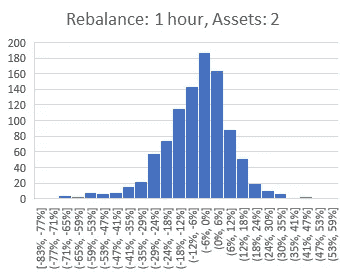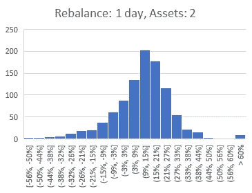

结果表明，双资产投资组合的表现差异很大。这应该是意料之中的，因为随机选择 2 项资产导致异常强劲或疲软表现的概率相对较高。我们预计，随着我们增加投资组合中的资产数量，每个投资组合中包含的各种资产将有助于稳定投资组合，并促使它们在更小的表现范围内趋同。

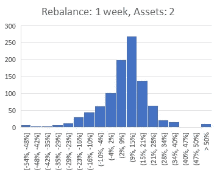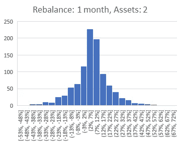

粗略地看一下，我们注意到对于这些双资产投资组合来说，1 天的再平衡期优于其他再平衡期。这可能是由于 Bittrex 上执行的每笔交易都会产生高额交易费。虽然我们没有在这项研究中包括这一数据，但我们预计随着交易费用的降低，每小时的再平衡期将开始超过每天的再平衡期。你可以在我们之前的一篇研究文章[这里](https://hackernoon.com/crypto-portfolio-rebalancing-a-trading-fee-analysis-eb9a34f692ac)中了解更多关于这是如何工作的。

> 利用每日再平衡期的双资产投资组合比相同的买入并持有投资组合平均高出 12.2%。

## 6-资产组合

继续研究 6 种资产的投资组合，我们发现我们的预期似乎是正确的。将投资组合中的资产数量从 2 个增加到 6 个，导致每个评估的再平衡期的业绩范围变窄。然而，在每个重新平衡期间，仍然有接近 100%的性能范围。随着每个投资组合中的资产数量不断增加，我们应该评估这个范围是如何变化的。

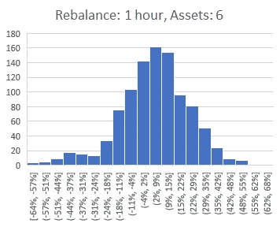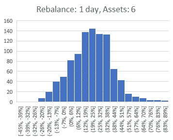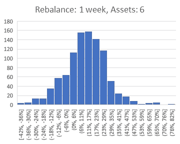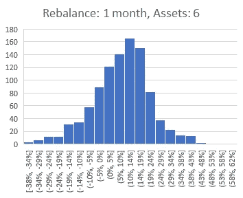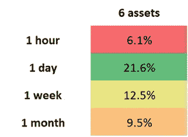

> **利用每日再平衡期的 6 种资产投资组合比相同的买入并持有投资组合平均高出 21.6%。**

## 10-资产组合

10 资产组合延续了 2 和 6 资产组合中观察到的趋势。每个再平衡期的业绩范围从最低到最高的投资组合开始压缩到大约 80%。此外，我们继续看到每日、每小时和每周的中值性能有所上升。奇怪的是，与 6 种资产的投资组合相比，我们看到每月再平衡期的中值表现有所下降。10 种资产的投资组合标志着第一个小时再平衡期超过月再平衡期的投资组合规模。

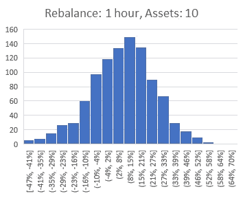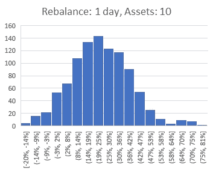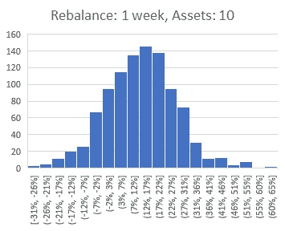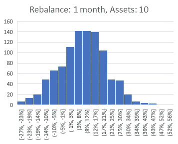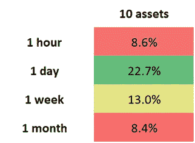

> 利用每日再平衡期的 10 种资产投资组合的表现比相同的买入并持有投资组合平均高出 22.7%。

## 14-资产组合

在 1 小时、1 天和 1 周的重新平衡期间，随着我们增加投资组合规模，观察到的性能增加的趋势会继续。与 6 个和 10 个资产的投资组合相比，1 个月的再平衡期的业绩继续下降。此外，我们观察到 14 种资产组合的表现范围继续向较小的结果范围靠拢。我们现在可以看到，在评估的所有重新平衡期间，性能分布在 60–70%之间。

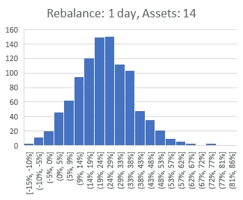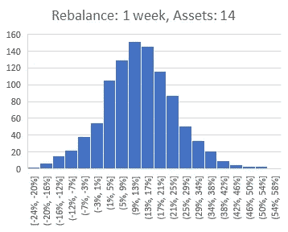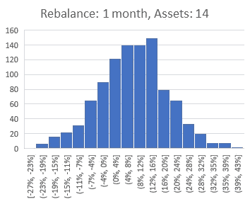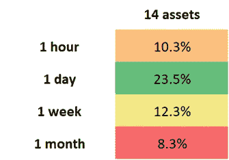

> 利用每日再平衡期的 14 种资产投资组合的表现比相同的买入并持有投资组合平均高出 23.5%。

## 18-资产组合

我们将考察的最终投资组合规模是 18 种资产的投资组合。18 资产组合延续了我们在 10 和 14 资产组合中观察到的趋势。在整个重新平衡过程中，性能范围继续缩小到 50%左右

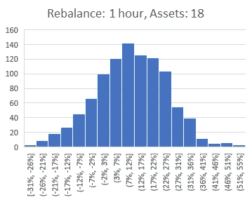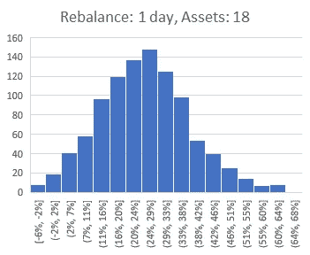

除了这一趋势，我们还可以在迄今为止我们研究的所有结果中发现一些其他趋势。其中一个趋势是，随着我们延长再平衡期，绩效结果的分布通常会变得更窄。因此，不仅投资组合中的资产数量在决定我们应该预期的分布类型方面有作用，再平衡期也有作用。

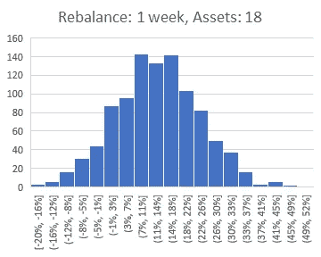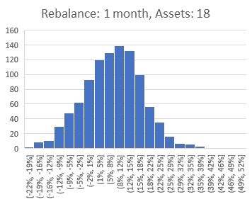

对于 18 项资产，1 天的再平衡期优于我们研究的所有其他再平衡期和投资组合规模。该投资组合规模和再平衡期的中值为 24.9%。

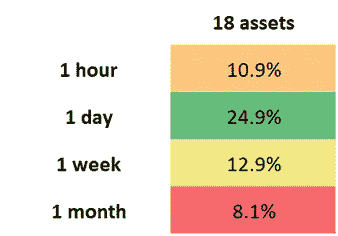

> 利用每日再平衡期的 18 种资产的投资组合比相同的买入并持有投资组合平均高出 24.9%。

# **完成比较**

一旦我们汇总了所有数据，我们就可以构建一个简单的 4 x 5 网格，展示所有再平衡期和投资组合规模的表现。当我们考虑最终性能分布的中间值时，这代表的是性能的中点。这意味着你可以把它看作是一半投资组合表现好于这个数字，而一半投资组合表现差于这个数字的点。

此外，图表中包含的每个值都是相对于买入并持有的百分比收益。因此，10%的价值代表比买入并持有好 10%*的表现。*

*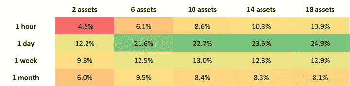*

*这张图表说明了几个不同的趋势，从中我们可以得出结论。我们可以清楚看到的第一个趋势是持有更多资产的投资组合表现更好。唯一不符合这一趋势的再平衡期是 1 个月的再平衡期。*

*我们观察到的第二个趋势是，更频繁的再平衡期往往优于更长的再平衡期。在这项研究中，该规则的例外是 1 小时的再平衡期。由于 Bittrex 等交易所的费用较高，高频再平衡导致投资组合表现下降。*

*为了提供运行的每个回溯测试的可视化，我们可以将每个回溯测试合并到一个直方图中。*

*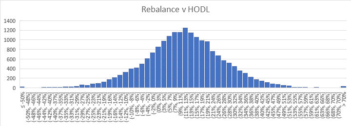*

*一旦这些回溯测试被合并到一个图表中，我们就可以完全理解在所有测试过的再平衡期和投资组合规模中，再平衡与买入并持有相比有何不同。在所有的回溯测试中，我们观察到平均性能提高了 11.46%。这意味着，如果我们随机选择 2 到 18 之间的投资组合规模，随机选择 1 小时到 1 个月之间的再平衡期，并随机选择投资组合中的资产，那么与买入并持有相比，再平衡该投资组合将有 50%的机会导致至少 11.46%的业绩增长。*

> ***总体而言，在 2018 年熊市期间，78.67%的再平衡投资组合跑赢了买入并持有。***

# ***结论***

*根据这些结果，我们可以得出两个主要结论。首先，增加再平衡投资组合中的资产数量往往会提高投资组合的表现。*

*第二，缩短再平衡期有助于提高投资组合的绩效。虽然由于交易费用的影响，高频再平衡期也有例外，但随着我们减少再平衡期，这种情况通常是成立的。*

*实施具有自动再平衡策略的多样化加密指数投资组合的策略是选择具有相应投资组合再平衡策略的多样化数量的资产的精细平衡行为。*

*这项研究支持压倒性的证据，即投资组合再平衡即使在熊市期间也能为加密货币投资组合提供可衡量的价值。虽然加密货币市场仍在兴起，但考虑传统的投资组合策略很重要，这些策略已经证明了它们在稳定和增长投资组合方面的巨大能力。*

# ***用 Shrimpy 重新平衡***

*Shrimpy 是一个免费的应用程序，可以自动重新平衡您的投资组合。我们用于资产分配、回溯测试和指数化市场的专用工具是业内最强大的。*

* [## Shrimpy -加密货币投资组合管理

### 管理您的数字资产的最简单、最值得信赖的方式。

www.shrimpy.io](https://www.shrimpy.io/) 

将 Shrimpy Universal Crypto Exchange API 集成到您的应用程序中，立即访问我们支持的每个交易所的交易执行、投资组合再平衡、市场数据、用户 API 密钥管理等。这是让您的用户满意并加速您的加密应用程序开发的最快方式。

 [## 面向开发者的加密交易 API

### 业界领先的加密交易、实时数据收集和交易账户管理 API。

developers.shrimpy.io](https://developers.shrimpy.io/) 

如果您仍然不确定，请尝试演示，看看我们提供的一切！

[**Shrimpy 演示**](https://www.shrimpy.io/demo)

留下你的评论，让我们知道你的平衡经验！

*捕虾队*

# 关于虾皮

[Shrimpy](http://shrimpy.io/) 是一个自动化的加密交易&投资组合管理工具，让用户像传统的指数基金一样自动化他们的加密资产投资组合策略。

## 给消费者的礼物

用户能够配置定制的加密货币组合，并实施被动管理策略，消除了必须主动交易加密的麻烦。

Shrimpy 的免费版本为所有用户提供了完整的自动交易、指数和再平衡功能。Shrimpy 还提供每月 8.99 美元的月费订阅。高级订阅包括:

Shrimpy Social :关注、交流和分享其他 Shrimpy 交易者的策略。

[**Shrimpy Insights**](https://blog.shrimpy.io/blog/shrimpy-introduces-social-insights) :了解其他 Shrimpy 用户如何构建和管理他们的加密组合。

[**高级回溯测试**](https://blog.shrimpy.io/blog/the-crypto-portfolio-rebalancing-backtest-tool) :用于评估定制加密货币组合&策略的健壮回溯测试工具。

 [## Shrimpy —加密货币投资组合管理

### 管理您的数字资产的最简单、最值得信赖的方式。

www.shrimpy.io](https://www.shrimpy.io/) 

## Shrimpy 为开发者提供的加密交易 API

除了消费者应用程序，Shrimpy 还为希望将可扩展的交易所交易功能集成到其应用程序中的开发人员提供了一个交易 API。

Shrimpy 的 Universal Exchange API 是作为一个基于云的解决方案创建的，以解决几个加密开发人员的障碍，包括**交换交易**、**产品可扩展性**和**用户管理。**有了 Shrimpy 的 API 在手，开发人员在创造将塑造加密未来的下一个时代的突破性产品时就不会受到范围的限制。

Shrimpy 的 API 是一种加密货币交易 API，可与以下所有交易所及其 API 端点兼容:币安 API、CoinbasePro API、Bittrex API、北海巨妖 API、Gemini API、Poloniex API、Huobi API、KuCoin API、Bibox API、BitMart API 和 HitBTC API。用户不必管理每个交易所的所有连接，只需利用 Shrimpy 现有的加密交易所交易基础设施，并专注于实际的产品开发。

 [## 面向开发者的加密交易 API

### 业界领先的加密交易、实时数据收集和交易账户管理 API。

developers.shrimpy.io](https://developers.shrimpy.io/) 

**虾米链接**:

[电报](http://t.me/ShrimpyGroup)

[推特](https://twitter.com/ShrimpyApp)

[脸书](https://www.facebook.com/ShrimpyApp/)

Reddit

最初发布于 [blog.shrimpy.io](https://blog.shrimpy.io/blog/rebalance-vs-hodl-bear-market-analysis)*