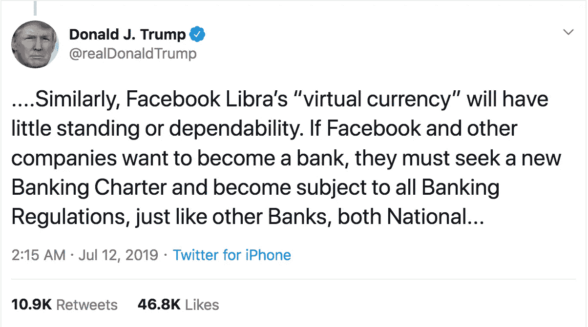

# 反抗天秤帝国

> 原文：<https://medium.com/hackernoon/rebellion-against-the-libra-empire-d279ff9aa1b6>

## 阅读完整的故事。

“上个月，脸书凭借《T2》一鸣惊人的《天秤座 3》震惊了世界。甚至在一年前，一家标志性的美国公司将推出一种数字货币，或者一位在任总统将[在推特上](https://twitter.com/realDonaldTrump/status/1149472284702208000)发布这种货币，这种想法似乎是疯狂的。

“欢迎来到新常态。

天秤座的声明让[政客们手忙脚乱](https://hackernoon.com/a-letter-to-facebook-611374b307fe)，像原子弹一样击中了[主流媒体](https://www.wsj.com/articles/facebook-says-libra-cryptocurrency-to-be-regulated-by-swiss-financial-authorities-11563208951)，并让许多密码影响者怀疑社交网络巨头是否刚刚将 90%的 altcoins 变成了 shitcoins。一个只有几个微不足道的程序员和几百万美元的小加密项目能抵挡住脸书以及像优步、Lyft、Paypal、Visa 和万事达这样的科技和支付处理世界巨头的联合力量吗？

但是地平线上出现了新的希望。地球上有一家公司有能力挑战社交媒体怪兽并取得胜利:

电报。

## [如果天秤座是《帝国反击战》，电报就是新的希望](https://hackernoon.com/telegram-and-the-rebirth-of-the-cypherpunk-revolution-g61l320rf)

脸书有 18 亿用户，而 Telegram 筹集了 17 亿美元。

虽然脸书有从未持有过比特币的无知群众，但 Telegram 有整个密码社区，他们以替代比特币为早餐。

马克·扎克伯格是互联网监控经济的典型代表，而 Telegram 的创始人帕维尔·杜罗夫是一个与权力斗争的叛逆者，隐私已经融入了他的 DNA。"

## [阅读完整故事:电报和赛佛朋克反抗天秤座帝国](https://hackernoon.com/telegram-and-the-rebirth-of-the-cypherpunk-revolution-g61l320rf)以及更多关于[天秤座](https://hackernoon.com/tagged/libra)和[电报](https://hackernoon.com/tagged/telegram)的故事在[黑客中午](https://hackernoon.com/)。