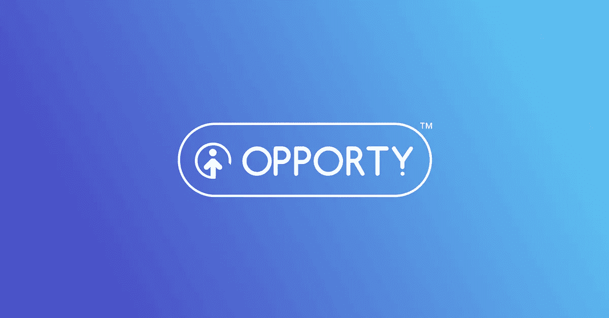

# 代表 opportunity 反驳 StockBaller

> 原文：<https://medium.com/hackernoon/rebuttal-to-a-critical-article-on-behalf-of-opporty-4061ee718957>

# 摘要

*   一位股票交易员 StockBaller 最近发表了一篇关于 CLCI (Clic Technology)公司及其合作伙伴 Opporty 的评论。
*   机遇和 CLCI 的成就和优点被掩盖和淡化，不公平地误导了读者。
*   我谨代表 Opporty 澄清一些细微差别，并为 StockBaller 的报告添加重要事实，以呈现一个更全面、更准确的画面。

[这篇文章](https://seekingalpha.com/article/4271226-clic-technology-caution-advised)几天前发表在 seekingalpha.com*网站*上。它提供了一些重要的结论，但并没有展示机会团队如何工作及其众多成就的全貌。这篇文章从负面描述了我们公司，我想在我的扩展分析中纠正这种不公正。

# 媒体活动

Opporty 在 T [witter](https://twitter.com/opporty_ico) 、我们的[博客](https://blog.opporty.com/)和 Opporty Plasma Cash 的 [GitHub 知识库](https://github.com/opporty-com/Plasma-Cash)上的媒体活动可能看起来节奏缓慢，因为我们只在那里发布最重要的新闻。我们的团队认为少写高质量的文章比频繁写无关紧要的文章要好。当您访问这些资源时，您总能找到关于我们成就的简明而有意义的报告。你不会发现任何无关紧要的信息。

此外，考虑其他社交媒体平台也很重要，特别是 Telegram，Opporty 在诽谤性文章中提到的整个时期都在积极和定期地与区块链社区进行沟通。

opportunity 在各种规模的媒体和新闻平台上被提及了 200 多次，包括一些最大的媒体和新闻平台。由公司创始人 Sergey Grybniak 为 Mars Finance 撰写的关于区块链等离子现金在国际贸易中的应用的[出版物已经成为整个系列中最好的出版物之一。其关键思想与《区块链能否彻底改变国际贸易》一书中的概念不谋而合](https://www.huoxing24.com/newsdetail/20181024230916074037.html)作者 Emmanuelle Ganne，后由世界贸易组织出版。Hacker Noon 的这篇文章的翻译可从[这里](https://hackernoon.com/the-lesson-ethereum-plasma-cash-enabled-international-trades-90c946d98343)获得。

# Opporty 实施了等离子现金

总的来说，区块链技术的现状远未完善。该行业没有确定的标准来定义区块链实施的“就绪性”。这就是为什么所有的开发者，包括四大，经常使用“工作进行中”的免责声明。

当谈到血浆(和血浆现金)时，我们总是记住用于处理交易的私有侧链，以及以太坊根链的“出口”。

根据部分工作的等离子体现金原型的第一次发布来判断我们的项目是错误的。它能够处理交易，但仍然缺乏许多功能。在当时，它是 GitHub 上第一个工作的 Plasma Cash 实现。

应该指出的是，当时，除了我们自己的仓库之外，我们只发现了一个存放血浆现金的仓库。但是我们无法启动它，并且公司开发人员/存储库所有者也没有对其处理事务的能力做出任何声明。

在我们第一次发布时，该产品还处于婴儿阶段，因为我们在以太坊创始人 Vitalik Buterin 提出血浆现金框架后不到两个月就发布了该产品。

后来，我们对这个版本进行了重大改进，包括但不限于[可伸缩性](https://blog.opporty.com/opporty-enhances-its-plasma-cash-runs-speed-tests-and-takes-tps-to-the-next-level-e7899324129d)，隐私(查看详情[这里](https://blog.opporty.com/opporty-technical-paper-part-1-495f53960873)和[这里](https://blog.opporty.com/opporty-technical-paper-part-2-4154a093d222)，以及 [DPOS 共识算法](https://blog.opporty.com/opportys-protocol-consensus-algorithm-615462c14e3b)。在我们于 2018 年 12 月发布最新版本时，我们已经拥有了具有独立共识算法的私有侧链，并“退出”到以太坊根链。换句话说，对于特定的用例，我们修改后的解决方案处于随时可用的使用状态。

从那时起，我们就没有更新过我们的 GitHub 帐户，因为我们正在改进和重构现有的代码，并准备发布以太坊网络中私人交易的新解决方案。我们的产品开发超越了我们与 CLCI 的合作，并计划很快宣布。

# 关于巧妙的解决方案

Opporty 的技术支持由软件开发公司 Clever Solution Inc 执行，该公司自 2013 年以来一直活跃在市场上。根据众多评级(包括但不限于顶级开发和 B2B 公司)，Clever Solution 是纽约市顶级数字提供商之一。

# 社会冲击

Opporty 不仅仅开发先进的技术。这家公司与合作伙伴一起教育社区，不懈地努力使其平台对每个用户都有用，并努力实现有抱负的初创公司最雄心勃勃的计划和梦想。

特别是，opportunity 团队为雇用残疾人或由残疾人创建的企业的发展和增长做出了贡献。Opporty 的倡议激励其他组织关注残疾企业家的需求。

技术和商业团体并没有忽视 Opporty 的努力和活动。该公司已经获得了多项奖项，包括由 Stevie Awards 颁发的“年度公司—商业和专业服务”铜奖提名。

Clever Solution 团队发布了多份教育指南和文章，展示了它如何在为 opportunity 开发突破性技术的同时解决挑战性的问题和任务，包括[等离子现金实施](https://clever-solution.com/case-studies/scalability-opporty-plasma-cash)、 [zk-SNARKS](https://clever-solution.com/case-studies/privacy-of-b2b-transactions-opporty-zk-snarks-implementation) 、[开发流程管理](https://clever-solution.com/case-studies/managing-quality-growing-teams)、[共识算法](https://clever-solution.com/case-studies/consensus-algorithm-opporty-dpos-pbft-solution-for-distributed-ledger-security)、[分布式密钥生成。阈值签名。BLS 计划。非交互式共识](https://clever-solution.com/case-studies/distributed-key-generation-threshold-signatures-bls-scheme-noninteractive-consensus)。

技术社区的教育材料中也描述了开发过程，例如，用于以太坊的 [Plasma Cash Side Chains 用于 C Sharp Corner 的](https://www.c-sharpcorner.com/article/plasma-cash-side-chains-for-ethereum/)和用于 Habr 的[Plasma Cash block chain 的 State 的数据结构](https://habr.com/en/post/455988/)。

# 总结一下

斯托克巴勒已经表达了他的观点，他有权发表意见。同样，机会团队有权添加重要的细节并展示问题的所有方面。我们应该能够共同描绘出反映真相的全面图景。机遇的代表总是感谢客观的批评，但当重要的细节被忽略，我们的成就被淡化时，我们不能保持沉默。