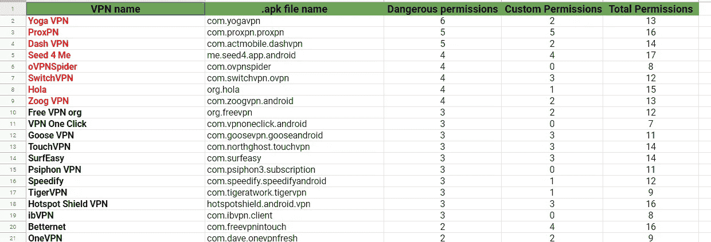

# 最近的研究回顾了 Android VPN 应用程序请求的不同权限:结果令人震惊

> 原文：<https://medium.com/hackernoon/recent-study-reviews-the-different-permissions-requested-by-android-vpn-apps-the-result-was-bc7a012c06cd>

*A preview of some the VPNs and the app permissions they requested*

VPN 是那些不断发现自己处于严格审查的接收端的技术之一，不幸的是，这给了它一个继续困扰其可行性的坏名声。

在过去的几年里，几项研究表明，大多数 VPN 应用程序(尤其是免费的)都有一个或多个缺陷(从 [DNS 泄露](https://www.dnsleaktest.com/)到过度或危险的权限),这削弱了它们的完整性和有效性。

就在我们认为情况不会再创新低的时候，我们遇到了和以前的研究一样令人震惊的新发现。VPN 专家，TheBestVPN 的约翰·梅森(John Mason)对总共 81 个 VPN android 应用程序询问的 [android VPN 权限](https://thebestvpn.com/android-vpn-permissions/)的安全和隐私含义进行了深入研究。不足为奇的是，结果毫无疑问地证明了这个市场的无能、疏忽和颓废程度仍然很高。此外，这两项研究都证明[谷歌最近努力](https://latesthackingnews.com/2019/02/14/google-play-store-malicious-app-detection-up-by-over-50/)清除 Google Play 中的恶意或用户数据安全默认应用。

*A preview of some the VPNs and the app permissions they requested*

在我们深入 John 研究的本质之前，首先理解权限的概念以及为什么需要认真对待它们是至关重要的。

**什么是安卓权限？**

设置权限是为了确保用户控制应用程序或服务提供商可以访问的信息量和设置。基本上，有两种类型的 Android 权限，正如谷歌在它的一份面向开发者的出版物中所描述的。它们是正常权限和危险权限。顾名思义，普通权限是应用程序运行所需的基本访问权限。在大多数情况下，我们的设备在没有我们输入的情况下自动授予应用程序正常权限。

另一方面，危险的权限允许应用程序访问可能危及用户隐私的数据和设置。显然，它们通常是在我们安装一个应用程序后弹出的，允许我们授予或拒绝应用程序访问一个或多个功能。不用说，不加选择地同意危险的权限也会危及系统的运行。

从研究结果中发现，相当多的 Android VPN 应用程序寻求与其正常操作不相关的危险权限，特别是 Android . permission . write _ EXTERNAL _ STORAGE 和 READ_EXTERNAL_STORAGE。

前者允许应用程序访问设备 SD 卡中的文件，而后者授权应用程序将数据输入外部存储。

**高安全和隐私风险关联权限**

更有趣的是，81 个 VPN 应用中有 27 个申请了对外部存储的读写权限，这可能会损害用户的隐私。作者归类为 VPN 应用程序使用的高安全性和隐私风险权限的其他权限包括:

*   **ACCESS_FINE_LOCATION** :明确允许 app 记录用户的位置。不幸的是，这违背了 VPN 的本质，因为它应该作为一种工具来隐藏一个人的位置。在接受审查的 81 个 VPN 应用中，共有 9 个应用属于这一类别。
*   **Write_Settings** :该许可授权应用程序对系统设置进行更改，这也使用户面临成为各种安全和隐私威胁的受害者的风险。作者指出，3 个 VPN 寻求允许他们配置操作系统设置的权限。

**第三方受限权限**

根据作者的说法，谷歌不建议第三方应用程序使用某些权限，因为它们会给用户带来相当大的风险。

然而，一些 VPN 应用程序违反了这些建议，这进一步证明了在 VPN 市场建立全球标准的必要性。这些权限如下:

*   **Manage_Documents:** 权限允许应用程序拥有与设备上的默认文档管理应用程序相同的访问权限和功能。尽管理论上不允许第三方应用请求这样的许可，然而，发现一个 VPN 请求它。
*   **Read_Logs:** 与 Manage_Documents 权限一样，Read_Logs 也不建议第三方使用，因为它使应用程序能够从系统的低级日志中访问文件，这些文件可能包含用户的私人详细信息。

**研究总结**

该研究共审查了 81 个 VPN 应用程序，发现了 8 个可疑或危险的 android VPN 权限，这些权限与 VPN 的主要功能无关。

从好的方面来看，81 个 VPN 应用程序中总共有 31 个没有危险权限的记录，然而，这并不能从每个 VPN 应用程序平均要求 11 个 android VPN 权限的令人不安的揭示中带走任何东西。正如作者所指出的，这是不可接受的，他认为，理想情况下，VPN 需要很少的权限就能正常工作。

根据这项研究的结果，可以有把握地说，一些 VPN 提供商对他们行为的影响漠不关心，尤其是[负面新闻](https://latesthackingnews.com/2019/02/27/facebook-removed-onavo-protect-from-google-play-store-voluntarily/)。这也凸显了这样一个事实，即用户在考虑采用哪种 VPN 时，不应只看 VPN 的名称或受欢迎程度。