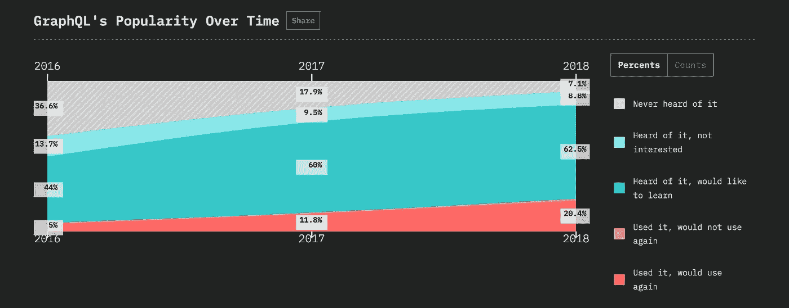
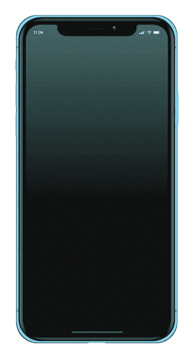
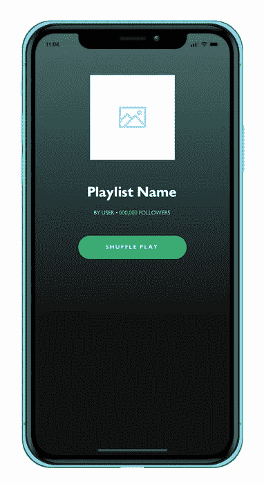
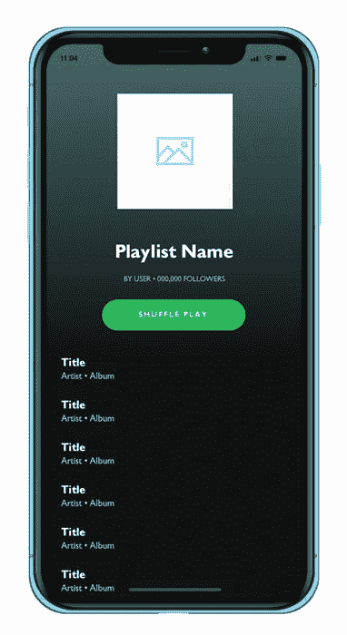
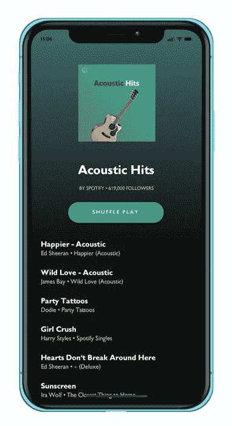

# 使用 GraphQL 和 React Native 重新创建 Spotify 播放列表

> 原文：<https://medium.com/hackernoon/recreating-spotify-playlists-using-graphql-react-native-874c2da615e6>

## 在本文中，我们将探讨如何使用流行的数据查询和操作语言来为 APIs GraphQL 和 React Native 重新创建 Spotify 播放列表

【www.jamiemaison.com】最初发表于**。**

*2015 年，脸书发布了他们内部为 APIs GraphQL 构建的数据查询和操作语言，此后它就成为了我们关注的焦点，部分原因是由于 Twitter、Paypal 和《纽约时报》等大牌的采用。事实上，JavaScript 2018 的[状态将 GraphQL 列为仅次于 Redux 的全球最受欢迎的数据层技术。](https://www.jamiemaison.com/blog/2018.stateofjs.com)*

**

*记住这一点，理解 GraphQL 的优势和劣势是很有用的。在本教程中，我将指导你创建一个屏幕，希望你们很多人都熟悉；Spotify 播放列表。幸运的话，您将更好地理解 GraphQL 如何使您的应用程序受益，并推动您更详细地探索这项技术。*

**

# *创建视图*

*与任何(好的)应用程序一样，我们需要拼凑出一个好看的前端体验，以吸引用户的方式显示我们的数据，Spotify 也不例外。为了让我们继续下去，我们将使用 React Native 来构建我们的移动应用程序，运行 Expo 来简化我们设备上的开发。一旦我们的应用程序启动并运行，我们将在本教程的后面讨论 GraphQL 部分。*

*首先，我们将安装 Expo 并创建 React 本地模板。要安装 Expo，只需运行:*

*`npm install -g expo-cli`*

*现在要设置文件夹结构和运行所需的所有必要文件:*

*`expo init spotify-playlist`*

*   *当要求“选择模板”时，选择“**空白***
*   *当提示“输入一些初始配置值”时，将应用程序名称更改为“ **Spotify 播放列表***

*初始设置完成后，您可以通过导航到新创建的文件夹并运行以下命令来启动应用程序:*

*`npm start`*

*如果你是世博会的新手，很容易上手。运行`npm start`后，你会看到如何用你的设备/模拟器测试你的应用程序的所有说明。要在您的设备上进行测试，只需使用 Expo iOS/Android 应用程序扫描二维码即可。*

*一旦运行，你应该会看到默认屏幕说“打开 App.js，开始你的应用程序！”*

*让我们从创建应用程序的基本容器开始。Spotify 播放列表屏幕由两个主要元素组成，一个带有渐变背景的标题和一个所有播放列表项目的列表。要重新创建这两个元素，请打开您的`App.js`,并用以下内容替换它:*

*这里我们创建了两个元素。一个来自 Expo 的`<LinearGradient />`组件和一个来自 React Native 本身的`<FlatList />`。我们已经添加了一些基本的样式，并暂时硬编码了高度值(一旦我们得到一些数据，我们将把这个高度改为`auto`)。*

*保存您的文件，Expo 应该热重新加载您的应用程序，现在看起来应该是这样的:*

**

*LinearGradient & FlatList View*

*我们现在准备开始将一些占位符数据插入到我们的应用程序中，以开始获得正确的标题元素样式。为此，我们需要两种字体`gibson-regular`和`gibson-bold`，你可以在这里下载和。将字体添加到项目的`/assets`文件夹中，我们准备开始将头部组件放在一起。*

*因为我们使用外部字体，所以我们需要在渲染组件之前异步加载它们，否则字体将不会存在，应用程序将会出错。幸运的是，世博会给了我们一个很好的方式来做到这一点。将以下内容添加到`App.js`:*

*看看我们如何在 componentDidMount 中加载字体 async，然后直到`this.state.fontLoaded = true`才呈现相关组件？您可能还注意到，我们的播放列表项不是我们之前创建的`<LinearGradient />`组件的子组件。这是因为如果你看 Spotify 应用程序，播放列表项目会独立移动到顶部渐变。这种视差效果是让一些应用程序看起来如此吸引人的微妙之处之一。*

*保存您的`App.js`，您现在应该有类似这样的东西。*

**

*Basic Header Placeholders*

# *重新创建播放列表*

*现在，对于任何播放列表的所有重要部分，歌曲本身！我们将通过使用 React Native `<FlatList />`来实现这一点。同样，在设置 GraphQL 之前，我们暂时只添加一些模拟数据。将您的`App.js`修改如下:*

*在这个代码片段中，我们对数据进行了迭代，并为每条数据创建了一个简单的视图，其中包含一些文本组件。*

*如果你现在加载真正的 Spotify 应用程序，你会看到在滚动视图时，有一个小技巧，随着你的拇指在屏幕上移动，隐藏播放列表文本，并轻轻地淡出专辑封面。有几种方法可以实现这种效果，但我会向你展示一种使用 CSS 和 JS 组合的方法，希望很简单。*

*再次打开你的`App.js`,我们将做一些修改，使它看起来像这样:*

*太好了！我们现在应该有一个功能齐全的应用程序，其行为就像 Spotify 应用程序中的播放列表部分一样。关于上面的代码，需要注意一些事情:*

*   *在滚动视图时，我们保存状态中的`currentScrollPos`,以供我们的每个组件读取。*
*   *然后，当`currentScrollPos`大于某个值- `{ this.state.currentScrollPos < 53 ? <Text> : null }`时，我们使用 React 来隐藏各种文本组件。*
*   *为了让事情看起来不那么像巫毒教，更具可读性，我们将一些计算分成不同的函数:`calculatePlaylistHeight`、`calculateButtonPos`、&、`calculateArtSize`。*

**

*Playlist View with Placeholders*

*既然我们已经得到了我们想要的应用程序的外观和行为，现在是时候开始将 GraphQL 引入等式来处理数据了！*

# *使用 GraphQL 插入数据*

*在我们进入“如何”之前，让我们先了解“是什么”和“为什么”。GraphQL 是作为“使前端查询变得容易”来销售的。在其核心，GraphQL 是一种类型化的查询语言，为开发人员提供了一种更简单的方式来描述并最终获得他们需要的数据。*

*出于本教程的目的，我们需要运行某种服务器来存储实际数据。使用`apollo-server`很容易做到这一点，但是您并不是在这里开始编写服务器代码！就像魔术一样，我在 codesandbox.io 上创建了一个 Apollo Server playground，我们可以用它来实现这个示例的目的。如果你对代码感兴趣，你可以在这里查看然而，如果你只是想跳过前面所有你需要做的是打开你最喜欢的浏览器，并导航到[https://rqvj0qw34.sse.codesandbox.io/](https://rqvj0qw34.sse.codesandbox.io/)-启动这将启动该地址的服务器，所以请确保在你的开发过程中在后台打开它！*

*现在，回到我们的 Spotify 应用程序，我们将为教程的下一部分安装以下依赖项:*

*   *[apollo-boost](https://www.npmjs.com/package/apollo-boost) —这是一种在 react 中使用 GraphQL 的零配置入门方式。*
*   *[react-Apollo](https://github.com/apollographql/react-apollo)—Apollo client 是在客户端应用中使用 GraphQL 的最佳方式。`React-apollo`提供 GraphQL 和 Apollo 客户端之间的集成*
*   *graphql-tag —一个解析 graphql 查询的 JavaScript 模板文字标签*
*   *[graph QL](https://www.npmjs.com/package/graphql)—graph QL 的 JavaScript 参考实现。需要解决与世博会的冲突。*

*可以通过运行以下命令进行安装:*

*`npm install --save apollo-boost react-apollo graphql-tag graphql`*

*现在排序完毕，让我们从 GraphQL 服务器获取数据，并使用以下数据查询显示它:*

*希望您能看到 GraphQL 让数据查询看起来有多简单，在这个例子中，我们只是请求一个 playlist 对象，它具有属性`name`、`creator`、`followers`、`albumArt`和`songs`，并且`songs`具有`key`、`title`、`artist`和`album`值。*

*让我们通过将`App.js`修改为以下内容，使用`react-apollo`获取并显示这些数据:*

*在上面的代码中，我们使用来自`react-apollo`的`<Query />`组件来请求数据，在返回数据时，我们呈现所有接收到的信息。该组件还允许我们处理`loading`或`error`状态，目前我们只是呈现一个空白视图，但您可以看到如何使用它来提供更好的用户体验。*

*现在保存并运行应用程序，您应该会看到一个功能完整的 Spotify 播放列表应用程序，它直接使用来自 GraphQL 服务器的数据！*

**

*Finished Application*

# *进一步阅读*

*这就是本教程的全部内容，如果你有任何 GraphQL 或 React 问题，你可以随时在 Twitter 或电子邮件上联系我，我会尽力帮助你的！以下是我感兴趣的其他一些文章，供进一步阅读:*

*   *[GraphQL:你需要知道的一切](/@weblab_tech/graphql-everything-you-need-to-know-58756ff253d8)通过网络实验室技术*
*   *由 Jonas Helfer 撰写的《GraphQL 解释:GraphQL 如何将查询转化为响应》*
*   *GraphQL 的[查询和突变](https://graphql.org/learn/queries/)*

*有一个项目，你正在寻找开始，认为你可能需要我的帮助，或者只是想伸出手？[保持联系！](mailto:jamie@jamiemaison.com)*