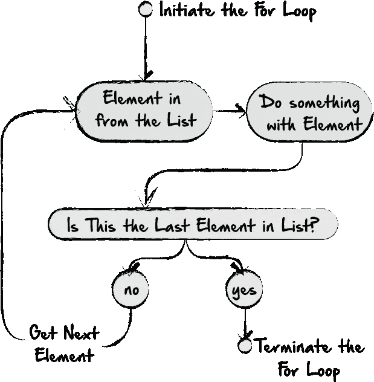
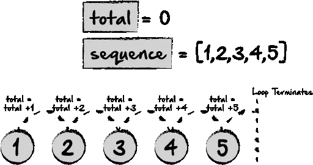
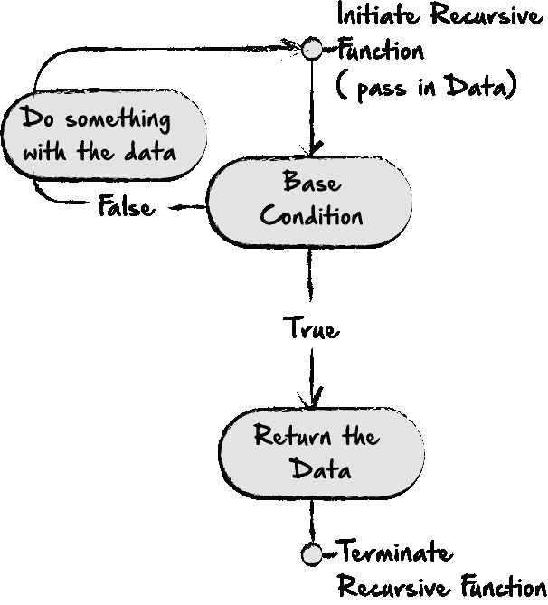
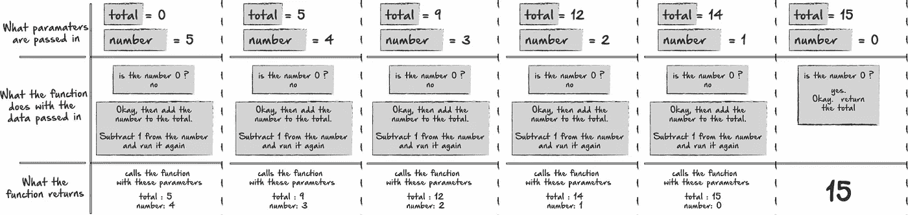
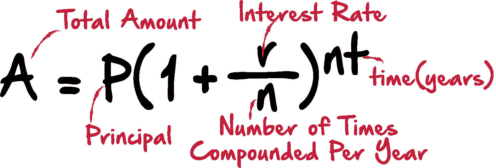
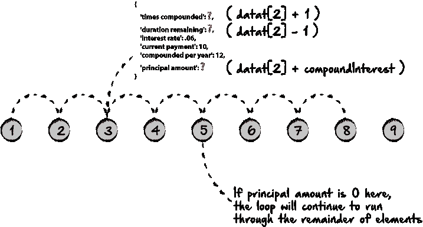
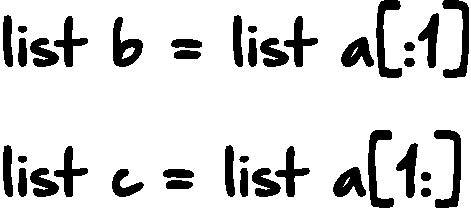
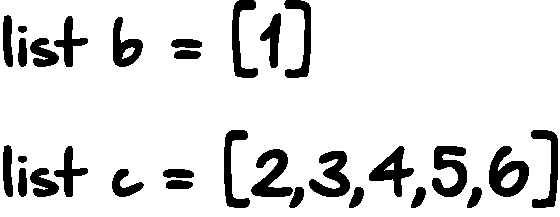
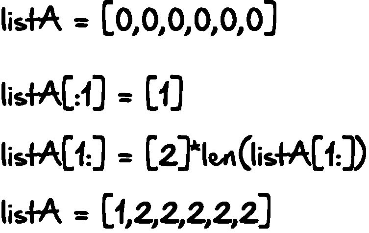

# Python 中的递归与循环

> 原文：<https://medium.com/hackernoon/recursion-vs-looping-in-python-9261442f70a5>


编程中最基本的工具之一是循环。虽然有许多不同类型的循环，但几乎每种类型的循环都有相同的基本功能:迭代数据以分析或操作数据。递归是另一种流行的函数类型，虽然它也可以像循环一样分析和操作数据序列，但在许多情况下，递归可能不太为人所理解，而且经常会有些混乱。几乎所有的递归函数都可以重写为循环，反之亦然。然而，每种类型的函数都有优点和缺点，知道什么时候使用一种函数优于另一种函数是我们在这里要研究的。在下面的帖子中，我们将尝试回答以下问题:

1.  **T5 什么是 For 循环？**
2.  ***什么是递归？***
3.  ***每种方法的实际例子是什么？***
4.  ***这两种方法应该分别在什么时候使用？***
5.  ***什么是递归数据结构？***

让我们从两种方法中似乎更简单的一种开始，循环。

# 对于循环



For Loop Flow

for 循环用于遍历序列(列表、元组、字典、集合或字符串)。只要到达数据序列的末尾，for 循环就会终止。

假设我们想把所有小于 5 的数字相加，得到总数。当然，我们可以简单地加上 1+2+3+4+5。但是如果我们把它变成一个函数，它允许我们重复使用同一个函数来添加 10 以下的数字，或者 20，或者其他数字。可能会有这样的情况，我们需要将两个值相加，但不知道值是什么，因此拥有一个返回低于某个值的数字之和的函数可能会很方便。

在这种情况下，我们可以做如下的事情



为了使这个循环工作，我们需要将所有的数字存储为一个列表，这样我们就可以遍历每个元素并将其加到总数中。

## 让我们看看这在实际代码中会是什么样子:

```
def getTotal(n):
    total = 0
    for number in list(range(n+1)):
        print number
        total = total + number
    return totalprint getTotal(5)
```

我们的函数从接受一个数字作为参数开始。这里，我们将使用 5 作为参数。然后，我们将我们的总数设置为 0。最后，我们迭代 0 和`n+1`之间的数字列表。我们在这里使用`n+1`,因为`list(range(n))` 会给出小于 n 的数字，但不包括 n，在本例中是 0，1，2，3，4。因为我们想包含 5，我们将使用`n+1.`

如果我们运行这段代码，我们可以看到在每次迭代中，我们得到了我们期望的数字，并且我们得到了总数。

## 我们的打印输出如下所示:

```
0
1
2
3
4
5
15
```

# 递归



任何函数调用自身时都会发生递归。递归和循环的最大区别之一是递归函数终止的方式。在上面的例子中，for 循环在它所循环的序列的末尾结束。然而，递归函数可以无限地继续下去，因为它不一定有数据序列。相反，递归函数有一个基本条件。基本条件是当条件满足时将终止循环的条件。

## 让我们举上面的例子，用递归重写一遍。从视觉上看，这可能是这样的:



在每个函数中，函数要么用新的输入调用自己，要么返回值。

## 让我们看看这在实际代码中会是什么样子:

```
def getTotal(n, total):
    print n
    if n == 0:  # base condition
        return total
    else:
        return getTotal(n-1, (total+(n)))print getTotal(5, 0)
```

在这里，我们可以传入一个起始数和一个总变量。第一次调用函数时，总数为 0，数字为 5。我们检查数字是否为 0。如果没有，我们再次调用该函数…但这次不是用 0 和 5 调用它，而是用 5–1 和 0+5 调用它，并重复这个过程，直到数字为 0，这时我们返回总变量 15。

# 用递归和循环计算复利

作为一个稍微难一点的练习，让我们用复利来确定贷款或投资的价值。为了确定这个值，我们需要 4 样东西:

1.  持续时间(年)
2.  利率
3.  每年复利的次数
4.  本金金额

## 计算复利的公式如下:



但是，这将一次性计算出全部金额。相反，我们希望在循环中或者用递归来实现。在这种情况下，我们的时间变量(nt)实际上将在迭代中处理。

在这两种方法中，我们都将使用这些数字作为变量，所以我们可以继续声明它们，并为每个方法使用相同的变量。

**变量可以这样定义:**

```
durationInYears = 10
interestRate = .06
compoundedPerYear = 12 
principalAmount = 4000
```

**— —循环复利计算**

为了使循环中的计算更容易，我们首先要做的是获得复利的总次数。如果它将按月复利，正如我们在变量中设置的那样，总年数是 10，那么结果将是 120，或 10*12。现在，我们可以循环该范围内的每个数字，计算每次迭代的复利，并将其添加到本金中。

## 代码可能是这样的:

```
def compoundInterest(principal, compounded, duration, rate):
    totalCompounded = duration * compounded
    for i in range(1, (totalCompounded+1)):
        principal = principal*(1+(rate/compounded))
    return principalprint (compoundInterest(principalAmount, compoundedPerYear, durationInYears, interestRate))
```

这与更简单的例子之间的唯一区别是，我们只是在每次迭代中多做一些计算。我们实际上迭代的是数字 1 到 120，而不是序列 5，这代表了复利的总次数。

**如果我们记录输出，我们应该得到一个值:**

```
7277.58693613
```

**— —递归复利计算**

在前面的例子中，我们的数据序列是 120，它表示本金将复利的次数。到达序列末尾后，循环将终止。对于递归，我们可以用类似的方式来设置它。我们可以给出函数的总持续时间，基本上有两个条件:

*   **条件 1:持续时间不为 0。**

> 做复利计算。将新的 iterest 添加到本金金额中。从总持续时间中减去 1。用新的本金金额和新的期限再次调用 sub。

*   **条件 2(基础条件) :持续时间为 0。**

> 归还本金。

在我们之前的递归例子中，我们从 5 开始，当它达到 0 时终止函数。

**在这里，我们会做同样的事情，但会从 120 开始。**

```
def compoundRecursion(principal, compounded, duration, rate, numberOfRecursions):
    if numberOfRecursions == 0:
        totalDuration = compounded * duration
    elif numberOfRecursions != 0:
        totalDuration = duration
    if duration == 0:
        return principal
    else:
        newDuration = totalDuration - 1
        amount = principal*(1+(rate/compounded))
        return compoundRecursion(amount, compounded, newDuration, rate, 1)print (compoundRecursion(principalAmount, compoundedPerYear, durationInYears, interestRate, 0))
```

这里，我们要么再次调用该函数，要么返回修改后的本金金额。每次我们调用新函数时，我们调用它，但是传入持续时间减 1。当持续时间等于 0 时，我们只返回本金。

# 何时使用递归

使用递归或循环可能在很大程度上取决于我们使用的语言，或者我们想要解决的问题。例如，在 JavaScript 中，当在满足基本条件之前达到堆栈限制时，使用递归会导致堆栈帧错误。如果是这种情况，循环可能会更好。

上面的例子也给了我们一个很好的例子，说明递归比循环更有效。

让我们想象一下，我们不像上面那样只跟踪数字，我们还想跟踪每个复合区间的其他数据。例如，我们可能要考虑定期还款会如何影响贷款期限。我们可能希望在序列结束前终止循环。如果贷款的复利总次数是 120，那么我们的列表长度是 120。但是，如果在仅仅 100 次迭代之后贷款金额为 0，那么在我们的列表末尾就有 20 个未使用的和不必要的列表元素。使循环场景更加复杂的是，贷款金额等变量的值取决于前一次迭代中贷款金额的值。不是说这个特别难，而是很乱。

**从视觉上看，这些问题可能是这样的:**



# 递归数据结构

这正是递归数据结构派上用场的时候。如果一个数据结构可以用它自身的一个更小的版本来定义，那么它就是递归的。列表是递归数据结构的一个例子。

**举个例子，我们来看下面这个列表:**


**现在，让我们从原来的列表中创建两个更小的列表:**



**如果我们打印两个列表，我们将得到以下结果:**



这个功能如此强大的原因是，使用递归函数和递归数据结构，我们可以一次修改整个列表，或者一个大列表的一小部分。当我们考虑循环的这个问题时，我们一次只能改变一个索引的一个值。

**作为如何做到这一点的示例，考虑以下内容:**



如果我们保存了大列表中的这些小部分，我们就可以调用相同的函数(递归)并向它发送小列表(递归数据结构)。

**让我们看看这是如何与我们之前的复利例子一起工作的:**

```
def recursiveData(data):
    # Base Condition ( if principal amount == 0 or if duration == 0)

    # Else Condition ( recalculate the times compounded, duration & principal amount)print (recursiveData(array))
```

我们的函数基本上由一个 if else 语句组成。虽然如果我们愿意的话，事情会变得更复杂，但是我们可以在这里完成所有我们想做的事情。最后，我们希望返回完成的数据，该数据将包含贷款金额和贷款复利的每个间隔的当前付款。

**我们的数据输出可能如下所示:**

```
[
{
    'times compounded': 0,
    'duration remaining': 10,
    'interest rate': .06,
    'current payment': 100,
    'compounded per year': 12,
    'principal amount': 4000
},
{
    'times compounded': 1,
    'duration remaining': 10,
    'interest rate': .06,
    'current payment': 100,
    'compounded per year': 12,
    'principal amount': 3900
}
]
```

**记住这一点，并且回头看看我们的较小列表的例子，这个过程可能是这样的:**


对于每个递归调用，我们将从列表中取出数组中的第一个元素。然后，我们将修改该元素的值，并再次调用该函数，但这次将 array[:1]和 array[1:]作为参数传递给它。正如我们所看到的，在列表的中间，我们应该有两个相同大小的列表，到最后，我们将完全转移和修改第一个列表的所有元素，并将它们都添加到第二个列表中。接下来，我们将一步一步地用实际代码创建这个函数。

**第一步。创建数组**

```
durationInYears = 10
compoundedPerYear = 12array = [{
    'times compounded': 0,
    'duration remaining': 10,
    'interest rate': .06,
    'current payment': 50,
    'compounded per year': 12,
    'principal amount': 4000,
    'total compounded': compoundedPerYear*durationInYears
}]*(compoundedPerYear*durationInYears)
```

在这一点上，我们有一个长度为贷款总复利次数的数组。每个元素包含相同的数据，我们将递归地改变这些数据。

**第二步。创建函数&基础条件**

```
def recursiveData(inputArr, outputArr):
    if len(inputArr) == 0 or inputArr[-1]['principal amount'] <= 0:
        return outputArr
```

同样，我们的基本条件涵盖了我们想要终止函数的两种情况。如果我们已经到达期限的末尾(`len(inputArr) == 0`)或者我们已经还清了全部贷款(`inputArr[-1][‘principal amount’] <= 0`)。

**第三步。创建 else 语句，并定义当前的 inputArray & outputArray 变量**

```
else:
        current = inputArr[:1][0]
        inputArrayLength = len(inputArr[1:])
        outputArray = outputArr
```

此时，我们从`inputArr`中弹出的当前元素是`current`。我们的输出数组也被定义了。如果我们以后需要访问我们的输入数组，我们可以用变量`inputArr`来实现。

**第四步。如果输出数组长度为 0，则弹出输入数组的第一个元素，(当前)并将其放入输出中，不做任何更改。**

```
if len(outputArray) == 0:
            outputArray.append(current)
            return recursiveData(inputArr[1:], outputArray)
```

现在，当递归函数被初始调用时，我们的两个数组应该像上面的图表一样。

**第五步。如果输出数组大于 0，修改当前元素的所有值。**

```
else:
            newTimesCompounded = outputArray[-1]['times compounded'] + 1
            newDurationRemaining = current['duration remaining']
            if ((outputArray[-1]['times compounded'] + 1) % 12) == 0:
                newDurationRemaining = outputArray[-1]['duration remaining'] - 1
            principal = (outputArray[-1]['principal amount'])*(1+(outputArray[-1]
                                                                  ['interest rate']/outputArray[-1]['compounded per year']))
            currentPayment = current['current payment']
            if currentPayment > principal:
                currentPayment = principal
            newPrincipalAmount = (principal - currentPayment)
            newTotalCompounded = outputArray[-1]['total compounded'] - 1
            newCurrent = {
                'times compounded': newTimesCompounded,
                'duration remaining': newDurationRemaining,
                'interest rate': current['interest rate'],
                'current payment': currentPayment,
                'compounded per year': current['compounded per year'],
                'principal amount': newPrincipalAmount,
                'total compounded': newTotalCompounded
            }
```

此时，我们可以打印我们的`newCurrent`变量，它是修改后的`current`变量，在它被复合并支付贷款后，它将拥有所有的新数据。接下来，我们需要将这个变量添加到输出数组中。

**第六步。将新的当前变量添加到输出数组**

```
outputArray.append(newCurrent)
```

**第七步。用新参数**调用递归函数

```
return recursiveData(inputArr, outputArray)
```

**我们完成了！让我们来看一下完整的代码块:**

```
durationInYears = 10
compoundedPerYear = 12array = [{
    'times compounded': 0,
    'duration remaining': 10,
    'interest rate': .06,
    'current payment': 2000,
    'compounded per year': 12,
    'principal amount': 4000,
    'total compounded': compoundedPerYear*durationInYears
}]*(compoundedPerYear*durationInYears)def recursiveData(inputArr, outputArr):
    if len(inputArr) == 0 or inputArr[-1]['principal amount'] <= 0:
        return outputArr
    else:
        current = inputArr[:1][0]
        inputArrayLength = len(inputArr[1:])
        outputArray = outputArr
        if len(outputArray) == 0:
            outputArray.append(current)
            return recursiveData(inputArr[1:], outputArray)
        else:
            newTimesCompounded = outputArray[-1]['times compounded'] + 1
            newDurationRemaining = current['duration remaining']
            if ((outputArray[-1]['times compounded'] + 1) % 12) == 0:
                newDurationRemaining = outputArray[-1]['duration remaining'] - 1
            principal = (outputArray[-1]['principal amount'])*(1+(outputArray[-1]
                                                                  ['interest rate']/outputArray[-1]['compounded per year']))
            currentPayment = current['current payment']
            if currentPayment > principal:
                currentPayment = principal
            newPrincipalAmount = (principal - currentPayment)
            newTotalCompounded = outputArray[-1]['total compounded'] - 1
            newCurrent = {
                'times compounded': newTimesCompounded,
                'duration remaining': newDurationRemaining,
                'interest rate': current['interest rate'],
                'current payment': currentPayment,
                'compounded per year': current['compounded per year'],
                'principal amount': newPrincipalAmount,
                'total compounded': newTotalCompounded
            }
            outputArray.append(newCurrent)
            inputArr = [newCurrent]*inputArrayLength
            return recursiveData(inputArr, outputArray)returnData = recursiveData(array, [])
for i in returnData:
    print (i)
```

为了确保它按照我们想要的方式工作，让我们将我们的支付金额提高到非常高的水平，以确保我们只得到我们想要的回报，并且我们的基本条件得到满足。

**如果我们将付款金额更改为 2000，则在打印时会得到以下数据:**

```
{'times compounded': 0, 'duration remaining': 10, 'interest rate': 0.06, 'current payment': 2000, 'compounded per year': 12, 'principal amount': 4000, 'total compounded': 120}{'times compounded': 1, 'duration remaining': 10, 'interest rate': 0.06, 'current payment': 2000, 'compounded per year': 12, 'principal amount': 2019.9999999999995, 'total compounded': 119}{'times compounded': 2, 'duration remaining': 10, 'interest rate': 0.06, 'current payment': 2000, 'compounded per year': 12, 'principal amount': 30.099999999999227, 'total compounded': 118}{'times compounded': 3, 'duration remaining': 10, 'interest rate': 0.06, 'current payment': 30.25049999999922, 'compounded per year': 12, 'principal amount': 0.0, 'total compounded': 117}
```

厉害！它似乎工作正常，基本条件得到了满足，并返回了一组比我们原本可以得到的更干净的结果。

想想看，如果我们使用一个循环来做这件事，并且仍然有 120 个元素要查看，其中大部分都是无用的/空的，那该有多烦人。

# 概括起来

一开始使用递归可能会令人望而生畏。但是在某些情况下，如果使用正确，它会是一个令人惊奇的工具。同样，根据具体情况，循环也可能是更好的选择。知道如何有效地做到这两点对于开发人员来说是一个很好的工具，也是在技术面试中给雇主留下深刻印象的好方法。