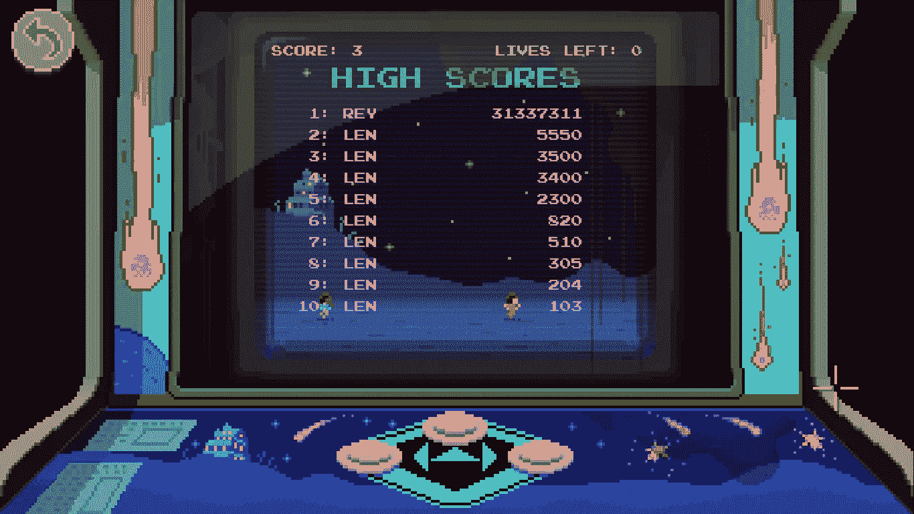
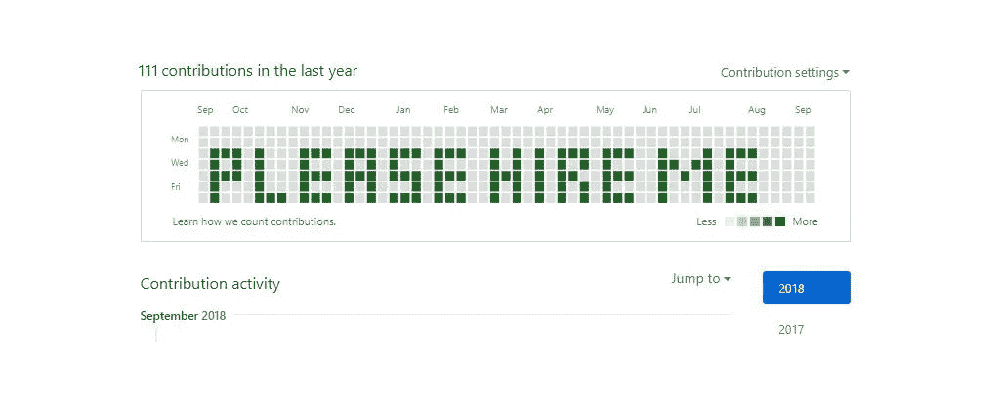
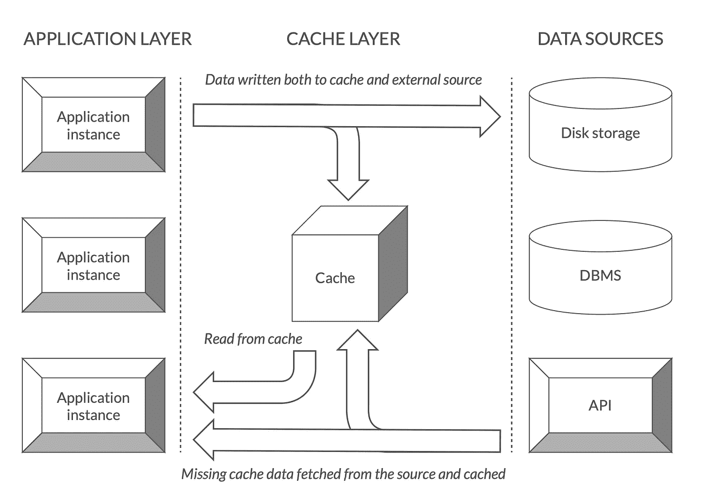
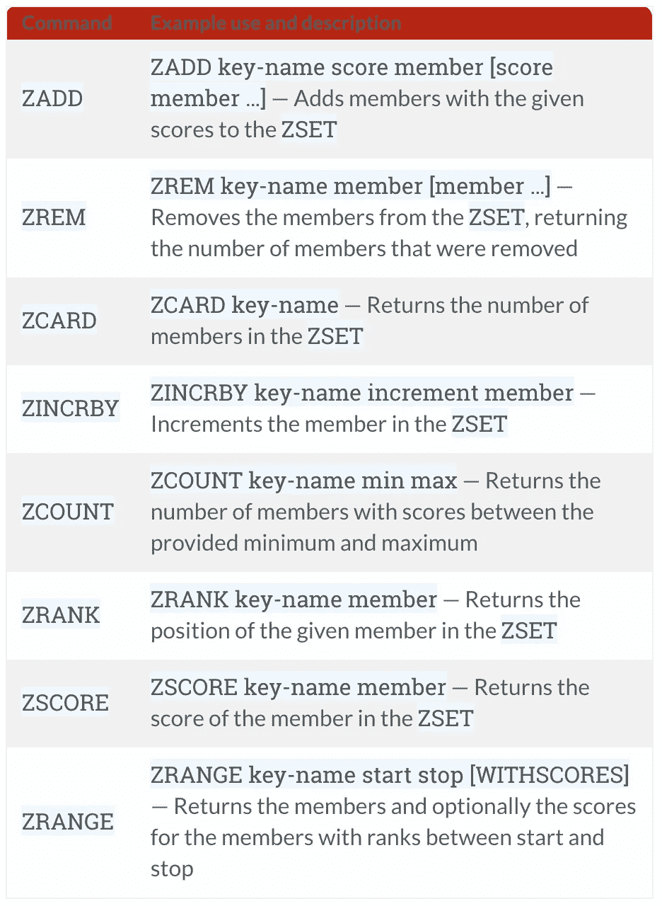

# 由 Redis 提供的实时排行榜结果

> 原文：<https://medium.com/hackernoon/redis-gamification-60e49b5494ae>



[Image Credit](https://discourse-cdn-sjc2.com/standard14/uploads/thimbleweedpark/original/2X/6/6ee5d532d285b863f719b116689a4b2f77b75513.jpg)

没有什么比排行榜更能引发真诚的满足感或动力不足感了。就像巴甫洛夫的狗一样，我们开始对这种引人入胜的刺激垂涎三尺。无论我们是被对自己雄心勃勃的成就的认可所激励，还是被一种可怕的判断力和自责感所激励，排行榜总能触动神经，让引擎加速运转。

曾经是游戏社区的主食，现在是一种工具，可以推动各种平台之间的互动。例如，GitHub 通过在日历上公开显示贡献统计，将“提交”到存储库的过程游戏化了。作为一名开发人员，我可以证明大片绿地的威力。

> 今天我们很高兴发布贡献:个人资料页面
> 的一个新功能，让你看到每个人在 GitHub 上都做了什么…贡献日历显示了你在过去一年中贡献的频率…你在 GitHub 的各个项目中做出贡献，我们希望向每个人展示你在做什么…展示你创建的奇特的资源库。
> 
> ——GitHub 博客，2013 年



[Image Credit](https://preview.redd.it/hqculc19byl11.jpg?width=960&crop=smart&auto=webp&s=afad3bd5a362b59d27dd2ba3fdbe9fadb257e0b5)

# 制作排行榜的艺术

随着更广泛的学科探索和部署各种游戏化机制，制作有效的排行榜已经成为一种艺术。从教育和健康到管理和营销的各个领域都在利用排行榜来激发积极的行为并增强主动性。事实上，建立透明度已经成为一种非常流行的策略，以至于无数的资源被用来详细说明如何正确地做这件事。

广义来说，排行榜有两种类型:*相对和绝对*。虽然绝对排行榜显示前 X 名的人数，但相对排行榜将用户放在类似排名的其他人中，减轻了沮丧和沮丧的感觉。胜利和失败的迷人心理提供了一个高效表格的洞察力，捕捉动机的细微差别，避免脱离。

完成一项挑战的满足感可能会激起一阵欣快。同样，没有最后一名的宽慰常常会唤起一阵喜悦。这些见解在排行榜开发的背景下是非常宝贵的，但其他因素对成功实施也同样重要。在一个被即时满足所驱动的社会里，忽视速度和时间的重要性是愚蠢的。


[Image Credit](http://topshelfgaming.net/wp-content/uploads/2017/12/Space-Invaders-Retro.jpg)

## 出于对游戏的热爱，实时更新

抵御挫折和缓解不耐烦需要一种特殊的数据库。事情是这样的。**排行榜貌似很难实现**。当太空入侵者在 20 世纪 70 年代末领先时，排行榜迎合了一个利基社区，只能显示前十名球员及其得分。然而，今天的这些糟糕的主板负责数量惊人的数据，并拥有丰富的功能，使得底层技术变得特别复杂。

如今，开发者不得不考虑像*跨平台潜力*、*社交整合*、*通知*这样的因素。用户希望在多种设备上看到他们的最新排行榜统计数据，并希望在排名发生变化时得到更新。令人印象深刻的排行榜还努力应对可能需要复杂计算的多种属性。单个应用程序可能需要一个全球排行榜，以及按位置、级别或时间区分的排行榜。针对所有这些需求进行优化的解决方案需要快速、灵活。

传统的关系数据库很难满足大量活跃用户的需求。用户越多，查询越慢。当一个应用程序使用外部数据源时，由于数据传输和延迟，它存在着性能不佳的风险。“高负载”环境需要更加灵活的基础架构，能够在短时间内有效处理数百万个事件。后端排行榜解决方案必须处理不断添加用户、删除用户、更新分数、查找排名等。幸运的是，Redis 适合这项任务！

# Redis 来救援了


Image by [Redis](https://redis.io/)

大量的读写操作可能会超出传统数据库的能力。但是，通过将经常需要的数据保存在应用程序附近，Redis 能够大大加快响应时间。Redis 从一个*内存数据集*中工作，这使得它有资格成为排行榜的杠杆。开发人员可以依靠 Redis 的缓存层来生成实时响应，而不是反复访问数据库。

就可伸缩性而言，缓存是最酷的工具之一，并且通常是需要提高性能时采取的第一步。它在速度上是有优势的，因为它意味着更少的数据库访问和更少的流量。出于这些原因，开发人员多年来一直求助于 NoSQL 数据管理解决方案，比如 Memcached。Memcached 是一个成熟的高性能缓存系统，但是 Redis 之所以被称为“类固醇上的 Memcached”是有原因的

Redis 的独特之处在于它提供了对数据驱逐的精细控制。开发者可以在各种驱逐政策中进行选择，为新信息创造更多空间，比如排行榜上的更新排名。Redis 作为一种缓存有巨大的潜力，但这并不是使它区别于其他选择的唯一原因。与 Memcached 只支持简单的键值结构不同，Redis 支持*字符串、哈希、列表、集合和排序集。*



Photo by [RedisLabs](https://redislabs.com/)

Redis 对于可以缓存的*对象非常灵活*。有五种主要的数据结构可供选择，它提供了处理复杂任务的复杂方法。**特别是有序集合**，帮助 Redis 以闪电般的速度添加、删除和更新数据。这种数据结构介于传统的集合和散列之间。它是一个不重复的字符串集合，但是其中的元素被映射到一个值，而不是有序的。有序集合特别强大，因为它们能够*对范围*进行操作，使得访问任何范围的分数、排名等变得非常容易。

在排行榜的情况下，每个唯一用户都与一个分数(可以重复)相关联，不同的排序集代表各种类型的排名。内置的 Redis `ZSET` *【排序集】*命令使得排序和访问您需要的确切信息或信息范围变得容易。让我们通过一个简单的`ZSET`实现来总结一下吧！

## 实施`ZSET`

我们将通过为给定的键设置一个值来记录一个有序集合中的分数。可以使用`ZADD`命令修改分数。

```
redis> ZADD "scores" 100 "anna"
(integer) 1
redis> ZADD "scores" 95 "david"
(integer) 1
```

现在让我们查询分数并按排名检索它们。我们将使用`ZRANGEBYSCORE`返回一个特定键的排序集合中的所有元素，得分在指定的`min`和`max`之间。

```
redis> ZRANGE 'scores' 0 1
1) "david"
2) "anna"
```

我们甚至可以使用`WITHSCORES`返回用户及其分数:

```
redis> ZRANGE 'scores' 0 1 WITHSCORES
1) "david"
2) "95"
3) "anna"
4) "100"
```

## 常用命令备忘单

更多说明，请参考常用`ZSET`命令列表。



Photo by [Redis](http://redis.io)

# 参考

[](https://redislabs.com/) [## Redis 实验室|用于即时体验的数据库

### Redis Labs 是 Redis 的大本营，提供全功能、地理分布的 Redis 数据库，是世界上…

redislabs.com](https://redislabs.com/) [](https://redis.io/topics/data-types) [## 数据类型- Redis

### 字符串是最基本的 Redis 值。Redis 字符串是二进制安全的，这意味着 Redis 字符串可以…

redis.io](https://redis.io/topics/data-types) [](https://redis.io/commands#sorted_set) [## 命令参考- Redis

### 命令信息命令名[命令名...]获取特定 Redis 命令详细信息的数组

redis.io](https://redis.io/commands#sorted_set) [](https://github.blog/2013-01-07-introducing-contributions/) [## 介绍贡献 GitHub 博客

### 今天，我们很高兴地发布贡献:个人资料页面的新内容，让您可以看到每个人都在做什么…

github.blog](https://github.blog/2013-01-07-introducing-contributions/) [](https://blog.directivealpha.com/daily-leaderboards) [## 【制作浏览器游戏】带 Redis 的每日排行榜

### 我的浏览器游戏 Directive Alpha 的核心功能之一是每日排行榜，它会自动重置…

blog.directivealpha.com](https://blog.directivealpha.com/daily-leaderboards) [](https://www.gamesparks.com/blog/leaderboards/) [## 排行榜——原创和最佳社交功能

### 排行榜可能是游戏中使用的最古老的社交功能，用于提高竞争水平…

www.gamesparks.com](https://www.gamesparks.com/blog/leaderboards/) [](https://joshtronic.com/2013/07/05/how-to-build-a-leaderboard-with-php-and-redis/) [## 如何用 PHP 和 Redis 搭建排行榜

### 对我来说，Redis 最大的吸引力之一是它拥有比键/值更多的数据结构类型。这些…

joshtronic.com](https://joshtronic.com/2013/07/05/how-to-build-a-leaderboard-with-php-and-redis/)  [## 如何利用 Redis，只需将它添加到您的堆栈中

### Redis 在许多方面不同于其他数据库解决方案:它使用内存作为主要存储支持，磁盘仅用于…

oldblog.antirez.com](http://oldblog.antirez.com/post/take-advantage-of-redis-adding-it-to-your-stack.html)