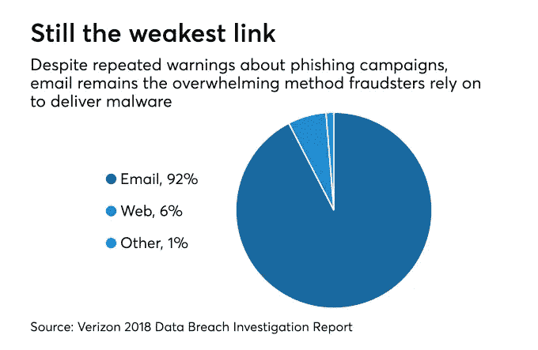
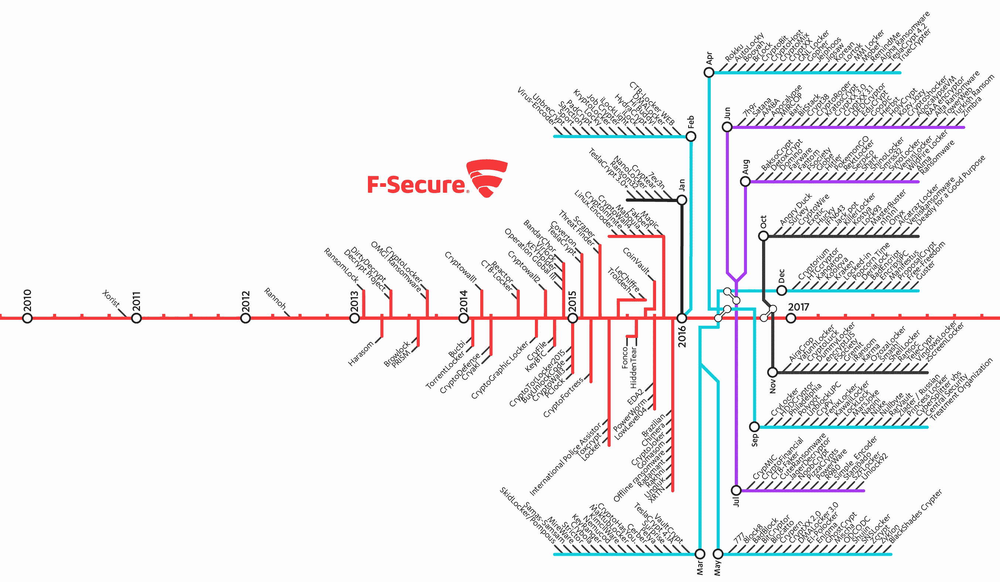
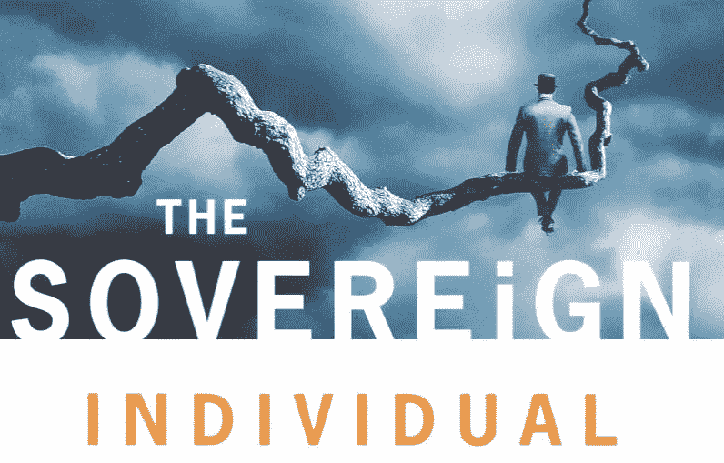

# 减少勒索软件的攻击媒介

> 原文：<https://medium.com/hackernoon/reducing-the-attack-vectors-of-ransomware-1c8d2751d08e>

Photo by [Chris Sabor](https://unsplash.com/@chrissabor?utm_source=medium&utm_medium=referral) on [Unsplash](https://unsplash.com?utm_source=medium&utm_medium=referral)

NotPetya，WannaCry 和 *BadRabbit。*

不，这些不是科切拉的头条新闻的名字(尽管你可能骗过我)。它们是 2017 年以来的勒索软件攻击的名称，迄今为止，这些攻击已导致超过 60 个国家的数百个公共和私人组织支付了数十亿美元的联合损失账单。

[如果你不熟悉勒索软件这一恶意软件分支，这里有一个来自文斯·塔宝拉的精彩深入的[解释](https://hackernoon.com/cryptography-malware-ransomware-36a8ae9eb0b9)。]

医院不得不拒绝急诊室的病人，银行客户无法取钱，主要港口无法装卸货物——这些都是因扣留运营所需的*数据*而造成的严重后果。嗯，更准确地说，首先加密这些数据，然后将解密密钥卖回给被感染的主机。

亚利桑那州冰茶背后的公司亚利桑那饮料公司(Arizona Beverages)在 2019 年 3 月受到了这样的攻击。据 TechCrunch 采访的一位消息人士称，这导致销售业务几乎陷入停顿。

> “我们每天损失数百万美元的销售额。这完全是一场闹剧。”

据怀疑，该勒索软件是通过恶意电子邮件附件发送的，已侵入他们的 200 多台服务器和联网计算机。

## 爆炸性增长

最近勒索软件种类和攻击的增长并非巧合。许多因素导致了这一点，这里有两个有趣的-

1.  被称为 *TheShadowBrokers* 的在线黑客组织获得了美国国家安全局开发的工具和漏洞的宝库，并在 2016 年和 2017 年倾销和出售它们。
2.  加密货币形式的数字稀缺发明，作为一种通过互联网(匿名和假名)转移价值和货币化安全漏洞的方式。

Image: Timeline of Ransomware Threats 2010–2017, F-Secure State of Cyber Security Report 2017

## 计算成本

对于受害者来说，勒索软件攻击的最大成本很少是赎金本身(如果支付的话)，而是对组织运营造成的损害以及恢复运营的成本。从必要的安全升级、收入损失、声誉受损和员工再培训，账单可能会迅速攀升。联邦快递、马士基(航运)和默克(制药)只是 NotPetya 袭击众多受害者中的三家，预计最终将损失总计 15 亿美元。

所有这些中最令人震惊的部分是勒索软件并不总是目标。它可能会通过将你的组织与你的供应商、客户或员工联系起来的数字管道，有组织地、不加选择地传播。此外，值得注意的是，将勒索软件推给其他组织的边际成本接近于零。无论你的公司价值几千美元还是几十亿美元(尽管预期的赎金数额会有很大差异)，对攻击者来说成本也没有什么不同。

> 信息技术正在为决定诉诸暴力的代价和回报的因素的根本转变奠定基础。
> 
> -戴维森-里斯-莫格公司

Book: **The Sovereign Individual** (1997) Touchstone

## 工业时代的教训

戴维森的开创性著作*The Sovereign Individual*&Rees-Mogg 描述了随着西方社会从工业时代向信息时代过渡，由于微处理技术的进步，已经并将继续发生的权力变化。这本书最引人注目的预测之一是，在技术日益进步的时代，制造业中的工会会消亡，这是因为工会为低技能工作勒索更高工资的战略力量下降了。

我们可以从这一时期组织所采用的策略中窥见类似的见解。工会对生产手段构成了*物理*威胁，而勒索软件对生产手段构成了*数字*威胁。对资源、员工、资产、制造、分销和声誉的破坏或损害仍然令人担忧。

【需要澄清的是，我对工会这个话题并不持有任何观点，我只是在分解一些已经被广泛采用的基本策略。]

## 保持小规模

在我们所处的时代，规模不再像过去那样提供战略优势。了解行业、地理位置和业务模式至关重要，因为规模的增加可能会导致虚拟攻击风险的增加。小公司勒索的上限较低。一个寻求赎金的坏演员只能在不破产的情况下索要一个组织所能承受的数目，否则双方都会空手而归。希望这样的演员理解基本的博弈论。一旦达到一定规模，实施一个门槛，即分成独立的部门或公司，可以减少传染。显然，一些组织只有在规模上才有经济意义。这就是为什么我们看到大型基础设施，如主要医院和市政府，继续充当有针对性的勒索软件攻击的低挂水果。

## 藏在显眼的地方

> “大多数信息技术都是高度可移植的……可以独立于地点发挥作用，并增加了思想、人员和资本的流动性。”
> 
> 戴维森-里斯-莫格公司

随着越来越多的组织发展成为核心技术公司，不受司法管辖，业务遍及全球，他们采用各种方法来满足这些新的需求。没有总部的分布式卫星办公室、自由职业者的远程劳动力、外包供应商和分销商、租赁设备和基础设施、签约服务提供商和订阅——一个组织可以存在的形式正变得不透明。这些措施结合在一起，会降低运营的数字可见性。

## 避免引人注目

一个以品牌为中心的组织以商誉的形式承载价值。善意是必须不断保护的东西，攻击者知道这一点。据透露，万豪酒店通过其子公司喜达屋，在 2014 年至 2016 年期间可能暴露了 3.27 亿个护照号码。尽管这不是由勒索软件造成的，但声誉损害仍然存在，该公司将在未来几十年试图重建信任。现在想象一下，如果同样的事情发生在国际飞石公司身上。听说过他们吗？我没有。可能是因为他们不需要我为了成功而知道他们是谁。但是，他们在 2017 年实现了 290 亿美元的收入，总部设在纽约，所有这些在 twitter 上的粉丝不到 1.5 万人。作为一家后台金融服务机构，他们不需要在互联网上大喊大叫来创造业务。成为他人终端产品机器中运转良好的一个齿轮，或者生产一种可以贴上白色标签的产品或服务，会极大地减少这种载体。

## 包扎

希望您现在已经基本掌握了勒索软件攻击的方法、规模和目标漏洞。一个组织越大、越明显、越根深蒂固，攻击者就越容易识别、找到并选择该组织作为目标。牢记这一点，战略性地建立组织可能有助于随着时间的推移减少或避免这种威胁。

Photo by [Austin Distel](https://unsplash.com/@austindistel?utm_source=medium&utm_medium=referral) on [Unsplash](https://unsplash.com?utm_source=medium&utm_medium=referral)

## 参考

1.  Tabora，V. 2018，“密码学+恶意软件=勒索软件”，*黑客正午*，4 Jun

 [## 密码学+恶意软件=勒索软件

### 当你把密码学和恶意软件结合在一起时，你会遇到一系列非常危险的问题。这是一种计算机病毒…

hackernoon.com](https://hackernoon.com/cryptography-malware-ransomware-36a8ae9eb0b9) 

2.Albrecht，M. 2017，*2017 年网络安全状况报告，* F-Secure，*p . 41 .[www . F-Secure . com/documents/996508/1030743/Cyber-Security-Report-2017](https://www.f-secure.com/documents/996508/1030743/cyber-security-report-2017)*

*3.Whittaker，Z. 2019，“亚利桑那州饮料公司被勒索软件攻击下线”， *TechCrunch，*4 月 2 日*

* [## 亚利桑那州饮料被勒索软件攻击下线

### 美国最大的饮料供应商之一 Arizona Beverages 在遭受大规模勒索软件攻击后正在恢复中…

techcrunch.com](https://techcrunch.com/2019/04/02/arizona-beverages-ransomware/) 

4.2018 年*威瑞森 2018 年数据泄露调查报告*，【https://enterprise.verizon.com/resources/reports/dbir/】T2

5.戴维森，J.D .和里斯-莫格，W. 1997，*主权个人*，试金石，第 156-182 页

6.多布什，G. 2018，“喜达屋数据黑客:万豪表示将支付新护照”，*财富，*12 月 4 日

 [## 喜达屋数据黑客:万豪称将支付新护照的费用

### 3.27 亿客户的护照号码可能已经在数据泄露中暴露

fortune.com](http://fortune.com/2018/12/04/starwood-hack-marriott-new-passports/) 

阿尼尔偶尔会在网上写些文字，因为他是一个真正的人类，绝对不是人工智能。他喜欢各种各样的活动，并以食物的形式消耗营养。他住在加拿大 a̶w̶s̶̶a̶s̶h̶b̶u̶r̶n̶̶d̶a̶t̶a̶̶c̶e̶n̶t̶e̶r̶。*