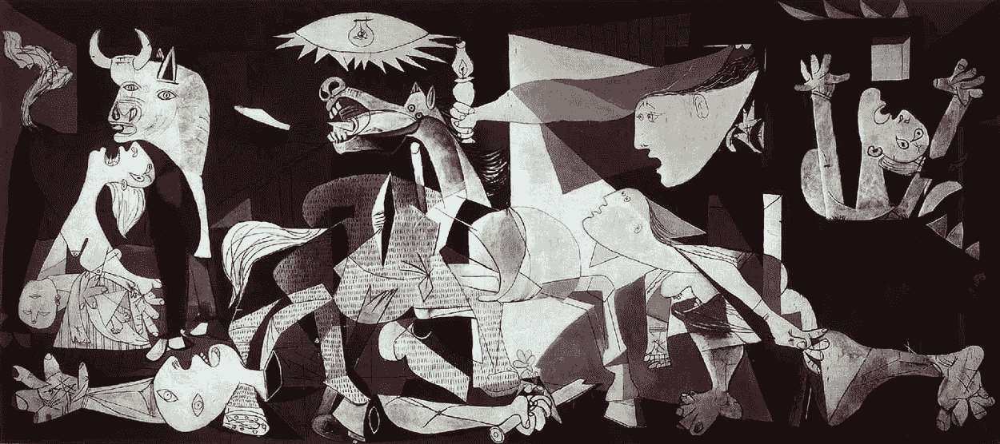

# 重新评估我们对比特币的价值

> 原文：<https://medium.com/hackernoon/reevaluating-how-we-value-bitcoin-1395c5484fa4>

## 阅读 [Daniel Sangyoon Kim](https://hackernoon.com/@danielsangyoonkim) 的[全文](https://hackernoon.com/fundamentally-valuing-bitcoin-at-45-000-btc-a7f171521ae6)

> “我将尝试提炼货币理论，帮助你从根本上理解货币和比特币的价值。”

阅读[全文](https://hackernoon.com/fundamentally-valuing-bitcoin-at-45-000-btc-a7f171521ae6)作者 [Daniel Sangyoon Kim](https://hackernoon.com/@danielsangyoonkim) 。摘录:

# 美元是如何估值的？

*“快速回答:MV=PQ。*

*长答案:有了美元，政府就扩大和收缩货币供应。*

请记住，政府扩张和收缩货币供应量“M”。美联储的目标是价格稳定和生产率提高，这意味着他们希望随着生产率的提高增加货币供应量。”

# 黄金是如何估值的？

*:黄金在交易所的交易价格由以下因素决定:1)珠宝和其他用途(如电子产品)对黄金的需求，以及 2)可用于此类用途的黄金供应量(即不在储备中的供应量)。需求和供给，就这么简单。*

# 到底什么是内在价值？

*“在这一点上，有必要澄清什么是内在价值。*

如果你知道一家公司未来 100 年的一切——收入、利润率、现金流、利率等——你就能得出一个完美的估值。"

# 菲亚特有内在价值吗？

“从技术上讲，菲亚特没有内在价值。它的价值来自于每个人都接受它作为交换单位，之后我们可以通过 MV=PQ 对它进行估价。如果不是因为它被接受为交易方式这一唯一事实，菲亚特美元与郁金香、豆豆娃或比特币并无太大区别。”

# 基本面投资者的结论

历史上许多最成功的投资者都反对持有比特币。这份名单中包括著名的宏观投资者乔治·索罗斯(George Soros)和斯坦利·德鲁肯米勒(Stanley Druckenmiller)，他们“打破了英格兰银行”对英镑的押注(并在此过程中为自己赚了数十亿美元)。这些都是货币方面的专家，所以听听他们的想法是有意义的。”

# 比特币仍然可以作为一种价值储存手段

*“比特币就像毕加索的杰作。正如我们知道毕加索的艺术品永远不会跌至 10 美元，鉴于比特币的知名度和全球影响力，我们可以相当肯定比特币不会再跌至 10 美元。”*

> “我认为，历史记录表明，老白人对他们不了解的新技术嗤之以鼻。”—马克·安德森

# 外卖食品

1.  ***我相信投资比特币是为了对冲菲亚特天启的几率。*** *它将在资产类别中作为一种金融对冲占据一席之地，类似于黄金(2008 年期间黄金或多或少保持稳定，而美国股市下跌了 40%)。当然，我认为，正如上文所解释的那样，黄金估值的实际机制与比特币截然不同。*
2.  我可以相当自信地说，由于对菲亚特将如何以及何时倒闭的预期不断变化，BTC 将继续动荡不安。 *而波动性会使其难以作为交换单位使用。*
3.  ***BTC 不会实现主流的事务性使用。随着脸书 Libra coin 的推出，这一点变得更加真实，Libra coin 将抢走比特币在新兴市场的机会。它是一种稳定的交易性加密货币，由一篮子法定货币支持。***

# 那么应该拥有比特币吗？

*“我的推荐？将你 1%的资产持有为比特币，没有比你能承受的波动损失更大的了。我个人不遵循自己的建议，但那是以后的事了。”*

## 在[黑客正午](https://hackernoon.com/)阅读[丹尼尔·桑云金](https://hackernoon.com/@danielsangyoonkim)的[全文](https://hackernoon.com/fundamentally-valuing-bitcoin-at-45-000-btc-a7f171521ae6)。

## 此外，查看[顶级黑客午间故事](https://hackernoon.com/editors-top-tech-stories/home)了解[脸书为何创造天秤座](https://hackernoon.com/facebook-has-found-a-place-to-park-its-40bn-cash-reserves-and-everyone-thinks-its-about-crypto-247e7b9c27a5)、[网飞 vs 苹果将如何成功](https://hackernoon.com/netflix-vs-apple-what-happened-and-how-google-play-could-capitalize-1ea94defbce6)、[以太坊开发如何变得更容易](https://hackernoon.com/ethereum-just-got-easier-to-develop-on-e78d6fbbe291)以及[83 家风险投资公司如何使用数据、人工智能&专有软件来推动阿尔法回报](https://hackernoon.com/winning-by-eating-their-own-dogs-food-83-venture-capital-firms-using-data-ai-proprietary-da92b81b85ef)。

直到下一次，

[黑客责任](https://hackernoon.com/@hackerhodl)