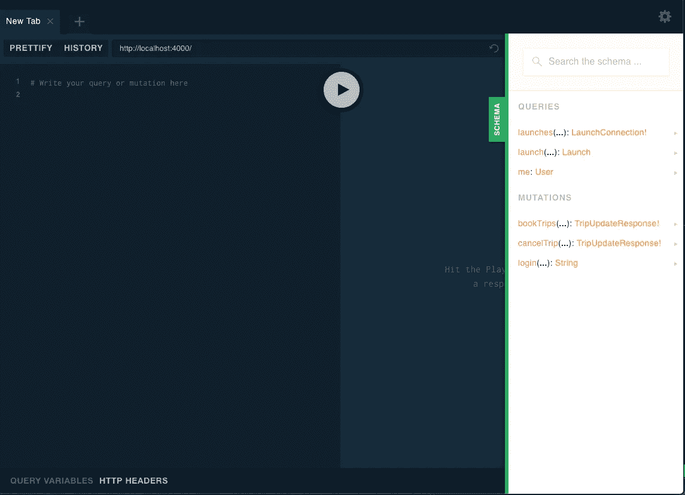
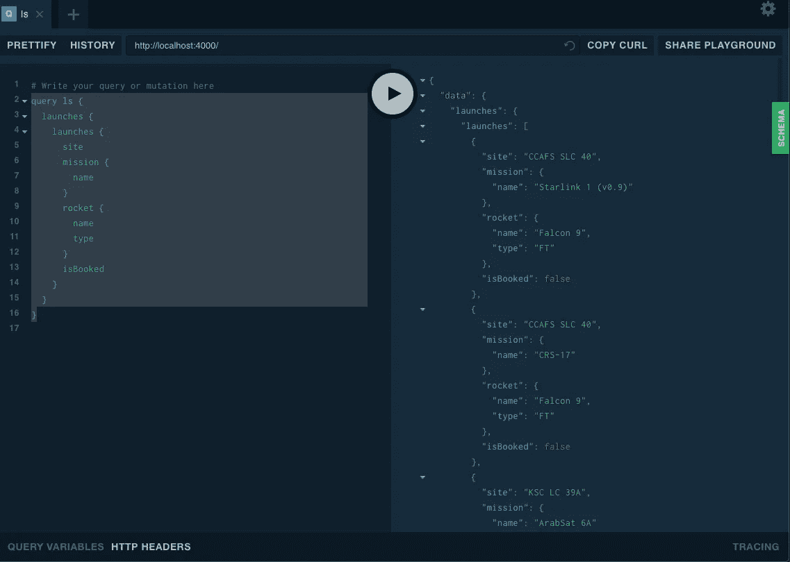
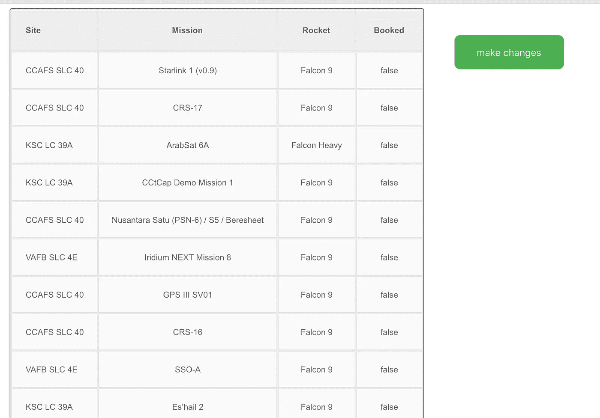
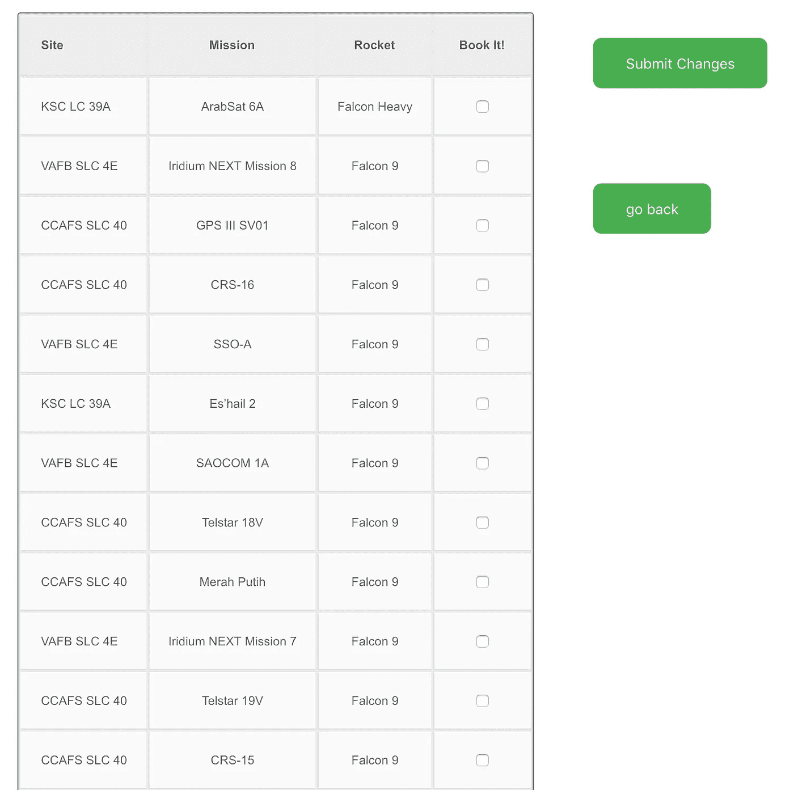

# Apollo 的 GraphQL 客户机的检索策略

> 原文：<https://medium.com/hackernoon/refetch-strategies-for-apollos-graphql-client-248a449734cd>

## 有几种方法可以重新提取数据。在本文中，我们通过示例来探究它们。


# 设置

在[用 Apollo-Boost](https://hackernoon.com/giving-react-a-lift-with-apollo-boost-74c6ff32894d) 提升 React + GraphQL 中，我演示了如何快速启动和运行 React 应用程序，然后如何整合来自 [apollo-boost](https://www.npmjs.com/package/apollo-boost) 的 ApolloClient React 组件。在撰写本文时，我使用 Apollo Launchpad 服务创建了一个 GraphQL 服务器实例，但现在它已经寿终正寝了。这次我将安装并运行来自 [Apollo GraphQL 教程](https://www.apollographql.com/docs/tutorial/introduction)的 GraphQL 服务器。下面是让该服务器运行的步骤:

```
git clone [https://github.com/apollographql/fullstack-tutorial/](https://github.com/apollographql/fullstack-tutorial/)
cd fullstack-tutorial/final/server
npm install
npm run-script start:ci
```

成功后，您将会看到:

```
$ npm run-script start:ci
...🚀 app running at [http://localhost:4000/](http://localhost:4000/)
```

服务器必须在本地运行，我将要介绍的应用程序源的各个分支才能正常工作。

# 该应用程序

我忽略了 Apollo 教程附带的客户端，用我自己的替代。在本文中，我将遍历我的 GitHub 库的几个分支，在本文的最后有每个分支的链接。

在开始之前，先在浏览器中查看一下位于 [http://localhost:4000](http://localhost:4000) 的 GraphQL 模式:



从操场上，我可以查询`launches`:



到目前为止，一切顺利。现在是时候搭建一个 app 了。在前面提到的文章中，React 应用程序是由 [create-react-app](https://facebook.github.io/create-react-app/docs/getting-started) 生成的。在这里，我会做同样的事情:

```
npx create-react-app apollo-refetch
cd my-app
npm start
```

一旦所有东西都被加载并且服务器正在运行，您将看到一个原子的旋转图形。不错，但是没用。在替换该图形之前，我需要安装 GraphQL 和 Apollo 的 react 工具:

```
npm i apollo-boost graphql react-apollo -S
```

现在我们准备好出发了。

# 第一步:查询组件

我将首先创建一个名为**launchs 的组件。**这将替换在 apollo-boost 生成的应用的`src/App.js`中找到的应用组件的内部。

这产生了(在一些偷来的 CSS 的帮助下):



此初始页面将是只读视图。我添加了一个按钮，该按钮将导航到一个编辑器页面，以便可以对启动列表进行更改。

# 下一步:编辑器组件

编辑器组件看起来很像发布列表，但是有一个用于预订一个或多个发布的控件。



编辑器代码有一个类似于 Launches 页面的查询，还有两个变化，一个用于登录，另一个用于更新任务预订。

全栈教程中的服务器应用程序要求在授权预订之前登录。出于我的目的，我将从 [faker](https://www.npmjs.com/package/faker) 生成一封随机的登录电子邮件，执行登录，获取 auth 密钥，然后确保我的 Apollo 客户端实例知道它以用于后续请求:

Full source code links at bottom of this post.

它有一些问题。如果你去编辑页面，预订一两个航班，然后点击提交，它可能看起来没问题。但是，页面应该只显示未预订的航班，所以一旦执行了变异，您预订的航班应该会从列表中消失。此外，如果您返回到起始页，航班仍将显示为未预订。问题是，在您没有告诉它们的情况下，突变不会重新提取数据，如果没有重新提取，React 组件将不会重新呈现。

有几种重新提取数据的技术，这就是本文的其余部分。

# 查询/检索

最简单的重取场景是当组件既查询又变异时。该组件首先查询以填充比如说一个项目列表；然后，组件中有一个控件触发一个突变操作，比如添加/删除/修改一个或多个项目。一旦执行了突变，就通过重新提取数据来更新组件。

编辑器就是这样一个组件:

查询子组件(从 apollo-client 导出)包装了前面显示的提交组件，其中包含一个 Mutate 组件。

在这种情况下，如果我想更新列表，使它不再显示我刚刚预订的航班，我可以使用查询组件提供的`refetch`函数:

```
<Query query={LAUNCHES}>
      {({ data, loading, error, **refetch** }) => {
...
            <Submit refetch={refetch}/>
```

现在，当 Submit 执行变异时，它可以在之后重新提取:

```
const submitChanges = (evt, mBook, refetch) => {
  const bookingElems = document.getElementsByName('booking')
  const bookedAry = [];if (bookingElems.length) {
    bookingElems.forEach(booked => {
      if (booked.checked)
        bookedAry.push(booked.id)
    });
    mBook({variables: {ids: bookedAry}})
    **refetch();**
  }
}const Submit = (props) => {
  const {**refetch**} = props;
... return <Mutation mutation={BOOK}}>
         {mBook => (
            <input type="submit" value="Submit Changes"
              onClick={evt => submitChanges(evt, mBook, **refetch**)} />
          )}
        </Mutation>
```

一切都很好，但是查询必须包含变异才能工作。的确，您可以将查询返回的 refetch 方法存储在某个 React 状态结构或 React 挂钩中，但还有另一种方法。

# refetch 查询

变异本身可以指导查询的重新提取，这又会更新显示查询结果的组件。

## 按查询名称进行变异重取

应用程序中有两个命名查询:`ls`和`bookie`。ls 查询用于 Launches 页面，bookie 查询用于 Editor 页面。

```
// Launches.js
const qLaunches = gql`query ls {
  launches {
    launches {
      id
      site
      mission {
        name
      }
      rocket {
        name
        type
      }
      isBooked
    }
  }
}`;// Editor.js
const LAUNCHES = gql`
query bookie {
  launches {
    launches {
      id
      site
      mission {
        name
      }
      rocket {
        name
        type
      }
      isBooked
    }
  }
}`;
```

注意到相似之处了吗？因为它们本质上是不同伪装下的相同查询，所以 Apollo 的缓存将使我将要演示的一些内容变得多余，但是概念是合理的。

我可以让突变组件[调用我想在突变完成后更新的查询](https://github.com/JeffML/apollo-refetch/tree/editorRefetch1)，而不是像传递烫手山芋一样传递`refetch`。

```
const Submit = (props) => {
...
        return <Mutation mutation={BOOK} **refetchQueries = {['ls', 'bookie']}**>
          {mBook => (
            <input type="submit" value="Submit Changes"
              onClick={evt => submitChanges(evt, mBook)} />
          )}
        </Mutation>
```

这将更新编辑器和启动页面。(实际上，由于我提到的缓存问题，更新一个会更新另一个。)

## 通过带有查询变量的完整查询进行的变异重取

只要我没有必须传递给查询的变量，上述技术就没问题，但是如果我传递了变量，还有另一种语法:

```
... refetchQueries = {[{
        query: ['GetCollectionByUserId'],
        variables: { userId : userId, first : :"Joe", last : "Friday"
    }]}
```

如果你不熟悉 GraphQL 查询变量，这里有一个例子。

refetchQueries 技术的一个问题是，很难确定哪些突变会影响哪些查询。如果我要为一个大型项目编写一个新的突变组件，我会知道哪些查询受到影响吗？

# 投票

保持查询组件新鲜的另一种技术是通过轮询。查询组件可以接受一个`pollInterval`属性，以毫秒为单位。

```
export default function Launches(props) {
  const {setEditing} = props;return (
    <Query query={qLaunches} **pollInterval={1500}**>
      {({ data, loading, error }) => {
        if (loading) return <p>Loading...</p>;
        if (error) return <p>ERROR</p>;
        return (
          <Fragment>
            <input type='button' value='make changes' onClick={() => setEditing(true)}/>
            <table style={{ border: 'solid 1px' }}>
              <tbody>
                <tr>
                  <th>Site</th><th>Mission</th><th>Rocket</th><th>Booked</th>
                </tr>
                {launchRows(data)}
              </tbody>
            </table>
          </Fragment>
        );
      }}
    </Query>
  );
};
```

然后，查询组件会不时刷新。如果监控实时事件，这可能非常方便，但是大量的轮询操作会影响网络性能。

# 捐款

最后，GraphQL 提供了订阅功能，我之前已经[写过关于它们的文章](https://hackernoon.com/graphql-subscriptions-using-apollo-2-3eb3184768c4)。如果您对轮询不感兴趣，并且将查询和变化连接在一起似乎很难维护，那么拥有一个在订阅事件发生时刷新查询的订阅服务(如前所示，通过调用 refresh()方法)可能有其优势。

需要建立一点连接来实现这一点:基本上是从`subscribe`事件到查询`refresh()`方法的映射。与轮询相比，网络流量可能会减少，但代价是增加了到服务器的套接字连接。

# 源代码

*   平原，不辞职工作编辑:[https://github.com/JeffML/apollo-refetch/tree/editor](https://github.com/JeffML/apollo-refetch/tree/editor)
*   带 refetch 和 refetchQueries 的编辑器:[https://github . com/JeffML/Apollo-ref etch/tree/editorrefetch 1](https://github.com/JeffML/apollo-refetch/tree/editorRefetch1)
*   查询轮询间隔:[https://github.com/JeffML/apollo-refetch/tree/polling](https://github.com/JeffML/apollo-refetch/tree/polling)