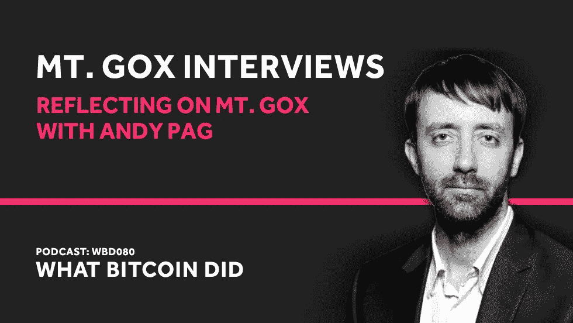

# 与安迪·帕格一起思考戈克山

> 原文：<https://medium.com/hackernoon/reflecting-on-mt-gox-with-andy-pag-d68cac57cba6>

## 音频采访转录— WBD080

***注:*** *以下是我采访记者安迪·佩奇的笔录。我已经检查了转录，但如果您发现任何错误，请随时发送* [*邮件给我*](http://hello@whatbitcoindid.com) *。可以* [*在这里*](https://www.whatbitcoindid.com/podcast/reflecting-on-mt-gox-with-andy-pag) *听原声录音。*

*你可以在这里订阅播客* [*听所有剧集*](https://www.whatbitcoindid.com/podcast/) *。*

在与 Mt. Gox 相关的系列采访的最后部分，我采访了 Mt. Gox Legal 的创建者和当选管理人 Andy Pag。我们回顾了我的谈话，杰德和马克、科因拉布和布洛克·皮尔斯之间的历史。

联系比特币做了什么:
听:[**iTunes**](https://itunes.apple.com/gb/podcast/what-bitcoin-did-podcast-bitcoin-crypto-trading-strategy/id1317356120?mt=2)|[**Spotify**](https://open.spotify.com/show/0mWUJuONiilW5JSBBFZ0s7?si=5qcbjpjYSRyKpi8wycEZUw)|[**Stitcher**](https://www.stitcher.com/podcast/what-bitcoin-did)|[**SoundCloud**|](https://soundcloud.com/what-bitcoin-did)[**YouTube**](https://www.youtube.com/whatbitcoindid)|[**TuneIn**](https://tunein.com/radio/What-Bitcoin-Did-p1079869/)关注: [**网站**](https://www.whatbitcoindid.com/)

# **采访记录**

**面试日期:2019 年 2 月 22 日星期五**

> **“这是一大笔钱，可能会对许多人的生活产生相当大的影响。看到这一切实现，看到人们得到他们期待已久的意外之财，这将是一个非常美好的故事。”**
> 
> **—安迪·佩奇**

**彼得·麦科马克:你好，安迪。你好吗？**

**[**安迪·佩奇:**](https://twitter.com/andybutshorter) 很好。非常感谢你邀请我参加你的播客。**

**[**彼得·麦科马克:**](http://www.twitter.com/PeterMcCormack) 不用担心，谢谢你的到来。事实上，这是相当多的几个星期，非常忙碌，我现在感觉到的事情之一是，我几乎想再做一次，因为我获得了如此多的信息，我有如此多的其他问题想问人们，但我想这只是这种权利的性质？这是一个又大又深的兔子洞。**

**[**安迪·佩奇:**](https://twitter.com/andybutshorter) 是的，我认为这是新闻工作的流程，也是为什么“回复权”如此重要的原因，因为它帮助你越来越深入地了解你所看到的任何事情的细节。听着，在我们继续下去之前，我私下对你说过，但我只想代表 Mt. Gox 各地的债权人公开说，非常感谢你在过去的一周内做了这么多工作，做了这么全面的工作，把这些播客放在一起。我认为对于许多债权人来说，他们将获得许多新信息，我认为对于几乎每一个债权人来说，他们都是第一次学习一些东西，这是一件非常非常有价值的事情，非常感谢！**

**[**彼得·麦科马克:**](http://www.twitter.com/PeterMcCormack) 哇！让我来问你一些关于这个的问题，因为，我还没有考虑那么详细，我假设所有的信息都在那里，但是我猜，它不是吗？那么，这给债权人带来了什么之前没有公开的好处呢？**

**[**Andy Pag:**](https://twitter.com/andybutshorter) 我认为很多被掩盖的东西都在不同的小口袋里。我认为可能人们有选择性地选择看到一些部分，而忽略其他部分。但我认为你对杰德的采访，我认为你有一些真正的，令人大开眼界的东西。我是说我在圣诞节前和杰德聊过一会儿。我为《星期日泰晤士报》的一篇文章接受采访，他告诉了我一些事情，我认为这是一种认罪，或者肯定让他对自己在其中的角色有疑问。最后，我写的那篇文章，我真的没有机会继续下去。**

**但我想他对你说过类似的话。我认为他更谨慎一点，可能有时间反思他说的话，重新评估。我认为他更谨慎一点，但尽管如此，我认为那次采访给我留下深刻印象的是，我认为那里可能有一些责任的承认，这是以前从未公开过的。**

**彼得·麦考马克: 是的，我想是有的，当时我并没有过多考虑，因为我做这个采访的时候，时间比其他所有的采访都要早。我在旧金山，有人做了介绍，问我“我想采访杰德吗”，我说是的。只是想了解一下 Mt. Gox 的背景。大约一年前，我试图采访马克，但从未成功。**

**所以我们接受了采访，没有想太多，回到英国，然后一些事情又开始出现在媒体上。所以我联系了马克。他答应了。然后我想，好吧，让我们看看我是否能召集一些人来讨论这个问题。一切都来得很快。我几乎没有足够的时间去研究。我跟你谈了我对布洛克·皮尔斯的采访，今天晚些时候会直播。我不得不提前一天，因为我飞到日本去采访马克，我没有足够的时间准备，有几次我肯定是捉襟见肘，或者陷入了我不能清晰表达问题或不知道我想问的问题的境地。**

**所以从某些方面来说，我几乎想在某个时候写一篇文章，但也就是说，我们已经说过这个节目将是一个反思，所以也许我们可以在彼此之间来回跳跃我的一些想法。我知道有几件事我们需要先了解一下。我们需要了解一下你的背景，很明显，在过去的几天里，Reddit 上发生了一些事情。所以我想问你这个问题，给你一个回答的机会。但是在我们开始之前，你能解释一下你的背景和你在 Mt. Gox 中的角色吗？很明显，我读过你想买下那处房产的故事，但请告诉我你在 Mt. Gox 的背景，然后告诉我你是如何与 Mt. Gox legal 有如此密切的关系的。你能告诉我背景故事吗？**

**[**安迪佩奇:**](https://twitter.com/andybutshorter) 耶。所以我认为我在 2013 年初发现了比特币，并认为这听起来很有趣。我真的没有做太多，然后价格开始上涨，我想，好吧，我真的错过了这里。我必须坐下来，有点明白这是如何工作的，我认为当时对我来说最大的吸引力不是崩溃，2008 年的崩溃在我脑海中仍然有点新鲜，这种技术解决方案承诺坚持银行家和民主化的钱，这一切听起来很棒。我想，好吧，这肯定值得一掷，所以我投了一点钱在比特币上。**

**我做了一些调查，Mt. Gox 是最大的交易所，因此，我认为它是最可信的。我当然意识到交易所经常遭到黑客攻击等事实。所以我电汇了一些钱，用它买了一些比特币。我是一个真正的霍德勒，我只是会时不时地看看它，然后价格就变得绝对疯狂，这是一个可爱的感觉。我记得大约有三四个月的时间，它每天都越来越值钱，我有一种自豪感，我有点向我的家人和朋友吹嘘它，他们会问“哦，是吗，你今天赚了多少钱？”它真的是乘风破浪。这是多么令人兴奋的感觉啊！**

**然后我认为价格见顶，开始下跌，我不知道该怎么办。接下来你知道 Mt. Gox 停止取款，然后它完全关闭。我真的震惊了好几天，只是一次又一次地重新加载 Mt. Gox 网页，出现了错误消息，没有人知道发生了什么，Reddit 疯狂地提出各种疯狂的理论。然后基本上在那之后坐下来，看着它又展开了四年，有些时候你几乎忘记了它，当然也放弃了它。**

**然后是比特币的价格，大概是在 2016 年底，2017 年，价格开始攀升，我想是马克在论坛上说，“看，你们需要得到法律建议，因为如果这超过 2500 美元，那么就有盈余”。马克告诉人们，盈余应该给股东，而不是债权人，你们需要聚在一起，获得一些法律咨询，并找出该怎么办。我在英国工作，我对日本的律师了解多少？当然，它们非常贵。**

**我作为一名记者的日常工作有点帮助，因为我的个人资料很少，但尽管如此，人们可以抬头看看我，看看我是谁，看看我真的存在。所以我可以利用这一点在 Reddit 论坛上建立一些人之间的信任，一个小的核心团队，我们聚在一起，决定，让我们大家凑 100 美元，看看我们能否让这个律师看看。我想我们的目标是筹集 1 万美元作为第一笔律师费。我们在一天之内就拿到了，然后又是一系列的法律费用，另一种是 30000 美元。我们在一周内完成了这一切，这太棒了！我认为很多人真的渴望在这里得到一些正确的答案，而不是 Reddit 上正在发生的疯狂。**

**通过这种方式，我们能够从这位日本律师那里获得法律意见，他是日本四大律所之一的顶级破产律师之一。通过这个我们可以看出，好吧，在破产的情况下，这些是规则。这是法律规定的。受托人能做的只有这么多，他的手被绑住了。如果有盈余，他必须将盈余返还给股东，即马克和杰德，但还有一个叫做民事赔偿的过程。这是前所未有的。当然不会达到这个规模，但这可能意味着债权人可以分享收益。但即使这样，也很复杂，因为当你从破产走向民事赔偿时，没有人会吃亏。如果你有比特币债权，你的比特币债权，在破产的情况下，只值 400 美元，450 美元，480 美元，不管是多少日元。**

**当你把它转移到民事赔偿，你可以用不同的方式评估你的索赔，你的价值就会增加。但是，如果你有一个法定索赔，你的价值下降，或者它会。因此，我们必须整理一大堆文件，提交给受托人和法院，告诉他们，“我们作为比特币债权人，不反对法定债权人在民事诉讼中获得 100%的债权，就像他们在破产时一样”，如果我们进入民事诉讼，即使我们作为比特币债权人，在比特币方面可能会得到更少。即使只是谈论它，我对它了如指掌，即使只是谈论它，我也会感到困惑。但本质上这是一个相当困难的过程，因为所有的债权人都必须得到平等对待，我们通过民事修复所做的事情实际上是在这一点上有点忽悠，但我们已经表明比特币债权人同意允许这种忽悠，以便能够推动这一点，因为最终这符合每个人的利益。**

**所以这个过程正在进行中。有趣的是，每个人都在不断提到民事诉讼已经尘埃落定。还没有完全结束。6 月份发生的事情是，受托人批准启动民事赔偿，这是一个他不得不再次提出索赔的过程。所以每个人都可以再提交一次申请。然后，他评估所有这些索赔，然后向法院提交所谓的 CR 计划，供法院批准。**

**现在，任何人都可以提交民事康复计划，在这个截止日期结束时，我想是在 4 月底，受托人将提交该计划，其他任何人都可以提交民事康复计划。债权人对此进行投票，如果任何计划获得超过 50%的投票，那么它就会获得批准。因此，从我们的角度来看，我们非常担心，提交的计划越多，任何一个计划获得一致同意的可能性就越小。已经有一些人不知道或者不理解投票的重要性，这是一种自然的浪费。**

**所以我一直在做的和我们小组一直在做的是努力确保所有的利益相关方都在游说受托人去影响他将要加入的单一计划。而不是试图分支说，“好吧，去他的，我要提出我自己的计划”。所以这对债权人来说非常重要，因为这还不是一个确定的交易。很重要的一点是，我认为只有一个计划可以推进，我们正在游说受托人，告诉他们这就是债权人希望你加入这个计划的原因。因此，当投票的时候，不会有任何混乱，我们不会最终没有批准民事恢复计划，因为在这种情况下，我们会回到破产，这意味着我们不是获得所有资产的百分比份额，而是作为比特币债权人，我们只能获得每比特币 485 美元。**

**目前的价格还不到民事赔偿的一半。因此，比特币债权人有很大的利益来确保这一过程继续下去，无论是从数量上还是从价值上，比特币债权人都是整个破产程序的绝大多数。这是我们 Mt. Gox Legal 正在做的事情之一。另一个非常重要的问题是僵尸索赔的想法，我称之为，所谓的自我评估索赔。因此，根据民事赔偿规则，受托人有义务确保每个可以索赔的人都有代表，即使他们没有及时提出索赔。**

**这意味着他将查看数据库，并为每个人生成索赔，即使他们实际上没有提交索赔。对于所有没有提出索赔的人，他将为他们保留 10 年的资金，如果他们在此期间没有提出索赔，他将把这笔钱交给日本财政部。现在这些加起来大约占总价值的 10-20%。因此，实际上，这是所有比特币索赔的 10 %- 20 %,而我们希望确保所有债权人都有公平的机会提交索赔。我们不想看到 10-20%的价值流向日本政府。**

**因此，我们与律师一起做的事情之一是，我们对自我评估索赔提出异议，以试图阻止这一过程。然后，我们目前正在做的第三件大事，实际上还有更多，但我们目前正在做的第三件主要事情是非常认真地研究 Coinlab 的声明，并试图理解围绕它的动力是什么。现在，作为债权人，我认为丑陋的事实是，我们真的没有什么可以做的。信托，我们可以向受托人提出交涉，但受托人有义务平等对待所有债权人。即使那些没有被批准的声明，像 Coinlab 的声明目前已经被拒绝，所以这是一个未批准的声明。**

**但是现在有一个过程可以完成，这个过程会给债权人带来很多问题。首先，这是一个可能需要四五年时间的过程。第二，取决于这一过程如何展开，它可能会在此期间推迟对债权人的任何分配。现在有几个因素，在这个时候，我们作为债权人所能做的就是，试图抓住这些因素，以便我们可以计划可能发生的事情。我接触的一些人正计划采取法律行动，希望能影响结果。**

**但是说实话，我对这种可能性并不乐观。我是说，你还没在你的播客上和彼得·韦森斯说过话。我并不支持他的观点，但这可能值得我提出这个论点，供维斯纳人使用，所以你可以明白为什么这是一个如此困难的问题。我有意识，我只是在不间断地说话。所以，如果我正在漫无边际地说，请随意开始吧！**

**彼得·麦科马克: 关于彼得·韦森斯，有趣的是，我曾多次试图联系他。事实上，一年前，当我看到马克的《AMA》时，我在上面贴了一张纸条，上面写着，“看，我很乐意让你上播客”。马克回复说，“好的，他会给我发邮件的”。然后有人找到我采访彼得。我想是某个负责他公关沟通的人，我回复说，“是的，当然，我很乐意这么做”。然后什么都没发生，然后显然这些采访发生了。我很乐意让彼得接电话。我认为我是一个公正的采访者。我想我会给每个人一个公平的机会。我认为现在这是故事的重要部分。**

**[**安迪·佩奇:**](https://twitter.com/andybutshorter) 抱歉打扰了，那是什么时候？那是多久以前的事了？**

**彼得·麦科马克: 嗯，如果你认为他是在去年三月或四月跳 AMA 的话。他们很快就取得了联系，非常接近飞往我想是西雅图或其他地方去做这件事。然后不管什么原因都没有发生，我想可能是因为我想先做马克的采访，然后马克的采访就没有发生。所以就没发生。现在我已经给彼得发了邮件，我知道他已经看到了或者有人看到了，因为我用的是一个叫 Polymail 的邮件客户端，它会告诉你什么时候有人读了。所以这些邮件已经被他或其他人看过了。我不知道。但是一直没有回复。我不知道他是否在听这些。我希望他能来。我希望你能讨论一下。我不知道他在法律上是否可以。我不知道，因为这是一个法律案件，他是否可以…**

**Andy Pag: 我怀疑，从法律上来说，把任何可能影响这一大笔钱的结果的信息公之于众不符合他的利益。所以我怀疑他明智地遵守了自己的忠告。**

**[**彼得·麦科马克:**](http://www.twitter.com/PeterMcCormack) 还有，舆论的法庭是坚决反对他的。我还没见过或说过一个人认为他的说法有任何根据。我试着对它保持中立。我可以试着说，“听着，我知道他确实有某种协议。他没有汇款许可证，但他确实有一份协议”。我不知道当时发生的细节。**

**安迪·佩奇: 是的，我认为你说得完全正确。这是公众意见的法庭，这是公认的智慧，我一直在努力研究它，以获得更多的细节，我认为总的来说，这可能是正确的立场。**

**然而，值得知道的是，彼得·韦森斯的律师是基于偶然性的律师。因此，他们看了这个案例，并决定，看这里有一些可以获胜的因素，我们将在这方面投入时间和精力。如果他们觉得没有充分的理由，他们是不会这样做的。有几个因素他们可能认为是可以赢的。一个是在合同中有一个清算损害赔偿条款，基本上是说如果你退出这个合同，你必须付给对方 5000 万美元。**

**这是在合同中作为对人们离开的威慑，清算损害赔偿通常是美国法院判决的方式，这是我被告知的，是你在合同中加入了一个巨大的数字，但实际上当涉及到争夺它时，法官会说，“嗯，很明显，你并没有真正损失 5000 万美元，你得到了这么多”。但公平地说，这是白纸黑字，每个人都签了字的合同，清算条款也在里面。日本律师可能会从稍微更字面的意义上看待这个问题，就像他们在美国案件中所做的那样。**

**然后是他们案件的第二个方面，根据我所理解的合同，美国客户应该支付费用，而 Mt. Gox 从未向 Coinlab 支付这些费用。所以他们可能觉得这是另一个可以赢的方面。然后还有一大堆其他的废话，那就是彼得·韦森斯想要建立一个比特币交易所，并诅咒道，如果没有遇到马克·卡佩斯的那一天，他就会是坐在像比特币基地这样大的企业顶端的家伙，因此马克·卡佩斯(Mt. Gox)欠他的。委婉地说，这是相当投机的。但这只是索赔的一小部分，最终总计 160 亿美元，这只是一笔令人厌恶的金额。**

**彼得·麦科马克: 嗯，比特币基地甚至不值那个价！**

**安迪·佩奇: 是的，我想我们已经从几个不同的角度看了这个问题，做了所有你能做的脑力、数学体操，尝试去哪里可以增加收入…仍然很难理解他是如何达到 160 亿美元的。有几个法律策略原因可以解释他们为什么会得出这个数字。一是它比整个遗产都大，因此阻碍了分配。**

**因此，如果他们回来说，“嗯，我们的索赔是 5000 万美元的清算损失和 2500 万美元的未付费用”。受托人可能会说，“好吧，我们会争论这个问题，但我们会留出一些钱来弥补损失，同时我们会将剩余部分分配给债权人，他们将获得临时分配”。但是回来说，我们想要 160 亿美元，受托人不能把 160 亿美元放在一边，因为什么都没有了。因此，它使这个案件成为优先事项，这意味着在这个问题得到解决之前，其他任何事情都不能动。在日本将要发生的过程是，首先，他们提交一份他们已经完成的索赔，受托人会看一看。被拒绝了。**

**然后他们进入这个叫做评估的过程。我认为这有点像仲裁，我认为有第三方监督这一过程，而不是真正的裁决。我不太清楚它是如何运作的，但在破产的情况下，这是一种公平的方式，公共领域中有与相关案件相关的文件，以及与他们正在处理的相关案件相关的部分文件。**

**我认为，我对这一最终将被淘汰的事实有信心的地方是，受托人和 Coinlab 的律师都有专家作证，因为最终都归结于他们在做交易时是否获得了交易所的许可，这是一个灰色地带。这上面有不同的灰色阴影。这是在比特币非常早期的时候，并没有真正围绕它建立起牢固的监管，给我某种信心的是，受托人，他在这一切中的最大恐惧是采取某种错误的措施，然后在这一切结束时，回来咬他的屁股。所以他采取了非常谨慎和中立的态度。**

**所以他的专家，我假设他给专家的简报是，给我一个清晰的想法。那个专家回来看了看事实，看了看 Coinlab 做了什么，看了看协议，然后他说，“看这个，所有这些州都应该给他们发执照，但是他们没有。他们不遵守联邦法规，他们离目标还有很长一段路要走”。我在转述，自己看，网上有。**

**Coinlab 也去请了律师。现在 Coinlab，他们的律师受到了不同的约束。他们的约束是赢得官司，而不是找到一个中立的客观立场，因为受托人知道，如果他走得太远，他的律师事务所将被 Coinlab 起诉。如果他反其道而行之，愤怒的债权人会亲自起诉他。因此，他在这一切中的真正动机是引导一条真正、真正中立的道路，超越任何形式的谴责。受托人给他的专家意见，回来说他们没有达到目标。显然，Coinlab，他们给他们的专家的简报是，我们希望赢得这个案子，看着完全相同的一组事实，不同的专家提出了 180 度的相反意见，实际上 coin lab 做得比他们需要的更多，以遵守许可和法规。**

**如果他们得到了许可和适当的监管，那么马克就没有权利违反合同，并对所有这些钱负责。如果他们没有，那么 Coinlab 可以去吹口哨，因为他们没有资格得到这笔钱。任何一个。我已经看过一些电子邮件，来回的邮件也是，这很有趣，我听过你对马克的采访。我见过马克几次。我经常和他发电子邮件。他有时是一个非常有用的信息来源，但也可能相当尴尬，你可以感觉到他在一定程度上帮助你，有些事情他在隐瞒，有时不清楚隐瞒的动机是什么，或者是否确实在隐瞒。**

**与马克一起工作可能是一个相当令人沮丧的过程，阅读 Vessenes 和 Coinlab 之间的这些电子邮件非常有趣，你可以感觉到，实际上，Vessenes 正在努力建立这项业务，他对马克的这种业务方式感到有点沮丧。你可以选择从两个方面来看待这个问题。一个是，韦森斯是一个非常严肃的商人，而马克是一个笨手笨脚的业余爱好者。另一个是，实际上 Vessenes 试图在这里做一些捷径，有点像 Del Boy，“是的，我们可能需要获得许可证，但我们可能没有它们也能逃脱”。马克在另一端是正直的，他说“实际上不，你没有用正确的方法做这件事。我之所以与你达成这个非常慷慨的协议，是因为我只是想有人来百分之百地照顾这一点，以便我们得到充分的许可，我们没有任何问题”。所以有两种看待它的方式。**

**最终将会发生的是，它将进入评估过程。在评估过程的最后，这个仲裁过程，如果他们不能找到任何共同点，可能需要达成和解。也许有其他的解决办法，我不知道。然后进入诉讼阶段，它会经历三个阶段；东京地方法院、上诉法院和高等法院，所有这些可能需要数年时间。现在这里有一个可取之处，就是在这个仲裁过程之后，如果他们想进一步采取行动，他们必须支付诉讼费，这些诉讼费与他们的索赔额成比例。**

**因此，如果他们出现在法庭上说，是的，我们想索赔全部 160 亿美元，那么实际上他们的诉讼费相当高。它们价值数千万美元。所以他们必须非常确定这些论点，才能继续下去。但是，他们可能会说，好吧，让我们放下天上掉馅饼的事情，让我们坚持我们能赢的事情。这可能会将索赔降低到一个更可承受的“规模”，以至于受托人可以说，“好吧，再说一遍，我会将这笔钱圈起来，以防我们失去这笔钱，同时我可以将钱分配给债权人”。因此，这一过程有望导致一种局面，即 Coinlab 再次抗争到底，就像他们在破产案中那样，但他们在抗争的同时，不会挟持我们其他人。**

**彼得·麦考马克: 嗯，我怀疑或想到的一件事可能是，他们会满意的一个解决方案是让 Coinlab 向他们支付据称他们欠 Mt. Gox 的 500 万英镑。因为承认没有任何过错需要偿还这笔钱，这不是一笔小数目，我想知道这是否也是考虑的一部分。**

**[**安迪 Pag:**](https://twitter.com/andybutshorter) 是啊，不知道。最终，如果达成和解，这将是受托人代表债权人做出的决定。我认为，像这样的金钱支付的解决方案可能相当困难，因为 Coinlab 的律师是应急律师，他们需要一个胜利才能得到支付。我不知道那 500 万美元还剩多少。如果这让韦森斯血本无归，我听到的传言是，他几乎破产了，或者肯定没有这么多钱，那么他就没有钱支付律师费了。所以我认为他很难接受。**

**我认为他需要放弃或者赢得一些东西。我觉得很难。我怀疑，我不知道，我有点想把这些相距甚远的点连接起来，但我怀疑他很难就这样离开，这就是为什么我知道有一些人在想办法公开强调他在做什么，以此鼓励他放弃。我只是不相信那会起作用，甚至对他采取法律行动。**

**我只是想，如果我对情况的理解是正确的，我只是不知道这将如何进行，因为最终如果他转向他的应急律师说，“非常感谢过去两年的所有努力，我放弃这个。”他们会对他说，“好吧，这样的话，你必须为我们过去两年的工作支付报酬”，那么这些钱从哪里来呢？所以我不知道有没有一种机制，让每个人都能做正确的事情，并且离开时闻起来，也许不是玫瑰的味道，但至少不是粪便的味道。**

**就和解而言，就债权人的情绪而言，Mt. Gox Legal，这是一种组织，这是一种债权人合作组织，它产生于最初的融资轮并分享这一律师，现在有超过一千个债权人。我做过几次民意调查。我喜欢认为我们是一个非常民主的组织。我基本上建立了一个董事会，三个人监督我做的事情，我们就不同的事情进行辩论和民意调查，这就是我们如何提出我们的建议，这些建议在我们发送给受托人的 CR 计划中概述。**

**但我们进行的另一项民意调查是，如果在再拖三年或四年或与 Vessenes 达成和解之间做出选择，你认为赚多少钱是合理的？有人说 500 万，1000 万。但总的来说，对此有一种真正的愤怒和敌意，而且确实感觉到维斯内斯真的在试图利用这种情况，即使这意味着年复一年地坚持下去，我们也不会让步。**

**这就是我读到的债权人的观点。我不知道受托人是否会因此而动摇，可能会有一点点，有点客观的冷静，不那么骄傲。他可能会看到，如果有机会支付 Vessenes 的法律费用，让他摆脱与他的律师，几十万或什么的，让我们掸掉灰尘，继续前进。我认为公平地说，这个故事中的每个人都想结束这一切。**

**彼得·麦考马克: 嗯，我希望他能在某个时候联系我，让我和他一起讨论这个问题。**

**安迪·佩奇: 是的，我也希望如此，因为我不想成为唯一一个为彼得·韦森斯做公关的人！我希望这不会让人觉得我在为他的立场辩护。但我认为理解这种情况下的动态很重要，不是因为债权人可以做些什么。但我认为它只是有助于管理对这种情况可能如何发展的预期。**

**[**彼得·麦科马克:**](http://www.twitter.com/PeterMcCormack) 我认为平衡很重要。所以希望他会，希望他会在某个时候到来。也许就在这条线上。也许他会在这个过程结束后的某个时候上场，但是我们会看到的。但谢谢你这么做，因为这真的很有用，因为我只听到了对彼得的负面情绪，但没有人真的给他带来好处，并试图解释这种情况。所以这非常有用。**

**Andy Pag: 先声明一点，我对他的诉讼一点都不同情！据我所知，这是站不住脚的。受托人得到的这个意见，我确信受托人是以一种非常客观的方式得到这个意见的，这个意见清楚地表明他是不恰当的，我认为这是我们可以坚持的基础。不幸的是，法律体系是否需要五年时间才能得出同样的结论，我对此没有太大的信心。**

**彼得·麦科马克: 我认为再花五年时间的唯一好处是，有时我会怀疑这个案子的长度是否已经到了极限。你有没有和自己坦诚地讨论过，陷在这个过程中是否更有利可图？然后可以自由买卖你的比特币，因为如果你有机会，你可能会以不同的价格出售。你可能以 2000 美元左右的价格出售，当这个过程结束时，它可能会上涨到 2 万美元。**

**[**安迪·佩奇:**](https://twitter.com/andybutshorter) 我想去年肯定有过这样的对话，当时价格大约是 2 万美元。我认为你是绝对正确的，虽然，在诚实的时刻，几乎有一种对整件事的感激，但你知道，只有当它结束时，它才结束，从现在到另一个四年时间，谁知道比特币的价格会在哪里。有趣的是，债权人中有一种真正的浪潮，他们想要回他们的比特币。他们不想让受托人卖掉它们。事后看来，你可能会说，实际上这不是一个很好的决定，因为当价格上涨到大约 10，000 美元或 8，000 美元时，受托人正在考虑出售它们。这看起来很有吸引力，然后你就会知道在这个过程结束时你有多少钱在等着你。**

**但我认为很多人，特别是那些在 2013 年拥有比特币的人，他们相信比特币，他们想要他们的比特币。此外，我认为对他们中的一些人来说，有一大堆不可靠的税收原因和个人财务原因，人们想要他们的比特币。但实际上，这是在冒巨大的风险，一种巨大的未来风险。但这在很大程度上是债权人的共识。**

**彼得·麦科马克: 好吧，听着，还有一堆东西要解开。我想简单介绍一下 Mt. Gox Legal。我还想谈谈出现在 Reddit 上的事情，因为我认为把它说出来很重要。**

**Andy Pag: 是的，我很感激这个机会。**

**[**Peter McCormack:**](http://www.twitter.com/PeterMcCormack)所以在我们深入研究之前，你能不能给我解释一下 Mt. Gox Legal 的法律结构是什么？背后的团队结构是怎样的？它是如何融资的？跑步要花多少钱，小组怎么交流？**

**[**安迪·佩奇:**](https://twitter.com/andybutshorter) 是的，本质上没有合法的结构。我的意思是从法律的角度来看，人们给我个人捐赠。我把钱花在律师身上，然后向人们汇报。最终，如果我想获得账户中的所有资金，我认为过去 18 个月中 30 万美元的大部分都通过了这个账户。如果我想拿走所有的钱，然后消失在墨西哥，实际上我认为任何人都很难做任何事情。我一点也不觉得这样做有趣。但只是解释一下，没有一种正式的法律结构，它在很大程度上是基于信任的，到目前为止运作得非常好。**

**就我们如何交流而言，我们有一个论坛，它的成长方式是每个人都出 100 美元来获得第一份法律意见，本质上是访问论坛，这是相同的交易。你付 100 美元就可以进入那个论坛。上面有大量的信息和见解，这些信息和见解不属于公共领域，我非常希望它们属于公共领域。但最终这些信息的出现要感谢那些捐款的人们所筹集的资金，他们有权获得这些信息，这对他们来说是公平的。**

**如果他们选择在群体外分享，那是他们的责任。然后在某些时候，我想在过去的 18 个月里，我们有过三四次筹款活动，我们需要达到特定的目标来实现特定的事情。在这一点上，有一个基于我们需要筹集多少和有多少活跃用户的建议捐款金额。人们可以选择捐赠或不捐赠。如果他们选择不捐赠，他们不会受到任何形式的惩罚。他们仍然留在论坛中，仍然是信息流的一部分。他们仍然可以建议如何管理团队的结构。如果他们捐了，那太好了，我们有钱去完成我们需要做的事情。所以总的来说，我们每个月大概要花掉 10，000 英镑。那主要是法律费用。**

**我还从中获得津贴，因为我全职从事这项工作，这是我们与团队讨论过的事情。最初，我是兼职做这项工作，后来它变得如此繁重，我不得不辞去在 BBC 的工作，全职专注于这项工作。公平地说，有时候一周过去了，我几乎不用做什么，而另一些时候却非常忙碌。但最终管理这种灵活性的唯一方法…没有其他类型的工作适合我，所以我确实需要从这份工作中拿一份全职津贴。我想很多人都认为这实际上是一项值得的投资，尤其是对一千多个债权人来说。我想有些人对此有些反感，从某种程度上来说这没什么。**

**如果到了筹款的时候，他们觉得这笔钱用得不公平，他们要么按比例减少捐款，要么干脆不捐。他们可以选择这样做。就像你说的，过去几天在 Reddit 上，我想有一两个人…我想有一堆 id 看起来都是同时建立的，他们非常活跃。我想的不是我的报酬，而是我可能在某些方面有偏见，或者试图操纵团队的结果，以实现对我个人长期有利的事情。我可以看到我有机会利用这种情况，但实际上不是。我向受托人陈述并要求律师查看的一切，都是由小组中的对话以及我们在小组中的投票和民意调查决定的。**

**因此，具体来说，我认为目前的一个问题是，我认为有可能，而且可能性可能很小，但有可能在 CR 全部完成和破产处理后，甚至在破产仍在进行时，可能有机会进行其他恢复。因此，可能会对以某种方式或形式负有责任的人采取法律行动。它们可能是世界各地的执法机构正在发现的资金，它们很可能会出现在有人说这是从 Mt. Gox 拿走的一大笔钱的时候，我们应该把它交给谁呢？如果到了那个时候，民事赔偿已经完成，没有人能拿走这笔钱，并公平地分配给所有债权人。然后这个罐子就变成了人们的机会，债权人有好的律师，好的钱和好的信息，他们可以冲进来抓住这些，然后说，“好吧，我是债权人，给我一些吧”。直到一小部分人从中受益。我认为债权人现在需要进行这样的对话。**

**我最大的担忧是，我们应该有某种法律实体，在民事平反结束后继续存在，因为我认为有一个能够公平分发任何文件的机构是很重要的。现在这个机构需要以某种方式，形式或形式得到资助。没有人会把它当成慈善机构来做。但是，这可能只是一个官僚程序，它只是一种遮羞布法律实体，但只是存在于纸面上，并不真正需要会计师每年做一次账目之类的事情。几百英镑大小的东西。也可能是债权人决定，看，我们想把钱投进去了。我们希望有一组勤奋的调查人员到世界的每个角落去，我们将为此花费数百万美元。或者介于两者之间的任何东西。这个浮动比例取决于你的风险偏好和未来复苏的可能性。**

**很可能最合适的事情就是让某样东西变小。现在我想一些人，在 Reddit 上有这种爆炸，有人甚至建立了一个网站来揭露我所做的事情背后的虚伪。有些人认为，我实际上是在试图策划这种情况，因为我可以为自己找到一份轻松的工作，或者以某种方式，我可以在未来的机构中为自己找到一些角色或优势。那不是我的意图。我喜欢在这一点上思考，我有足够的关系，如果将来有任何彩池出现。我可能是少数几个消息灵通的债权人之一，能够利用这一点。**

**所以，如果有什么不同的话，我其实对没有一个持续的身体很感兴趣。其实真的很恐怖。我的意思是，我已经花了几天时间读了一些非常恶心的东西。我的意思是，就像 Reddit 上关于我的一些非常侮辱人、肮脏的事情，我 100%不承认，这是对我过去说过的话的一种歪曲，我有点认为这是诽谤。我的一部分人认为，不，实际上看，也许这里有一些我没有解决的有效问题，它只是需要更多的沟通，我正在努力在接下来的几天里与人们沟通。**

**[**皮特:**](http://www.twitter.com/PeterMcCormack) 但是你知道安迪吗，这是个复杂的情况。太复杂了！我一直试图理解这一切，解决所有问题。有这么多相互矛盾的观点。有这么多相互矛盾的故事，有这么多的信息，有时缺乏信息或信息的花絮。还有一些人在网上匿名聊天，可能人们并不真正了解你在后台做了多少工作，可能你犯了一些错误，或者你没有以正确的方式沟通，但感觉 Reddit 永远不会成为解决某些相关问题的地方**

**还有，我想从来没有真正出现过这样的情况。我不认为曾经有过这样的情况，一家公司已经破产，然后在破产过程中，资产突然变得价值 10 亿美元，世界各地有 24，000 人需要争取，以应对日本法院。这就像一个独特的情况，有许多不同的复杂性。我想有时候，也许，潜在的人们只是有点误解了。**

**[T5【安迪】Pag:耶。我做这个是全职工作。我坐在这上面，甚至我都很难跟上它。我们的论坛是一个非常好的信息来源。但是如果你今天才注册，那就像被瀑布击中一样。我是说，你知道，从哪里开始！有很多东西需要跟上，这很困难，因为没有一种简单的方法来提炼这些东西，并且随着新的信息加入到画面中，所有这些情况都在不断变化。这几乎就像是如果你从一开始就没有经历过这一波，那么现在就开始吧，祝你好运，因为这很难。我想，从很多方面来说，这确实是我工作的主要部分，只是试图让那些把两个和两个放在一起，想出其他东西的人平静下来，只是试图让每个人都知道什么是可行的信息，什么是或多或少可靠的。](https://twitter.com/andybutshorter)**

**彼得·麦考马克: 好的，Reddit 上的很多东西也来自布洛克·皮尔斯。显然我采访过他，和他谈过话，这是我最不喜欢的采访。我会和你分享我对他的看法，当我们试着总结到最后的时候，但是这显然有一些背景。布洛克和你谈过了，他来找你了，他有个主意。我猜你思想开放或乐于接受，因为我认为你有义务听取任何建议，对吗？所以你能给我一个你和布洛克互动的背景吗，它是如何发生的，你是如何处理他的建议的。**

**你知道我准备来这里写一篇诽谤布洛克的文章吗？然后我听到了你对他的采访，他说了很多关于我的可爱的事情。**

**彼得·麦科马克: 另一件事是关于布洛克的，我认为如果他把某人视为潜在的盟友，他可能会说他的好话。**

**[**Andy Pag:**](https://twitter.com/andybutshorter) 对，我觉得完全正确。**

**[**彼得·麦科马克:**](http://www.twitter.com/PeterMcCormack) 所以我和马克在一起的时候，马克告诉我，顺便说一句，我相信马克在某些事情上说的是实话。其他的事情，我觉得他为了自保可能会稍微歪曲一点事实。但他说，布洛克来到东京，与他见了面，并说“我可以帮助你重建形象，重建声誉”。然后他来到网上，除了对马克的绝对仇恨，他什么也没做，然后他发了一些非常可恶的事情。所以我想知道布洛克是否把你视为一个潜在的盟友，所以这才是他表现友好的原因。如果你不是盟友，他也不会是。这有意义吗？**

**安迪·佩奇: 不，绝对是这样，我认为你说得完全正确。我只想补充一点，我认为他认为我是一个好人，因为他对人的判断力很强！不，更严重的是，我认为那正是他所做的。我认为他告诉人们的正是他认为他们想听的。我认为这是他无意中让我陷入的一个很大的问题，因为我和他谈了一次话…尽管他提出了抗议，但他的提议仍有大量不明确之处，而且每天都在发生变化。我认为这反映了一个事实，即他在没有特别了解的情况下进入这一领域，也没有特别了解现有的债权人团体。**

**他突然想，我要解决所有这些问题，他慢慢地接受了这个事实，“哦，实际上很多问题已经解决了，我有点多余了”。我认为很多困惑是他回溯并理解了这一点。但是我认为你是绝对正确的。我想，和我交谈过的、与他讨论过的每个人都说过同样的话，他承诺过各种美好的事情，但结果却完全是一派胡言。**

**我和他谈过，每当任何一个新人出现在现场，债权人之间立刻会有这种反弹，“这家伙是谁？他很怀疑，他们的动机是什么，以及他们打算如何以某种方式敲诈我们”。我认为对这些事情有一些怀疑是好的，但我的方法是，“好吧，好吧，让我们以谨慎、开放的心态来对待这件事。让我们看看提供什么。让我们开始对话吧”。在过去，当有多个债权人团体都争相做不同的事情时，这种做法很有效。与其把对方当成对手，不如实际上让我们聚在一起。我们来讨论一下。让我们看看你在努力做什么，我们在努力做什么，确保这些事情能够协同工作并在此基础上继续发展。**

**因此，我在这种情况下非常接近布洛克，当我和他通电话时，尽管网上有这么多东西，他给了我一个非常有说服力的故事，他想做的就是收购交易所，这太好了。还有一个附属于他的组织。他们对追回资产感兴趣，这必须是一个债权人所有、债权人管理的企业，我认为这是绝对正确的。就这一点而言，我看不出有什么理由去挑剔它。如果他想买 Mt. Gox，最终这是他和受托人之间的事。去和受托人谈谈，带上一堆现金，想买什么就买什么。**

**他说他还会把其中的 16%给债权人。这意味着他会以 16%的低价购买。好吧，好吧，如果债权人想要高度可疑的商业利益的 16%,那么这可能是受托人需要给他们的东西。因此，所有这些都没问题，他想提交一份 CR 计划。他绝对是。至少，和我交谈过的人都围着他，他们明确地对我说，“我们肯定会提交这个 CR 计划”，是我说，“你有日本的法律顾问吗？你有没有意识到，如果你提交了 CR 计划，你就有分裂投票的风险，然后我们就会回到破产。你知道这有多危险吗？实际上，你在公司责任计划中提出的任何建议都已经摆在桌面上，而且受托人还不知道。所以你看到他们从那后退。**

**然后，整个周末，我和布洛克聊了聊，“是啊，太棒了，一切都会好起来的。一切都很美好。我们想支持受托人。我们也会给你的组织一大笔钱。我正在计算所有的资金，一切都会很好的。让我帮你联系一下和我一起工作的人，这是我的亲密团队”。然后和他一起工作的人进入一个小电报小组，然后他们说的第一句话是“是的，最终我们要做的是一个关于未来复苏的 ICO”。我说，“实际上这有很多问题”。**

**首先从法律的角度来看。如果我是 Mt. Gox 的受害者，你给我一枚 Gox 硬币让我提出索赔，我把它卖给了与 Mt. Gox 无关的人，我仍然有在法庭上说我是 Mt. Gox 受害者的合法权利，我想分享这一点。所以 Gox 硬币是法定的，我只是不明白这怎么可能，因为他必须在全球管辖范围内拥有它。我只是不明白那是怎么回事。另一件事是为什么我们需要一枚金币？实际上，这只是一种机制，让你置身于一件不需要你的事情之中，也许如果你把这个建议交给债权人，并以一种对他们有意义的方式提出，你就可以为它建立共识。我不是说这不是应该做的事情。这不是吸引我的东西。但我认为这显然是那种…我不想说隐藏的动机，但我认为他想重建这个交易所并认为这是一个可行的业务的想法。**

**那对我来说没有意义。我没有和任何人谈过，但不管怎样，他有钱，尽管去做吧。但是如果你想在一枚金币后面。我知道他在你的采访中否认了。再说一次，我只是想知道那是不是他为了适应天气而换的外套？我就是不明白他在暗示什么。但最终，我认为他的范围被缩小了，到了不能真正提出任何建议或提议的地步。如果在接下来的两三个星期里，我们再也听不到他的消息，我一点也不会感到惊讶。**

**彼得·麦科马克: 是的，我想你可能是对的。我的意思是我从采访中得到的，这是一个非常奇怪的采访，在我的播客历史中，我有过两三次这样的采访。我不是像你一样的记者，我只是一个陷入其中的人。但我倾向于找到我最不信任的人，我最难与之交谈的人，倾向于说“我只关心比特币”或“我只关心名称”的人，以及倾向于说“哦，我为比特币做了这么多”和“我拥有最多公司”的人，他们总是给自己的行为添加某种验证，因为他们的行为通常是邪恶的。**

**所以我就觉得很奇怪。我不相信什么是激励。我想这只是个人的经济动机。这就是我所能想到的，以及他对马克的一些指控，可悲的是，我当时没有这些信息，或者说我没有完全跟上挑战他的速度。但当他谈到马克时，比如说，他的目标是阻止马克从中获得任何金钱。然后我意识到是马克，他让债权人知道有这样一种潜在的情况，即股东在破产后将会得到他们应得的资金。所以看起来马克，不管发生了什么，他实际上想掩盖这件事，他希望债权人能得到最好的交易。然而，布洛克在这里，有点大喊大叫，指责这不是真的。**

**[**安迪·佩奇:**](https://twitter.com/andybutshorter) 是的，我不想……在为彼得·韦赛尼斯辩护后，我不想贸然介入，只是为所有在这件事上被忽视的人辩护。但是，我只是说也许，我意识到这样一个事实，如果我为布洛克辩护，我会让自己被指控在某种程度上受他的控制，但我绝对没有。但我不知道。**

**显然，他在各种交易中获得了 10 亿美元，或许这不取决于你相信谁，但如果我有一大笔钱，但我不知道该怎么花，那么我可能会考虑收集古董交易所。就像有些人收集老爷车，也许我想用这些钱做的就是让自己成为当天的英雄，也许这是我为了实现这一目标而抓住的幻想。所以也许我们可以相信他的话。对我来说没什么意义。最终，在某种程度上，我有点厌倦谈论布洛克祝福他。没关系。除了给受托人带来一大笔现金，并购买一家交易所(如果他想这么做的话)，他没有能力对这一过程施加任何影响。**

**我认为在这一点上，他发起的任何 CR 计划都有点污点。这很遗憾，因为他本可以考虑得更周全，本可以首先接触所有不同的球员。事实上，他和丹尼尔·凯尔曼在网上有过一次可怕的争吵，但实际上，他们两人，当谈到把他们的头放在一起，去追维斯尼斯时，我认为他们会是一个强大的团队。不幸的是，由于个人差异，我看不到这会发生。**

**很明显，他们都在朝着不同的方向努力。如果他走近每个人，说，“看，这就是我在想的，你觉得呢？到目前为止你做了什么？好吧，也许我可以这样支持它。也许我可以这样支持它”。那么他绝对会成为当时的英雄，每个人都会把他抬在底座上。但遗憾的是，他突然意识到，哦，所有人都已经在房间里了。我以为只有我一个人在这里。我不知道。我已经到了有点厌倦去想它的地步了。事实上，他试图做的事情最终不会对事情的结果产生任何影响，除了如果他想购买品牌和 URL，可能会给受托人的金库增加几百万英镑之外，我对此感到满意。**

**彼得·麦考马克: 好吧，好吧，让我们暂时忘记布洛克，但我确实认为你也应该有机会回应一些关于 Mt. Gox 透明度的声明。所以有几件事很突出。**

**[**Andy Pag:**](https://twitter.com/andybutshorter) 在你开始之前，我能不能说一句，我喜欢 Mt. Gox Transparency 这个名字，但它背后是谁？不知道。不是很透明，但是好吧，我们走！**

**彼得·麦科马克: 我认为他们很好地概述了布洛克的使命是什么，并揭穿了它。但他们也对你做了一些评价。它出现在 Reddit 上。那些似乎没有红迪账户很长时间的人对它进行了激烈的指责。但就这样吧。但是有两三个问题让我觉得很突出，我认为需要回答。因此，首先会有大量资金注入 Mt. Gox Legal。其次，你建议应该与 Gox Rising 密切合作。我认为最大的说法是，如果没有这笔钱，你的收入将在 3 月底枯竭，你想组织一次与律师、受托人和布洛克·皮尔斯的会议。因此，如果你从表面上看，这些指控是相当实质性的。你想站在你这边吗？**

**[**安迪 Pag:**](https://twitter.com/andybutshorter) 是啊，你想一个一个地朝我扔吗？我会仔细检查的。**

**[**Peter McCormack:**](http://www.twitter.com/PeterMcCormack)先说你建议和 Gox Rising 进行合作的说法。**

**[**Andy Pag:**](https://twitter.com/andybutshorter) 在我与 Brock 交谈之后，正如我所说，他告诉了我所有我想听到的事情，好吧，他们似乎与我们想要做的事情非常一致。没有我们想象的那么可怕。他还说，他将为此投入大量资源。我们作为债权人正在为此掏钱，为什么不赞助 Mt. Gox Legal 或找到一些他们可以在财务上支持我们的方法，以减轻债权人的负担。**

**目前，我们正在进行一轮融资，因为我们筹集了足够的资金来达到 CR 的截止日期，但后来托管人将 CR 的截止日期推迟了两个月。所以我们还差两个月，现在我很不情愿地不得不回去对债权人说，“你还记得我上次说的是我最后一次向你借钱吗？嗯，我需要更多的钱”。所以这可能是一个很好的解决方案。很明显，在没有 100%清楚界限是什么的情况下，我不会和他做这样的事情。**

**果不其然，在一个周末内，整个想法都土崩瓦解了，事后看来这是行不通的。但我认为这意味着我会支持对债权人来说是个坏主意的东西，因为它对我个人来说是有意义的，即使我想，我绝对不想，但即使我想，我们的论坛有足够的制衡，我也不能。**

**所以当我们成立的时候，我成立了一个管理委员会。所以我寻求志愿者。我想我们有五六个志愿者公开表明了自己的身份，并说这就是我，这在当时甚至现在都是人们不想做的事情，因为他们担心自己的权利被劫持。这些是我的证书，我自愿成为管理委员会的成员，然后人们投票选出这些人。所以他们不是我选的人，他们是小组选的人，每周或每隔几周或我们需要的任何时候，我都会和他们通电话。我给他们一个更新。我和他们分享一些不公开的事情，这些事情我不能和团队中的其他人公开分享。**

**他们对正在发生的事情有非常清楚的想法，如果他们觉得我处于不利的位置，或者我的行为不符合团队的利益，他们可以打电话给团队说，“看，我们需要取代安迪，因为这是正在发生的事情，我们需要其他人来做我们的协调员”。同样，如果我走到他们面前说，“哦，大家看，布洛克要给我们 50，000 美元，我们要做的就是支持他的计划。我知道这对债权人来说不太管用，但拜托，这可是 5 万美元”。小组中的人不可能没有批判性思维能力来看穿一个对债权人无效的计划。所以这种情况是不可能发生的。**

**[**彼得·麦科马克:**](http://www.twitter.com/PeterMcCormack) 那么第二个说法是，你的收入会在 3 月底枯竭。但我想这是你一直以来的压力吧？**

**[**安迪·佩奇:**](https://twitter.com/andybutshorter) 对，我就是这个意思。我认为有一个丑陋的事实，那就是我们本质上都在等待一笔横财，我们都希望在这一切结束时变得相当富裕。有一种不公平感，我们被剥夺了这一权利，而正确的事情是我们有权获得这笔意外之财。因此，我认为对于一些人来说，这种怨恨是因为我们现在的处境和获得这笔意外之财之间存在任何财务障碍，而且不知何故，像律师这样的人，像我这样放弃我的工作全职做这项工作，他们在某种程度上有权获得这项服务，因为他们由于这次盗窃而受到了不公正的待遇。**

**最终，没有人会帮助处于我们这种情况的人，除非我们真的付钱给他们。很可能这个团队中有志愿者愿意免费做我想做的事情。我 100%接受他们走上前说，“看，这就是我，我认为我可以免费做这份工作，我认为我也可以做得一样好”。我非常乐意安排移交给他们。我可以回到我在 BBC 的工作岗位，或者回到其他新闻工作，这不成问题。这有点像这个想法，不知何故，我抓住这个小采邑，我已经为自己开辟了…但是这个组织的结构是有目的的，所以事实并非如此。我们在论坛上公布我们的账户，每个人都可以看到，所以他们可以确切地看到钱是怎么花的。**

**[**彼得·麦科马克:**](http://www.twitter.com/PeterMcCormack) 最后一个引人注目的是你试图组织一次与律师、受托人和布洛克的会面。**

**[我认为他是这种想法背后的驱动力，即通过起诉当时以某种方式参与这一过程并与 Mt. Gox 无关的人，有很多机会挽回损失。奥利弗告诉我，当他们在日本的时候，他们打算去试着和受托人见一次面。我想，知道他们在说什么真的很有趣，于是我向奥利弗建议，我当时怀疑他现在可能还没有日本委员会。](https://twitter.com/andybutshorter)**

**我对他说，嗯，如果我们的律师作为一个观察者来帮助建立信任，这样我们就可以看到你在做什么，建立一些透明度，这样可以吗？令我惊讶的是，我本以为他会拒绝，但他却说“好啊，好啊，没问题”。然后会议就再也没发生过。显然我们的律师会在那里代表我们。**

**但我认为问题是 Mt. Gox transparency 背后的人认为我们的律师在那里会给受托人一种印象，即奥利弗·赖特是在我们的支持下出现的。我是说，很明显事实并非如此。我们的律师足够精明，能够代表我们的利益，并清楚地表明他们的利益，我与我们的律师进行了这次谈话，我们并不赞同他们所做的事情，我们只是对他们的利益感兴趣。再说一次，这是一个想法，不知何故我把我们的资源给了布洛克——这绝对不是正在发生的事情。**

**这是清楚理解布洛克试图达到的目的的过程的一部分，不幸的是，它被这样曲解了。不知何故，我不知道这意味着什么。我不知道我在那里做了什么恶意的事情，不知何故，我认为这是对布洛克接近受托人的指控。显然这不是我的本意。我和我们的律师之间的电子邮件表明，如果我们的律师要去，那也不是他要去的原因。事实证明，我很确定那次会面从未发生过。当然，如果真的发生了，我们的律师不在场，也没有被邀请。我不认为未来会有任何计划让这种事情发生。如果布洛克·皮尔斯意识到这一点，我会很惊讶，因为我不认为他和奥利弗·赖特特别擅长沟通。所以，如果担心的是我会借给我们的律师，让他们相信布洛克对受托人的做法，那么这 100%不是这样设计的。**

**彼得·麦科马克: 我想这不会是你最后一次在 Reddit 上看到指责你的事情，但很高兴听到你对此的回应。**

**[**Andy Pag:**](https://twitter.com/andybutshorter) 听着，就在这。我真的很期待做这个播客，我真的很感激有机会回应这些东西，因为它就在那里。我的意思是，如果你在这个小小的乱伦的世界里，它创造了一件大事。但是真的很遗憾，我们讨论这个的时间不多了。我认为最终我认为这是一个，也许是两个非常不满的人干的，我不明白。我真不明白他们为什么不满。我想他们觉得我在利用这种情况，他们的钱被浪费了。不管是谁，我都会让他们联系我。我的电话号码在我的网站上很容易找到。给我打电话，让我们冷静地讨论一下。**

**但是建立一个网站，然后在 Reddit 上创建三个帐户，然后进行诽谤……A——知道发生了什么的人可以一眼看穿，B——不知道发生了什么的人最终只会感到困惑。只有一个真正的债权人团体，即 Mt. Gox Legal，它代表了大量的债权人，显然我要说的是，它实际上为债权人的利益做了一些有价值的工作。对那个实体进行诽谤是很遗憾的。如果你对我的管理方式不满意，没关系。**

**实际上，Mt. Gox Legal 内部有很多机制可以让您提出这些问题并解决它们。但是，采取这种外部措施，然后在 Reddit 上制造这种人为的争议，我认为这是非常有害的。我的意思是对我个人来说，这是有害的和令人讨厌的，所以，我会蒙混过关。但这损害了 Mt. Gox Legal 背后的其他债权人的利益和地位。**

**[**彼得·麦科马克:**](http://www.twitter.com/PeterMcCormack) 我确实想做一点反思，因为我还没能采访到彼得·韦森斯，这是最后一次采访，我想总结一下我的一些想法，我认为你会是一个有趣的人，值得分享。所以让我告诉你我的想法，我有硬币的两面。**

**首先，我要为杰德辩护，他创建了一个卧室爱好项目。仅此而已。这有点像没有交易所时比特币的交换想法。当时没有其他交易所存在，当他推出它时，我认为比特币的交易价格是 6 美分，然后不到 6 个月他就脱手了。在我的大部分采访中，我都多次提到这一点。我认为很多人回顾杰德的时代，但他们通过一个镜头或经历了 20，000 美元的比特币和价值数千亿美元的市场来回顾，他们忘记了他只是参与了这个非常早期的项目。**

**他当时也很难找到银行。他从自己的摩根大通银行账户里存钱。在他的辩护中，也许他只是认为这不值得，这是我给他的辩护。然后我看着另一边，想，你交给我的东西显然是坏掉的，显然是一团糟。不管这是不是无辜的，如果你违反了法律，你就违反了法律。如果你破产了，你就破产了。所以我对杰德有不同的看法。你感觉如何？**

**安迪·佩奇: 我完全明白你在说什么。我认为在你对他的采访中，有几件事很能说明问题，我也认为这很棒。我认为，事实上他描述了这家初创企业…你问他它是在亏本经营吗？我不记得确切的措辞是什么，但他承认，“是的，它是亏本经营，但它是一家初创企业。初创企业总是无所适从”。这就是他在那次采访中要传达的那种心态。就像我说的，我是在转述，所以请原谅我的措辞有点宽泛，但我认为这真的真的很能说明问题。我认为，如果你是一家正在使用投资者资金的互联网初创企业，而投资者给了你这笔钱，并且知道你可能会失败，而且你将会在左右两边不停地拿钱。**

**但我认为这是非常不同的，如果你把钱作为一种交换，你说，“我持有你的钱，我不是投资它，我只是在你交易时持有它，然后我会还给你”。我认为开始摆弄这种投资是一件非常不同的事情。但我认为，在那次采访中，他似乎没有做出这种区分，这很能说明问题。我认为这只是一种态度的窗口。当时都是小规模的东西。我正在想一个愚蠢的类比，但是如果我正在驾驶我的汽车，我做了一个愚蠢的举动，仅仅是方向盘的一个微小的摆动，那么我可以让我的汽车转向，造成很大的损害，最终是我的错。所以我们都要对我们采取的行动负责，即使有时这些行动会产生巨大的后果，我们也不想让它们变得巨大。**

**最终，我真的认为这失踪的 80，000 比特币是一个大问题。我认为杰德当时对此的责任肯定有问题要回答。有趣的是，当他跟你说话时，你说，“哦，它们只值 30，000 美元左右”。当他与我交谈时，我想他给出了一个非常具体的数字 67，000 美元。我认为他试图贬低它的价值。按照今天的标准，67，000 美元，我敢肯定，如果他能以 67，000 美元成交，我想他会马上付钱的。如果你读了销售合同，这真的很有趣，我已经看了很多细节，它描述了合同开始的这种时刻。在这一点上，合同说的是你合计所有的资产和负债，Mt. Gox 拥有的所有账户。那是杰德会给蒂班的金额，因为合同是杰德和蒂班之间的，而不是马克，虽然马克拥有蒂班 100%的股权。**

**然后两天后会发生什么，黑客出现了，或者钱不见了，或者比特币不见了。但最终合同的书写方式是，当钱在那里的时候，会计会提前两天。所以这是资金池里的全部资金，杰德欠蒂巴尼的。现在，他从来没有给蒂班，蒂班一直很短。你可以提出一个论点，让马克在一个资金短缺的交易所工作，这意味着他唯一可以通过的方式就是躲避和潜水，而不是定期检查账目，因为他不想让员工意识到历史资金短缺的事实。**

**因此，这位黑客能够从交易所中榨干所有的东西。现在，有些人会想到这个论点，说，好吧，说杰德一开始就失去了这笔钱，这有点过了，不知何故，这是杰德的错，这个场景，这个情况是设定好的，然后马克失去了剩下的钱。如果马克把交易所经营得更好，并且他已经解决了安全问题，那么把 100%的责任归咎于这些丢失的 80，000 个比特币是不公平的。但我仍然认为这里有一个问题，杰德仍然欠蒂巴尼 80，000 比特币。我认为你的采访真正有趣的地方在于，他似乎承认对此负有责任。**

**[**彼得·麦科马克:**](http://www.twitter.com/PeterMcCormack) 耶。80，000 是一个非常奇怪的数字，因为我似乎无法准确描述它在时间线中的位置，因为在交接期间，Jed 仍然拥有对某些位的管理控制权，而 Mark 拥有对某些位的控制权，然后 80，000 在此期间消失了。我不会做出任何指责或猜测。**

**[**安迪·佩奇:**](https://twitter.com/andybutshorter) 我的意思是，我已经花了相当多的时间，试图根据来自不同地方的不同信息，建立一个尽可能准确的时间表。在我看来，他们实际上同意了销售。所以他们有一段对话，当比特币丢失时有一段聊天对话。在再次讲述时，是杰德通知了马克，而不是马克注意到这些硬币不见了，这再次给你一种感觉，杰德对这些硬币有监护权，他仍然是保管人，他仍然对它们有控制权。**

**在那次谈话中，他们同意合同将从几天前开始。因此，在这些硬币丢失之前，当你阅读合同时，它说在合同开始时，你计算出你有多少比特币，多少现金，欠每个账户持有人多少债务，这就是你要交出的东西。这就是杰德要移交给蒂巴尼的东西。然后它就不见了，他也没把它交出来。还有一大堆其他减轻处罚的因素，那就是合同中有一个条款说，马克同意承担最终为任何出错承担责任的责任，就像上面说的那样。事实上，杰德向我暗示，他们就这 80，000 比特币进行了一次对话，马克同意承担这笔债务。如果这是正确的，如果有记录显示马克斯说“好的，80，000 个比特币不见了，但给你，杰德，别担心。我来接手这个”。那么，如果在合同中有后续协议，马克就可以免除杰德支付这 80，000 比特币的责任，这可能会减轻杰德的一些责任。**

**这个还有 150 种切法。另一件我认为很能说明问题的事是杰德告诉我的，我和他的这次谈话，是为了一篇报纸文章而进行的采访。我跟杰德说得很清楚，他告诉我的一切都是记录在案的，所以我愿意分享。但他告诉我的另一件事是，由于服务器被根化，黑客攻击发生了。所以交易是在一个共置的服务器上进行的，这也是你今天的标准，你想，你到底在想什么把比特币交易放在一个共置的服务器上！本质上是可怕的安全！所以那台机器是固定的，我说，“那么谁的责任是安全，谁的责任是保护它？”杰德说:“嗯，也许我没贴对地方。也许我没有跟上补丁的进度”，这与你认为这是一个卧室项目的态度是一致的，让我们看看会发生什么，让我们试一试。**

**我认为杰德有点不诚实，因为他启动了这个东西，从技术上来说是的，好吧，有一些打嗝和颠簸，把这些代码扔在一起。但最终杰德的思维看，我可以看到这将是一个法定和许可和资金转移的噩梦。里面可能有一些钱，但我这样做了三到六个月，已经有 50，000 美元被盗。这太让人头疼了。让我们摆脱它。我想那八万…我个人对此的看法是，80，000 英镑不见了，我认为杰德法庭比马克法庭更应该受到指责。**

**我认为这很困难，而且还有一大堆限制法规的问题，关于债权人是否能做些什么。我知道我花了相当多的时间研究债权人如何通过法律行动寻求某种补偿。我知道还有其他人在关注这个问题，它很可能会被修改。我不知道。再次重申，我认为你让杰德在那次采访中透露的内容很有说服力，对故事的继续发展也很重要。**

**彼得·麦科马克: 我不认为我们中的任何一个人知道在同样的情况下我们会做什么。你买了一个交易这种新数字货币的交易所，然后几年后，它突然变成了价值五亿的东西。谁能为此做好准备，谁知道如何经营那种生意？我确实发现马克本质上并不虚伪，他只是搞砸了几次，还有一点自我保护。但他肯定不觉得自己是那个有技能或能力、应该接管交易所的人。他可能有一些技术技能，但我认为他可能没有必要的商业头脑来做这件事。**

**那么他不仅接管了一个交易所，还接管了一些东西。他接管了一个交易所。他接管了一家企业。他接手了一个安全噩梦，他接手了一个可能资不抵债的东西，必须找到一种方法来恢复最初的 5 万美元，但很快，8 万个比特币，在比特币出现挤兑后不久，这 8 万个比特币，比如说价值 6.7 万美元，我实际上没有看数字，但如果说比特币做了 10 倍，那就突然变成了 67 万美元。**

**所以他基本上是因为严重的头痛而被甩的，见了面之后，他看起来不像是那种会拿起电话说，“看，杰德，你给了我一个彻头彻尾的狗屎三明治。我不想这样。我们必须重新谈判，关闭视线，说，我与此事无关”。感觉他是那种可能会想，“哦，上帝，我可能会想办法解决这个问题”，然后给自己挖了一个更大的坑。你对这种观察有什么感觉？**

**安迪·佩奇: 我认为这可能非常接近事实。但我可能对那种情况没有同感。我认为，如果你采取了一些有意想不到的重大后果的行动，那么它仍然在你的头上，只是因为“我不知道它会是这么大的一件事”。尽管如此，你在某一点上做了一个有意识的选择，我认为归结为道德，当这笔钱不见了的时候，你在某一点上做了一个有意识的选择，没有转身对债权人说，“哦，看，这笔钱不见了”。我认为当时这是他们所有比特币的三分之一。所以这是一个相当大的数目。即使以今天的美元标准来衡量，这个数字也很小。这仍然是他们工作交换价值的很大一部分。**

**他们可能采取的另一种方式是转身对每个人说，“看，我们已经被黑了，我们正在努力把钱拿回来。但与此同时，我们将通过收费来实现这一目标，这将需要一段时间，可能会发行一枚 Gox 硬币”或其他任何你打算做的事情。但我认为，对我来说，最重要的事情是，他们只是运气不好，生活就是这样，对于糟糕的演员来说，他们选择对债权人保密，在那之后，债权人堆积了金钱，认为这是一个相对安全的赌注，就像我一样，然而多年后想，“好吧，这是最大的交易，这是每个人都信任的交易。这是我要寄钱的地方”。我真的认为这可以归结为一个问题，那就是他们没有对债权人坦诚，如果他们这么做了，交易所可能会崩溃，然后很多人，早期的比特币投资者，他们会失去他们的钱，这对他们来说是很悲伤的。**

**谁知道呢，也许现在陷入这种混乱的人会少得多，或者债权人可能已经走了，“好吧，去他的，马克，坦白得很好，我们一直在这个交易所，这是一个堡垒，我们相信你会把自己从这个洞里挖出来”。他本可以用一种更透明的方式来处理一切。这同样适用于杰德，从网上公布的对话来看，他即使不是首席建筑师，也是同样重要的人物，以下是我们如何掩盖这一点，以便债权人随后发现这一点。**

**彼得·麦科马克: 是的，我不反对这一点。他们本应该更诚实的事实，但我不知道当时是什么样的。他有什么样的理论。也许他太担心这样做，考虑到影响，或者也许他想，“哦，也许我可以解决这个问题”。**

**安迪·佩奇: 我的意思是，他当然担心这种影响，或者他只是担心这样一个事实，即他刚刚购买了这家公司，他希望它将成为一棵摇钱树，但突然之间它已经崩溃了，他将如何摆脱这种局面？当然，这些都是各种各样的心态，但我认为这归结为一个道德问题。**

**[**彼得·麦科马克:**](http://www.twitter.com/PeterMcCormack) 不，我同意。但我只是认为，基于我有限的历史和工作，我遇到过许多人，他们踢了一个罐子，然后一家企业最终倒闭了。再说一次，我不在那里。我无法猜测他做了什么，但我认为他认为他可以解决这个问题。**

**Andy Pag: 我的意思是我们在兜圈子。我想你是对的。他可以解决问题，但要解决问题，不需要债权人的同意。本质上，这是当你转身说，“看，我们被黑了，但最终是你的钱不见了。你想让我怎么处理这件事？你想让我就这样折叠起来，消失，爬回我的岩石下吗？或者你想让我把费用放在一边，把钱赚回来，换成美元，这样我们就不会因为价格上涨或未来发生的任何事情而损失太多钱”，因为他们在那个阶段不会知道。有一种方法，他可以试着在顾客同意的情况下修理它。**

**彼得·麦科马克:是的，我不反对。然后，我认为另一个真正的关键点是，我认为最大、最愚蠢的错误是，从来没有检查过冷钱包的状态。很明显，我们不知道他有没有，但假设他没有。**

**[**Andy Pag:**](https://twitter.com/andybutshorter) 不，他在记录中声明他没有，他再次给出的理由是钱包的结构方式，访问它是有风险的，而且就像你对 Mark 说的那样，他非常友好，然后突然事情就不太合理了。然后你会想，你到底有多主动？围绕这一点总是有那种困惑。平心而论，当时的情况非常复杂。现在坐在这里，并不像看起来那么简单。但我很难接受这一点。**

**我认为他知道账目很乱，也许你会说“他妈的，我不想看，我知道会有多难看”。或者他可能担心“我不能让员工看到这个，因为如果他们看到，他们会泄露出去，然后交易所就会崩溃”。最初的道德选择是当时不告诉顾客。然后你很快就掉进了一个兔子洞，在那里你被迫在谎言之上建立一个谎言，以便继续踩水。**

**我认为，他没有检查账目的事实，我的怀疑，我个人的信念是，更多的是受那个想法的驱使，我从混乱中了解账目，我不想看，我不想让任何人看，因为我不想让它泄露出去。结果…我的意思是黑客是惊人的。两年半，差不多三年了，我想是有人每天偷几百次硬币。简直不可思议！**

**彼得·麦科马克: 我为马克辩护的一件事是，我认为人们没有意识到的一件事是，有人试图入侵该网站，或者人们每天都在攻击它。他在战斗，在救火，这仍然是第一次交流。所以人们看到发生的黑客攻击，认为你是个白痴，但可能没有意识到他可能也挫败了多少。**

**从本质上说，他接手了一些被屠杀的、有问题的代码库，并试图尽自己最大的努力把它建立起来。如果你今天要启动一个交易所，有很多关于已经出错的事情的案例研究，你应该做对。今天仍在发生。我们有隐视症，我们有四肢畸形。我认为有些人期望第一天就拥有最高的安全标准，基于我们现在在比特币或加密世界中所处的位置，我认为这有点不现实。**

**[**安迪 Pag:**](https://twitter.com/andybutshorter) 我觉得那真的很公平。我认为你完全正确。我认为正如你所说，可能还有很多其他事情会变得更糟，但他避免了，我认为他进入了一个非常未知的世界，在资金转移和反洗钱方面的监管和许可。他当时做的一些事情，你现在知道了，你会想，“哦，哇，那是相当超前的想法”。也许作为首席技术官，他是管理交易所的最佳人选。作为一名首席执行官，事后看来，我认为很明显他不是，我想知道他在这一点上是否会承认这一点。**

**彼得·麦科马克: 我几乎可以肯定他不是首席执行官，那是一个非常非常难做的角色。我永远不会羡慕一个人必须成为一家大型交易所的首席执行官。最近我在和谁交谈，有人在经营一家交易所，我说，“你必须时刻担心会出问题”。他们说，“是的，你主要担心的是你有一个一直在增长的巨大蜜罐，人们试图从你这里窃取”。**

**[**安迪·佩奇:**](https://twitter.com/andybutshorter) 我认为作为一个商人，我们现在作为债权人所面临的所有事情，看看 Coinlab 案，有一种说法是…可怜的马克，他受到了不公正的待遇，而韦森斯正在利用这种情况。但是还有另一种说法，这种说法出现在所有的故事中。出现在关于 8 万比特币被黑的故事里，是杰德的错还是马克的错？是别人的错吗？另一种说法是也许马克只是个差劲的商人。马克为什么不说，“等一下，杰德，你还差 8 万个比特币，我不会接受的”，或者“我们需要用不同的方式解决这个问题”，或者“你需要支付差额”。我认为这不是一个不合理的商业决定。你在为 X 买东西，突然它的价值少了 80，000 比特币，然后你就不会继续了。我不认为这有什么特别复杂的，第一天商学院的东西，不是吗？**

**所以在所有这些故事中，对于 Coinlab 也是一样，故事可能是这样的，也许马克真的很难相处，也许他制造了这些不存在的问题，或者其他什么原因，事实上 Coinlab 有一个有效的案例。我不认为那是正确的，实际上在那种情况下。但是，总是有这种令人困扰的疑问伴随着所有这些故事出现，你认为所有这些故事的共同点可能只是马克是一个非常，非常糟糕的商人，这是他制造另一个大问题的另一种方式。如果他一直在商店里卖饼干，而饼干现在仍然值 2 美元，就像 2013 年一样，那么这真的没有关系。问题是，他的商业头脑正受到相当严厉的评判，因为这个行业碰巧无意中发现了一项资产，这项资产的核心价值从几便士变成了几千美元。所以所有这些错误和成倍增加…..**

**彼得·麦科马克: 你经常会听到人们说主要的指责是他无能。我的意思是你会受到很多不同的指责，但最主要的是他不称职。我尽量不去用那个。我认为不检查冰冷的钱包是不称职的，但我说一般来说，这是一个非常相似的术语，但我认为有一个稍微不同的内涵。我倾向于认为他超出了自己的能力范围。**

**[**安迪佩奇:**](https://twitter.com/andybutshorter) 平心而论我觉得谁都会。我认为在 2011 年和 2012 年，这是一个非常困难的行业，这是真正的狂野西部。你想想那个时代还在的交易所。现在还活着的不多了，是什么，北海巨妖和比特币基地？我想大概就是这样吧？其他人都在路上消失了。这公平吗？**

**[**彼得·麦科马克:**](http://www.twitter.com/PeterMcCormack) 我认为相当准确。实际上，我并没有发现人们对马克有很大的敌意。有几个人，但我认为一般来说大多数人也获得了一定程度的同情。这就像一种平衡，我认为这可能是一个治疗的事情。**

**安迪·佩奇: 我认为这是看待他的一种公平方式。我认为你完全正确。有一段时间，他被诽谤，是所有坏事的根源，我认为现在人们只是更愿意接受这样一个事实，即这些情况，实际上有更多的细微差别和更多的事情正在发生。我认为这有点令人沮丧，他总是暗示这样一个事实，“哦，我不能说，因为我的审判正在进行，但一旦结束，你会看到完整的故事”和所有其他的事情，我们会看到的。实际上他的判决几周后就要出来了。所以我们将会看到什么被揭露，如果在那之后有什么的话。就我个人而言，我对马克没有任何恶意或恶意。我不会信任他为我经营生意，但我不会向他扔烂番茄！**

**彼得·麦科马克: 事情是这样的，他的审判或听证会就要开始了。我不想让他进监狱。我认为他在过去的几年里付出了很多。他收到了死亡威胁。他在监狱里呆了 11 个月，就像入狱前一样。所以他说不能出去。他基本上被单独监禁了 11 个月，这影响了他所说的精神状态。他承担了很大的责任，我认为他不应该为此承担全部责任。所以我个人的感觉，我不是债权人，所以我可能会有不同的感觉，但我个人的感觉是，他会受到某种指控。我希望这是某种缓刑，他真的可以继续他的生活。**

**我想你是对的，他经历的事情可能超出了我们很多人的想象。我觉得我有点纠结的一件事是，有时候在我和他的谈话中，我感觉不到他从那次经历中学到了什么。所以没有任何形式的，我不想说悔恨，但至少有一点点回顾和思考他所犯的错误。从某种程度上来说，他非常坦率地承认了自己的错误。但是就如何进步而言，现在感觉仍然有这种态度的痕迹，如果你喜欢的话，“没关系。我可以解决这个问题”。**

**在我们进入民事康复之前，有一点，他提出了这个计划，要花费 2.5 亿美元左右，让 Mt. Gox 重新回来，这样人们就可以得到赔偿，这几乎就像马克一样，你不是权衡这种建议的人，尽管它是出于好意。但你应该吸取的教训是，那种从[听不清]中摆脱出来试图解决问题的做法不是你的角色，也不是你的专长。你是绝对正确的，我认为人们很容易忘记他经历了我们大多数人无法想象的事情。**

**但我只是想知道，整个经历是否给了他可能应该得到的教训。我不知道。我敢肯定他确实在和这些东西搏斗。他实际上是一个非常深刻的思想家，所以我相信他确实是，而且可能真的不公平，让他的，他的每一个动作和细微差别都像我们现在这样在公共场合被分析和讨论。马克，如果你在听，我为在公共场合对你进行心理分析道歉。真的不公平！**

**彼得·麦科马克: 是的，这很有趣，因为正如你所说的，在我的内心深处我在想“上帝啊，这样讨论这个真的很糟糕”，但我不知道。**

**[**安迪 Pag:**](https://twitter.com/andybutshorter) 听着，我觉得他是个公众人物，不管他愿不愿意。我认为他把自己放在公共领域足够多，这是随之而来的。他最终是一个损失了 5 亿美元的组织的名义领袖，很多人想知道原因。他的个性和性格是理解的一部分。因此，作为一名记者，我认为这种讨论是公平的。**

**彼得·麦科马克: 听着，我时间有限，所以我要结束讲话，给你们一个大概的介绍。我们已经讨论了杰德，我们已经讨论了马克，我认为我最重要的感觉是，现在最重要的事情是尽快结束这件事，并按照债权人的要求执行 CR 计划，也就是说，Coinlab 的事情需要尽快结束。**

**我认为布洛克需要退后一步，远离整件事，让自己保持沉默。然后，债权人与受托人合作，尽快了结此事，然后整个事情就被埋葬了，每个人都继续自己的生活。我真的想不出别的了。丹尼尔·凯尔曼做了很好的总结，我认为他也是债权人的代表，但感觉这就是需要发生的事情。**

**Andy Pag: 最终，这整个崩溃真的很吸引人，因为我认为这是第一次，在这种规模上，密码世界一头扎进了法典和法律的世界，特别是在日本，那里的事情甚至比美国还要严格。这是两个世界的碰撞，一群像布洛克这样的密码型的人进来了，“是的，好吧，我们只要发行一枚硬币，砰，然后一切就完成了”。这些都是非常谦逊，文雅的法律破产律师，他们在公司工作了 15 年，只是忙着查看他们的文件，静静地翻阅他们的文书工作分类账，这只是这些不同规则的碰撞，法令全书和 ICO 以及风险资本家的规则，这两件事的速度完全不同。**

**有一种绝对的挫败感，为什么不能解决这个问题？原因是有这个法律程序，这是一个小心翼翼、孜孜不倦地走过每一步的过程。但是，是的，条款的方式将最终解决，Coinlab 需要进行调解，然后受托人…我毫不怀疑受托人知道债权人想要什么，他希望能够实现这一点。但他也受到法令和法院规定的一系列限制和规则的约束，他将不得不努力在两者之间找到自己的方向。**

**[**彼得·麦考马克:**](http://www.twitter.com/PeterMcCormack) 最后，我们已经五年了，希望不会再过五年，但如果是，我肯定我们会说的！但是五年过去了，你个人是如何反思这一切的？你从中得到了什么？最后，让人们知道他们如何与你保持联系，如果你想知道他们如何与你联系。**

**[**安迪 Pag:**](https://twitter.com/andybutshorter) 是啊，真是棘手。我想我每天都是如此，以至于我真的不再有那种宏观的思考了。我认为真正关键的事情是如何…在一个层面上，这些都是电子表格上的数字。但实际上，这是一大笔钱，可能会对许多人的生活产生一些非常戏剧性的影响，看到这笔钱兑现，看到人们获得他们等待已久的意外之财，并继续享受这些意外之财的果实，这真是一个令人愉快的故事。我认为和一群经历过这一旅程的人一起做这件事会很不错。**

**我有点像中彩票。你买了一张彩票，然后你赢了，你得到了钱。几乎太容易让人享受了。然而，债权人经历了什么，他们经历了这个旅程，并希望在它的结尾有一张中奖的彩票，但我们赢得了它。我只是希望在这一切结束的时候有很多快乐的人，希望这不会太遥远。**

**就塞加入 Mt. Gox Legal 而言，这是一个完全自愿的债权人组织和合作社。很抱歉加入需要付费。我希望有一种不要求人们付钱的方法。加入需要 100 美元，之后你想捐多少就捐多少。我认为，几乎所有加入的人，也许除了 Reddit 上的一个人，都对他们从中获得的信息非常满意。我们有一千多个债权人。我觉得我们得到了受托人的信任。我认为他非常认真地对待 Mt. Gox 法律事务，这是一项重大的责任。任何人都可以申请破产或民事赔偿。我认为这是一项明智的投资。**

**[**彼得·麦科马克:**](http://www.twitter.com/PeterMcCormack) 没事人。听着，听着，谢谢你能来。我真的很感激你所做的一切。我欣赏你的开放，我期待这一个出来，看看有什么反应。**

**[**安迪 Pag:**](https://twitter.com/andybutshorter) 再一次感谢你把这个系列放在一起。对债权人来说真的很有价值。**

**联系比特币做了什么:
听:[**iTunes**](https://itunes.apple.com/gb/podcast/what-bitcoin-did-podcast-bitcoin-crypto-trading-strategy/id1317356120?mt=2)|[**Spotify**](https://open.spotify.com/show/0mWUJuONiilW5JSBBFZ0s7?si=5qcbjpjYSRyKpi8wycEZUw)|[**Stitcher**](https://www.stitcher.com/podcast/what-bitcoin-did)|[**SoundCloud**|](https://soundcloud.com/what-bitcoin-did)[**YouTube**](https://www.youtube.com/whatbitcoindid)|[**TuneIn**](https://tunein.com/radio/What-Bitcoin-Did-p1079869/)关注: [**网站**](https://www.whatbitcoindid.com/)**