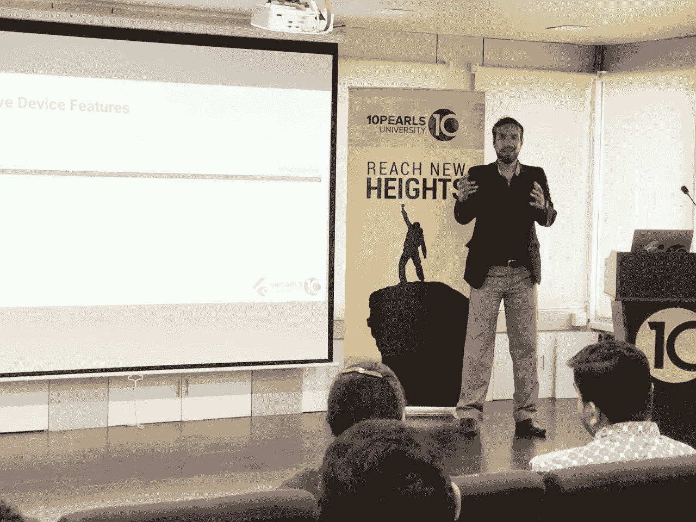
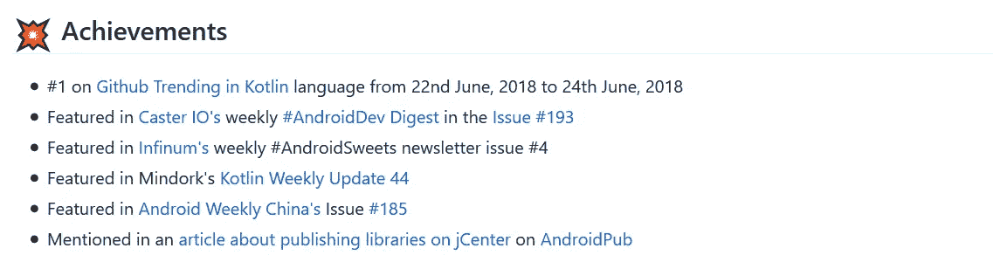
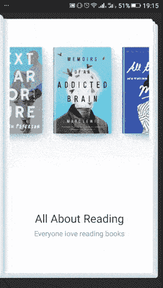
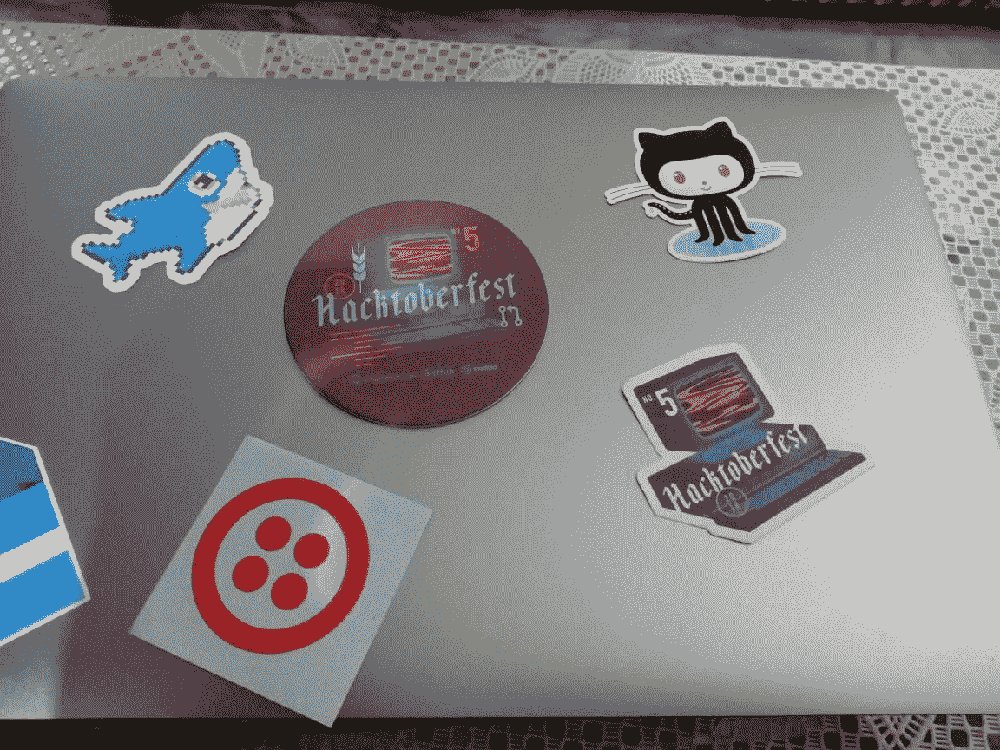
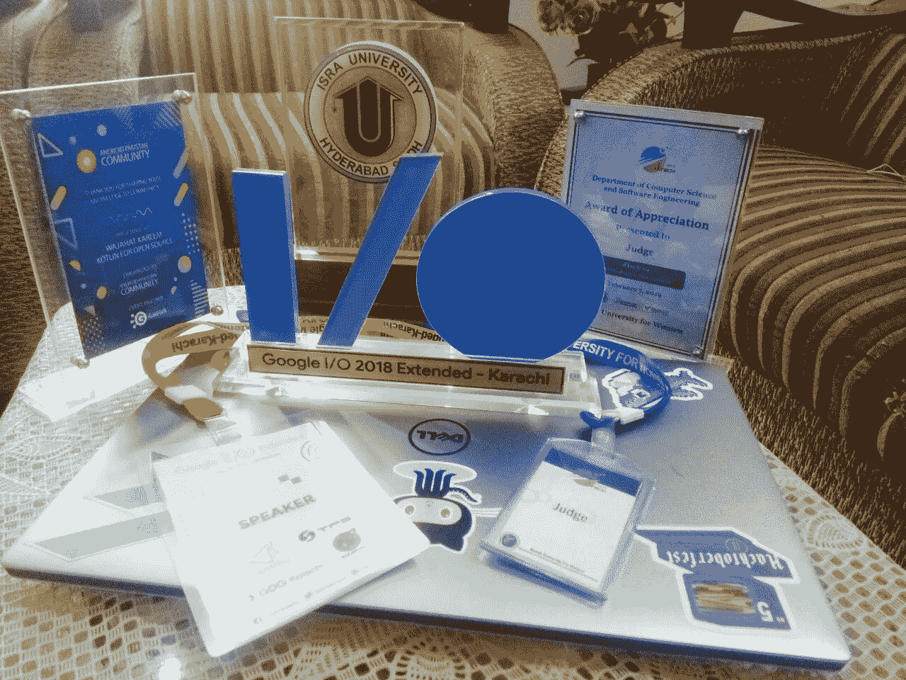
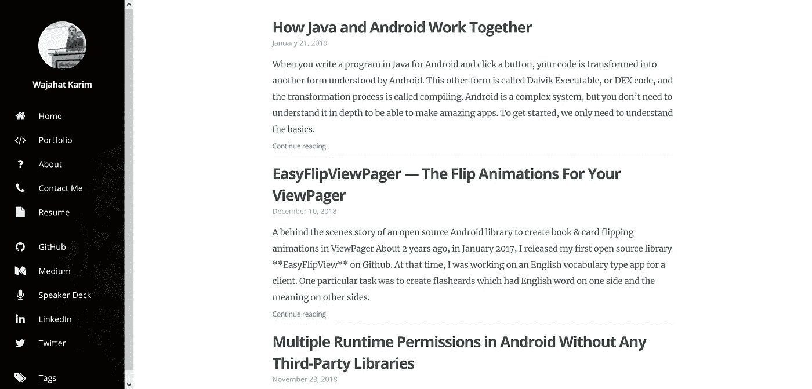

# 📆对 2018 年的反思——我的回顾之年

> 原文：<https://medium.com/hackernoon/reflections-on-2018-my-year-in-review-e88f45ee4211>

## 开源、公开演讲、新工作、新房子和大新闻的一年！

Me, giving a [talk about Flutter](/flutterpub/next-stop-flutter-477023188671)

2018 年对我来说是伟大的一年，无论是个人还是职业。去年当我写[我的第一年回顾](https://hackernoon.com/after-wasting-2017-year-successfully-now-looking-forward-to-waste-2018-again-8204b77ba74a)时，我不知道这些反思和年度回顾的真正影响。但它帮助我战胜了自我欺骗综合症，让我对自己负责(至少对我的内心负责)，为自己写日志，最重要的是，看到了这些年来我作为一个人和一名开发人员是如何提高自己的。

 [## 在成功浪费了 2017 年之后，现在期待再次浪费 2018 年

### 又是一年回顾，关于更多的失败和错失的机会

hackernoon.com](https://hackernoon.com/after-wasting-2017-year-successfully-now-looking-forward-to-waste-2018-again-8204b77ba74a) 

这一次，因为太多的原因，我很晚才开始写和发表这篇评论。(到最后你就知道我为什么迟到了)。但是，我很高兴至少我现在正在做，这仍然是̶f̶i̶r̶s̶t̶，2019 年的第二个月。我相信它仍然算数。——*提醒自己明年要准时。*

# 🤔谁是 [## 开源代码 100 天

### 100 天我得到了什么，你能从开源得到什么？

android.jlelse.eu](https://android.jlelse.eu/100-days-of-code-in-open-source-3ceb38474a89) 

> *剧透提醒:我获得了 6 份来自国外的工作邀请，4 个自由职业项目，以及当地/全球的认可。*

## 👏[中拍](https://github.com/wajahatkarim3/MediumClap-Android)安卓库

受 Ohans Emmanuel 和[的启发，我尝试在 Android 中创建这种效果，只是为了学习一些关于视图动画的东西。*(谢谢你*](https://medium.freecodecamp.org/how-i-re-built-the-medium-clap-effect-and-what-i-got-out-of-the-experiment-991672995fdf) [Github Trending in Kotlin](https://medium.com/u/aea1cff96976#1 on <a class=) language

**这整个把 Medium Clap 安卓库放到 Github 上，看到其他开发者反馈的经历，是我在 2018 年享受到的最美好的事情。对我来说，这更像是全年的一个亮点。这给我带来了如此多的惊人的机会(稍后会有更多的介绍)，而且[被许多简讯](https://github.com/wajahatkarim3/MediumClap-Android#-achievements)报道，这是我想都想不到的。**

The [Achievements of Medium Clap Android](https://github.com/wajahatkarim3/MediumClap-Android#-achievements) Library

## ✔️ [简易验证](https://github.com/wajahatkarim3/EasyValidation)安卓库

2018 年 6 月中旬上线，这个项目对我来说是个模棱两可的项目。为了利用 Kotlin 扩展的能力提供一个简单的文本和输入验证方法，这个库有大约 [6 个不同的模块](https://wajahatkarim.gitbook.io/easyvalidation/including-in-your-project)用于不同的目的。我已经开发了两个模块，我正在慢慢地研究其他模块。此外，我从其他 [开发者](https://github.com/wajahatkarim3/EasyValidation/issues/18)那里获得了[许多](https://github.com/wajahatkarim3/EasyValidation/issues/26) [贡献](https://github.com/wajahatkarim3/EasyValidation/issues/24) [，这变得更加稳定和完善。](https://github.com/wajahatkarim3/EasyValidation/issues/20)

我写了一篇关于这个库以及我如何创建它的详细文章。你可以在这里阅读，如果你想或不想。没有压力。

 [## 通过简单的验证快速轻松地验证您的文本

### 一个利用 Kotlin 强大功能的 Android 文本和输入验证库

android.jlelse.eu](https://android.jlelse.eu/quickly-easily-validating-your-text-with-easy-validation-498d7eb54b0b) 

## 📖[轻松翻页查看寻呼机](https://github.com/wajahatkarim3/EasyFlipViewPager)安卓库

我的另一个有趣的库，这是我为自己目前正在做的一个 Android 应用程序项目单独创建的。这个库允许 android 开发者在他们的 Android 应用中为他们的`ViewPager`创建页面/卡片翻转动画。从明星[刘的【UpLabs】](https://www.uplabs.com/posts/onboarding-animation-expore)的入职书店动画中得到灵感，我想在我的 android 应用程序中有同样的动画效果。这花了我一段时间，但我设法创造了它。你可以在下图中查看这个库的演示。

A book-flip demo of [EasyFlipViewPager Android](https://github.com/wajahatkarim3/EasyFlipViewPager) Library

在短短两个月的时间里，这个库在 Github 上的启动次数已经超过了 300 次，Android 开发者的应用程序下载次数也超过了 1000 次。我还写了一篇关于它的文章，讲述我如何以及为什么创建这个库。不管你想不想，你都可以再看一遍。没有压力。

 [## EasyFlipViewPager —视图页面的翻转动画

### 一个在 ViewPager 中创建书籍和卡片翻转动画的开源 Android 库的幕后故事

android.jlelse.eu](https://android.jlelse.eu/easyflipviewpager-the-flip-animations-for-your-viewpager-fd66b34f4703) 

## 💻黑客啤酒节挑战

这是我第一次参加由 [Github](http://github.com) 、[数字海洋](https://www.digitalocean.com/)和 [Twilio](https://www.twilio.com/) 组织和赞助的 [**黑客节挑战赛**](https://hacktoberfest.digitalocean.com/) 。挑战的目标是在 Github 上创建至少 5 个拉请求，并赢得一件限量版 t 恤。我在 Github 上提交了 7 个 pull 请求，比如 [Mozilla Components](https://github.com/mozilla-mobile/android-components) 、 [Travel Mate](https://github.com/project-travel-mate/Travel-Mate) ，还有一些我自己的，比如 [MediumClap](https://github.com/wajahatkarim3/MediumClap-Android) 、 [EasyValidation](https://github.com/wajahatkarim3/EasyValidation) 等等。是的，我还收到了 t 恤和漂亮的礼品。*谢谢 Github、数字海洋和 Twilio。*

The Hacktoberfest Challenge T-Shirt and Beautiful Stickers

总的来说，这是我在一条推文中对 2018 年开源活动的总结。

# 🎤公共演讲=社区

A collection of all shields, cards, stickers etc. of 2018 — I love that Google IO shield ❤

2018 年 6 月，我开始涉足公共演讲和当地社区贡献。我上一次做公开演讲是在 2012 年，所以获得一个机会和平台有点困难。因为本地没多少人知道我。他们可能看过我的文章或 Github 项目，但他们并不了解我个人。因此，我开始给当地的活动和社区活动组织者或技术会议等打电话，请求他们让我在他们的活动中谈谈我的经历和学习。

我在开源和 Github profile 方面的工作帮助我验证了我的经验，我得到的第一个机会是在 [*NED Karachi*](https://www.neduet.edu.pk/) 的一个项目展览中担任评委，这是巴基斯坦工程和计算机科学领域的顶级大学之一。感谢 [**德夫卡斯特·巴**](https://medium.com/u/3e65873c331d#/) 。

我在下面的文章中分享了更多的细节。

 [## 播客——什么是开源？什么是 Hacktoberfest？

### 我的第一个乌尔都语播客是关于开源和巴基斯坦开发的黑客节

android.jlelse.eu](https://android.jlelse.eu/podcast-whats-open-source-and-what-s-hacktoberfest-60f799e50415) 

# 📝写作=分享知识

2018 年初，我定下了至少发表 48 篇文章(每月 4 篇)的目标，作为新年决心。我不能按时到达。我在 2018 年发表了 36 篇文章，大多是在[媒体](/@wajahatkarim3)上，也有在[我的网站](http://wajahatkarim.com)，以及 [Dev.to profile](https://dev.to/wajahatkarim/) 上。这些文章帮助我每月获得约 10，000 至 15，000 次浏览，平均阅读率约为 43%。我在媒体上也有超过 1000 名粉丝，目前我有大约 1300 名粉丝。我对此非常自豪，因为在 2018 年初，我只有 200 名粉丝。所以，一年大约有 1100 个追随者。

以下是我浏览次数最多、阅读量最大的一些文章，排名不分先后。

 [## Android 中的多个运行时权限，没有任何第三方库

### 在本分步指南中了解如何添加多个运行时权限

medium.com](/mindorks/multiple-runtime-permissions-in-android-without-any-third-party-libraries-53ccf7550d0)  [## 在 10 行以下的 Android 中快速执行微小的异步任务

### 不使用任何框架，如 RxJava 或管理线程

android.jlelse.eu](https://android.jlelse.eu/executing-tiny-asynchronous-tasks-quickly-in-android-under-10-lines-7ebaa2103e9b)  [## 从 Android Studio 向 jCenter 发布您的 Android、Kotlin 或 Java 库

### 在 Bintray 和 jCenter 上发布 Android 库的详细操作指南

android.jlelse.eu](https://android.jlelse.eu/publishing-your-android-kotlin-or-java-library-to-jcenter-from-android-studio-1b24977fe450)  [## 不使用代码添加日志

### 再也不用放 Log.d()这样的行了！

android.jlelse.eu](https://android.jlelse.eu/add-logs-without-using-code-bd49fe9202ca) 

除了写文章，我还和[丹麦 Amjad](https://medium.com/u/1a952cf1f6b0?source=post_page-----e88f45ee4211--------------------------------) 一起为 Flutter 创办了一家名为 [**Flutter Pub**](https://medium.com/flutterpub) 的媒体刊物。我们很快就要超过 5000 名追随者，平均每天有大约 2000 名访客。在全世界大约 30 位作家的帮助下，我们已经发表了 100 多篇关于 Flutter 的文章。你可以在这里了解更多。

 [## 欢迎来到颤振酒吧

### 所有关于旋舞和它的魔法的酒吧。

medium.com](/flutterpub/welcome-to-flutter-pub-8480678ed212) 

# ❓杂事=未知数

我的生活中有一些发生在 2018 年的事件，我无法为这篇文章归类。

## 🌐新网站

2018 年，我用 [Hugo 框架](https://gohugo.io/)重新设计了 [**我的个人网站**](https://wajahatkarim.com) 并在告别 Wordpress 后托管在 Firebase 上。我使用了 [Tranquilpeak 主题](https://themes.gohugo.io/hugo-tranquilpeak-theme/)并集成了 Gitlab 的持续集成(CI)来轻松添加/更新内容。

[My new website](https://wajahatkarim.com) in Hugo Framework

## 💥Android 领域的谷歌开发专家(GDE)

我相信你和我想的一样。嗯，在 Google IO 2018 Extended talk 上，我通过 [Eric Bhatti](https://medium.com/u/4142dad0ad21?source=post_page-----e88f45ee4211--------------------------------) 会见了来自 Google 的 [**Sami Kizilbash**](https://twitter.com/samikiz) 。他建议我申请巴基斯坦的 GDE 安卓系统。我在 [**Manikantan K**](https://twitter.com/manikantan_k) 的帮助下经历了整个过程，可惜没能成功。我有不到 1 年的开源贡献和文章写作经验。于是，他们(谷歌)让我在 2019 年 3 月或者更晚的时候重新申请。所以，我很兴奋再次申请，看看这次会怎么样。

> 感谢 [Eric Bhatti、](https://medium.com/u/4142dad0ad21?source=post_page-----e88f45ee4211--------------------------------) [Sami Kizilbash、](https://medium.com/u/6ee481f953a7?source=post_page-----e88f45ee4211--------------------------------) [Manikantan K、](https://medium.com/u/fc673539f95b?source=post_page-----e88f45ee4211--------------------------------)和 [Google 开发者](https://medium.com/u/991272e72e68?source=post_page-----e88f45ee4211--------------------------------)给我一个申请这么好的机会。

## 📱伦敦脸书公司移动解决方案工程师的工作机会

这对我来说完全不可思议，令人震惊。我甚至没有想到我会有机会在脸书伦敦工作。在整个过程中，这是一次令人惊叹的经历，但由于家庭限制，我不得不拒绝了这一邀请。我在下面写了一篇关于它的文章。

 [## 我没有接受脸书大学的工作邀请。原因如下？

### 你可能会认为我疯了。也许我是。也许我不是。

hackernoon.com](https://hackernoon.com/i-didnt-accept-job-offer-at-facebook-here-s-why-fd6fce49a26b) 

# 🎥娱乐——电影、季节、戏剧

事实上，我已经一年没看电影了。如果可以的话，今年我可能会去追踪。我和我的妻子一起看了大多数电影，从《速度与激情》系列，牢不可破，分裂，标记，尖峰时刻系列，102 不出来，婴儿日，时尚，哈利波特系列，杀手，盗梦空间，守护者的传说，无忌，桑吉，搜索，宠物的秘密生活，表情符号，破坏拉尔夫，饥饿游戏系列，等等。

此外，我和我妻子(她的第一次)一集一集地看了《权力的游戏》第四季。她爱它，非常喜欢它。现在，我们正在等待最后一季。此外，我们还看了 Zara Yaad Kar 和 Baba Jani 的巴基斯坦连续剧。

我还看了一遍《硅谷》第一季、《停止与着火》第一季、《纸牌屋》第四季、《绝命毒师》第一季和第二季、《公司》第一季和第二季以及《亿万富翁》第一季和第二季。

# 📚阅读的书籍

2018 年，我读了 6 本书:《精益创业》、《从零到一》、《上钩》、《高效人士的 7 个习惯》、《第 8 个习惯》和《富爸爸穷爸爸》。

# 💖生活=大新闻！

最后，我们来到了生活部分。所以，让我分享一下我在文章开头提到的重大新闻。

> 我和我的妻子在 2019 年 1 月 1 日生了一个漂亮的男孩。

技术上来说，这不在 2018 年，但是我已经把 2018 年加进去了，让我的一整年都值了。

Picture of hand of our little bundle of joy :)

这概括了整篇文章。这是一个相当长的年度回顾。让我们看看明年会怎样。我心中有一些目标，例如:

1.  在媒体上获得至少 5000 名追随者
2.  在媒体上发表至少 50 篇文章
3.  进行 5-10 次公开演讲

我希望你喜欢这篇文章。请在评论中告诉我你的想法。我很想知道你的建议。

**Wajahat Karim** 毕业于[NUST](http://nust.edu.pk)，是一名经验丰富的移动开发人员，一名活跃的开源贡献者，也是两本书[学习 Android 意图](https://www.amazon.com/Learning-Android-Intents-Muhammad-Usama/dp/1783289635)和[用 Unity 掌握 Android 游戏开发](https://www.amazon.com/Mastering-Android-Game-Development-Unity/dp/1783550775/)的合著者。在业余时间，他喜欢花时间和家人在一起，做编码实验，喜欢写很多东西(主要是在博客和媒体上)，并且是开源的热情贡献者。2018 年 6 月，他的一个库成为了 [Github 趋势](https://github.com/trending)上的第一名。[他的库](http://github.com/wajahatkarim3)在 Github 上有大约 2000 颗星星，并被全球各地的开发者用于各种应用。在 Twitter 和 [Medium](/@wajahatkarim3) 上关注他，获取更多关于他的写作、Android 和开源工作的更新。

 [## Wajahat Karim (@WajahatKarim) |推特

### Wajahat Karim 的最新推文(@WajahatKarim)。安卓开发者。UI/UX 设计师。博主。作家…

twitter.com](https://twitter.com/WajahatKarim) 

此外，如果你有任何想让他回答的问题，请通过他在 wajahatkarim.com 的网站联系他，在主题栏写上亲爱的瓦贾哈特。