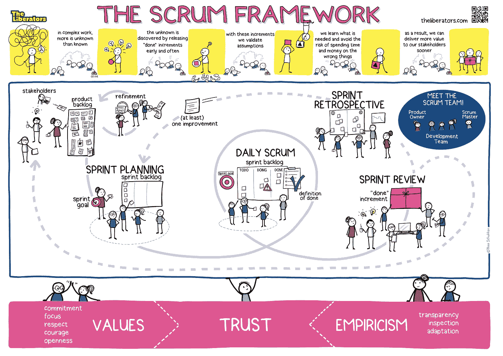

# 刷新 Scrum 框架的目的

> 原文：<https://medium.com/hackernoon/refresh-the-purpose-of-the-scrum-framework-61aa99ba159f>

> 由职业 Scrum 培训师巴里·奥弗里姆、Scrum、T2 和 T3 组成

The Scrum Framework, visualized by Thea Schukken

你的同事会如何完成下面的句子:“Scrum 框架的存在是为了…”？有时候，我们陷入了 Scrum 的规则和机制中，而忘记了我们最初想要达到的目标。或者，我们甚至不知道这有什么意义，只是因为这很时髦或者其他人都在做什么，我们就跟着去做。无论哪种情况，这都不是一个很好的改善基础。

> *“Scrum 框架的存在是为了…”*

所以，为什么不在即将到来的 Sprint 回顾会上花点时间来重新阐明 Scrum 的目的呢？

*   邀请人们单独地、安静地列出他们在使用 Scrum 时所做的所有事情(1 分钟)；
*   邀请人们结对。人们轮流分享他们的清单，并互相询问“为什么这很重要？”对于每一项*和*为整体列表。鼓励人们不断问“为什么？”这样你才能真正深入到核心(10min)；
*   两人一组，邀请人们一起用海报或大贴纸完成句子:“Scrum 框架的存在是为了……”(5 分钟)；
*   两人分享他们的句子。作为一个小组，挑选最好的，并进一步完善。如果团队陷入困境，这也是一个教授 Scrum 目的的绝佳机会。重要的关键词是*值、【完成】增量、验证假设*、*复杂性、*和*可预测性* (10 分钟)；
*   创建五个站点，每个站点对应一个 Scrum 事件。邀请人们组成新的组合。每组选择一个站点开始。给两人 5 分钟时间来探究该活动如何服务于上一轮中确定的目的。可以做些什么来优化此活动的完成方式？5 分钟后，要求两人顺时针移动到下一站，并在之前两人所写的基础上继续。重复，直到每一对都访问了每个站点(25 分钟)；
*   一起听取来自五个站点的见解。最大的收获是什么？下一次冲刺应该做的一个重要改进是什么？(10 分钟)；

我们总是建议在 Sprint 回顾和 Sprint 规划的开始重申 Scrum 的目的，以及它如何与这些事件联系起来。如果你需要帮助自己澄清这一点，Scrum 指南是一个很好的开始。请随意下载[这张免费海报](http://bit.ly/2PmFV6r) (PDF)并把它放在显眼的地方。它阐明了 Scrum 框架的目的及其各种角色、事件和原则。

你或你的 Scrum 团队会如何完成这句话？

> *“Scrum 框架的存在是为了…”*

我们希望通过这种回顾的形式来学习你的经验。试一试，并随时分享结果！

*想了解更多关于 Scrum 框架的目的吗？加入我们的* [*职业 Scrum 大师*](http://bit.ly/2xEBA6a) *或* [*职业 Scrum 大师 II*](http://bit.ly/2CUHHY2) *课程(荷兰语或英语)。我们保证一个独特的，令人大开眼界的体验，100%免费的 PowerPoint，高度互动，严肃但有趣。*

*原载于 2019 年 6 月 27 日*[*https://medium.com*](/the-liberators/refresh-the-purpose-of-the-scrum-framework-9e4bceb25499)*。*