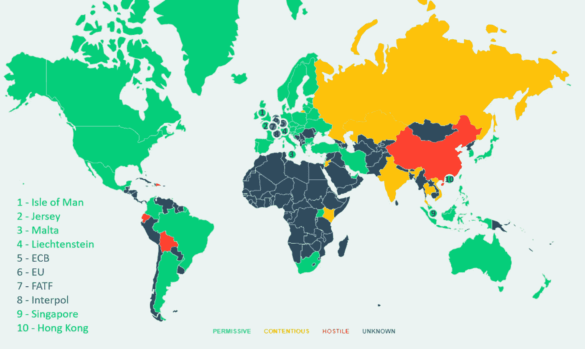

# 数字资产领域的法规

> 原文：<https://medium.com/hackernoon/regulations-in-the-realm-of-digital-assets-fedcc9f82f73>

Legal status of bitcoin by country as on 4-Mar-2019 ([source](https://map.bitlegal.io/))

> “我们不理解的，我们害怕。我们害怕的东西，我们认为是邪恶的。我们认为邪恶的东西，我们试图去控制。我们无法控制的…我们攻击”——未知

加密货币提供了一个不受中央集权和第三方控制的金融系统的前景。密码安全交易将你的资产控制权掌握在你手中的想法并不是最近才出现的，但在 2009 年比特币出现之前(在 1983 年电子现金出现之前甚至更不流行)，这一想法几乎没有被探索过。然而，加密价格在 2017 年底飙升，随后在明年大幅下跌，这重新引起了全球对这些数字资产的关注。早先对这种“时尚”不屑一顾的政府和金融当局现在不得不注意起来。在对这种诞生于秘密无政府主义观念的新资产阶级的担忧中，许多官方机构走上了 [*恐惧*](https://www.forbes.com/sites/laurencoleman/2017/12/17/why-the-massive-fears-around-cryptocurrency-will-rise-and-whats-next-for-2018/#4d3086a4742d)[*邪恶*](https://krugman.blogs.nytimes.com/2013/12/28/bitcoin-is-evil/)[*控制*](https://bcfocus.com/news/others/chinese-police-stop-a-major-blockchain-event/6148/)*[*攻击*](https://www.reuters.com/article/us-crypto-currencies-iran/iran-central-bank-bans-cryptocurrency-dealings-idUSKBN1HT0YN) 的下行螺旋。但是随着加密货币知识和意识的普及，一些具有前瞻性思维的国家已经开始实施积极的监管措施。*

*加密货币监管的当前形势可以分为经济发展路线。虽然加密货币在欧盟、美国、澳大利亚和其他发达国家(如新加坡和日本)广泛合法(作为数字资产)，但它们的合法性在发展中经济体是一个争论的问题。加密法规的不确定性源于加密货币不能被归类为由[豪威测试](https://www.investopedia.com/terms/h/howey-test.asp)定义的投资合同。Axpire 顾问约翰·芬顿[说](https://www.youtube.com/watch?v=qOIU0jKaFHY)整个加密行业必须有一个全权委托标准。无边界技术很难遵守有边界的法律。虽然政府总是希望保护他们的公民，但加密监管必须得到全球的认可。*

***以下是主要国家当前加密法律框架的简要概述:***

*长期以来，美国一直在努力解决如何将密码作为一种资产来处理的问题。美国的法规不能一概而论，因为有些州比其他州更欢迎加密。美国证券交易委员会在加密问题上一直很谨慎，有时也很强硬。然而，一系列[集体诉讼](https://theindependentrepublic.com/nano-lawsuit-2018/)和[开创先例的审判](https://cointelegraph.com/news/us-cftc-chair-notes-crypto-cases-in-record-year-of-enforcement-actions)(为了清除骗局)正在慢慢为更进步的法规铺平道路。法律之鹰 Morvareed Salehpour 说，美国正朝着正确的方向谨慎行事。那些寻求迁移到看似更自由的加密法规的国家的项目没有意识到许多国家通常会效仿美国的法律先例。*

***中国**已经有效地取缔了加密货币的交易，而**印度**已经禁止银行向加密公司(包括交易所)提供银行服务，但没有明确宣布加密为非法。这两个国家都有一个*先区块链后加密*的立场。印度的问题现在已经到了这样的地步，最高法院已经指示当局在 4 周内拿出明确的规定。就中国而言，它已表示支持全球监管努力。*

***日本**和**韩国**在处理密码时有相对友好的规定。虽然日本将加密视为财产，FSA(金融服务厅)也给予了该行业自律地位，但韩国在这方面仍有点落后。南韩的金融服务委员会(FSC)透露，一些加密法案最近已经提交国会审议。这些法案旨在保护密码所有者的权利，确保密码交易的稳健性和安全性。*

***新加坡**、**瑞士、**和**马耳他**在法规方面最为进步，导致许多项目将基地转移到这些国家。在这些司法管辖区，交易和交换是合法的，加密货币被视为[商品](https://complyadvantage.com/knowledgebase/crypto-regulations/cryptocurrency-regulations-singapore/)、[资产](https://complyadvantage.com/knowledgebase/crypto-regulations/cryptocurrency-regulations-switzerland/)或[交易媒介](https://complyadvantage.com/knowledgebase/crypto-regulations/cryptocurrency-regulations-malta/)。约翰·芬顿认为，马耳他将成为监管方面的先行者之一。“马耳他将成为标杆，其他所有国家都将效仿”。*

**

*Bitcoin ATM in Zug, Switzerland ([source](https://coinatmradar.com/bitcoin_atm/4380/bitcoin-atm-general-bytes-zug-crypto-valley-labs-the-block/))*

*我们将何去何从？*

*虽然加密领域的用例范围和技术以及项目数量都在继续大幅增长，但法规却没有跟上步伐。布鲁金斯学会指出，不同政府的不同观点使得围绕加密的混乱变得更加复杂。除此之外，正如 Morvareed Salehpour 所言，分散的系统引发了管辖权、责任和执行方面的问题。我们目前的法律框架与真正的公共区块链不同步。因此，政府不倾向于支持真正分权的区块链是很自然的。私人区块链和集中演员更容易被接受。但是随着大量的秘密案件走上法庭，[判例法](https://events.eventact.com/ki2/crypto/Shaul%20Zioni-Litigation%20trends%20in%20cryptocurrency.pdf)开始建立。真正分散化系统的案例越来越多。*

*世界各地的权威人士已经[欣赏](https://dailyfintech.com/2019/01/07/blockchain-weekly-front-page-governments-love-blockchain/)区块链的优点，大多数[同意](https://news.bitcoin.com/sec-commissioner-suggests-excessive-crypto-regulation-hurts-growth/)过度监管会扼杀创新。因此，许多监管重点现在已经转向消费者保护、打击欺诈和更强有力的监管解决方案。与此相一致，监管机构必须制定强有力的协议。就像股票交易员不必担心自己的股票被盗一样，这种新型数字资产也必须确保这一点。此外，另一个反复出现的主题是呼吁跨国监管。欧洲银行管理局(EBA)已经[接受](https://bitcoinist.com/eu-banking-authority-cryptocurrency/)有必要*“欧盟内部加密货币操作的标准化法规”。**

*因此，这些监管运动现在也开始影响技术趋势。以消费者为中心的法规将导致许多代币/硬币在未来被视为证券。因此，2019 年的一个总体趋势是[安全令牌产品](https://blockgeeks.com/guides/security-tokens/)(或 sto)的出现，像 [CoinBX](https://coinbx.blockchainwarehouse.com/) 这样的项目已经在寻求利用这一点，通过建立更简单的入口来进行 sto，同时完全符合当前的法律。预计将会有更多技术模仿监管运动的实例。*

*从长远来看，我们总是看到法律拥抱创新。不管需要多长时间。法律先例已经在世界范围内建立起来，例如 [Blockvest](https://twitter.com/msantoriESQ/status/1068246911533092866) 、 [Bithumb](https://www.coindesk.com/court-win-for-bithumb-exchange-in-case-of-crypto-investors-355k-hack) 、 [Bitcoininfo](https://cryptonews.com/news/an-unprecedented-legal-victory-for-crypto-in-russia-2971.htm) 等等。我们开始在全球范围内看到更多冷静的监管只是时间问题。一个受到有效监管的市场会减少欺诈事件，加强对消费者的保护，同时鼓励金融科技创新。从种种迹象来看，我们正坚定地朝着这个方向前进。*

****关于作者:****

*[*Rohit chatter JEE*](/@rohitchatterjee_6181)*是一名在德州仪器工作的模拟设计工程师，*[*Abhijoy Sarkar*](/@SarkarAbhijoy)*是一名银行家转行的企业家。他们是多年前失去联系的高中好友。他们在 2018 年初通过 crypto 重聚，并通过相互研究和共享知识进行投资。**

****他们通过密码自由职业平台***[***matchbx . io***](https://matchbx.io/)***写这篇文章作为写作 gig，让他们的工作得到回报。****