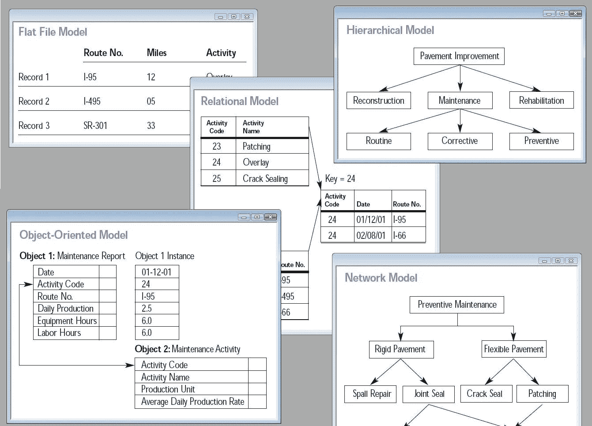

# 关系数据库(设计模式和编写查询)

> 原文：<https://medium.com/hackernoon/relational-databases-designing-schema-writing-a-query-8e714fce689d>

source : [https://en.wikipedia.org/wiki/Database#/media/File:Database_models.jpg](https://en.wikipedia.org/wiki/Database#/media/File:Database_models.jpg)

嗨伙计们！！在这篇文章中，我将讨论如何设计一个快速的关系数据库模式，以及如何在关系数据库中编写一个原始的 sql 查询。所以，不浪费时间，让我们开始吧。

在深入设计模式之前，让我们先看看构成一个好数据库的属性。数据库中事务的 ACID 属性。