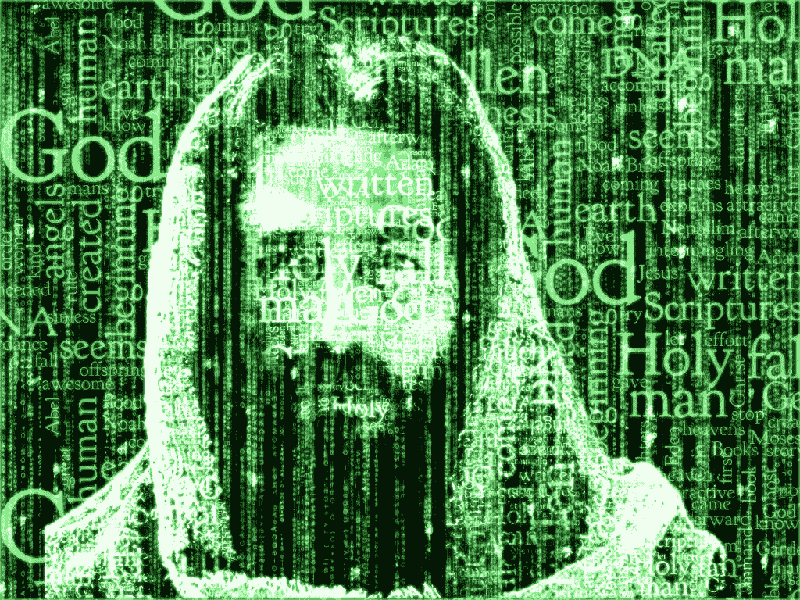
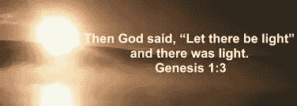
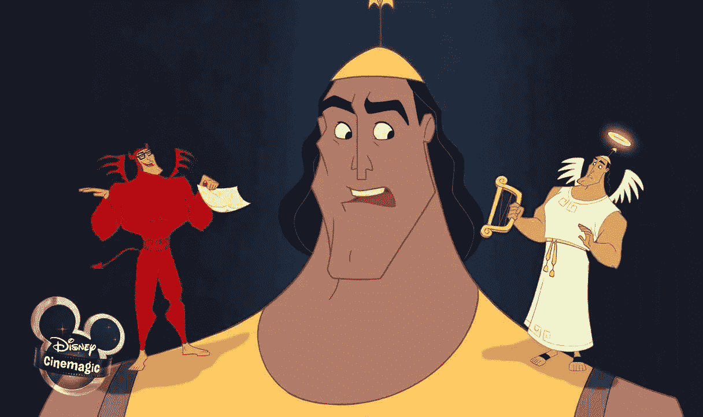

# 宗教与模拟假说:上帝是人工智能吗？

> 原文：<https://medium.com/hackernoon/religion-and-the-simulation-hypothesis-is-god-an-ai-part-i-e2ac0016ca1e>

## 视频游戏和黑客帝国为宗教信仰提供了科学依据吗？(第一部分)

*注:在*《黑客帝国》*发布 20 周年之际，麻省理工学院和斯坦福大学的毕业生 Rizwan Virk 发布了他的书，* [*《模拟假设:一位麻省理工学院的计算机科学家展示了为什么人工智能、量子物理学和东方神秘主义者同意我们在一个视频游戏*](https://www.amazon.com/dp/B07M81F1KG/) *中，该书探索了这一理论的科学、哲学和宗教基础。这是探索模拟假设不同方面的系列文章之一——请访问*[*www.zenentrepreneur.com*](http://www.zenentrepreneur.com)*了解更多信息。*

数百年来，从牛顿到笛卡尔到爱因斯坦，许多著名的科学家都不怕在他们的著作中谈论上帝(或意识的重要性)。这可能部分源于最初不想与伽利略等科学家的命运相同，伽利略的研究被占主导地位的天主教会压制。随着时间的推移，虽然教会变得不那么占主导地位，但我怀疑它源于一种真诚的信念，即尽管科学擅长观察，但它的简化主义倾向可能永远无法解释宗教经常探索的未知意识世界。结果，科学家避开了宗教，认为它是“不科学的”，只应该由社会学家来研究。

最近，出现了一种理论，这种理论导致许多科学家重新审视古老的宗教概念，电子游戏和科幻小说都为这种新模式提供了关键部分。这一理论，即模拟假说，认为我们所感知的物理现实实际上是计算机生成的模拟——就像电影《黑客帝国》中描述的超级复杂的视频游戏。

这个月是这部开创性电影上映 20 周年。虽然这部电影有许多宗教色彩(拯救人类的弥赛亚的出现)，但它作为一种文化现象出现，超越了当时的大多数其他电影，因为它的中心论点是:我们生活在一个模拟的世界里，在我们看不见的地方还有另一个世界。

这是两篇文章中的第一篇，这两篇文章考察了世界上东方和西方的宗教提出的许多观点不仅与模拟假说一致，而且这一新理论可能会找到一种方法来弥合宗教和科学之间日益扩大的差距。第一部分将集中在西方宗教，特别是上帝和他的天使以及来世的观念，而第二部分将集中在东方宗教，特别是关于玛雅的观念，或幻觉，因果报应和轮回。

我们将看到这些宗教思想是如何通过模拟假说的视角呈现出全新的意义的。事实上，这一理论可能为所有这些论点提供了科学和技术基础，表明世界宗教描述的看不见的世界可能比我们想象的更科学！

Does the Matrix show us a scientific model for religions?

# 黑客帝国，它的宗教色彩和它的中心思想

简单回顾一下，在《黑客帝国》中，尼奥(山谬·里维饰演)是一名电脑黑客，他在网上发现了神秘的《黑客帝国》。他最终遇到了墨菲斯(劳伦斯·菲什伯恩饰演)，后者解释道:“不幸的是，没有人能被告知矩阵是什么。你得自己去看。”

即使你没有看过这部电影，你也可能听说过它最具标志性的一幕:墨菲斯让尼奥选择服用“红色药丸”醒来，看看母体是什么，或者服用“蓝色药丸”，继续过自己的生活。尼奥吃了红色药丸，在现实世界中醒来，发现他以为的现实实际上是一个复杂的计算机模拟——基本上是一个超现实的视频游戏！

# 视频游戏、虚拟现实和模拟世界的概念

模拟假说曾经是科幻小说的领域(《黑客帝国》的创造者沃卓斯基夫妇声称受到了科幻作家菲利普·K·蒂克等人作品的启发)。

如今，这一观点受到了哲学学者(牛津大学的尼克·博斯特罗姆在 2003 年的一篇论文中提出了模拟论证)、物理学家(《新宇宙》的主持人尼尔·德格拉斯·泰森和已故的斯蒂芬·霍金都很重视这一观点)，尤其是当今的计算机科学家的重视。

为什么现在这种想法越来越被重视？这是因为电子游戏和人工智能技术的发展。事实上，特斯拉创始人兼 SpaceX 创始人埃隆·马斯克(Elon Musk)在 2016 年发表声明，解释了其中的逻辑:四十年前，视频游戏的艺术水平是两条线和一个点，Pong 是第一个广泛使用的街机游戏。今天的 MMORPGS(大型多人在线角色扮演游戏)，如*魔兽世界*和*堡垒之夜*，已经创造了共享的虚拟世界，由数百万玩家控制的角色居住。

马斯克推测，如果虚拟现实和增强现实的保真度继续提高，我们很快就会无法区分“物理”和“虚拟现实”。

虽然像博斯特罗姆这样的科学家很少谈到视频游戏，马斯克也很少谈到意识的上传和下载，但如果我们把这些趋势带到他们的逻辑结论，我们最终会发现模拟假说听起来很像所有宗教传统一直告诉我们的东西！

# 西方中心原则#1:神说:要有光！

让我们从西方传统(即犹太教、基督教和伊斯兰教)开始，或者如他们被称为亚伯拉罕的宗教线。他们有许多共同的特点，尤其是尊重《旧约》,这是《圣经》中最古老的部分。

《圣经·旧约》中的《创世纪》开篇，上帝说:“要有光，然后就有了光。”其次是上帝用 6 天创造了地球，然后在 7 日休息。

这当然是最受科学家嘲笑的领域之一。当然，形成一颗行星需要 6 天以上的时间，不是吗？我们最好的估计是地球已经有几十亿岁了。此外，如果地球还没有被创造出来，你怎么可能测量 6 天的时间呢？

然而，随着模拟假说的引入,《创世纪》的这一部分开始有了新的含义。如果我们开始将物理世界视为计算机生成的现实，而不是物理现实，那么这种描述对科学家来说听起来就不那么奇怪了。在视频游戏的世界里，在一个视频游戏世界里“旋转”一个新的服务器或新的星球需要大约 6 秒钟。开创性的视频游戏*无人天空*，使用分形算法为 18 万亿颗行星生成独特的动植物。包括模拟在内的所有计算机程序都有“时钟速度”的概念，即某一特定步骤可能需要的最小时间增量。尽管我们可能认为它是即时的，但生成任何模拟世界都需要一定的时间。

模拟世界中的时间增量是由某个“代”或“步”设置的，它是 CPU 基础时钟速度的倍数。例如，如果内部时钟速度是 1 毫秒，那么测量小于 1 毫秒是不可能的。但是在模拟中，“日”、“年”或“步”可能是 6 毫秒或 6000。

也许更重要的是上帝创造世界的行动——在宗教传统中，光似乎有着特殊的地位。

*Figure 1: Light plays a fundamental role in Religion, Physics and Video Games*

当我们审视现代物理学时，我们发现我们认为是物理世界的一切已经被证明大部分(99%)是真空。固体对液体对气体只是不同运动的原子和分子的集合。这让人们相信物理宇宙实际上并不存在——存在的只是代表原子和分子的信息排列。

爱因斯坦相对论发现物理学中唯一真正的常数是光。光是特别的，尽管没人知道为什么。事实上，你可能会说光是物理学中唯一真正的“基础”。我们还没能找出原因。

在计算机模拟中，光也是特殊的。事实上，计算机图形是由基于信息的像素组成的——这些像素被“渲染”到游戏内部存在的物理世界中——我喜欢称之为“渲染世界”。渲染就是根据不同的值点亮像素，以呈现不同的颜色——将黑暗的屏幕变成一个“世界”！

为什么物理学中唯一的基础是电磁辐射的速度，这也是我们在计算机内部和计算机之间发送信号的速度？此外，西方宗教明确地告诉我们，上帝创造世界的方式与我们渲染电子游戏世界的方式相同——通过“打开”物理世界的像素？

# 西部中心原则#2:电子游戏中的天使和来世

大多数宗教都关心我们死后会发生什么。事实上，你可能会说这是中心问题，也是宗教存在的主要原因！在西方宗教传统中，一个主要的教义是我们有一个不朽的灵魂，这是根据我们今生的行为来判断的。这种判断是基于对我们在物质世界的“这里”所做的事情的回顾，这种行为决定了我们在“来世”或来世的结局。

根据我们所关注的西方传统的特定分支，这个基本主题有所不同(例如，在天主教和东正教中的炼狱)。在几乎所有这些案例中，都有我们称之为天堂和地狱的地方。在犹太教中(同样取决于具体的解释)，天堂是伊甸园，地狱是 T2。在伊斯兰教中，天堂被称为 *Jannah (* 基本上是牛奶和蜂蜜的花园 *)* ，似乎是为了强调它与旧约是同一个地方，地狱使用了几乎完全相同的短语: *Jahannam* 。

这个确定到底是怎么做的？伊斯兰教是这些宗教中最新的一种，它给了我们更多的细节。在《古兰经》(以及第二权威文本《圣训》)中，特别提到我们每个人都有一个“行为卷轴”。上帝不仅会在我们死后回顾我们的行为，还会向我们展示我们行为的后果。因为我们可能甚至没有意识到我们的一些行为产生了超出我们所知的影响，这不是一个简单的过程，而是需要拓宽我们的视野。

*Figure 2: A Depiction of a Recording Angel from Washington DC*

谁在这卷经卷中记录信息，它是如何向我们展示的？在伊斯兰教中，记录天使 *Kiramin Kitab* 是两个记录我们“善行”和“恶行”的天使。现在你可能已经看过现代卡通片了，片中每个肩膀上有一个天使和一个魔鬼。原来这幅图的来源很可能是伊斯兰传统，先知告诉信徒，每个人都有两个实体——一个天使和一个精灵，每个人的肩膀上都有一个，它们引导我们做好事或坏事。

在基督教传统中，记录天使与我们的守护天使是一样的，在基督教和犹太教传统中，“生命之书”被“行为卷轴”所取代(在一种情况下，它只是进入天堂的人的名单，在其他传统中，它与行为卷轴几乎相同)。

这真的会发生吗——我们的行为和它们的影响被天使(或字面意思，上帝的使者)记录在某个地方(被渲染的世界之外),如果是这样，它是如何工作的？

*Figure 3: Are Angels Really AI daemons? A Disney representation*

更重要的是，这一切与电子游戏和黑客帝国有什么关系？

原来还挺多的！很明显，在我们的一生中，有一个“分数”，对天使来说是清晰可见的(他们不在我们的物理现实中，但可以看到正在发生的一切)。你可能会说他们是我们在“渲染世界”中看不到的电子游戏的记分员。

而且，在一个三维世界里，你会如何记录善行和恶行？电子游戏再次给了我们答案。在今天的电子竞技视频游戏中，在游戏进行的同时，关键动作会被在渲染世界之外观看游戏的评论员记录下来。通常这是使用屏幕捕捉软件自动完成的，有时是实时的。

这些录音天使实际上可能是某种形式的人工智能吗？地球上有 70 亿人，有 140 亿天使，他们的简单工作就是记录我们做的每一件事吗？现代计算机科学提供了答案——让人工智能像自动屏幕捕捉一样记录我们游戏中的重要点，然后回放给我们是有意义的。

最近，我加入了一家视频游戏公司，该公司不仅记录了《魔兽世界》和《英雄联盟》等 3d MMORPGs 的关键时刻。它可以回放关键时刻，这样我们就可以回顾我们做对了什么，做错了什么。这个 3D 录像的独特之处在于，我们不仅可以从原始玩家的角度回放游戏，还可以从游戏中任何其他玩家的角度回放！我们真的可以看到我们的行为对游戏中其他玩家的影响！

听起来熟悉吗？它不仅像行动的卷轴，而且也很像我们所说的生活回顾。这个术语是雷蒙德·穆迪博士在研究 NDE 氏症(或濒死体验)时创造的。他通过研究数千例“临床上”死亡但被复苏的人，发现他们都报告了类似的经历。其中最常见的是生活回顾，一个天使(或光之存在)向他们回放这个人的生活场景。其中最著名的是丹尼翁·布林克利，他写了畅销书《被光拯救的 T0》。丹尼翁不仅记得这篇人生回顾——他特意说这是一篇 360 度人生回顾——你不仅能看到自己的行为，还能从他人的角度看到自己行为的后果！

黄金法则是通过强迫你看从其他玩家的角色那里回放的“游戏”来实施的！

事实上，某种 3D 屏幕捕捉，加上一些人工智能，可能是完成宗教文献中向我们描述的事情的唯一方法，也是这些宗教的关键戒律之一！

从字面上来看，记录天使更像是上帝的使者，他们的任务是观察我们的所作所为。我们今天是如何发送信息的——当然是通过自动化的计算机程序。在计算机科学中，作为一个独立进程独立运行的监控我们正在做什么的代码通常被称为守护程序，这是希腊语中恶魔的意思。这可能比最初的命名者意识到的更合适——尽管也许他们应该被称为六翼天使，天使的希腊语术语！

这些不是唯一发生在上帝身上的事情，由人工智能比全能的神处理得更好——想想数十亿祈祷者进入一个中央系统——上帝，或旧约中称为耶和华的上帝，会如何处理这么多的祈祷者？一个由“天使”组成的智能系统可能是做到这一点的唯一途径。

这一初步分析表明，模拟假说，即 20 年前发布《黑客帝国》时出现的核心理论，可能为先知和宗教书籍一直告诉我们的事情提供了一个科学模型:我们处于一个模拟的世界，就像一个电子游戏，这个世界之外有一些存在物(或过程)正在观察我们所做的一切。

在第二部分中，我们将探索一些东方宗教传统背后的思想，并展示模拟假说如何提供将所有这些传统与现代科学联系起来的重要模型。

*注:在*《黑客帝国》*发布 20 周年之际，麻省理工学院和斯坦福大学的毕业生 Rizwan Virk 发布了他的书，* [*《模拟假设:一位麻省理工学院的计算机科学家展示了为什么人工智能、量子物理学和东方神秘主义者同意我们在一个电子游戏*](https://www.amazon.com/dp/B07M81F1KG/) *中，该书探索了这一理论的科学、哲学和宗教基础。这是探索模拟假设不同方面的系列文章之一——请访问*[*www.zenentrepreneur.com*](http://www.zenentrepreneur.com)*了解更多信息。*