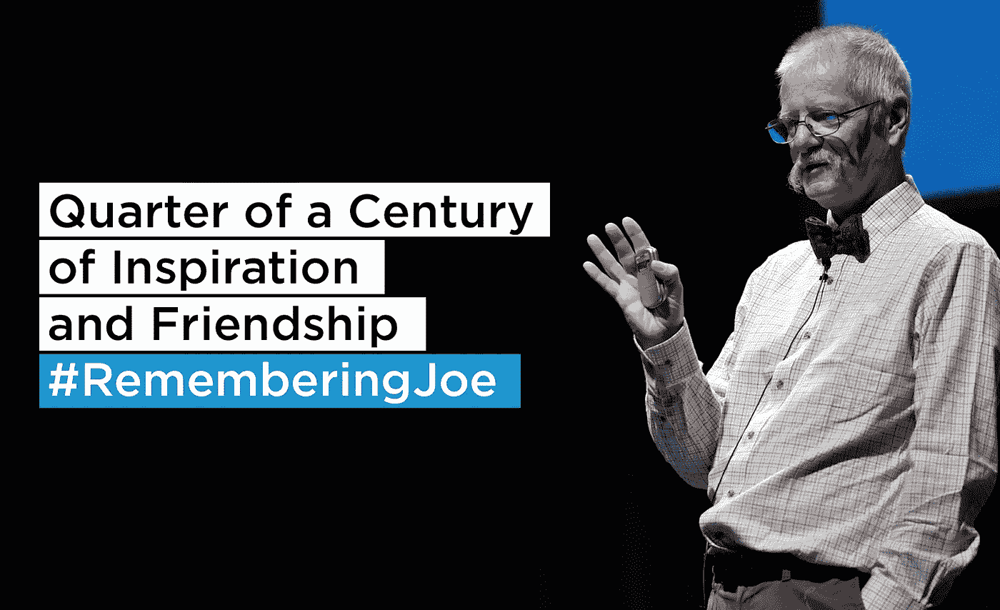
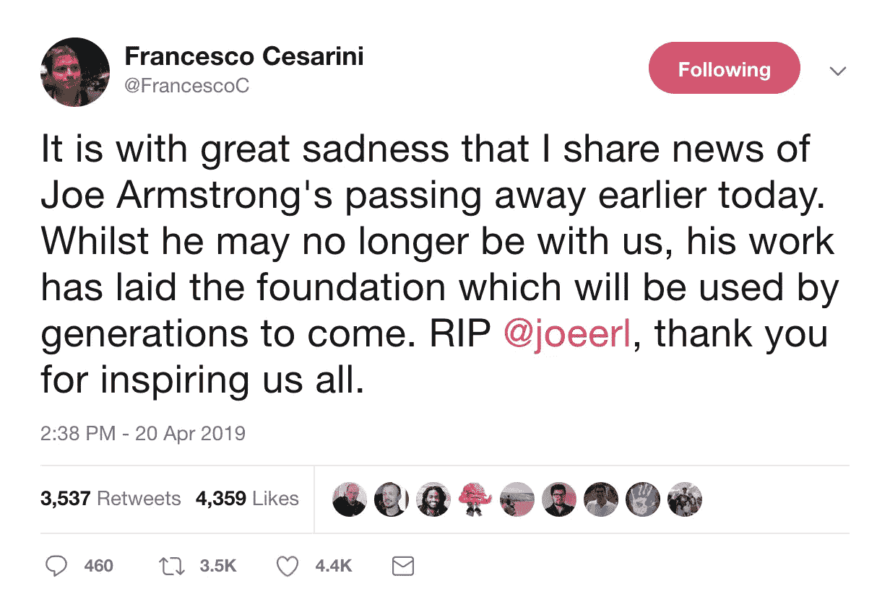
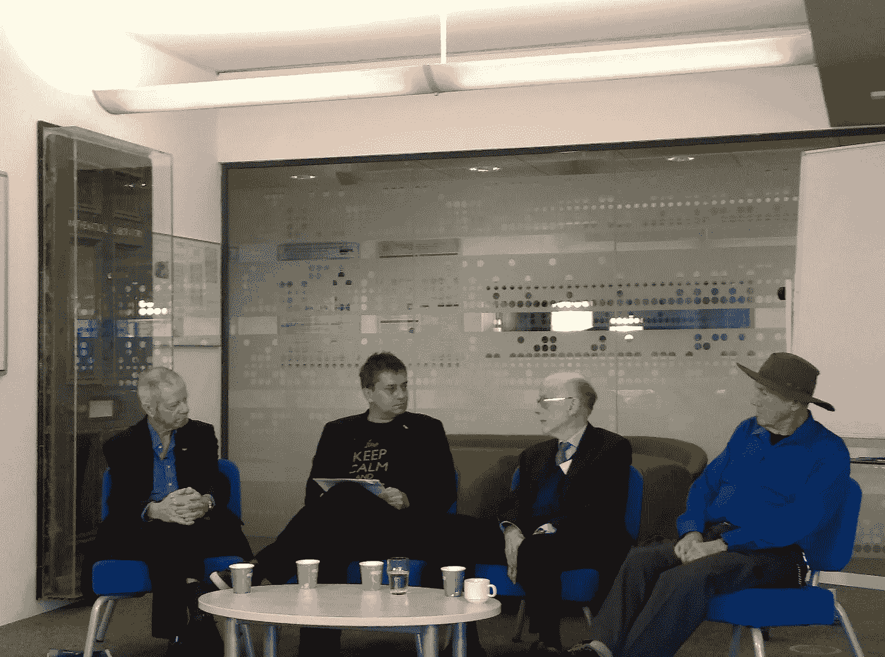
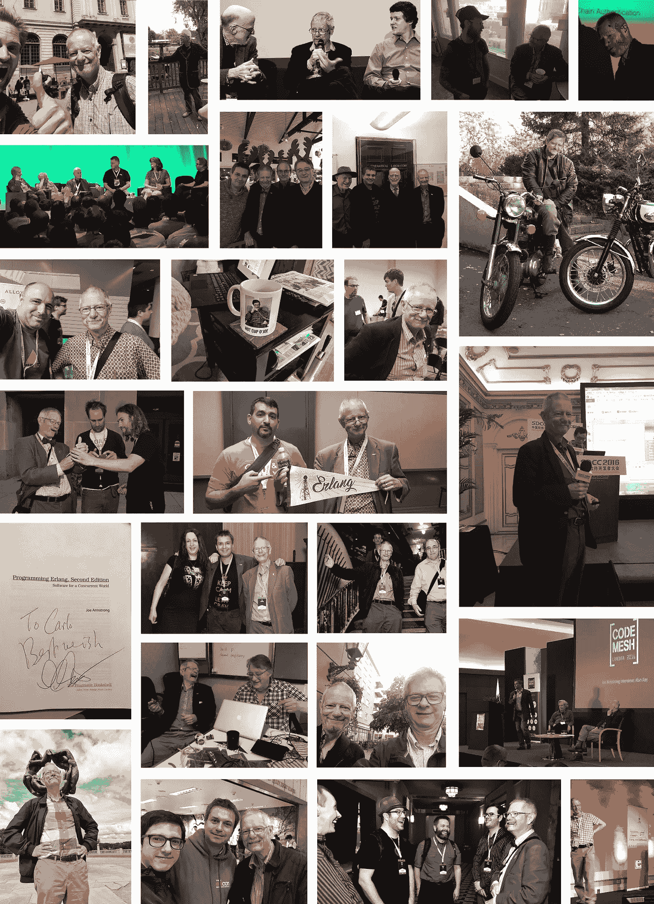

# 记住乔，四分之一世纪的灵感和友谊

> 原文：<https://medium.com/hackernoon/remembering-joe-a-quarter-of-a-century-of-inspiration-and-friendship-3ddded0831ab>

弗朗切斯科·塞萨里尼

朋友缅怀乔·阿姆斯特朗的几点感想？

我第一次看到乔·阿姆斯特朗这个名字是在 1994 年，当时我买了他合著的《Erlang 并发编程》的第一版。我们第一次交往发生在 1995 年，当时我在找一家有兴趣赞助我硕士论文的公司。我拨了爱立信计算机科学实验室所在地 Ellemtel Utvecklings AB 的号码，要求接通乔·阿姆斯特朗。得到一句你好，我毫无准备的开场白是*Skall jag ta det pengelska，或者你更喜欢我用瑞典语说？一阵沉默之后是笑声，同样的笑声我们很多人都和乔联系在一起。*

# 隔着墙互相喊叫

在计算机科学实验室的实习充满了热情和创造力。这个实验室有一种学院派的、不墨守成规的、几乎是反建制的感觉。隔离到大楼的角落，烟斗和香烟的烟雾从一些房间里冒出来。我敢肯定，清洁人员被要求“忘记”部门的存在，或者也许，他们不敢在下班后冒险去那里。ISO 9000 评论(和办公室搬迁)是一个让乔(和罗伯特)清理办公桌的阴谋。但重要的不是你的桌子有多整洁，而是为了加深我们对计算机科学的理解而进行创新的动力。您没有使用现有的 web 服务器，而是编写了自己的服务器，以便理解 HTTP 是如何工作的，并提出改进和扩展的建议。你没有把爱立信的高安全性视为理所当然，你找到了绕过防火墙的方法，并试图智取高薪系统管理员。当我在我的大学和爱立信 UNIX 帐户之间使用分布式 Erlang 时，我问 Joe 这是否正确。他在大厅里走着，大声笑着。这是他呼吁展示和讲述，与他好奇的同事分享知识，他们很快就来到他的办公室。有时候，没有必要亲自去那里。迈克和罗伯特总是被安排在他隔壁的办公室，这样他们就可以隔着墙大喊大叫。

# 领先于他的时代

和乔的头脑风暴会议是最好的。我们曾经花了一个下午的大部分时间寻找一个问题的解决方案。我最终在实现上工作到凌晨，事实上，它工作了。第二天，当乔走进办公室时，他把头探进我的房间说:*你知道我们昨天想出的解决方案吗？算了吧，这没用的。*我上蹿下跳地说*有用，有用，就在这里，*毫无结果。他回答说，*不，我们错了*，然后走开了。无论是在思想上还是在解决问题上，他都经常走在时代的前面，并且可能已经发现了我们解决方案中的一些边缘和边界案例，这些案例过于琐碎，无法与人分享。在这里，你学会了过滤他的想法，把你理解或相信的想法拿出来，把你不喜欢或不理解的放在一边。

# 解决问题的方法

有时，你会在他的办公室外面散步，他会招手让你进来，然后和你一对一地分享他的日常感悟、心得、文章和学术论文。其中一次攻击发生在 1995 年，当时 Erlang 发布了一个重要版本。他们在语言中加入了列表理解和乐趣(产品管理优先考虑了其他特性)，Joe 向我展示了他们如何允许你实现干净且易于维护的代码，隐藏递归模式并在一个位置隔离副作用。他向我展示了我所见过的最短的 QuickSort 实现，提到您可以用 6 行代码解决八皇后问题。我花了两个晚上试图在脑子里找出一个解决办法，但毫无结果。厌倦了第三个不眠之夜，我向乔寻求解决方案，却被告知:我不知道，我自己从来没有解决过。上网看看。已经存在一年的 WebCrawler 和 Lycos 未能提供解决方案。虽然我爱乔的位，那一天，我可以掐死他。

我想他对此已经习以为常了(学员们想掐死他)，因为他声称我们总是虐待走在他们前面的天才。古滕贝格破产了，伽利略受审时逃脱了死刑，而达尔文的理论遭到了许多人的嘲笑。快进到 10-15 年前，政府和企业一样，而不是拥抱点对点，迫害那些建立在他们之上的服务。好吧，政府和公司可能没有勒死任何人，但他们肯定起诉他们或试图把他们关进监狱。Joe 对他们的待遇很反感(是他向我展示了 bittorrent 是如何工作的)，但当我告诉他海盗湾的一位创始人在一次采访中声称他将利用在监狱的时间学习 Erlang 时，他笑了。*(我已经到处找我读到的那篇文章，如果谁有链接，请发给我***)**

# *离开爱立信*

*1998 年 12 月，Erlang 作为开源软件发布几天后，Joe 和他的一些计算机科学实验室同事离开，创建了 Bluetail，后来被 Alteon Websystems 收购，Alteon web systems 又被北电收购。这几年我们都忙于开发产品，主要在会议和研讨会上见面。我确实记得，当 Erlang Solutions 推出其第一个网站时，北电曾被告知这一消息；当互联网泡沫破裂时，我接到他的一位同事 Pekka 的电话，说他、Joe、Robert、Jane 和团队中的许多其他人刚刚被解雇！没过多久，2003 年，北电就开始为有 10 年经验的 Erlang 开发人员做广告，他们没有意识到他们最近解雇了当时符合条件的 10 人中的 7 人。北电不会雇用我，当时我只有 8 年的 Erlang。你必须喜欢随机的管理行为。*

*他将自己的冗余视为一个机会，决定在学术界工作一段时间，通过瑞典计算机科学研究所 SICS 攻读博士学位。对于任何试图理解系统背后的基本原理的人来说，在存在软件错误的情况下构建可靠的分布式系统是必读书。民间传说(乔喝了几杯啤酒后)说，在 SICS 工作了几年后，他走进导师的办公室，提交了完整的论文。他的上司惊讶地抬起头说，*事情不应该是这样的。我应该在你写的时候给你反馈。*、【乔】、*让我知道你的想法。* 在 SICS 之后，乔重返爱立信，完成了一个完整的循环。2014 年，他成为 KTH 大学的兼职教授，继续通过他激发学生好奇心的神奇能力来启发他们。就像他在 1995 年激励我一样。*

# *探索学习*

*Joe 知道编程语言不是关于受欢迎程度或选美比赛。它们都是关于解决问题和推动行业发展的。他对 Rich Hickey、Don Syme 或 Simon Peyton-Jones 的成功故事同样感到兴奋，并希望 Haskell、F#和 Clojure 也能如此。最近，他对西尔万·克莱布什的《Ponylang》非常感兴趣。当我们与 Go 团队共进晚餐时，他热情地向 Ken Thompson 解释了 Erlang 的并发错误处理机制。他鼓励 Ken 在 Go 中集成类似的语义。他曾在 90 年代告诉我，Erlang 不会永远存在。会有更好的事情发生。我不认为我们当时意识到，无论将来会发生什么，都会受到他的作品的严重影响！*

*很明显，他不喜欢的语言有 C++、Java 和 JavaScript(阅读 Node.js ),理由很充分。尽管他不喜欢这些语言，但他希望在探索中见到这些语言背后的发明者，以了解更多，理解他们的动机并分享他的想法。他让我试着让布伦丹·艾希在旧金山的 Erlang 工厂演讲，并希望在伦敦的 Code Mesh 与比雅尼·斯特劳斯特鲁普会面。有一次，我不得不把他拖出山景城的谷歌，当时詹姆斯·高斯林在他的办公室，我们碰巧在外面散步。乔问我是否认为他只是进去介绍自己是不礼貌的，对此我建议(为了我们的主人)最好不要这样做，而是做一个适当的介绍。*

# *三重奏，甚至四重奏！*

**

*我们谈论的是乔，但是我们不要忘记在他职业生涯的大部分时间里，他和罗伯特、迈克是一个团队的一部分。他们由耐心的比约恩领导，比约恩让他们自由解决与电信相关的问题，并对什么感兴趣，而不是如何感兴趣。这是他们需要创新的空间。我不确定他们中的任何一个人是否能够独自创建 Erlang，但是他们能够一起利用彼此的优势，成功地创建了 Erlang 和 OTP。我多次试图让他们一起上台来展示三人组的动态，但总是照本宣科(甚至乔的部分！).我第三次成功了，在 2015 年旧金山 Erlang Factory 主题演讲中，[从 WhatsApp 到外太空](https://www.youtube.com/watch?v=Zf51VOjIVCQ)，在演讲的最后 15 分钟，他们脱离了剧本，开始互相提问，观众哄堂大笑。它显示 Joe 是发明者，Robert 是对美学感兴趣的人，Mike 是完成者和具有行业经验的最终用户。20 年过去了，看到他们的团队活力、友谊和纽带依然存在，而且越来越强，真是太棒了。*

**From WhatsApp to Outer Space.**

# *超越二郎*

*最近几年，Joe 开始谈论 Erlang 以外的话题。他的奇异主题演讲，[我们所处的混乱](https://www.youtube.com/watch?v=lKXe3HUG2l4)，聚焦于他在软件行业最讨厌的事情之一。由于计算机变得更快，软件似乎变得更复杂，因此也更慢。他提到了物理定律，这是软件行业几十年来一直试图挑战的。Joe(一名训练有素的物理学家)将物理定律应用于计算机科学和分布式系统。以超过光速的速度同步传递消息、共享内存或尝试共享数据。如果你听到一个程序员说你不能这样做，这违背了物理定律，你现在知道他们的引用来自哪里了。*

**The Mess We’re In.**

*他退休后计划做的许多项目之一是采访他的英雄，如果他得到足够的采访，将结果发表在一本书上。他建议 2016 年在伦敦 Code Mesh 的舞台上采访艾伦·凯。我从未见过会议观众如此着迷。类似的反应发生在 2018 年 11 月的 [Let's #TalkConcurrency 小组讨论](https://www.erlang-solutions.com/blog/let-s-talkconcurrency-panel-discussion-with-sir-tony-hoare-joe-armstrong-and-carl-hewitt.html)中，我们能够让东尼·霍尔爵士、卡尔·休伊特和乔·阿姆斯特朗讨论并发模型的过去、现在和未来。乔本来应该主持这次采访，但因为我们中的许多人认为他和托尼、卡尔一样有很多话要说，所以我们让他参加了这个小组。我很高兴我们做到了，因为我们讨论了三种不同但重叠的并发方法，每种方法都是为了解决不同的问题而创建的。和乔一起去剑桥录音，很明显他身体不太好。他的肺只有 60%的容量，他经常上气不接下气。肺纤维化明显。但是我们都希望他们能够控制住局面。*

**

**Let’s #TalkConcurrency Panel Discussion, from left: Joe Armstrong, Francesco Cesarini, Sir Tony Hoare, Carl Hewitt**

# *肺部研究*

*2019 年 4 月 20 日星期六，我收到了令人恐惧的 WhatsApp 消息，乔刚刚去世。就在前一天，消息更加积极，他们已经缩小了诊断范围，并相应地调整了治疗方法。不幸的是，为时已晚。乔留下了他的妻子海伦，他的孩子克莱尔和托马斯以及两只猫，佐罗和黛西，他们出现在各种节目中。乔给上一代的猫取名为维特根斯坦和叔本华，但现实以海伦的形式给它们重新命名；他们被称为塔比和老虎。他还留下了许多朋友、同事、学生和追随者，他们将继续他的工作，传播他的思想，并确保这些思想不断发展，并不断融入主流编程实践。*

*我们都很高兴 Joe 看到了他的工作是如何影响他周围的世界的，以及 Erlang 风格的并发和 OTP 是如何在必须在多核架构上扩展的分布式容错系统领域中被采用的。基本上，在不久的将来。*

*谢谢你，乔，做你自己。谢谢海伦支持他做他最喜欢的事情。也谢谢克莱尔和托马斯帮忙抚养大了一个叫二郎的哥哥。正如老话所说，没有人真正理解并发，直到他们有了第二个孩子(或猫)。*

*海伦和克莱尔恳请大家为肺部研究捐款，克莱尔在脸书上发起了一场募捐活动:[https://www . Facebook . com/donate/312270252802913/312270286136243？sfns=mo](https://www.facebook.com/donate/312270252802913/312270286136243?sfns=mo)*

*   *在美国有美国肺脏协会:【https://www.lung.org/get-involved/ways-to-give/ *
*   *英国英肺基金会:【https://www.blf.org.uk/donate】T4*
*   *在瑞典 hjrt-lung fonden:[https://www.hjart-lungfonden.se/Stod-oss/](https://www.hjart-lungfonden.se/Stod-oss/)*

*缅怀乔·❤*

**

**#RememberingJoe with credits to the wonderful community — many thanks for sharing ❤**

*非常感谢并感谢以下照片:*

*@ samaaron@ puredanger@ rolodato@ bentanweihao@ MachinesAreUs@ bltroutwine@ danielozcps@ christian _ fei@布莱恩 _ 亨特；@ EuenLopez@ cacorriere@ t _ sloughter@ acscherp@ strangeloop _ stl@ janjiss@张虎；@ MarioAquino@ MakisOtman@ perlhack@ colrack@ aodanne@ gsarwate@ scrogson@ gar1t@ RogerSuffling@ gturitto@lelff*

*特别感谢@michaelbridge 提供的特写照片。*

**原载于 2019 年 4 月 23 日*[*https://www.erlang-solutions.com*](https://www.erlang-solutions.com/blog/remembering-joe-a-quarter-of-a-century-of-inspiration-and-friendship.html)*。**