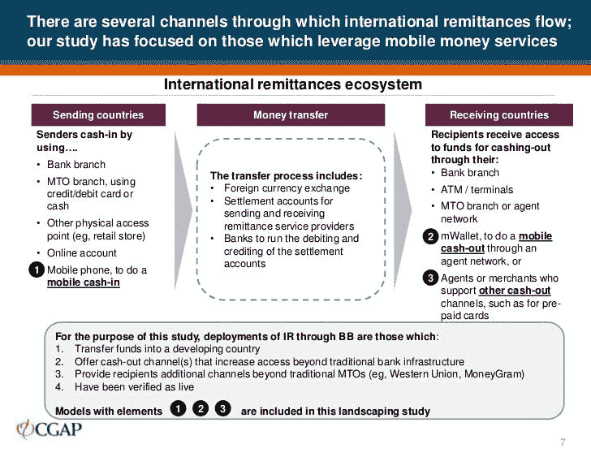
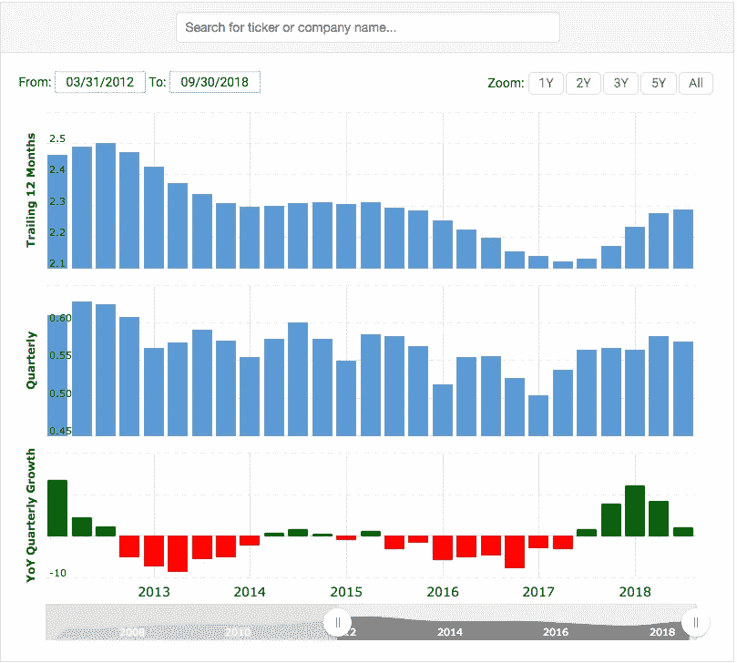
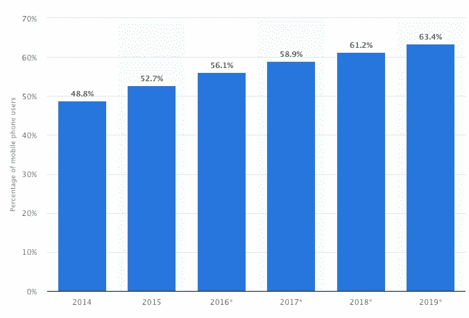
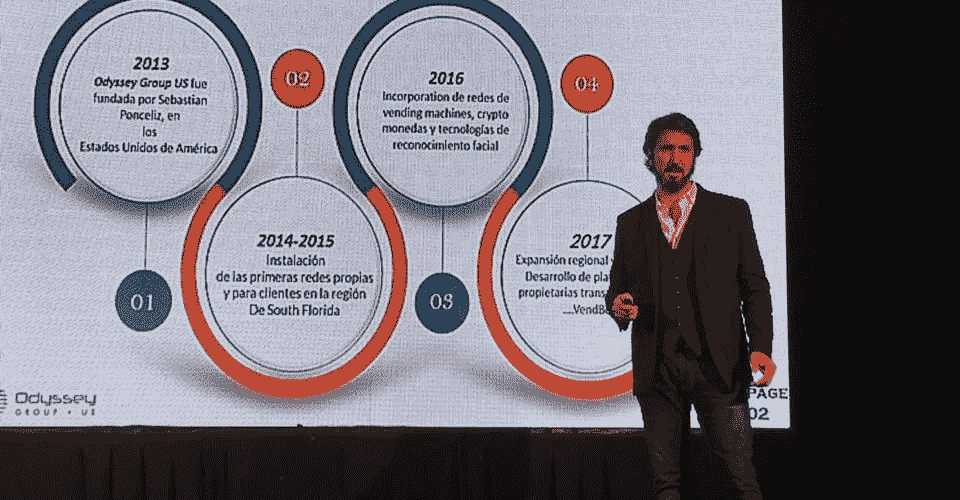
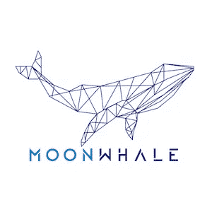

# 汇款&区块链——天作之合？

> 原文：<https://medium.com/hackernoon/remittance-blockchain-match-made-in-heaven-5f5ad8500a2>

汇款是移民工人将钱汇给自己国家的人。人们总是为了在高收入国家(或与本国相比货币价值较高的国家)寻找更好的工作前景而迁移。根据《2018 年世界移民报告》,目前估计有 2 . 44 亿国际移民生活在其他国家。这一数字直接或间接促成了全球 6890 亿美元的汇款行业，其中印度位居榜首，贡献了 800 亿美元或 11.6%。全球汇款行业**预计 2019 年增长超过 3%。**

# 传统汇款市场

当我们谈到汇款或向家庭汇款时，我们会想到西联汇款和速汇金等公司。

传统的汇款包括几个步骤，包括代理和柜台商店。移民工人通常来自金融基础设施欠发达的发展中国家。这导致了现金的实物转移。家庭可以在实体店接收汇款，如典当行或汇款公司的当地分支机构。

使用传统汇款服务的优势包括灵活性和便捷性。凭借其庞大的网络和遍布全球的 500，000 名代理人，西联汇款能够将资金汇往几乎没有互联网接入的偏远地区。

然而，通过传统方式汇款的代价可能很高。

1.  **高额费用**
    每笔汇款的费用可能高达 8-9 %,对于移民家庭来说，这可能是一笔不小的数目。
2.  缓慢的汇款可能需要几个星期才能到达目的地。
3.  **易受欺诈** **和盗用** [Venmo、](https://venmo.com/) PayPal 拥有的数字货币转账服务、[因支付欺诈损失约 4000 万美元](https://www.pymnts.com/digital-payments/2018/venmo-payment-fraud-transaction-loss-rate/)。

# 网上转账的兴起

技术的进步为我们提供了比手工汇款更好的选择。网上汇款是一种更安全、更快捷的汇款方式。TransferWise 和 Revolut 等公司席卷了整个行业，并被宣布为汇款行业的颠覆者。

然而，有一个事实依然存在。这些网上转账平台严重依赖手机渗透。在新兴经济体，大多数人都会拥有一部可以上网的手机。例如，柬埔寨是一个新兴市场，96%的柬埔寨人拥有手机。根据这一统计数据，每年有 150 万柬埔寨人作为移民工人在海外工作，每年向他们在柬埔寨的家人汇款 20 亿美元。

网上汇款带来的一个巨大缺陷或挑战是偏远地区缺乏互联网连接。如果没有一个可靠的互联网连接，除非这个国家自己想办法解决这个问题，否则什么也做不了。也许埃隆·马斯克可以通过他与 SpaceX 的太空互联网解决这种情况。

# 在线转账之后，区块链可能是汇款的未来

最受欢迎的加密货币是比特币。它被称为全球金融业的未来。比特币当然有成为世界数字货币的巨大潜力，但在此之前，需要做两件事之一:

1.  比特币变得更不稳定
2.  各地的产品和服务都变得以比特币而非法币定价

我们离那还有很长的路要走，因此，让我们把注意力放在它的底层技术上，而不是比特币:T2 区块链技术

让我们试着理解什么是区块链，为此，这里有一个视频:

现在你对区块链有了一个大致的概念，让我们看看区块链上的汇款是如何工作的。这里有一篇关于 Hackernoon 的精彩文章。

区块链技术的主要支持者认为它可以降低汇款服务的成本。有趣的事情正在幕后发生，区块链科技正试图取代当前金融服务业的集中化业务模式。金融机构和银行正在探索实施区块链的方法，以降低交易成本、提高交易速度、减少欺诈和消除第三方。

通过避开传统的中间商，区块链技术可以加快和简化跨境支付，让汇款变得更加实惠。跨境交易时，汇率波动可能导致损失，而区块链可以提供几乎有保障的实时交易。

分布式账本技术(Distributed Ledger Technology)或 DLT 可以作为新的跨境支付基础设施的支柱，这种基础设施可能会解决效率低下的问题，并提供更快、更安全、更实惠的服务。

## **汇款公司节省成本**

目前汇款的平均交易成本大约是每笔汇款的 4-5%。这一成本包括汇率差额、汇款方和收款方的中介费用、代理费用、管理费等。在汇出 500 美元时，20-25 美元将成为交易费用。像 TransferWise 这样的在线转账平台能够将成本降低到 1%。区块链可以把成本从 5%降到百分之几。这将大幅降低 300 亿美元的汇款成本，达到数千美元的荒谬水平，因此是一种有效的节约成本的方法。

## **与当前系统相比的神速**

 [## TechCrunch 创始人:在 Ripple 的 XRP 中发送 5000 万美元耗时 3 秒，成本 30 美分

### TechCrunch 创始人迈克尔·阿灵顿表示，XRP 是迄今为止将资金从世界一端转移到另一端的最佳方式

dailyhodl.com](https://dailyhodl.com/2018/08/06/techcrunch-founder-sending-50-million-in-ripples-xrp-took-3-seconds-cost-30-cents/) 

通常情况下，汇款可能需要几天到几周的时间，TransferWise 自称时间更快，因为它使用了一个在线平台。再次提及 Ripple 能够以 3 秒钟的惊人速度发送 5000 万美元是一个令人难以置信的壮举。

另一个例子是总部位于香港的区块链汇款平台 [Bitspark](https://www.bitspark.io/) ，它利用了 Bitshares 的区块链协议。他们能够以几美分的费用实现每秒 10 万笔交易。

# 创新需要时间

目前，大多数汇款客户对现有提供商的服务感到满意。过去几年，西联汇款的收入一直在增加，尽管增幅很小。这表明，尽管区块链技术和智能合约的兴起(甚至 TransferWise 等新玩家也进入了该领域)，传统的汇款服务提供商仍有需求。

根据 Macrotrend 提供的统计数据，西联汇款的毛利在 2012 年末达到峰值后一直在下降(顺便提一下，TransferWise 成立于 2011 年，但可能只是巧合？).有趣的是，吴的利润在 2018 年初开始上升，他们通过提高外汇汇率和专注于中小企业，为客户提供对冲和市场连接来实现这一目标。

尽管区块链具有革命性的潜力，但该技术需要时间才能完全成熟并被大多数人采用。当前的金融行业正试图彻底改革其系统，以适应和试验这一新兴技术，并教育当前的汇款人。

**移动渗透对在线汇款至关重要**

目前，预计 2019 年全球手机互联网普及率将增长至 60%以上。如此一来，世界很快就可以联网，给家人寄钱就像打电话一样简单。

随着世界变得更加互联，我们可以期待 TransferWise 和 Revolut 等公司取得巨大进展。随着他们的进步，区块链也会进步。

但是，另一个玩家进入了市场，渴望利用区块链技术扰乱全球汇款市场:

# 混合 ATM 和区块链技术

Sebastian Ponceliz, CEO of Odyssey Financial Group.

总部位于新加坡的区块链咨询公司[的](https://moonwhale.io/)[新闻稿](/moonwhale-blockchain-ventures/press-release-2-moonwhale-secures-important-corporate-client-odyssey-financial-group-b60d1a13188b)中，moonwale Ventures宣布了他们的下一个主要商业客户[奥德赛金融集团](http://odysseygroupus.com/)。他们将共同开发一个新的汇款系统，利用混合自动取款机和区块链技术，名为 **MoneyFi。**

MoneyFi 本质上将是一个由钱包和交易所组成的应用程序，便于货币转换。汇款将通过区块链技术公司处理。

奥德赛金融集团专门在全球部署自动取款机和比特币自动取款机。Odyssey 庞大的自动取款机网络在汇款游戏中具有巨大的优势，它有可能为欠发达地区缺乏互联网连接提供金融解决方案。毫无疑问，这将消除第三方代理向收款人汇款的需要。加上区块链的应用，资金转移可以近乎即时。

 [## 阿根廷将推出 4000 台以太币、比特币和莱特币自动取款机

### 阿根廷，那个被遗忘的阳光之地，似乎正试图赶上本世纪，除了…

www.trustnodes.com](https://www.trustnodes.com/2018/05/01/4000-ethereum-bitcoin-litecoin-atms-roll-argentina) 

奥德赛集团首席执行官 Sebastian Ponceliz 用西班牙语对当地媒体[发表评论:](https://www.infobae.com/economia/finanzas-y-negocios/2018/04/29/desembarca-en-argentina-una-red-de-cajeros-para-negocios/)

> “他们不仅仅是人们取钱的收银员，他们还将发行预付卡，可以用于电子商务、通过区块链转账、加密货币和小额信贷的微卡 linkeo。”

奥德赛金融集团已经预先同意在未来两年内安装 4000 台自动取款机。他们的自动取款机是为数不多的提供以太币和莱特币的自动取款机之一。Odyssey 准备用他们创新的 ATM 解决方案来应对庞大的全球汇款行业。

## 新的创新汇款模式前景光明。

创新往往以客户为中心，提供一种新产品或一种做增值事情的替代方式。纵观人类历史，我们一直在升级或改进任何现有的方法。它是唯一一种被经验证明会随着时间推移而升值的“货币”。

区块链当然可以成为汇款公司的资产。重要的是要记住，技术本身需要时间将理论付诸实际应用。我相信这一时刻比我们想象的要近。汇款和区块链，再好不过了。

非常感谢您的关注。感谢任何给文章的掌声，也请留下评论！

## 关于我:

Iliya Zaki 是 Moonwhale Ventures 的业务开发和营销官。

Moonwale Ventures 是一家 [STO 金融咨询公司](https://moonwhale.io/investment-platform/#third)，为公司提供关于 STO 流程&结构的战略建议，以及代币发行，包括生命周期管理和项目的二级市场上市。Moonwhale 还在建立一个端到端证券令牌(STO)投资平台，该平台将迎合寻求投资 STO 项目的投资者，以及寻求通过 STO 筹集资金以资助业务扩张或新企业的公司。

更多信息，请访问:[月鲸 STO 解决方案](https://moonwhale.io/investment-platform/#third)

[推特](https://twitter.com/MoonwhaleBV) | [领英](https://www.linkedin.com/company/moonwhalebv) | [脸书](https://www.facebook.com/MoonwhaleBV/) |

