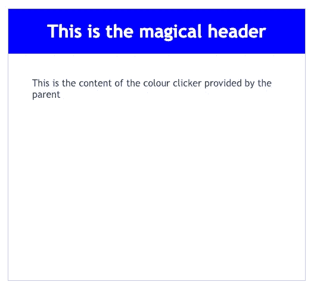
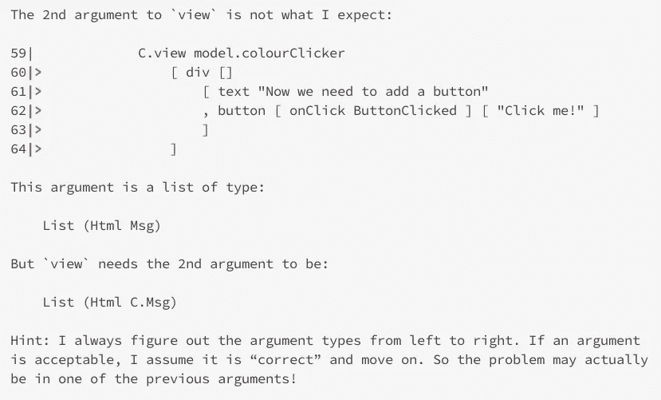
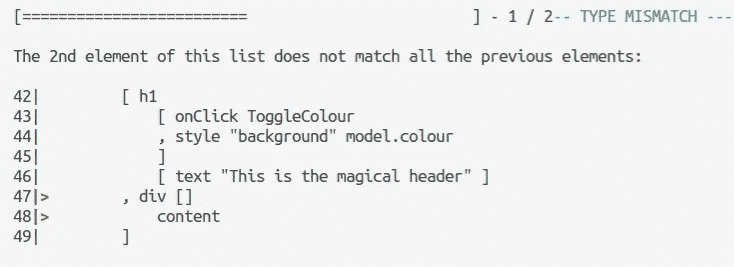

# 为榆树渲染道具

> 原文：<https://medium.com/hackernoon/render-props-for-elm-d5547efd66f5>

## 嗯，差不多吧。

这是一种常见的 UI 模式，在 Elm 中实现起来有点困难。类似 React 世界的渲染道具或者*的特效*，如果你已经逃离了棱角分明的世界。

这个想法是，你想创建一个通用组件来提供一些包装器用户界面和一点点状态管理，然后重用这个组件，但是在其中注入你自己的视图(渲染属性)。这种技术的一个很好的例子就是模态或者标签条。在这些情况下，您不希望每次都重写通用的标记和逻辑。一个模态有一个页眉和一个页脚，你需要跟踪它是打开的还是关闭的等等，但是当你*使用*时，你最关心的是你特定用例的内容。

# 那么问题出在哪里？

它在铅字里。让我们试着去做，我们会看到为什么它不能立即工作。为了简单起见，假设我的通用组件基本上只是一个 div，我希望能够呈现我的自定义容器组件，但将自定义 UI 注入其中。我的 div 将有一个标题，当你点击它时，它会改变颜色(这是它内部跟踪的状态，我想抽象掉)。

# 让我们试试吧

我们的 ColourClicker 组件将具有通常的 Elm 生命周期，因为它需要跟踪这一点点内部状态，它最初可能看起来像这样:

```
type alias Model =
    { colour : String }type Msg
    = ToggleColourinit : Model
init =
    { colour = "blue" }update : Msg -> Model -> Model
update msg model =
    case msg of
        ToggleColour ->
            toggleColour modeltoggleColour : Model -> Model
toggleColour model =
    case model.colour of
        "blue" ->
            { model | colour = "red" }
        _ ->
            { model | colour = "blue" }view : Model -> List (Html Msg) -> Html Msg
view model content =
    div
        [ class "colour-clicker" ]
        [ h1
            [ onClick ToggleColour
            , style "background" model.colour
            ]
            [ text "This is the magical header" ]
        , div []
            content
        ]
```

希望这不需要太多解释。view 函数只允许我们从消费代码中注入内容。

使用该组件的代码可能看起来有点像这样:

```
import ColourClicker as Ctype alias Model =
    { colourClicker : C.Model }init : ( Model, Cmd Msg )
init =
    ( { colourClicker = C.init }, Cmd.none )type Msg
    = ColourClickerMsg C.Msgupdate : Msg -> Model -> ( Model, Cmd Msg )
update msg model =
    case msg of
        ColourClickerMsg subMsg ->
            let
                subModel =
                    C.update subMsg model.colourClicker
            in
            ( { model | colourClicker = subModel }, Cmd.none )view : Model -> Html Msg
view model =
    div [ class "demo" ]
        [ h1 [] [ text "Demo of render props technique for Elm" ]
        , Html.map ColourClickerMsg <|
            C.view model.colourClicker
                [ div []
                    [ text "This is the content of the colour clicker provided by the parent" ]
                ]
        ]
```

最终结果看起来是这样的，并且工作正常:



# 新功能请求

现在假设我希望我注入的内容包含一个按钮，并且我希望在我的父组件中处理这个按钮的点击。像这样:

```
type Msg
    = ColourClickerMsg C.Msg
    | ButtonClickedupdate : Msg -> Model -> ( Model, Cmd Msg )
update msg model =
    case msg of
        ... ButtonClicked ->
            let
                _ =
                    Debug.log "Button Clicked!" ()
            in
            ( model, Cmd.none )view : Model -> Html Msg
view model =
    div [ class "demo" ]
        [ h1 [] [ text "Demo of render props technique for Elm" ]
        , Html.map ColourClickerMsg <|
            C.view model.colourClicker
                [ div []
                    [ text "Now we need to add a button"
                    , button [ onClick ButtonClicked ] [ text "Click me!" ]
                    ]
                ]
        ]
```

这是想做的一件合理的事情。我们不希望 ColourClicker 组件本身处理这个按钮单击，因为逻辑属于调用组件。ColourClicker 应该只对它自己的状态负责(即它的标题的颜色)。但是我们有一个问题。我们的 ColourClicker 的视图函数期望它的内容是类型`Html ColourClicker.Msg`，但是我们现在试图传入`Html Parent.Msg`，所以类型没有对齐，编译器(正确地)报错。



# 那么我们能做什么呢？

我们按照类型来。首先，我们必须让 ColourClicker 的视图函数接受多态类型的内容，如下所示:

```
view : Model -> List (Html parent) -> Html Msg
```

在这个签名中,“parent”是一个类型参数，表示我们不知道这个 Html 将具有什么类型。这消除了以前的编译器错误，但用一个新的错误代替了它。



现在的问题是我们的 ColourPicker 视图试图将`Html parent`嵌入到`Html ColourPicker.Msg`的块中，这是不允许的。因此，很明显，我们需要以某种方式映射传入的 Html，以将它强制转换为正确的类型。

为此，我们需要在 ColourClicker 中创建一个新的 Msg 类型，将父 Msg 类型映射到该类型，创建一个函数来执行映射，并在我们写出内容时调用该函数:

```
type Msg parent
    = ToggleColour
    | Parent parentwrap : Html parent -> Html (Msg parent)
wrap =
    Html.map Parentview : Model -> List (Html parent) -> Html (Msg parent)
view model content =
    div
        [ class "colour-clicker" ]
        [ h1
            [ onClick ToggleColour
            , style "background" model.colour
            ]
            [ text "This is the magical header" ]
        , div []
            (List.map wrap content)
        ]
```

我们所做的是*用多态父类型参数化*我们自己的消息类型，这样我们可以创建一个包含*父消息的消息类型的实例。请注意，所有这些对调用代码都是透明的，不会引入更多的复杂性。这使得类型排成一行，但这不只是一个技巧吗？我们的更新功能会发生什么变化？它需要进行如下更改:*

```
update : Msg parent -> Model -> ( Model, Cmd parent )
update msg model =
    case msg of
        ToggleColour ->
            ( toggleColour model, Cmd.none ) Parent p ->
            ( model, Task.perform identity (Task.succeed p) )
```

首先我们需要改变返回类型，允许我们返回一个`Cmd parent`。这很不寻常——通常应该是`Cmd Msg`。如果需要的话，我们也可以这样做*，但是在这种情况下，我们没有这样做。记住更新功能没有什么神奇的，它只是一个功能——我们可以做我们喜欢的事情。在处理新的`Parent parent`消息类型的 case 语句的分支中，我们简单地使用任务 api 将该消息转换成一个`Cmd`，并将其返回给调用者。*

*最后需要对父类的更新函数进行修改，以正确处理这个新的返回类型。现在看起来像这样:*

```
*case msg of
   ColourClickerMsg subMsg ->
       let
           ( subModel, subCmd ) =
               C.update subMsg model.colourClicker
       in
       ( { model | colourClicker = subModel }, subCmd )*
```

*从 update 函数出来的 subCmd 已经是直接从父 update 函数返回的正确类型。它最终将作为 ButtonClicked msg 反馈到更新函数中。*

*现在一切都编译了！我们有非常好的惯用语法，我们能够自然地处理父级的按钮单击，而 ColourClicker 组件对此一无所知。我们现在可以更有效地重用 ColourClicker 组件。*

*我很乐意听到解决这个问题的其他方法，因为我花了一段时间才弄明白这个问题，而且这似乎是一个很普遍的要求。*

*这个例子的代码可以在[这里](https://github.com/julianjelfs/elm-render-props)找到。希望这对某人有用。*