# Git 重置 101

> 原文：<https://medium.com/hackernoon/reset-101-ba05d9e3f2c7>


*Reset 可能是最难理解的*[*git*](https://hackernoon.com/tagged/git)*命令之一，此外还有一个危险的坏名声。这两种说法都有一个有效的理由:是的，重置* [*命令*](https://hackernoon.com/tagged/command) *有点难以理解，在某些情况下，这可能是危险的。但是，这并没有那么难。所以在这篇文章中，我会尽我所能给你一个清晰的，精炼的重置命令教程。为了使它简短而不至于让人不知所措，我抽象出了一些不重要的细节并简化了一些东西，但是如果你想了解更多关于 git 的内部工作方式，你也可以查看我的* [*理解 Git*](https://hackernoon.com/https-medium-com-zspajich-understanding-git-data-model-95eb16cc99f5) *系列来了解这里介绍的一些东西的更多细节。*

# Git 三

在我们深入研究`reset`命令之前，我们需要看一下 git 的树:工作目录、暂存区和存储库。


从 git 的角度来看，您可以将它们视为可以进行更改的三个领域:

*   工作目录——文件系统上的项目文件
*   临时区域—下一次提交的预览
*   repository—git 保存所有(过去的)提交的数据存储。

`reset`命令对这些三/区域进行操作，但是首先，让我们看看`add`和`commit`命令(我们日常使用的)如何影响这些区域。

假设我们有一个 web 应用程序，我们对我们的`index.php`文件做了一些重构。我们所做的更改会反映在工作目录中:

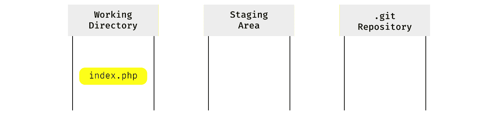

我们可以通过运行`git status`来确认这一点:

```
Changes not staged for commit:
  (use "git add <file>..." to update what will be committed)
  (use "git checkout -- <file>..." to discard changes in working directory)modified:   index.php
```

现在，我们通过使用`add`命令将这些更改移动到暂存区域:

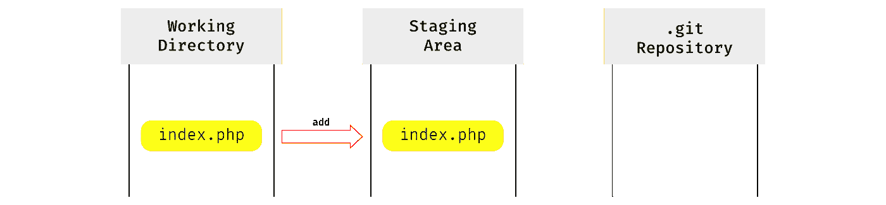

运行`status`命令会告诉我们:

```
Changes to be committed:
  (use "git reset HEAD <file>..." to unstage)modified:   index.php
```

因为`status`命令看到我们在工作目录和暂存区中有相同版本的`index.php`文件，但是在存储库中没有。

为了在那里添加它，我们使用`commit`命令:

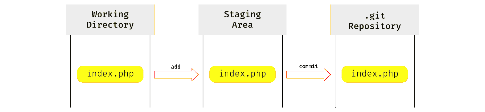

现在工作目录、暂存区和存储库都包含相同版本的`index.php`，运行`git status`会告诉我们有:

```
nothing to commit, working tree clean
```

因此，`status`命令的工作方式是，它比较工作目录、暂存区和存储库中的文件版本，如果有不同的版本，就要暂存/提交文件。

假设我们对`index.php`文件做了更多的重构，并再次执行整个添加/提交周期。

现在我们的工作目录、暂存区和存储库都将包含我们的`index.php`文件的新的第二个版本。

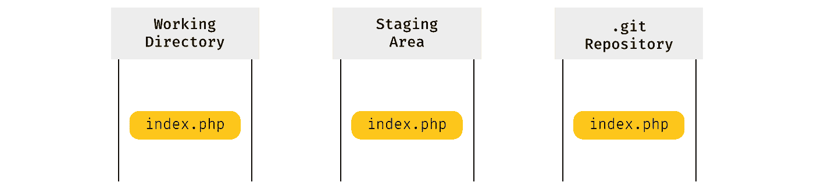

但是第一个版本呢？如果您还记得，我们说过存储库保存所有以前的提交，所以第一个版本的`index.php`仍然在那里:

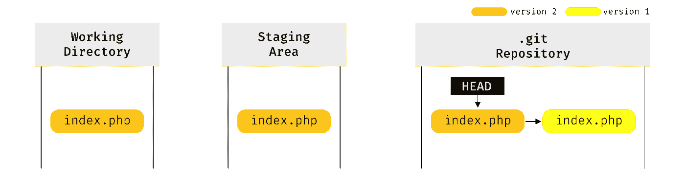

为了跟踪`index.php`文件的哪个版本是当前版本，存储库有一个名为`HEAD`的特殊指针，它指向当前版本(当与暂存区的版本进行比较时，`status`命令只查看`HEAD`指向的当前版本)。

现在我们已经了解了这一点，我们终于可以进入我们的`reset`命令，看看它是如何操作这些 git 区域(树)的内容的。

# 复位—软

第一种模式的`reset`命令只会做一件事:

*   移动`HEAD`指针

在我们的例子中，我们将通过运行以下命令将其移动到之前的提交(第一个版本的`index.php`):

```
git reset --soft HEAD~1
```

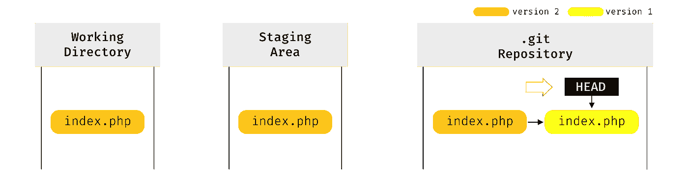

git 的树现在看起来像这样:

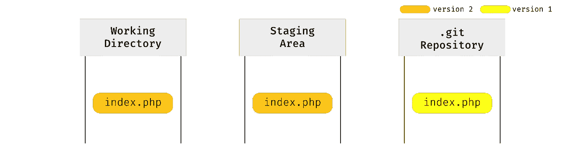

当我们运行`git status`时，我们会看到一条熟悉的消息:

```
Changes to be committed:
  (use "git reset HEAD <file>..." to unstage)modified:   index.php
```

因此，运行`git reset — soft HEAD~1`基本上撤销了我们的最后一次提交，但是包含在该提交中的更改并没有丢失——它们在我们的暂存区和工作目录中。

# 重置—混合

第二种模式的`reset`命令将做两件事:

*   移动`HEAD`指针
*   更新暂存区(使用`HEAD`指向的内容)

因此，第一步与`--soft`模式相同。第二步获取`HEAD`指向的任何内容(在本例中，它是`index.php` 文件的版本 1)并将其放入暂存区。

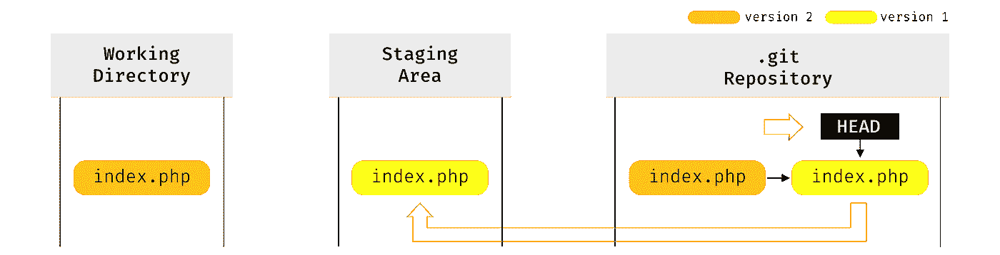

因此，在运行`git reset --mixed HEAD~1`之后，我们的区域看起来像这样:

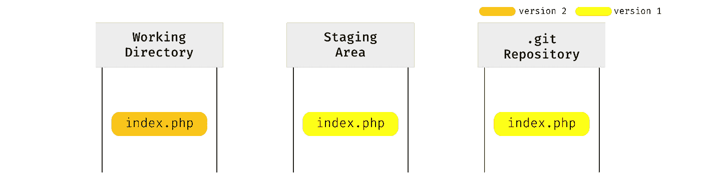

运行`git status`现在又给了我们一个熟悉的信息:

```
Changes not staged for commit:
  (use "git add <file>..." to update what will be committed)
  (use "git checkout -- <file>..." to discard changes in working directory)modified:   index.php
```

因此，运行`git reset — mixed HEAD~1`撤销了我们上一次的提交，但是这次提交后的更改(只)在我们的工作目录中。

# 重置—硬

现在是臭名昭著的硬模式。运行`reset — hard`将做三件事:

*   移动`HEAD`指针
*   更新临时区域(使用`HEAD`指向的内容)
*   更新工作目录以匹配临时区域

因此，前两步与`--mixed.`相同，第三步使工作目录看起来像暂存区(已经填充了`HEAD`指向的内容)。

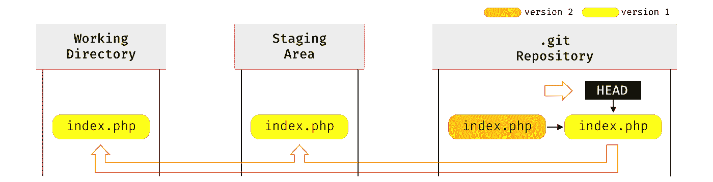

因此，在运行`git reset --hard HEAD~1`之后，我们的区域看起来像这样:

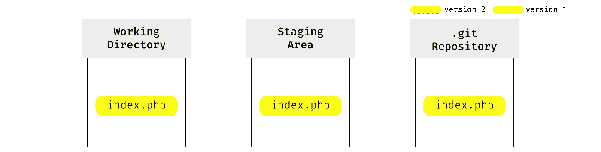

运行 git 状态给我们提供了:

```
nothing to commit, working tree clean
```

因此，运行`git reset — hard HEAD~1`已经撤销了我们的最后一次提交，并且该提交中包含的更改既不在我们的工作目录中，也不在暂存区中。但它们并没有完全消失。Git 不会从存储库中删除提交(实际上，有时会，但很少)，所以这意味着我们的第二个版本的提交仍然在存储库中，只是有点难以找到(你可以通过查看名为 *reflog* 的东西来跟踪它)。

那么，重置是危险的这个名声又是怎么回事呢？嗯，有一种情况下，一些更改可能会永久丢失。考虑这样一个场景，在第二次提交之后，您对您的`index.php` 文件做了更多的更改，但是您没有暂存和提交它们:

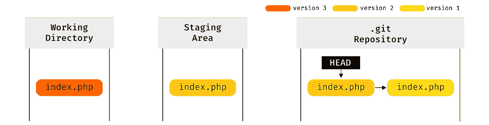

现在你跑`git reset --hard HEAD~1`:

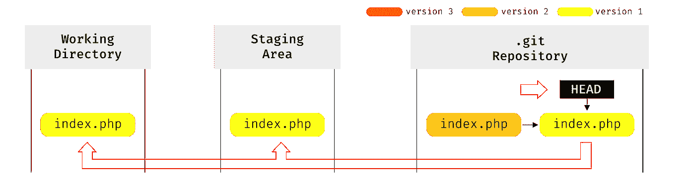

由于`reset --hard`覆盖了您的工作目录的内容以匹配暂存区(它已经与`HEAD`相匹配),并且您从未暂存和提交您的更改，因此没有提交存储库中的那些更改，所有这些更改现在都将及时丢失……就像雨中的眼泪。

硬重置的危险在于它不是工作目录安全的——这意味着如果您的工作目录中有文件更改，并且在您运行它时会被覆盖(和丢失)，它不会给你任何警告。所以在硬重置时要格外小心。

这就是你要的——重置命令。我希望我解释得很好，并且你会同意这并不困难。是的，它可能是危险的，但只有在与`--hard`选项一起使用时。

正如开始所说，如果你想知道更多关于 git 的内部工作原理，你可以查看我的 [*理解 Git*](https://hackernoon.com/https-medium-com-zspajich-understanding-git-data-model-95eb16cc99f5) 系列，如果你想更深入地了解复位命令，你可以查看 Scot Cachon 的 git pro 书中的 [git 复位揭秘](https://git-scm.com/book/en/v2/Git-Tools-Reset-Demystified)章节。

# **附录:**

*   在示例中，我们使用了`HEAD~1`作为`reset`命令的参数。正如您可能已经知道的，git 中的每个提交都有一个唯一的标识符，称为*校验和*，我们可以使用它作为 reset 命令的参数来重置特定的提交


*   为了简化示例，我们只编辑和提交了一个文件，实际上，我们经常提交多个文件，所以一个特定的提交包含多个文件的不同版本。


*   特殊的`HEAD`指针通常不直接指向提交(为简单起见，如示例所示)，而是指向一个分支指针，然后该分支指针指向一个特定的提交

