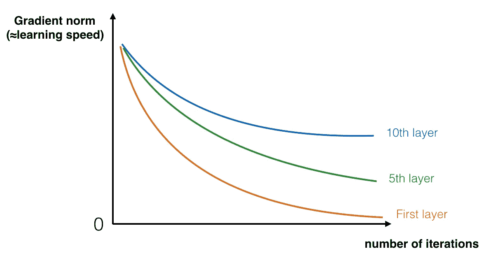
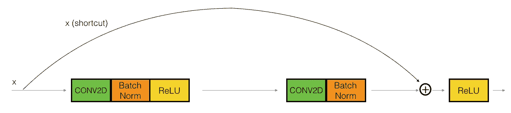
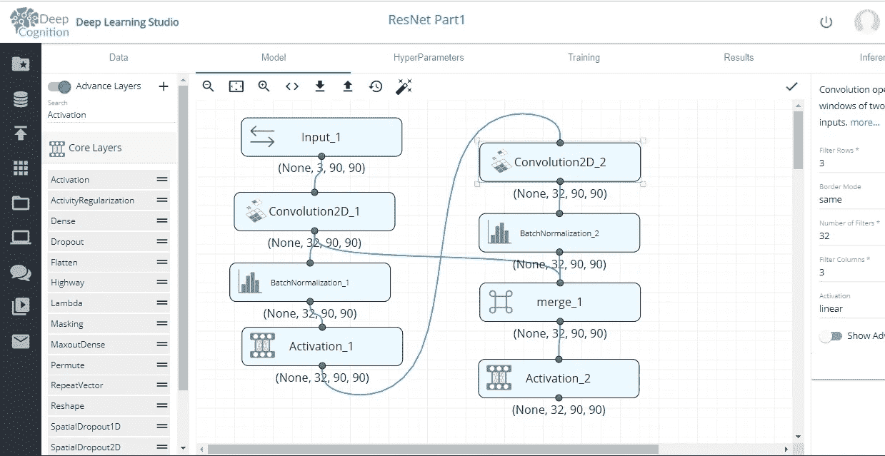
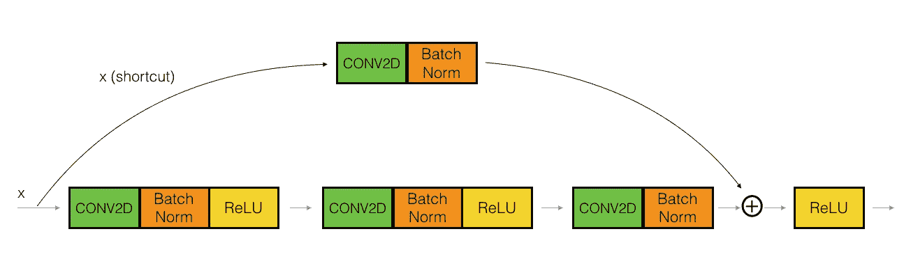
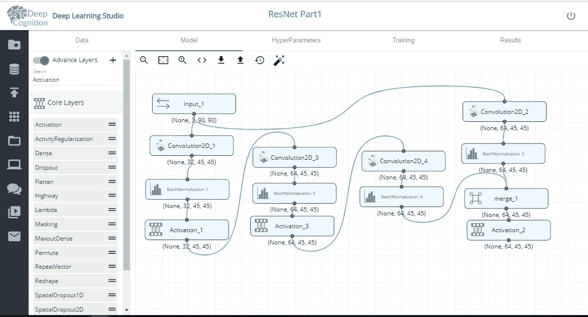

# ResNet:使用深度学习工作室进行块级设计|第 1 部分|

> 原文：<https://medium.com/hackernoon/resnet-block-level-design-with-deep-learning-studio-part-1-727c6f4927ac>

# 1 —深度神经网络的问题

非常深的网络的主要好处是它可以表示非常复杂的功能。它还可以学习许多不同抽象层次的特性，从边缘(较低层)到非常复杂的特性(较深层)。然而，使用更深的关系网并不总是有帮助的。训练它们的一个巨大障碍是梯度消失:非常深的网络通常有一个梯度信号，它很快变为零，从而使梯度下降慢得令人无法忍受。更具体地说，在梯度下降过程中，当您从最后一层反向投影回第一层时，您在每一步上都乘以权重矩阵，因此梯度可以按指数规律快速下降到零(或者，在极少数情况下，按指数规律快速增长并“爆炸”以获得非常大的值)。

 [## 爆炸和消失的梯度问题:真相背后的数学

### 你好星尘！今天我们将看到爆炸和消失梯度问题背后的数学原因，但首先让我们…

hackernoon.com](https://hackernoon.com/exploding-and-vanishing-gradient-problem-math-behind-the-truth-6bd008df6e25) 

因此，在训练过程中，随着训练的进行，您可能会看到早期层的梯度幅度(或范数)非常快地下降到零。

# 2 —构建剩余网络

在 ResNets 中,“快捷方式”或“跳过连接”允许渐变直接反向传播到更早的层:

ResNet 中使用两种主要类型的块，主要取决于输入/输出维度是相同还是不同。你将在 DLS 实施这两项计划。

我们将实现类似于他们的研究论文中提到的 resnet 块。这不准确。

# 2.1 —身份模块

标识块是 ResNets 中使用的标准块，对应于输入激活(比如 a[l])与输出激活(比如 a[l+2])具有相同维数的情况。为了充实 ResNet 的 identity 块中发生的不同步骤，下面是显示各个步骤的另一个图表:

**Identity block.** Skip connection “skips over” 2 layers.

上面的路径是“快捷路径”较低的路径是“主路径”在该图中，我们还明确了各层中的 CONV2D 和 ReLU 步骤。为了加快训练速度，我们还增加了一个 BatchNorm 步骤。批次归一化必须沿通道轴进行(模式=1)。

要了解更多关于 DLS 的信息:

 [## 鸢尾属分类|DeepCognition| Azure ML studio

### 界:植物界分支:被子植物目:天冬目:鸢尾科亚科:环烯醚萜族:环烯醚萜属:鸢尾

towardsdatascience.com](https://towardsdatascience.com/iris-genus-classification-deepcognition-azure-ml-studio-4b930f54435a) 

为了实现下面的，你可以从 DLS 选择任何数据集。

**Identity Block ResNet**

以下是各个步骤。

主路径的第一部分:

*   第一个 CONV2D 具有(F1，F1)个滤波器，其形状为(1，1)，跨距为(1，1)。它的填充是“有效的”。
*   第一个批处理规范是标准化通道轴。
*   然后应用 ReLU 激活功能。这没有名字，也没有超参数。

主路径的第二部分:

*   第三个 CONV2D 具有(32，32)个形状为(1，1)且跨距为(1，1)的滤波器。它的填充是“有效的”。
*   第三个批处理规范是标准化通道轴。

最后一步:

*   快捷键和输入被加在一起。
*   然后应用 ReLU 激活功能。这没有名字，也没有超参数。

# 2.2 —卷积块

您已经实现了 ResNet 标识块。接下来，ResNet“卷积块”是另一种类型的块。当输入和输出尺寸不匹配时，可以使用这种类型的块。与 identity 块的不同之处在于快捷路径中有一个 CONV2D 层:

**Figure 4** : **Convolutional block**

快捷路径中的 CONV2D 层用于将输入 x 的大小调整为不同的尺寸，以便在将快捷路径值添加回主路径所需的最终添加中尺寸匹配。例如，要将激活维度的高度和宽度减少 2 倍，可以使用步长为 2 的 1x1 卷积。快捷路径上的 CONV2D 层不使用任何非线性激活函数。它的主要作用是应用一个(学习的)线性函数来减少输入的维数，以便维数为后面的加法步骤匹配。

卷积块的细节如下。

**(您可以根据您的数据集选择 f、F1、F2、F3 的值)**

主路径的第一部分:

*   第一个 CONV2D 具有形状为(1，1)的(F1，F1)个滤波器，跨距为(s，s)。
*   第一个 BatchNorm 正在归一化通道轴(mode=1)。
*   然后应用 ReLU 激活功能。这没有名字，也没有超参数。

主路径的第二部分:

*   第二个 CONV2D 具有(f，f)的(F2，F2)滤波器和(1，1)的跨距。
*   第二个批处理规范是标准化通道轴。
*   然后应用 ReLU 激活功能。这没有名字，也没有超参数。

主路径的第三部分:

*   第三个 CONV2D 具有(1，1)的(F3，F3)滤波器和(1，1)的跨距。
*   第三个 BatchNorm 是归一化通道轴(mode=1)。注意，这个组件中没有 ReLU 激活函数。

快捷路径:

*   CONV2D 具有形状为(1，1)的(F3，F3)滤波器和跨度为(s，s)的滤波器。它的填充是“有效的”。
*   BatchNorm 正在规范化通道轴(模式=1)。

最后一步:

*   快捷方式和主路径值相加。
*   然后应用 ReLU 激活功能。这没有名字，也没有超参数。

如果你喜欢这篇文章，请👏和分享😄。更多关于深度学习的文章请关注我的**[**LinkedIn**](https://www.linkedin.com/in/maniksoni/)。**

**请订阅我的 YouTube 频道:**

** [## AI 与 MANIK

### AI 又回来了！

www.youtube.com](https://www.youtube.com/channel/UCNrS8D0rHKh8k2SU8oDY4Hg?view_as=subscriber?&ab_channel=AIwithMANIK) 

感谢阅读😃

祝你幸福。**