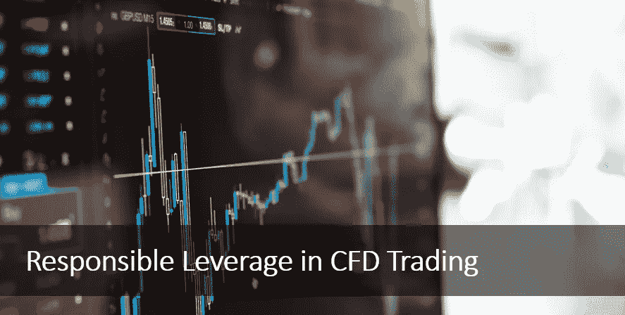
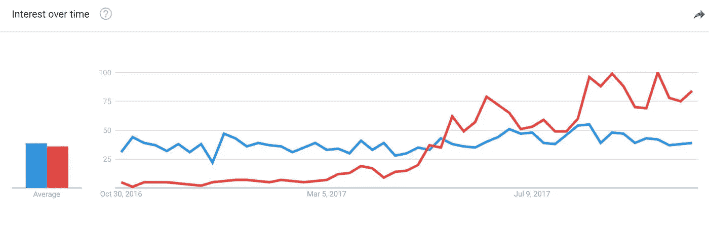
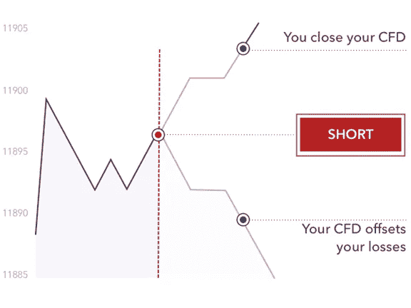
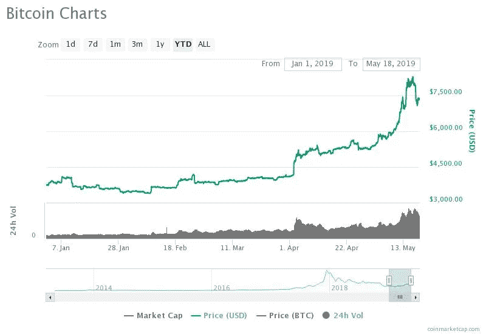
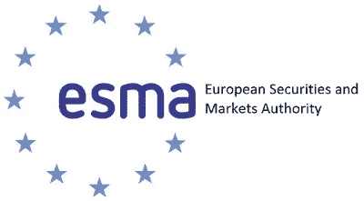
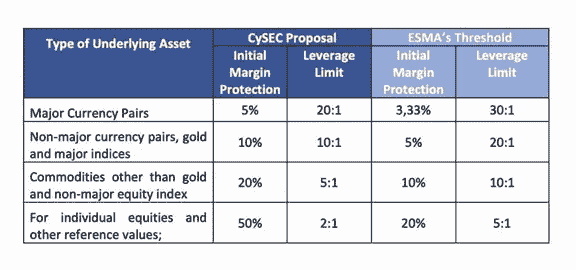

# 负责任的杠杆作用:差价合约交易和目前的监管状况

> 原文：<https://medium.com/hackernoon/responsible-leverage-cfd-trading-and-the-current-state-of-regulations-b21e9de66bf4>

## 外汇和加密货币经纪商应如何适应 FCA、ESMA 和 ASIC 法规的最新变化？

从历史上看，专业交易者受到不断变化的监管环境的影响，尤其是偏好杠杆产品的交易者。这一直是两方的战斗:经纪人与监管者，经纪人希望提供交易者最想要的产品，监管者希望保护交易者免受不相称的风险。

全球最受欢迎的交易产品之一是差价合约。

## 什么是差价合约？

[差价合约(CFD)](https://www.investopedia.com/articles/stocks/09/trade-a-cfd.asp) 交易日益成为最受欢迎的衍生品交易形式之一。该工具允许交易员对外汇、股票或大宗商品等基础资产的价格涨跌进行投机。

最近，加密货币社区尤其对衍生品交易表现出越来越大的兴趣:

[The red line represents the community’s interest in CFD trading, while the blue line represents their interest in cryptocurrency trading.](https://www.financemagnates.com/thought-leadership/consolidating-crypto-challenges-opportunities-cfd-brokers/) Source: Google Trends

> “加密交易行业在保证金交易方面没有太多经验，但这是交易员需要的东西。”来源:[金融巨头](https://www.financemagnates.com/thought-leadership/consolidating-crypto-challenges-opportunities-cfd-brokers/)

CFD 交易不涉及基础资产的实际买卖。相反，它是一种对资产未来价格进行投机并从价格变动中获利的工具。

这尤其引起了加密货币交易社区的兴趣，因为它允许交易者减轻由私钥/公钥管理不善导致的不必要的风险。

“The safest way to trade [cryptocurrencies], without the need to bear the risk of storing digital assets, is to opt for crypto CFDs.” Source: [Bitcoinist](https://bitcoinist.com/how-to-choose-the-best-crypto-cfd-for-you/)

# **为什么要交易差价合约？**

差价合约为所有类型的交易者提供了巨大的优势，这也使得差价合约在金融界越来越受欢迎。一些优势包括:

## **杠杆**

杠杆允许交易者用交易总价值的一小部分进行交易，从而使他们的初始资本发挥到最大。交易者只需缴纳初始保证金(总价值的一部分)，即保证金。保证金金额取决于头寸的大小和交易的基础资产。

## **卖空能力**

CFD 交易是交易者在下跌市场中获取利润的少数途径之一。如果交易者能够准确预测价格运动的方向，他们就能在上涨和下跌的市场中获利。这种灵活性使得差价合约对交易者来说很有吸引力。

## **套期保值**

对冲是金融成功的关键要素之一。差价合约允许交易者对冲他们的实物投资组合。例如，如果交易员认为股票市场处于低迷状态，他可以利用差价合约建立空头头寸。如果他们是正确的，他们可以赚取利润，抵消实物投资组合的损失。即使预测不准确，交易者也可以平仓 CFD 头寸，并用未来收益抵消损失。

“[Benefits of CFD trading”](https://www.ig.com/au/cfd-trading/benefits-of-trading-cfds) Source: IG

> CFD 交易的一些其他好处是能够进入各种各样的市场、低成本、流动性和税收效率。

# **CFD 的内在风险是什么？**

就像任何高级交易工具一样，交易者必须小心与 CFD 交易相关的一些内在风险:

## **过度交易**

CFD 交易以其低成本结构和低初始资本投入，使得交易者非常容易陷入过度交易陷阱。这实质上意味着他们将投资组合的大部分暴露给市场，超过了他们的资本在万一发生损失时所能弥补的。如果交易员的头寸被证明是错误的，他们可能会损失很大一部分资金。

## **隔夜融资**

隔夜融资指的是交易员维持其未平仓头寸的每个交易日的掉期利率。如果长期持有未平仓头寸，这些成本可能会吃掉很大一部分利润或导致亏损。简而言之，除了一些例外，差价合约最好被视为一种短期工具。

## **缺乏所有权**

正如我们前面提到的，CFD 交易并没有赋予交易者基础资产的所有权。对于 CFD，仪器本身没有内在价值。虽然纯粹从交易的角度来看，这可能很方便，但从长期来看，持有一项资产以增强投资组合，从而避免引发掉期利率，是有意义的。

例如，在 2018 年熊市最严重的时候持有比特币的交易者，将从加密货币市场最近的复苏中获得良好的回报，否则与差价合约相关的隔夜融资费用将会减少。

[“With a 98 percent gain year-to-date, bitcoin has outperformed most assets in 2019.”](https://www.ccn.com/monster-100-2019-gain-bitcoin-rally-is-just-beginning)

# **监管机构有什么说法？**

由于差价合约和杠杆交易的内在风险，监管也在不断发展。交易员和经纪商需要密切关注监管规定，以确保他们不会被抓错脚。让我们看看全球监管机构采取的一些方法:

## **FCA**

金融行为监管局(FCA)是英国金融市场和金融服务公司的监管机构。其战略目标是确保监管保护消费者和市场，同时促进国内竞争。

FCA 最初对 CFD 行业采取强硬立场，实施临时限制。然而，它现在已经对可用于 CFD 交易的杠杆设置了上限。根据资产类别的不同，所有金融产品的最大杠杆率将在 30:1 至 2:1 之间。

[FCA Delays Issuing New CFD Rules Until “Summer 2019”](https://www.financemagnates.com/forex/regulation/fca-delays-issuing-new-cfd-rules-until-summer-2019/)

CFD 交易员预计新规则将于 2019 年 4 月出台，但 [FCA 推迟了新规则的发布](https://www.financemagnates.com/forex/regulation/fca-delays-issuing-new-cfd-rules-until-summer-2019/)。就目前情况来看，目前的规则是临时性的，每三个月更新一次。

## **ESMA**

欧洲证券和市场管理局(ESMA)是欧盟的金融监管机构。它与欧洲金融监管体系成员的监管机构和其他主要金融机构密切合作。

[ESMA 去年宣布了新的措施](https://www.esma.europa.eu/press-news/esma-news/esma-agrees-prohibit-binary-options-and-restrict-cfds-protect-retail-investors)，引入了一系列变化，如对新头寸的杠杆限制、引入维持保证金、负余额保护和标准化警告声明等要求。

当前的杠杆限额如下:

主要货币对 30:1；

非主要货币对、黄金和主要指数为 20:1；

黄金以外的商品和非主要股票指数为 10:1；

个别股票和其他参考价值为 5:1；

加密货币为 2:1。

这些限制[最近被更新](https://www.regulationtomorrow.com/eu/esma-renews-restriction-on-cfds-for-further-three-months-from-may/)，并将持续到 2019 年 8 月 1 日。

值得注意的是塞浦路斯证券交易委员会采取的办法。与 ESMA 相反，CySEC 提出了一种基于风险的杠杆方法。具有不同经验水平的客户将被划分到不同的细分市场，并能够使用不同的杠杆。这将取决于投资者的知识水平和风险偏好。

“[CySEC Proposes Three Tiers of Leverage for Retail Clients](https://www.financemagnates.com/forex/brokers/breaking-cysec-proposes-three-tiers-of-leverage-for-different-retail-clients/?utm_source=newsletter&utm_campaign=breaking&utm_source=Finance+Magnates+Newsletter&utm_campaign=4b05244d91-EMAIL_CAMPAIGN_2019_05_30_10_06&utm_medium=email&utm_term=0_686f8f22ac-4b05244d91-284892761)”. Source: Finance Magnates

此外，市场上层的零售客户也将获得略高的杠杆限额。

## **ASIC**

澳大利亚证券和投资委员会(ASIC)是澳大利亚首要的金融监管机构。除其他优先事项外，它促进和改善金融系统的绩效，促进投资者的参与，并执行法律。

分析师认为，在对海外经纪商提供的非法杠杆外汇交易感到担忧后，ASIC 可能会效仿 FCA 和 ESMA 的做法。

到目前为止，该地区的监管环境对此类工具更加开放。该地区作为寻求提供受监管保证金交易的经纪商的避风港的声誉，也为非法和/或不透明的经纪行为打开了大门。例如，一些[场外衍生品发行商](https://financefeeds.com/asic-warns-some-brokers-try-to-avoid-overseas-cfd-offering-restrictions/)正在招揽境外客户在他们那里开户，以避免海外干预措施，并向他们提供更高的杠杆。

这些担忧使 ASIC 在如何推广负责任的杠杆交易方面处于有利地位。[澳大利亚政府最近通过了 2019 年国库法修正案](https://www.investordaily.com.au/analysis/44829-asic-powers-present-a-chance-to-address-responsible-leverage)，允许 ASIC 对发行给散户投资者的产品设置负责任的杠杆限制，就像 ESMA 一样。

[ASIC reminds firms about changes to CFD, margin FX transactions reporting](https://financefeeds.com/asic-reminds-firms-about-changes-to-cfd-margin-fx-transactions-reporting/)

最近， [ASIC 向金融公司](https://financefeeds.com/asic-reminds-firms-about-changes-to-cfd-margin-fx-transactions-reporting/)发出了一份关于差价合约、保证金外汇和场外衍生品交易报告变化的提醒。变更涉及排除衍生产品的确定，要求使用“生命周期”方法，而不是日终“快照”方法向衍生产品交易库报告这些交易。

澳大利亚也可能很快出台更强有力的措施来保护交易者和投资者。

# **负责任的杠杆原则**

围绕 CFD 交易的监管现状源于对不负责任地使用杠杆交易的担忧，杠杆交易给散户交易者带来了巨大风险。

在这种情况下，保持杠杆交易的最佳实践是谨慎的。多年来，负责任的杠杆一直是讨论的热门话题，可以归纳为以下核心原则:

## **过度教育**

企业需要确保交易者充分了解所涉及的风险，不仅要了解保证金交易需要什么，还要了解如何以负责任的方式进行交易。

这应该被视为一个持续的过程，包括在他们从新手成长为专业人士的交易过程中的再教育。

> 经纪人需要在一开始就向交易者披露所有涉及的资本风险。

## **将交易者的利益放在首位**

经纪人需要确保他们以最大的诚信为客户服务，即使这意味着在允许利用的现金流方面开始保守。

不是所有的交易者都能承受全部的杠杆能力，即使它在监管限制之内，而确保这一点是经纪人的责任。客户应该能够以最小的经济和情感压力应对动荡时期。

> 经纪人需要对他们的预测保持保守，并确保他们向客户提供足够的多样化。

## **超过监管要求**

基于前面的观点，即只向受过教育并有能力处理风险的交易者提供充分的杠杆能力，经纪人也有责任建立自己的教育和杠杆兼容性的专业标准。

> 经纪人需要确保他们不仅遵守，而且超过各自辖区的监管要求。

# **券商应该如何适应？**

零售经纪业不断变化的监管格局可能会导致整个行业的整合效应。

新规定可能会导致客户数量减少，交易量和收入随之下降。分析师还预测，更多的券商将从做市商模式转向直通式处理模式，以便轻松应对这些新规定。

## **了解直通式处理(STP)**

与做市商不同，直通式交易经纪商没有交易台，直接将客户订单传递给其流动性供应商。这些机构可能是银行、对冲基金，甚至是实际上是交易对手的其它经纪商。STP 经纪商只能通过小额佣金或提高利差来赚钱。

尽管做市商即使在客户亏损的情况下也能盈利，但直通式处理经纪商无论盈利还是亏损都能获得相同的金额。在某些情况下，当客户通过收取更高的费用获利时，直通式处理经纪商可以赚更多的钱。这确保了没有利益冲突。STP 的其他优势包括更快的订单处理、最佳价差和无重复报价。

由于 STP 经纪商的盈利模式是基于交易量的佣金，而不是客户的损失，因此该行业也可能会转向产品供应和交易工具的多样化，以确保零售交易商的持续盈利能力和寿命。

## **结论**

各种监管方法原则上是对 CFD 领域的认可，尽管存在某些限制。

虽然一些市场参与者的不良行为和散户投资者面临的风险迫使监管机构采取谨慎的态度，但我确实相信，随着负责任的杠杆操作的实施，长期来看，该领域将会有更多的监管放松。

 [## Marcus Tan-brocta gon fin tech Group | LinkedIn 营销和业务发展总监

### 加入 LinkedIn 我每天的工作都围绕着为金融科技和……

www.linkedin.com](https://www.linkedin.com/in/marcustanyh/)