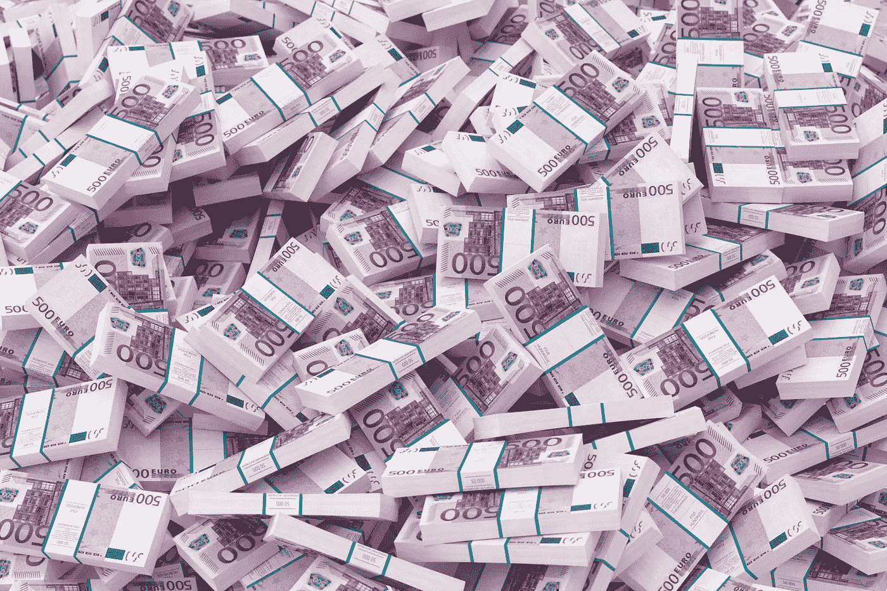

# 对于€3M 公司的估价，ReTest 每月必须开具 83，333 份订阅的发票

> 原文：<https://medium.com/hackernoon/retest-must-invoice-83-333-subscriptions-per-month-for-its-3m-valuation-99cee59da84a>

德国[启动](https://hackernoon.com/tagged/startup) [复试](https://retest.de/)刚养的 [€600K](https://twitter.com/retest_en/status/1110203448048451584) 起[高新 grunderfonds](https://high-tech-gruenderfonds.de/en/#title)(HTGF)。

ReTest 向开发测试人员和经理出售其软件测试工具的订阅，€每月 15 美元(€每年 150 美元)。

# 估价

假设 ReTest 向 HTGF 出售了 20%的股权。

那么它们在€的估值为 60 万英镑/20% =€300 万英镑。

每月有多少订阅必须重新测试发票，以评估€3M [的价值](https://hackernoon.com/tagged/valuation)？

# 出口

HTGF 将这笔投资称为种子轮投资。

假设他们想从赢家身上赚 10 倍。

HTGF 需要 2x 来补偿稀释。

然后，他们希望从投资中获得 10 * 2 = 20 倍的回报。

而 ReTest 需要€3M * 20 =€6000 万的退出价值，才能得到€3M 的估值。

# 收入

假设重新测试的交易价格是退出时 12 个月收益的 4 倍。

并且在出口处没有现金和债务。

那么，他们需要€6000 万英镑/ 4 月 12 日=€130 万英镑的平均月收入，才能实现€300 万英镑的估值。

# 捐款

ReTest 向开发测试人员和管理人员€收取每月 15 英镑的订阅费。

然后，他们必须在退出时为他们的€3M 估值开具平均每月 130 万€/€15 = 83333 订阅的发票。

# 自己动手

不同的假设？

复制一份用于这篇文章的[电子表格](https://docs.google.com/spreadsheets/d/1lWxMxGITQ6d0CRRSPJl6y2110df6pyjgqZyuGmBim2Q/edit?usp=sharing)(文件>复制一份…)，加入你的假设并得出你自己的结论。

*原载于 2019 年 3 月 27 日*[*venturevalue.com*](https://venturevalue.com/retest-must-invoice-83333-subscriptions-per-month-for-its-e3m-valuation/)*。*