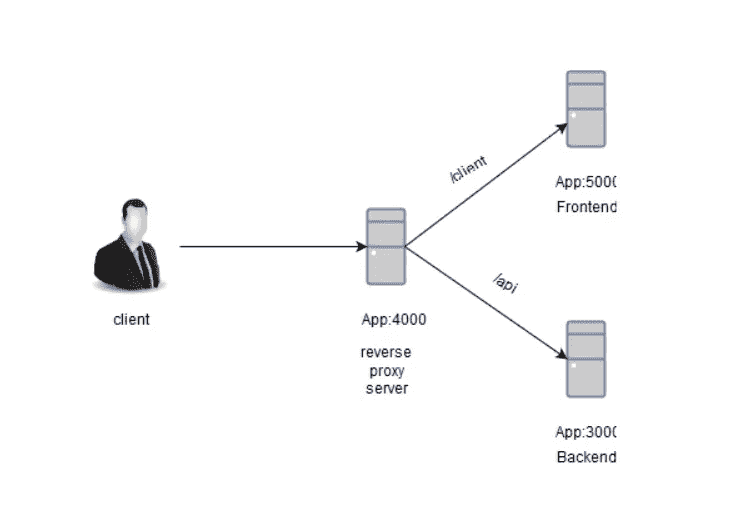

# 使用 Express 服务器的反向代理

> 原文：<https://medium.com/hackernoon/reverse-proxy-using-express-server-1f1b0b5a6e67>

我经常在我的服务器上运行多个应用程序，并且经常从同一个域名提供后端和前端服务。因此，让我们深入探讨如何服务后端和前端应用程序，基本上是两个不同的应用程序通过一个域在不同的端口上列出。



Made with [https://www.draw.io/](https://www.draw.io/)

如上图所示，后端运行在 3000 端口上，前端运行在 5000 端口上。如果客户端在端口 4000(反向代理服务器)上运行的应用程序上发送请求，它将查找 URL 是否以/api/*结尾的目标。它会将请求转发到后端(3000)，如果 URL 以/client/*结尾。它会将其转发到前端(5000)。

我们将使用 Express 服务器来构建我们的代理服务器。为了运行 express 服务器，您将最新版本的 node 安装在您的机器上。从这里下载并安装它。现在转到您想要创建这个反向代理服务器的项目目录，并运行以下命令。

```
npm init
npm install express
npm install express-http-proxy
npm install request
```

您将看到 package.json 创建在您的项目目录中。现在创建 server.js 文件，并将下面的代码粘贴到其中。

```
const proxy = require('express-http-proxy');const app = require('express')();const express = require('express')const request = require('request');app.use('/api', proxy('http://localhost:3000')); // this will proxy all incoming requests to /api route to back endapp.use('/client', proxy('http://localhost:5000')); // this will proxy all incoming requests to /client route to front endapp.listen(4000, () => { request('http://localhost:5000', function (err, res, body) { if(err === null){ console.log('backend is reachable from proxy server') }
    else{ console.log('backend is not reachable from proxy server') } }); request('http://localhost:3000', function (err, res, body) { if(err === null){ console.log('frontend is reachable from proxy server') }
   else{ console.log('frontend is not reachable from proxy server') } });});
```

现在是最简单的部分，只需运行下面的命令来运行代理服务器，并确保您的后端和前端在那个时候是活的。

```
node server.js // you can user forever or pm2 to run it in infinite loop
```

如果您现在从一个端口提供两个不同的应用程序，那就好了。

一如既往，这里有一些编程幽默给你


Stop it Patrick, you’re scaring him 😄