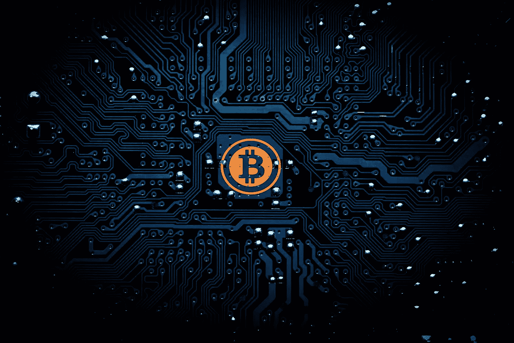
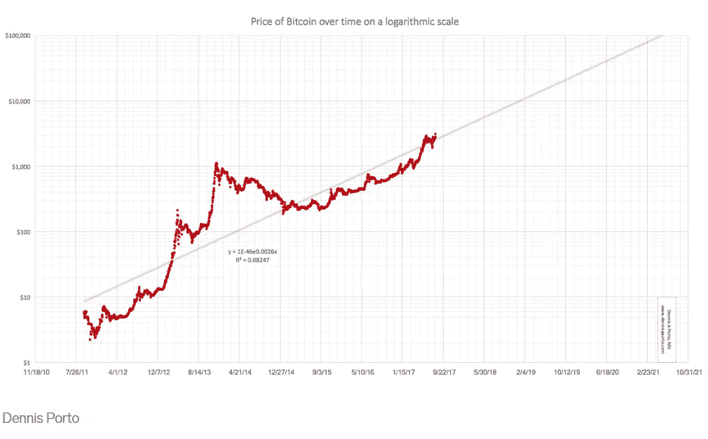
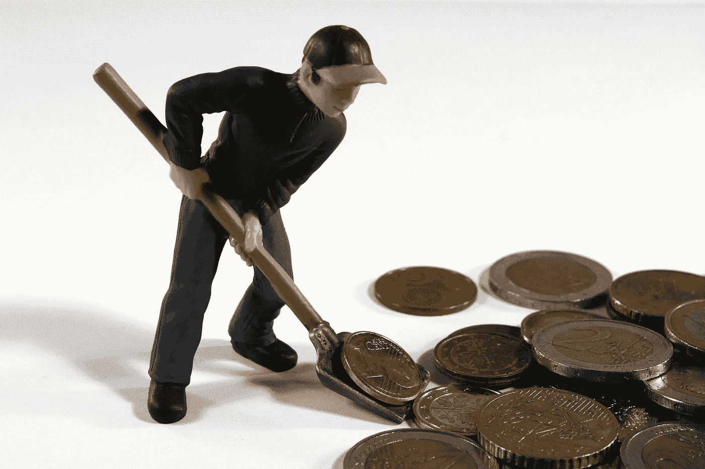

# 重温比特币和摩尔定律

> 原文：<https://medium.com/hackernoon/revisiting-bitcoin-and-moores-law-8fffb77e9ab2>

这两者之间有关系吗？

Why is Bitcoin linked to Moore’s law?

从约翰·迈克菲到沃伦·巴菲特，每个人似乎都对比特币的发展方向有自己的看法，观点大相径庭。在当前持续的熊市中，怀疑论者对比特币的判断似乎被证明是正确的。

而看好比特币的人则宣扬牛市终将回归，理由有几个，比如机构资金进入、闪电网络的发展以及更多商家接受比特币作为支付方式。随着委内瑞拉等国家继续经历恶性通货膨胀并开始购买比特币，大规模采用将迟早到来。

你可能已经听到了吧？我猜你已经听了很长一段时间了，尤其是如果你已经在这个领域呆了很长一段时间。

虽然这些实际上是有效的理由，并可能是永远难以捉摸的“大规模采用”的强大驱动力，但我想涵盖一个有趣的理论，如果被证明为真，可能意味着比特币现在被严重低估(截至 3 月 10 日，比特币的价格约为 3900 美元)

注意上一句的关键词是“如果”。没有人知道任何资产类别在未来 5 年的价格，更不用说像比特币这样波动的资产类别了。话虽如此，让我们探索一下可能的关联，如果下面有关联的话。

# 摩尔定律是什么，有关系吗？

2017 年 8 月，在加密市场的牛市之前，Business Insider 发表了[一篇文章](https://www.businessinsider.sg/bitcoin-price-and-moores-law-2017-8/?r=US&IR=T)，哈佛大学学者兼比特币投资者 Dennis Porto 认为，如果遵循摩尔定律，比特币的价格可以达到 10 万美元。维基百科对摩尔定律的定义如下

> **摩尔定律**是观察到密集[集成电路](https://en.wikipedia.org/wiki/Integrated_circuit)中[晶体管](https://en.wikipedia.org/wiki/Transistor)的数量大约每两年翻一番。

根据丹尼斯·波尔托的说法，“摩尔定律专门适用于电路上的晶体管数量，但也适用于任何数字技术……任何呈指数增长的技术(即‘遵循摩尔定律’)都有翻倍的时间。”

根据这种说法，假设随着区块链技术的发展，比特币的价格将根据技术进步的速度而变化。如果根据下面的图表得出自然结论，比特币的价格预计将在 2021 年达到 10 万美元。

Chart by Dennis Porto

他的预测真的有分量吗？人们对比特币的块大小的限制已经做了很多，如果摩尔定律可以在这里应用，块大小可能会随着时间的推移而增加。此外，随着时间的推移，计算能力的增长总是一件好事，对吗？

# 不是全部情况

抛开增加块大小可能不是解决方案的事实(StopAndDecrypt 就此写了一篇很棒的文章)现实是技术进步不是影响比特币或任何其他资产类别或产品价格的唯一因素。

还有其他因素无疑会发挥作用，例如商家接受比特币作为支付方式，全球经济因素以及对我们当前法定货币体系的看法变化。鉴于比特币作为一种货币和商品之间的重叠，评估通常影响这两种资产类别的因素可能会被证明是有用的。

**比特币作为一种支付方式**
全球许多商家已经接受比特币作为一种支付方式，大量支付项目致力于推动比特币和其他加密货币作为支付方式。最引人注目的项目是 [PundiX](https://pundix.com/) 。

作为星巴克与国际大陆交易所(ICE)支持的交易所 Bakkt 合作协议的一部分，星巴克将接受比特币作为支付方式，可能利用闪电网络。

Bitcoin as a currency and commodity

尽管所有这些都是大规模采用的积极迹象，但这仍为时尚早。我们目前面临着“先有鸡还是先有蛋”的问题，即如果没有很多用户持有比特币，商家就不太可能接受比特币作为支付方式。相反，如果没有很多商家接受比特币作为支付方式，用户就不太可能使用比特币作为货币。

**作为商品的比特币**
尽管比特币被创造的初衷是作为数字货币使用，但对比特币的认知已被证明远不止于此。很多人通过持有和出售比特币发了财，甚至更多的人因为波动性而亏损。因此，相当多的用户将比特币视为一种商品。

与所有其他商品一样，全球经济因素对比特币的价格有着巨大的影响。例如，石油和黄金等大宗商品依赖于公众对股票和债券等其他金融资产的看法。这反过来又取决于经济的表现。英国退出欧盟和美中贸易战等事件对许多公司的利润产生了巨大影响。

在这种情况下，散户投资者，尤其是较为保守的散户投资者，可能更愿意投资于不那么依赖于政府政策和经济因素的资产类别。这就是我认为比特币将发挥作用的地方。

比特币的价格目前波动太大，不适合作为散户投资者躲避不稳定经济的资产类别。然而，随着比特币交易量的增加以及投机活动的减少，比特币可以成为一种商品。

# 包装它

更有可能的是，比特币的价格与摩尔定律无关，至少不像许多人希望的那样相关。虽然比特币与其底层技术密切相关，但还有许多其他因素会影响比特币的价格和公众对比特币的普遍看法。CryptoIQ 的这篇[文章](https://cryptoiq.co/the-laws-that-govern-bitcoin-part-1-moores-law/)也涵盖了这一点。

尽管科技世界的节奏很快，但抵制变革仍然是人类与生俱来的天性。你认为你的邻居还需要多久才会将比特币视为一种货币或商品？

尽管我很希望当前的熊市结束，比特币能够被大众接受，但这是一个我们无法回避的严峻事实。根据摩尔定律，即使是奇迹般的技术发展也无法改变这一点。

# 喜欢这篇文章？鼓掌&评论！

作为一个区块链和密码爱好者，我喜欢写关于这个话题的观点文章。如果你是需要内容营销支持的区块链公司，联系我！我很想收到你的来信。

**联系我**
网址:[www.blockconstellation.com](http://www.blockconstellation.com)
邮箱:jiayung@blockconstellation.com
LinkedIn:[https://www.linkedin.com/in/jia-yung/](https://www.linkedin.com/in/jia-yung/)