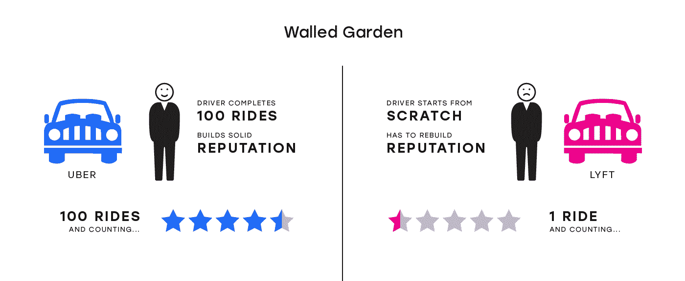
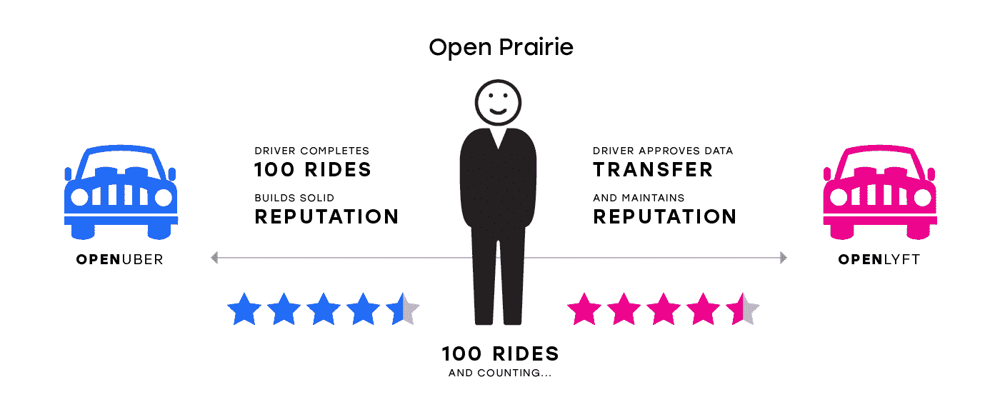
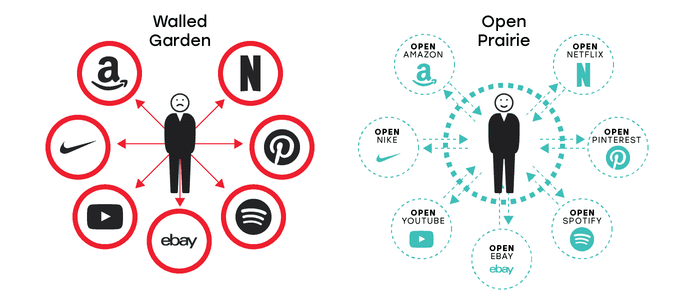

# 理查德·斯托尔曼&软件创新的未来

> 原文：<https://medium.com/hackernoon/richard-stallman-future-of-software-innovation-4e591fa93d7f>

Richard Stallman

**软件创新的麻烦:从过去到现在**

曾几何时，软件开发创新的一个瓶颈是访问计算机。

随着时间的推移，随着计算的普及和软件业成为经济的重要组成部分，软件开发创新的瓶颈从计算的普及(因为计算机变得无处不在)转向了新型开发:为了追求利润，公司开始限制对软件的开放访问。

为了对抗这种新的发展，一场非常重要的运动开始了，由像理查德·斯托尔曼这样的人领导。

对于那些需要复习的人来说:理查德·斯托尔曼领导着自由软件运动，这场运动展示了通常的非自由软件是如何让用户受制于其开发者的不公正权力，加上他们的监视和操纵，以及用自由(尊重自由)软件取代它的运动。

在[关于“为什么软件应该免费”的文章](https://www.gnu.org/philosophy/shouldbefree.en.html)中，理查德·斯托尔曼认为软件**开发*应该独立于软件*发布*或*修改*来看待。*他提出了阻止软件分发或修改对社会有害的几个原因:使用它的人越来越少，没有一个用户能够修改或修复软件，其他开发者无法从软件中学习或在软件基础上创作新作品。

理查德·斯托尔曼在他的著作中强调的是，消费者和生产者之间的价值转移应该被识别、量化和透明化，这样资源才能得到相应的配置。

例如，脸书根据用户的数据足迹为每个用户赚取$fn(x ),而用户根据用户的使用量从脸书获得$fn(y)用于社交互动的可用和可靠服务。如果理查德·斯托尔曼要设计这样的价值转移，脸书应该为他们收集用户数据的每次交互支付用户一些边际金额，用户应该为每次交互支付脸书一些边际金额。

愿景是美好的，但不幸的是，现实并没有像理查德·斯托尔曼预想的那样发展。

**现实:不仅代码关闭，状态也关闭**

不幸的是，开源运动并没有取得胜利(目前来说)。即使开源作为一个产业比以往任何时候都大，但由于软件创作者可以通过禁止免费使用他们的软件来从生态系统中获取高额回报，大多数代码仍然是封闭的。

重要的是，随着软件行业的发展，其他东西变得比软件本身更重要:系统的状态。“状态”是关于应用程序用户和 web 服务本身的信息，随着用户使用 web 服务，这些信息会不断更新。

正如丹尼斯·纳扎罗夫在他的文章“开源之后会发生什么？”中提到的，从互联网之前的个人软件工具(即 Excel、PhotoShop)到网络服务(即 Spotify、网飞、优步、Instagram)的过渡导致了一个关键的区别:不是用户维护他们自己的状态，而是网络服务代表用户维护状态。这反过来又导致了积累状态数据的服务(即保存使用该服务的用户的所有信息的数据库)手中控制权的合并。

随着时间的推移，构建 web 服务的代码变得不如服务的状态重要。随着越来越多的用户产生越来越多的状态，就会产生更有用的服务，吸引更多的用户，从而产生更大的状态。这变成了一个良性循环(对于服务的提供者来说),使得 web 服务拥有了更多的控制权。

例如，Spotify 可以提供更好的音乐推荐，因为它的算法可以获得更多的音乐收听数据，从而带来更好的推荐，从而带来更好的用户体验。因此，更多用户加入 Spotify，进而为 Spotify 产生更多数据，进而进一步改善产品和用户体验。

这是一个飞轮:作为一个 web 服务，你拥有的状态数据越多，从长远来看，对你的价值就越大。如果你想理解为什么脸书-亚马逊-网飞-谷歌公司如此强大，这就是答案。

**2019:创新死了吗？**

这就把我们带到了今天，消费者网络服务和云服务实际上都非常接近寡头垄断。这对终端消费者和市场创新都不利。

说到消费者网络，正如 Ben Thompson 在《T4 聚合理论》中所写的:

“互联网从根本上改变了竞争格局:分销商不再基于独家供应商关系进行竞争，消费者/用户是事后才考虑的。相反，供应商可以被商品化，把消费者/用户放在第一位。推而广之，这意味着决定成功的最重要因素是用户体验:最好的分销商/聚合商/做市商通过提供最好的体验而获胜，这为他们赢得了最多的消费者/用户，这吸引了最多的供应商，这以良性循环的方式增强了用户体验。”

这也意味着，保存在封闭状态系统中的数据会带来更好的用户体验，进一步帮助主导服务扩大用户群，从而增加数据。在写这篇文章的时候，我的手机上有 11 个谷歌应用、7 个亚马逊应用和 4 个脸书应用。

当谈到消费者网络时，有一个明显的权力集中正在进行。

不仅消费者网络被少数大玩家控制，在企业软件领域也可以观察到同样的情况。

本·汤普森(Ben Thompson)最近观察到，AWS、Azure 和其他云基础设施服务将会生吞开源公司。 [MongoDB 就是一个例子](https://stratechery.com/2019/aws-mongodb-and-the-economic-realities-of-open-source/)，但是你可以想象未来伤亡会多很多。AWS 和 Azure 将吃掉基础设施市场，而 Salesforce、Workday 和 ServiceNow 将吃掉企业应用市场。

这里重要的是分布:虽然这些供应商每天都从使用开源软件中受益，但他们正在巩固由于其优越的分布而带来的权力。他们使用与消费者网络寡头同行相同的公式获胜:他们拥有的客户数据越多，未来可以追加销售和交叉销售的产品和服务就越多。

它给我们留下了什么？

我们有一个由公司控制的消费者网络，我可以用一只手的手指来数，我们还有一个由大致相同数量的供应商控制的基础设施云。

鉴于这种整合，这些公司之外的创新很难实现。

如果你在 2019 年是一名有抱负的企业家，你将很难获得用户，不管你是在消费者网络还是企业软件领域工作。

**出路**

有一种新技术将解开软件创新的瓶颈。

如果我们采纳理查德·斯托尔曼关于软件开放存取的想法并使之成为现实，会怎么样？不仅如此:如果我们也让状态数据对每个 web 服务开放和可用呢？

激励和技术的结合可以创造这样一个世界。

想象一种新的计算方式。

[根据 Vitalik Buterin 的定义](/@VitalikButerin/the-meaning-of-decentralization-a0c92b76a274)，这种类型的计算在架构上和政治上是分散的，但在逻辑上是集中的。

它在体系结构上是分散的，因为这种新的计算是由许多相互通信的计算机组成的。它在政治上是分散的，因为许多个人或组织控制着组成系统的计算机。它在逻辑上是集中的，因为有一个共同认可的状态，系统的行为就像一台计算机。

拥有这样一台去中心化的电脑有什么好处？

1.  它将允许用户看到正在后端执行的源代码
2.  所有公共数据将对所有人开放
3.  最重要的是，它将引发软件行业有史以来最大的创新浪潮，因为所有的开放服务将相互对话并交换数据

让我们把最后一个属性称为“服务的可组合性”。

**可组合性**

如果我们将理查德·斯托尔曼的开源软件方法类比，并将其应用于开放服务，世界将与今天大不相同。

根据 Stallman 的文章，开发人员合作并公开重用代码是非常重要的。

如果我们将这种思想应用于 web 服务，这将意味着允许不同的服务使用彼此的状态，从而使开发人员能够重用 web 服务，使它们能够相互交流并改进彼此的工作。

让我们看看它是如何工作的。

**例子#1:抵制审查的开放服务**

想象一下，一个司机在优步开了 100 次车，并获得了良好的声誉。想象一下这样一个场景，优步因为一个虚假的报告而审查司机，在这个过程中完全删除了他的信誉数据。

如果 OpenUber 存在，并且是用开放数据构建的，那么该服务可以与其他类似的开放服务进行对话，这个司机现在可以将他或她的声誉带到 OpenLyft、OpenInstacart、OpenDoorDash 和其他可用的网络服务，而无需任何额外的注册，KYC，或者更重要的是，没有任何失去声誉的风险。这使得所有的服务对于其他接口和业务都是可互操作的和可重用的，使得用户的信誉也是可移植的。这也让用户免受主观审查。

**例子#2:开放数据以获得更好的用户体验**

想象一个最终用户拥有其数据的世界。用户可以提供对他或她的数据的访问，以换取定制的体验，从而允许互利的关系。

例如，我从 OpenAmazon 向 OpenNike.com 提供我的购物数据，从而允许 OpenNike.com 根据 OpenAmazon 提供的以前的鞋子购买历史定制我的鞋子购物体验。

在这样的世界里，我拥有数据，而不是与我合作的公司。我提供我的数据访问权来换取差异化的用户体验。这是我的决定，不是公司的决定。

**结论**

听起来像是我想参与的未来。

为了将这种未来带到现在并使之成为现实，我们必须创建一种新的计算范式，允许在几分钟内通过直观的开发体验构建可扩展的、分散的和开放的服务。

正如我前面提到的，新型的计算，在架构上和政治上是分散的，但在逻辑上是集中的，是能够实现这样一个未来的东西。这种未来将打破当前软件开发创新的瓶颈。

本文中概述了几个致力于未来的项目。麻省理工学院的蒂姆·伯纳斯·李领导的 Solid 公司正在建立许多基础。另一个例子是附近的[正在为开放状态应用程序建立基础设施，并研究如何使这些应用程序易于开发和使用，以及具有有意义的商业模式。](http://nearprotocol.com)

我们希望这篇文章能带动该地区更多的项目。