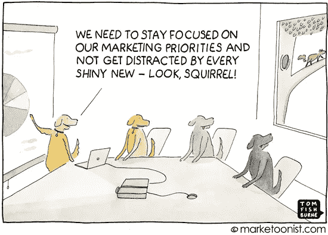

# 克服🔮客户对话和数据中的闪亮物体综合症

> 原文：<https://medium.com/hackernoon/roadmapping-with-the-loudest-guy-in-the-room-69560f0f67e3>

## 如何与房间里声音最大的人交谈

你知道这个故事。你是产品经理，努力组织与领导团队和主要利益相关者的季度产品规划会议。您吸引了客户，与开发团队一起评估工作量，梳理了 1，000 张支持票。不知疲倦地在一个充满事实和假设的美丽演示中描绘了一个主题远景。

Credit: [Marketoonist](https://marketoonist.com/2015/01/shinyobject.html)

你知道，如果你让利益相关者参与规划路线图，你最终会得到更多的认同，也许会做出更好的决策。所以你把卡片放在白板上，讨论并打开它。也许你有一个计划游戏，利益相关者得到扑克筹码来创造一个讨论和权衡的动态。

然后有人清了清嗓子。也许是销售副总裁，或者创始 CEO。他们雄辩而有说服力地为自己的特色辩护。也许这将是达成大交易的关键。也许它只是一个闪亮的物体。它甚至可能不是一张准备好的卡片。尽管有最好的逻辑、约束和理由，说服对团队起作用。而你却被清单上那个闪亮的物体卡住了。

> 我就是那个人。

我患有🔮*闪亮物体综合征*并且可以说服人创造一个包围所有人的现实扭曲场。也许这些特质让我成为一名优秀的企业家，但这是天时地利人和。而且不是在计划会议上。我再也不想成为那样的人了。

在最糟糕的情况下，你可能会有闪亮物品综合症的传播，正如里奇·米罗诺夫在《T4》中描述的销售导向型发展的滑坡。

如果你和那个人一起工作，你不会因为成为他们而赢。而且也不是你想赢，你只需要找到平衡。这来自于将客户洞察和数据带入房间。

所以我要尽我的一份力量。首先检查我的[偏好](https://betterhumans.coach.me/cognitive-bias-cheat-sheet-55a472476b18)(这是一个很大的列表)。

第二，时刻注意我越少用答案强加我的声音，就能出现更好的答案和更重要的团队合作。

第三，通过寻求在房间里听到客户的声音和数据。你应该总是能够翻动卡片，用事实为讨论提供依据。这并不意味着它应该妨碍新思想、来自经验的本能和远见。但这需要成为[对话](https://blog.pingpad.net/products-are-conversations-392f84cc8300)的一部分。

*PS:我们帮助* [*产品经理创造出令人敬畏的产品*](https://pingpad.net) *的使命的一部分，就是把客户和数据带到房间里。*