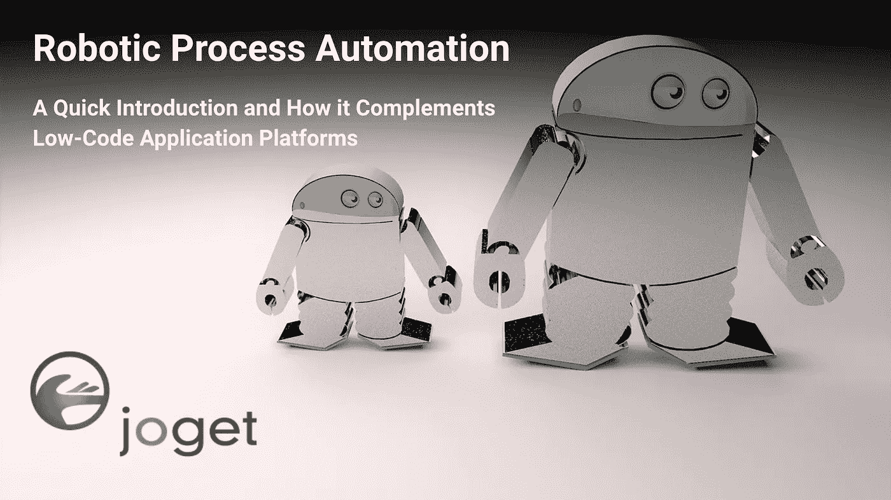

# 机器人过程自动化

> 原文：<https://medium.com/hackernoon/robotic-process-automation-a-quick-introduction-and-how-it-complements-low-code-application-9be580f32511>

## 快速介绍以及它如何补充低代码应用平台

机器人过程自动化(RPA)是当今最热门的企业技术之一。这是怎么回事？本文将简单介绍 RPA，并解释它如何补充低代码应用程序平台。

# 什么是机器人过程自动化？

机器人流程自动化(RPA)是业务流程自动化的一种形式，它部署“机器人”或软件代理来模拟用户如何与计算机交互。这些机器人被编程或配置为代替人类操纵用户界面(UI)。现代 RPA 平台包括人工智能(AI)和机器学习功能，以处理大量可重复的任务和事务。例如，RPA 机器人可以登录到应用程序，输入数据，执行一些计算，完成一些任务，然后注销。

# RPA 与宏或脚本有何不同？

此时，您可能会认为这听起来很熟悉。这些难道不类似于老派的宏(例如微软 Excel 中使用的宏)、脚本、屏幕抓取或桌面记录吗？从某种意义上来说，是的，但是您可以将 RPA 机器人视为扩展用于企业的下一代宏。例如:

1.  RPA 平台可以在企业范围内管理、监控和审核机器人，这与仅在单台机器上工作的基于桌面的旧方法相反。
2.  RPA 机器人可以自主执行，并同时与多个应用程序交互，而不是局限于特定的应用程序。
3.  RPA 机器人可以融入人工智能和机器学习，以适应甚至处理异常。

有关差异的更多信息，请访问 https://www . ui path . com/blog/whats-the-difference-between-robots-and-macros 和

[https://www . LinkedIn . com/pulse/how-robotics-process-automation-RPA-different-Graham-Ferguson/](https://www.linkedin.com/pulse/how-robotics-process-automation-rpa-different-graham-ferguson/)

# 为什么使用 RPA，它如何补充低代码应用程序平台

实施 RPA 平台有许多好处，例如，它:

*   允许更快速、更高效地完成现有流程
*   为手动和重复性任务创造成本节约
*   减少错误并确保更可预测的处理时间，以符合法规和标准

在贵公司的数字化转型战略中，会有 RPA 扮演重要角色的场景。但是，一定要理解 RPA 并不适合所有情况，也不能完全取代人力资源。RPA 最适合可重复的流程，尤其是在从遗留软件和系统迁移太困难或成本太高的情况下。与其说是改变现有的业务流程，不如说是通过自动化使它们更有效率。

但是，如果您的遗留系统不能提供足够的功能或者不够稳定来支持您当前和未来的需求，会发生什么呢？在许多情况下，实现业务运营方式的现代化至关重要，因此有必要重新构建平台。平台再造意味着在现代平台上重新开发软件应用程序，因为旧的遗留系统不再适用。

这就是低代码应用程序平台作为 RPA 的理想补充的用武之地。像 [Joget](https://www.joget.com/) 这样的低代码平台提供了一种可视化和快速构建企业 web 应用程序和重新设计业务流程的方法。因此，理想情况下，您将两全其美，这些新的低代码应用程序与 RPA 一起工作，与传统和外部系统集成。新的应用程序可以引入经过改造和更加优化的业务流程，同时与 RPA 机器人集成以自动化现有业务流程。

# 结论

在本文中，我们介绍了机器人流程自动化(RPA)及其优势。我们还解释了 RPA 和低代码应用程序平台如何相互补充，即低代码应用程序用于快速构建新的应用程序以进行流程再造，同时与 RPA 一起工作以与遗留系统和外部系统集成。

关于实用教程，请阅读[机器人过程自动化和低代码应用平台:集成 UiPath 和 Joget 的实用教程](/@jogetworkflow/robotic-process-automation-and-low-code-application-platforms-a-practical-tutorial-on-integrating-b646bd2b96f2)