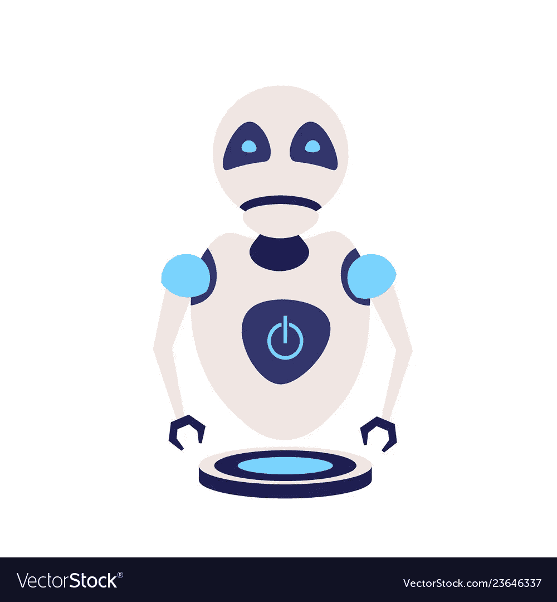

# 机器人和人工智能，你在这个世界上的位置

> 原文：<https://medium.com/hackernoon/robotics-and-ai-your-place-in-this-world-5bcb5aa1151>

Looks Like An Alien Robot.

你应该看看《复仇者联盟 2019》剧透，托尼·斯塔克的西装现在是人类的了！你必须相信，它将取代美国队长，就像人工智能将取代人类一样。

让我们诚实地面对自己，我们渴望一种更好更快地做事的方法，不可否认，我们很懒，我们需要一些东西或人来为我们完成那些繁忙的任务——无论是在我们的工作场所还是日常生活中。

然而，解决这个问题的方法就在此时此地，普通人现在似乎将它视为一种威胁。高效的生产手段、精确的数据分析、自动化等等是我们所认为的威胁――令人着迷。我们正被机器人和人工智能将如何终结我们的流行词所迷惑。

No offence Forbes.

搜索关键词“机器人和人工智能”，你会发现前三个结果是关于机器人如何取代人类的，我仍然在观望，这些标题是否会吸引更多的观点，而不是我们如何仍然在世界上占有一席之地，尽管机器人和人工智能的存在。

说实话，机器人和人工智能并不是绝对比我们好，它们可能被编程为比我们更好地执行任务――而不会感到疲劳；他们可以有效地进行数据分析，很少或没有错误。这太神奇了，我对这种颠覆性创新以及它在未来 10 年将如何变得更具颠覆性感到兴奋。

说真的，仔细想想，机器人和人工智能无疑比我们做得更好。但他们仍然无法体验某些定性的人类特征——未来 10 年，机器人和人工智能永远不会像我们一样有创造力来创新这些东西。这是柔软的真理，不管它是多么片面，它仍然是真理。

就在之前，我深入研究了机器人和人工智能在世界上的坐标，让我们通过简要检查它们如何让我们的生活变得更容易，以及它们现在仍然如何，来给这项技术一些信任。

# 简要了解机器人和人工智能如何让世界变得更美好

在仔细研究工作空间后，我给那些感觉自己将被机器人和人工智能取代的人写了一份草稿。坐在沙发上，喝杯咖啡，仔细看看发展中国家和不发达国家。

发展中国家的公民在生活水平方面相当不错，但相对于我们所关注的，他们肯定不担心人工智能或机器人取代他们。这就引出了这样一个问题，那就是发达国家的个人将何去何从。

毫无疑问，发达国家的技术进步速度正在飙升，我不认为他们的增长会在未来 10 年停滞不前――这不是投资科技股的建议。

然而，如果你觉得自己即将被机器人和人工智能取代，希望仍然存在，以下是你仍然有机会工作的方式。

# 机器人和人工智能能做什么，不能做什么

我非常清楚，机器人是为执行任务而生的，大多是重复性的任务，而且它们比人类做得更好。这个案例发生在制造业，事实是——我们减慢了生产过程，这影响了公司的总产出，但是在这方面替换人是一个有效的管理决策，不需要更多的争论。机器人不会累，也不会生病，而是被设计来执行生产周期中的特定任务。

然而，对于人工智能，他们需要数据，给他们数据，你就有了数据分析的爱因斯坦。但是，实际上不止这些。人工智能执行许多任务，并被用于各种领域，如金融领域的股票分析，以确定何时交易最佳，人工智能也适用于教育领域的个性化学习，但人工智能拥有自然智能的能力是正在推理的。这种用自然智能开发 AI 的趋势，就是我们现在所说的人工通用智能(强 AI)。建造一个完全类似人类的人工智能的探索仍然让人怀疑这是不可能的还是可能的。

好了，简单描述一下机器人和人工智能能做什么，检查它们不能做什么似乎是你快乐的一部分，但事不宜迟，让我们检查一下机器人和人工智能不能做什么，以及你如何有机会在这些技术的时代生存下来。

最重要的是创造力，通过拥有想象力的思维来制造机器人和人工智能以变得有创造力现在似乎是不可能的，这给了我们超越它们的力量——毕竟，创造力是推动我们走向机器人和人工智能发展的因素之一，当它们完全到来时，我们的创造力仍然可以击败它们。

其次，人工智能和机器人拥有复杂情绪并像我们一样对它们做出充分反应的能力似乎是不可能的，而需要个人能够管理情绪并能够与个人进行情感交流的工作，如医院中的病人或治疗师，是你在这项技术上的另一个优势。

最后，人工智能决策过程通常基于概率或数据的可用性。然而，在紧张的情况下——这需要批判性思维，机器人最有可能将这种情况归咎于概率性失败——我知道这相当悲观。然而，人类拥有某些无法量化或限定的关键特征，但事实仍然是，我们如何对情况做出反应以交付成功的结果，机器人和人工智能不会公平，甚至 AGI 也不会——我们非常乐观。

总之，在我们所处的时代，发展技能对个人来说是最重要的。你的软技能或硬技能是让你作为一个人领先于人工智能的竞争优势的一个主要因素，从今以后，不要对人工智能或机器人感到恐慌，它们让我们的事情变得更容易，但在现实中，我们可以生活在一起，相互补充，走向更美好的未来。