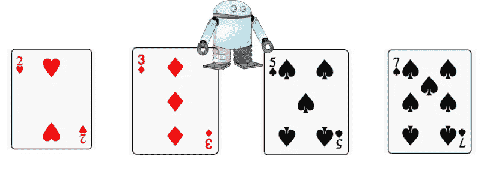
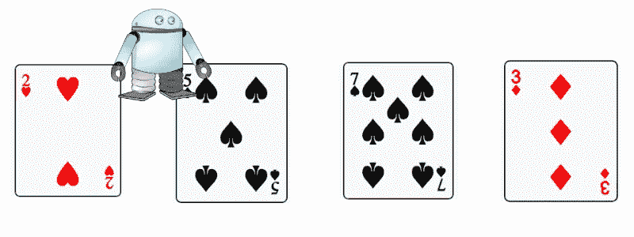
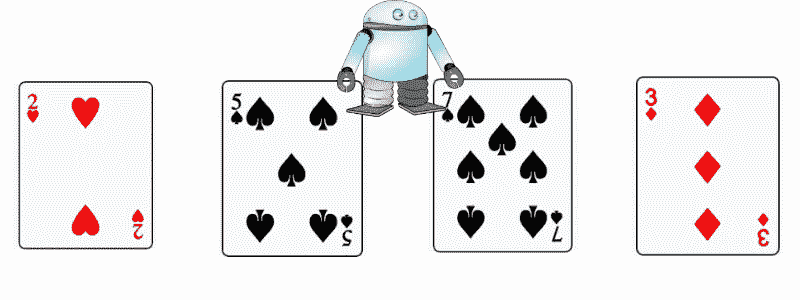
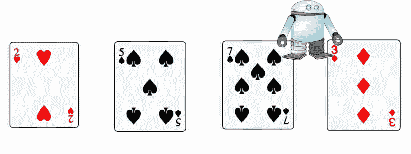
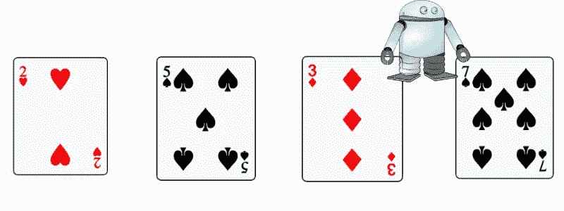
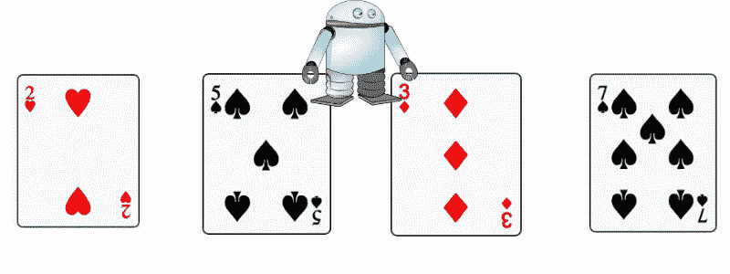

# 机器人整理卡片

> 原文：<https://medium.com/hackernoon/robots-sorting-cards-b6ed770d9ce0>

## 教授计算机科学概念的离线活动:程序、算法、排序、假设、正确性、计算复杂性等。等等。需要:笔、纸和一副牌。

***【TL；博士！如果你只是为了可打印的教案而来:*** [***这里是***](http://bit.ly/cs-offline-cards)

**

*该活动旨在为来访的学生团体提供 CS 内容。否则，它只是一个建筑和办公设施的游览。*

*下面是一个 1-1.5 小时的课程计划，它可以并且已经被定制来适合幼儿园和高中的高年级学生。它是经过几年的开发和实地测试，并在数百名来访学生身上试用，结果非常积极。*

## *典型的课程包括:*

****(完整教案图解及以下链接)****

*   ***关于**排序**是什么以及为什么它是解决 CS 中许多问题的核心的一般性讨论**。
    通过向志愿者分发一本**字典**或一张**纸** **电话簿**并要求他们查找一个名字或单词来说明分类。
    然后，要求另一名**志愿者**，让他们找到一个**特定的电话号码**，或者一个包含特定单词的**定义**。*
*   *向每组孩子分发**5–6 张卡片**(确保没有相同号码的卡片)并要求孩子轮流随机排列卡片并**分类**。*
*   *一个关于什么是**程序的讨论:一系列指令。***
*   *年长的学生可以从关于什么是**算法**(程序背后的想法)的简短讨论中受益——你对卡片分类的**计划**是什么？*
*   ***介绍**带有小指令集的“机器人”范例
    **(向左移动、向右移动、交换)**
    摊开 3 张卡片，然后**编写“程序”**使它们被分类。一个学生写指令，另一个**扮演机器人**。(第一个或第三个学生向机器人读指令，其他人确保指令得到遵守。)*
*   *介绍一下**【条件交换】**(如果某一方比较大的话只交换**)
    现在的目标是写一个**通用程序**，可以处理任何输入。(卡片是在程序编写后随机**布置的)。；
    现在添加另一个角色，一个学生试图重新排序 3 张卡片到**生成一个输入，程序未能**排序。*****
*   ***编写一个 **MAX** 函数，并使用该函数编写 **SORT** 程序。***

## ***它可用于教授各种 CS 概念:***

*   ***编码(一系列指令)***
*   ***边缘情况，开始条件，假设和明确的定义。(机器人会掉下边缘吗？)***
*   ***算法设计(从指令中抽象出方法)***
*   ***调试和对抗性输入(你能找到反例吗..)***
*   ***分类方法***
*   ***由其他函数组成一个函数。***
*   ***计算复杂性(高中高年级学生可以将动作数量计算为卡片数量的函数)***

# ***课程计划***

***可打印的课程计划可在[谷歌文档上找到。请随时给我发送评论或想法。](http://bit.ly/cs-offline-cards)***

# ***入门，图解分解***

***请参阅完整的课程计划以了解详细信息，但这里只是让您开始了解要点:
将班级分成每组 3-4 名学生的小组***

1.  *****已知输入，详细解说**。首先，洗牌并摊开卡片，然后一名学生接受指示，一次一张地照着做。(不需要写说明。)***
2.  *****已知输入，一次性全部输入。还是那句话，先把卡片摊开，但现在要写出整套说明。*****
3.  *****未知输入。我们引入了一个新的指令“条件交换”,现在学生们必须在洗牌和摆牌之前写完整个程序(3 张牌)。*****
4.  *****对抗性输入。学生们没有洗牌，而是试图找出步骤 3 中的程序不适用的顺序。*****

## ***第一步:**已知输入，逐个播放。*****

***从给学生发卡片开始，4 或 5 张卡片就可以了。一名学生扮演机器人。机器人的手放在两张相邻的卡片上。其他人将轮流下达指令。
目标是对卡片进行分类。***

***机器人只知道三个指令:**左移**、**右移**、**换卡**。***

***“机器人”应该对每一个指令做出反应，而不是等待。稍后你可以要求他们提前写好所有的说明。***

***所以如果我们像这样开始。***

******

***Figure 1: At the start, the student who plays the robot, touches two adjacent cards and awaits instructions.***

****第一个指令可能是* ***【向右移动】*** *，并且将导致这样的结果。****

******

***Figure 2: The student emulates moving right by shifting the hands, the right hands moves to touch the next card, and the left hand moves over and now touches the card previously touched by the right hand.***

******【右移】*** *再移。****

******

***Figure 3: After the second “move right”***

***现在我们必须交换卡片。所以 ***【掉包卡】******

******

***Figure 4: We have placed the 7 in its final place. we will now have to rearrange the 3 and the 5.***

******【向左移动】******

******

***Figure 5: The robot has moved left.***

******【互换牌】******

******

***Figure 6\. Now the cards are sorted.***

## ***第二步:**已知输入，一次性全部。第一个程序*****

***与步骤 1 相同，但现在在看到卡片后，将一系列说明写下来。然后指令被一个一个的念出来，如果最后卡片被排序，任务就成功了。
在上面的例子中，有了上面的启动条件。一个示例程序可能是:(机器人从最左边的两张卡片开始)***

*   ******向右移动******
*   ******向右移动******
*   ******互换卡片******
*   ******向左移动******
*   ******互换卡片******

## ***步骤 1-2 的讨论***

1.  ***这一阶段的目标是传达机器人遵循指令，而不是“独立思考”。有时，通过建议作为机器人的孩子们试着做人们告诉他们的事情，而不是他们的意思，来播种这种互动是很有趣的。***
2.  ***有时混乱随之而来，这很好，鼓励它。下面有几个例子，我相信其他人会提出来，保持幽默，但很容易将谈话引向与计算机问题有关的各种话题。***
3.  ***如果在一组中，**一个机器人“意外地”从桌子上掉了下来**(显然这很搞笑🤷)因为 5 个不同的人在喊“向右移动”,它向右移动了 5 次——你可能会谈到通信协议的问题，拜占庭将军的问题。(然后说“*好了，现在只有一个人给出指示。并且每条指令只执行一次"*)***
4.  ***如果同学们开始争论“*谁的左，* ***我的左还是你的左*** *？* ***升序还是降序*** *？你可以引导一个简短的讨论，关于程序中的假设，术语和通用语言的需要，明确的指令等等。(并且通过说“*从现在开始，左边表示机器人的左边，排序表示最大的卡片在右边，机器人的右边*”)来关闭它)****
5.  ***如果一个机器人**离开了卡**，或者**没有在正确的位置**开始，那么第二步就全乱了，你可以讨论假设，以及初始条件的验证。(并通过决定机器人从哪里开始的某种约定来结束它。)***
6.  ***有人可能会提出这样的观点:方块 3 的**不能与黑桃 2 相提并论。这是讨论比较、假设、消除歧义和共同语言的一个很好的开端。同样，如何决定相等的项目的排序顺序？
    如果先按花色排序，再按编号排序，或者只按花色排序，会怎么样？(我们可以这样结束讨论:我们只关心数字，并确保发给各组的卡片没有重复。但是不管是什么决定，只要我们都同意排序后的正确顺序，它都不会影响程序。)*****

## ***第三步— **未知输入，第一种算法。*****

****这一步对于 6-7 岁的孩子来说通常太超前了。(上面有足够的材料供年龄较小的学生上完整的一节课。)YMMV 关于年龄，你说了算。****

***对于这一步，或者将问题定义为**对卡片**进行分类，并且**从 3 张卡片**开始，或者对于更年轻的组，将问题定义为提取最大值——将最大的卡片一直放在(右)端。***

***我们现在还必须介绍一下 ***条件互换*** 。该指令取代了之前的**交换**指令——它仅在较大的卡位于左侧时交换卡，因此在该指令之后，无论是否交换，较大的卡都将位于右侧。
如果我们发出指令**“有条件交换”**，当牌桌看起来像上面的 ***图 5*** 中那样时，牌被交换，结果如图 ***图 6*** 所示，但是，如果我们再次发出指令，**什么也没发生，**较大的牌仍然在右边。***

***这个练习是本课的主要部分，各组将尝试几次，但都失败了。**不要跳过此**，让小组提出想法，并在房间内走动。找出哪个小组的想法适用于大多数而非所有输入。把那个程序拿出来，写在黑板上。展示它是如何在输入上进行测试的，询问其他小组是否可以展示一个失败的“输入”(开始时的卡片顺序)示例。***

***适用于大多数输入的示例程序(对于**三张卡，**从最左边的两张卡开始)可能是***

*   ******条件互换******
*   ******向右移动******
*   ******有条件互换******

***它将在[2，3，4]、[2，4，3]、[3，2，4]和[4，2，3]上工作***

## ***第四步——对抗性输入，尝试打破它。***

***它在[4，3，2]和[3，4，2]上不起作用。
为了让它能够处理这些，我们需要添加一个*左移和一个 ***条件交换。*******

## ****3–4 人讨论:****

****但是我们怎么能确定它是正确的呢？
一种方法是测试所有可能的输入。
测试排序的所有可能输入只在非常小的输入上可行，但这是证明我们排序 3 张卡片的程序是正确的(不管 3 张卡片以什么顺序出现)的超级有效的方法。****

****现阶段我们可以谈论**算法**，或者**ideaᵀᴹ将军**。到目前为止，我们已经编写了一系列处理特定输入的指令，现在我们必须想出一个可以处理任何输入的想法。我们必须能够抽象地思考这个问题。例如，我们可以把这个问题分成两步。
第一步。确保最大的卡片放在最右边的位置
步骤 2。确保最后两张卡片已分类。****

****步骤 1 可以通过从最左边的位置开始，执行条件交换，然后向右移动，一次一步，每次执行另一个冒泡排序来实现。当我们到达终点时(在 3 张牌的情况下，这需要一步)，我们可以确定最大的牌在它的位置上。(因为不管它从哪里开始，在某个点上机器人到达了它，并且从那个点开始，它通过交换它，一直向右移动它)。****

****第二步很简单，只要向左移动拿到两张牌，有条件的交换。****

****一般来说，如果有三张以上的卡片，我们将添加一个类似于步骤 1 的步骤，将第二大的卡片移动到第二个位置，等等。****

****我们刚刚重新发现了冒泡排序。****

****[打印输出的课程计划](http://bit.ly/cs-offline-cards)包含其他扩展，例如计算复杂性。等等。它还建议何时以及如何移动到更多的卡。享受吧。(还有 lmk 如果有评论。)****

## ****学分:****

****感谢马克·迪特莫最初的想法和围绕开发的讨论，感谢谢尔盖帮助开发交付。这个项目由 Laura 和 Toogler(谷歌教学)团队维护和交付。****

****在滑铁卢的谷歌办公室，我们会收到很多学校参观的请求。学校的孩子们并不真正欣赏在一座有一百年历史的工业砖建筑上用新的玻璃和钢铁装饰所表达的设计哲学；虽然带有 playstation 和街机游戏的休息室是一个很酷的令人印象深刻的功能，但它真的不值得一游。一些老师对微型厨房的预算印象深刻，但孩子们不知道腰果的价格。****