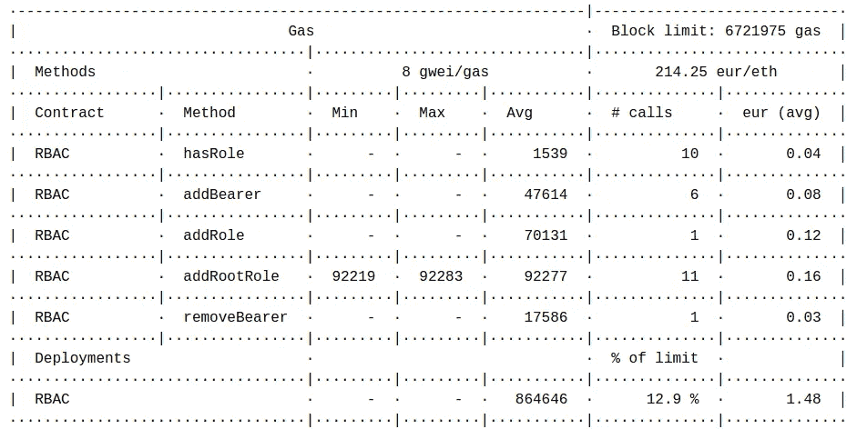

# 以太坊区块链基于角色的访问控制

> 原文：<https://medium.com/hackernoon/role-based-access-control-for-the-ethereum-blockchain-bcc9dfbcfe5c>

你决定谁用你的智能合同做什么


> 历史上，隐私几乎是不言而喻的，因为很难找到和收集信息。但是在数字世界中，我们需要有更明确的规则。—比尔·盖茨

# 介绍

基于角色的访问控制是软件系统的[安全需求，这些软件系统被设计成由数百个用户访问。虽然这种需求通常在企业软件和操作系统中实现，但针对以太坊区块链的工作并不多。](https://en.wikipedia.org/wiki/Role-based_access_control)

本文旨在展示我们如何在 Solidity 中为以太坊区块链实现基于角色的访问控制，并教你构建自己的访问控制。我们也公开了我们的代码，请随意以任何方式或形式重用它。

当把一个[供应链设计成一个有向无环图](https://hackernoon.com/implementing-a-supply-chain-in-the-ethereum-blockchain-dcc91ea718ab)时，我们意识到我们需要动态地决定谁可以给图中的每个节点添加信息。从现实世界的角度来看，如果您拥有一个制造工厂，您可能希望装配线上的所有操作员用他们自己的帐户记录他们已经装配了一个零件。

我将 OpenZeppelin 作为 solidity 开发的黄金标准，它有一个 [Roles.sol](https://github.com/OpenZeppelin/openzeppelin-solidity/blob/master/contracts/access/Roles.sol) 契约，用于在它们的 [ERC721.sol 契约](https://github.com/OpenZeppelin/openzeppelin-solidity/blob/master/contracts/token/ERC721/ERC721Mintable.sol)中实现 Minter 和 Burner 等角色。不幸的是，这些实现不允许在运行时创建新的角色，如果您想使用单独的角色控制对每个单独令牌的访问，就需要创建新的角色。

> 本文旨在展示如何为以太坊区块链构建基于角色的访问控制系统。

根据我们的要求，我结束了从零开始编写一个 [RBAC 合同](https://github.com/HQ20/SupplyChain/blob/master/blockchain/contracts/RBAC.sol)的工作，然后找到了 [OpenZeppelin](https://openzeppelin.org/) 的[相同想法](https://github.com/TalAter/zeppelin-solidity/blob/master/contracts/access/rbac/RBAC.sol)的停产版本，它有着几乎完全相同的方法。为了提高可重用性，我尽可能地按照他们的命名法重构了我的代码。

在以下部分，我将描述:

*   我们的门禁系统的设计要求；
*   作为智能合同的实现；
*   我们考虑的测试案例；
*   状态改变法的气体使用
*   以及一些收尾的想法。

让我们开始吃吧。

# 概念设计

我对 RBAC 系统的想法很简单。

1.  角色将由一个数字标识符标识，就像 unix 中的组一样。
2.  只需一个描述就可以动态创建角色。
3.  每个角色将存储用户的地址。
4.  每个角色都有第二个关联的角色，这是唯一允许添加或删除用户的角色。

如果您正在使用来自 [OpenZeppelin](https://openzeppelin.org/) 的 [Roles.sol](https://github.com/OpenZeppelin/openzeppelin-solidity/blob/master/contracts/access/Roles.sol) 和 [RBAC.sol](https://github.com/TalAter/zeppelin-solidity/blob/master/contracts/access/rbac/RBAC.sol) 契约，您需要注意的是 [Roles.sol](https://github.com/OpenZeppelin/openzeppelin-solidity/blob/master/contracts/access/Roles.sol) 只实现在角色内生效的*操作，而在角色*外发生的*操作在 [RBAC.sol](https://github.com/TalAter/zeppelin-solidity/blob/master/contracts/access/rbac/RBAC.sol) 或[访问/角色/*Role.sol](https://github.com/OpenZeppelin/openzeppelin-solidity/tree/master/contracts/access/roles) 契约中实现，包括*

在我的实现中，我做了许多适合我们用例的决定:

1.  我在角色结构中包含了一个描述字符串，结构本身存储在一个数组中。数组中每个角色结构的位置被用作标识符。使用映射来存储角色是一种诱惑，但是我发现在这里没有必要。
2.  每个角色在实例化时都会收到另一个角色的标识符，我们将其指定为管理员角色，并且在实例化后不能修改。此管理员角色是唯一可以向此角色添加和删除承载者的角色。
3.  出于安全性和一致性的原因，您可以从角色中删除不记名，但没有办法从系统中完全删除角色。

> 在我的实现中，我采取了许多适合我们用例的实现决策。

**本文的早期版本使用数组来存储每个角色的承载者。那是从* [*尼科·维高*](/@Nico_Vergauwen) *作为建议改成了贴图。这样代码更高效、更清晰，即使审计更麻烦。*

# 履行

```
pragma solidity ^0.5.0;/**
* @title RBAC
* @author Alberto Cuesta Canada
* @notice Implements runtime configurable Role Based Access Control.
*/
contract RBAC {
  event RoleCreated(uint256 role);
  event BearerAdded(address account, uint256 role);
  event BearerRemoved(address account, uint256 role); uint256 constant NO_ROLE = 0; /**
   * @notice A role, which will be used to group users.
   * @dev The role id is its position in the roles array.
   * @param description A description for the role.
   * @param admin The only role that can add or remove bearers from
   * this role. To have the role bearers to be also the role admins 
   * you should pass roles.length as the admin role.
   * @param bearers Addresses belonging to this role.
   */ struct Role {
    string description;
    uint256 admin;
    mapping (address => bool) bearers;
  } /**
   * @notice All roles ever created.
   */
  Role[] public roles; /**
   * @notice The contract constructor, empty as of now.
   */
  constructor() public {
    addRootRole("NO_ROLE");
  } /**
   * @notice Create a new role that has itself as an admin. 
   * msg.sender is added as a bearer.
   * @param _roleDescription The description of the role created.
   * @return The role id.
   */
  function addRootRole(string memory _roleDescription)
    public
    returns(uint256)
  {
    uint256 role = addRole(_roleDescription, roles.length);
    roles[role].bearers[msg.sender] = true;
    emit BearerAdded(msg.sender, role);
  } /**
   * @notice Create a new role.
   * @param _roleDescription The description of the role created.
   * @param _admin The role that is allowed to add and remove
   * bearers from the role being created.
   * @return The role id.
   */
  function addRole(string memory _roleDescription, uint256 _admin)
    public
    returns(uint256)
  {
    require(_admin <= roles.length, "Admin role doesn't exist.");
    uint256 role = roles.push(
      Role({
        description: _roleDescription,
        admin: _admin
      })
    ) - 1;
    emit RoleCreated(role);
    return role;
  } /**
   * @notice Retrieve the number of roles in the contract.
   * @dev The zero position in the roles array is reserved for
   * NO_ROLE and doesn't count towards this total.
   */
  function totalRoles()
    public
    view
    returns(uint256)
  {
    return roles.length - 1;
  } /**
   * @notice Verify whether an account is a bearer of a role
   * @param _account The account to verify.
   * @param _role The role to look into.
   * @return Whether the account is a bearer of the role.
   */
  function hasRole(address _account, uint256 _role)
    public
    view
    returns(bool)
  {
    return _role < roles.length && roles[_role].bearers[_account];
  } /**
   * @notice A method to add a bearer to a role
   * @param _account The account to add as a bearer.
   * @param _role The role to add the bearer to.
   */
  function addBearer(address _account, uint256 _role)
    public
  {
    require(
      _role < roles.length,
      "Role doesn't exist."
    );
    require(
      hasRole(msg.sender, roles[_role].admin),
      "User can't add bearers."
    );
    require(
      !hasRole(_account, _role),
      "Account is bearer of role."
    ); roles[_role].bearers[_account] = true;
    emit BearerAdded(_account, _role);
  } /**
   * @notice A method to remove a bearer from a role
   * @param _account The account to remove as a bearer.
   * @param _role The role to remove the bearer from.
   */
  function removeBearer(address _account, uint256 _role)
    public
  {
    require(
      _role < roles.length,
      "Role doesn't exist."
    );
    require(
      hasRole(msg.sender, roles[_role].admin),
      "User can't remove bearers."
    );
    require(
      hasRole(_account, _role),
      "Account is not bearer of role."
    ); delete roles[_role].bearers[_account];
    emit BearerRemoved(_account, _role);
  }
}
```

# 测试

我总是描述当[公开一个契约](https://github.com/HQ20/SupplyChain/blob/master/blockchain/contracts/RBAC.sol)时通过的测试，这既是为了展示边缘情况，也是为了对代码的可靠性提供一些信心。

```
Contract: RBAC
RBAC
✓ addRootRole creates a role.
✓ hasRole returns false for non existing roles.
✓ hasRole returns false for non existing bearerships.
✓ addRootRole adds msg.sender as bearer.
✓ addRole doesn’t add msg.sender with admin role.
✓ addBearer reverts on non existing roles.
✓ addBearer reverts on non authorized users.
✓ addBearer reverts if the bearer belongs to the role.
✓ addBearer adds a bearer to a role.
✓ removeBearer reverts on non existing roles.
✓ removeBearer reverts on non authorized users.
✓ removeBearer reverts if the bearer doesn't belong to the role.
✓ removeBearer removes a bearer from a role.
```

作为对之前反馈的回应，我现在也加入了一份使用 eth-gas-reporter 的气体使用报告。



Gas use for RBAC.sol

# 结论

本文描述了一个基于智能合约角色的访问控制系统的实现，该系统具有以下属性:

1.  允许在运行时创建新角色。
2.  包括角色管理员的概念，允许向角色添加和删除成员。
3.  允许轻松确定所有现有角色及其承载者。

基于角色的访问控制实现起来并不复杂，但是正如本文所示，需要考虑许多权衡和设计决策，这将与您的用户以及允许他们执行的操作密切相关。如果您决定[重用 RBAC 系统的这个实现](https://github.com/HQ20/SupplyChain/blob/master/blockchain/contracts/RBAC.sol)，我会非常高兴，但是我鼓励您寻找并考虑其他选择。

对于这个 RBAC 合同的实际应用，请继续关注我们供应链系列的下一篇文章。